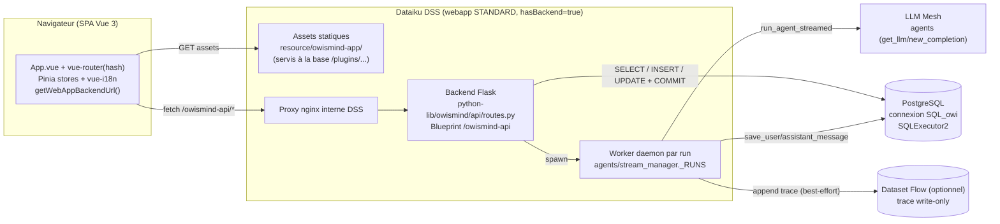

# OWIsMind - Architecture

> Documentation d'architecture système et de flux de données du plugin Dataiku DSS **OWIsMind**.
> Destinée à un ingénieur senior en onboarding ou à une passation de production.
>
> **Source de vérité** : `memory/PROJECT_STATE.md` + `memory/LESSONS.md` priment sur tout
> (les guides de `cadrage/` sont des points de départ). Ce document décrit l'architecture telle
> qu'observée dans le code ; pour le « pourquoi » détaillé d'une décision, suivre les liens vers la mémoire.
>
> **Docs sœurs** : [`backend-api.md`](./backend-api.md) · [`frontend.md`](./frontend.md) ·
> [`data-model.md`](./data-model.md) · [`security.md`](./security.md) · [`build-test-deploy.md`](./build-test-deploy.md)

---

## 1. Vue d'ensemble

OWIsMind est un **portail de chat agentique métier** packagé en **plugin Dataiku DSS** (`plugin.json:3`,
id `owismind`). Le **frontend Vue 3 + Vite** est buildé en assets statiques **servis par DSS** ; le
**backend Flask** vit dans `python-lib/owismind/` (modulaire) et parle aux agents IA via **LLM Mesh**.
Tout l'état (conversations, messages, runs persistés, feedback) est stocké en **SQL direct** sur une
connexion **PostgreSQL** via `SQLExecutor2` - **sans Flow au runtime**. La seule exception au « no Flow »
est la **trace d'exécution**, appendée en write-only sur un dataset Flow optionnel.

Différenciateur produit : **Conversation + Live Timeline + Evidence Studio** (v1 implémenté : panneau de
preuve qui re-exécute, en lecture seule et bornée, le scope du SQL généré par l'agent sur des datasets
whitelistés par l'admin - voir §4 et `docs/superpowers/specs/2026-06-09-evidence-studio-v1-design.md`).

---

## 2. Composants & responsabilités



| Composant | Responsabilité | Où |
|---|---|---|
| **SPA navigateur** | UI de chat (sidebar, timeline live, picker d'agent, admin), routing hash, i18n FR/EN, thème ; appels backend via `getWebAppBackendUrl` | `frontend/src/` |
| **Assets statiques servis par DSS** | `index.html` + `assets/index-<hash>.{js,css}` buildés par Vite, servis à la base `/plugins/owismind/resource/owismind-app/` | `resource/owismind-app/` (généré) |
| **Backend Flask (Blueprint)** | API HTTP `/owismind-api/*` : identité, chat start/poll, feedback, listes de conversations, agents, espace admin | `python-lib/owismind/api/routes.py` |
| **Worker daemon (par run)** | Exécute UN run d'agent en thread de fond, accumule les events normalisés dans un dict mémoire, persiste réponse + SQL + trace | `python-lib/owismind/agents/stream_manager.py` |
| **Agents LLM Mesh** | Modèles agentiques DSS (`get_llm(agent_id).new_completion().execute_streamed()`) | hors webapp, résolus par whitelist serveur |
| **PostgreSQL via `SQLExecutor2`** | Stockage SQL direct (chat, users, settings) ; instance fraîche par appel ; COMMIT obligatoire | connexion `SQL_owi`, schéma `public` |
| **Dataset Flow de trace** | Trace brute de fin de run, appendée write-only (1 ligne/exchange), best-effort, optionnel | param `traces_dataset` (SELECT) |

---

## 3. Modèle d'exécution DSS

OWIsMind est une webapp DSS de **type `STANDARD`** avec `hasBackend: "true"` et
`standardWebAppLibraries: ["jquery","dataiku"]` (`webapp.json:12-15`). DSS sert deux choses :

1. **Le frontend statique.** Vite builde le SPA avec `base: '/plugins/owismind/resource/owismind-app/'`
   et `outDir: '../resource/owismind-app'` (`vite.config.js:7-12`). Les assets sont déposés dans
   `resource/owismind-app/` ; l'entrée DSS est `webapps/.../body.html`, qui est une **copie** du
   `index.html` buildé (le chaînage est fait par `/build-plugin` - voir [`build-test-deploy.md`](./build-test-deploy.md)).
   Les slots `app.js` / `style.css` de la webapp STANDARD restent vidés mais présents (DSS les exige).

2. **Le backend Flask.** DSS injecte l'objet Flask `app` via le star-import `dataiku.customwebapp`.
   Le bootstrap `backend.py` est volontairement **mince** - aucune logique métier :

   ```python
   from dataiku.customwebapp import *          # fournit `app`
   from owismind.api.routes import register_routes
   register_routes(app)                         # backend.py:6-10
   ```

   `register_routes` enregistre le Blueprint `owismind_api` (préfixe `/owismind-api`,
   `routes.py:60`), applique le niveau de log configuré, et logge la table des routes + le statut
   storage au démarrage (`routes.py:674-692`) - le log webapp DSS confirme ainsi quel build tourne.

**Identité.** Toute requête `/owismind-api/*` résout l'utilisateur **côté serveur** depuis les
**en-têtes d'authentification du navigateur** (`resolve_identity(request.headers)`,
`security/identity.py`), jamais depuis le corps de la requête. Le frontend n'envoie que des données
logiques (`session_id`, `message`, `agent_key`…). Python observé = **3.9.x** (3.11/FastAPI non validés).

**Hypothèse mono-process.** Le dict mémoire des runs (`_RUNS`) et le bootstrap admin supposent un
backend **mono-process** (condition opérationnelle ; voir `memory/PROJECT_STATE.md` §12 et `security.md`).

---

## 4. Flux de données end-to-end (un tour de chat)

Le transport est du **polling**, pas du SSE. La SPA déclenche un run puis interroge le backend par
petites requêtes courtes ; le worker exécute l'agent en arrière-plan.

```
Navigateur                     Backend Flask                  Worker (thread)            LLM Mesh / PostgreSQL
   │                                │                              │                            │
   │  POST /chat/start              │                              │                            │
   │  {session_id, message,         │                              │                            │
   │   agent_key, history_limit,    │                              │                            │
   │   parent_exchange_id}          │                              │                            │
   ├───────────────────────────────►│ resolve_identity(headers)    │                            │
   │                                │ resolve_enabled_agent(key)   │                            │
   │                                │   → (project_key, agent_id)  │                            │
   │                                │ can_accept(user_id)          │                            │
   │                                │ save_user_message (BRUT) ────┼───────────────────────────►│ INSERT chat_v4 (phase 1)
   │                                │ start_run(...) ──────────────►│ (spawn daemon)             │
   │  ◄─────────────────────────────┤ {run_id, exchange_id}        │                            │
   │                                │                              │ history_messages_for_chain ┼──► SELECT (CTE ancêtres)
   │                                │                              │ build_completion_messages │
   │  GET /chat/poll?run_id=&cursor=│                              │ run_agent_streamed ────────┼──► execute_streamed()
   ├───────────────────────────────►│ stream_manager.poll(...)     │   ← events normalisés      │
   │  ◄─────────────────────────────┤ {events, cursor, done, error}│   (timeline live)          │
   │   … répété toutes les 500 ms … │                              │                            │
   │                                │                              │ save_assistant_message ────┼──► UPDATE chat_v4 (phase 2)
   │                                │                              │ save_trace (best-effort) ──┼──► append dataset Flow
   │  GET /chat/poll (done=true) ───►│                              │ done=true                  │
   │  ◄─────────────────────────────┤ {events incl. final_answer}  │                            │
```

Étapes clés (références : `routes.py:160-299`, `stream_manager.py`, `streaming.py`) :

1. **`POST /chat/start`** (`routes.py:160`) - résout l'identité, valide le payload, résout l'`agent_key`
   opaque → `(project_key, agent_id)` via la **whitelist serveur** (`settings.resolve_enabled_agent`).
   Pré-check d'admission (`can_accept`, 429/503) **avant tout write**. **Phase 1 du write 2 temps** :
   `chat_v4.save_user_message` persiste le message utilisateur **BRUT** (pour ne pas perdre la question
   si le run échoue). Lance le worker via `stream_manager.start_run`, renvoie `{run_id, exchange_id}`.
   Le **préfixe nom+date** du tour courant (`context.build_user_prefix`) est calculé au build-time et
   passé au worker, mais **le message stocké reste BRUT**.

2. **Worker daemon** (`stream_manager._worker`) - assemble le **contexte multi-tours = chaîne d'ancêtres**
   de la branche (`chat_v4.history_messages_for_chain` remonte `parent_exchange_id`, excluant l'après-branche)
   + le tour courant préfixé, puis itère `streaming.run_agent_streamed`. Chaque event normalisé est empilé
   dans `_RUNS[run_id]["events"]` sous `_LOCK`. Bornes de sûreté : `MAX_CONCURRENT_RUNS=8`, TTL d'éviction
   (60s/600s), `MAX_RUN_SECONDS=300`, `ABANDON_AFTER_SECONDS=30`, caps mémoire par run.

3. **`GET /chat/poll`** (`routes.py:267`) - renvoie les events depuis le `cursor`, **owner-scopé** (un
   `run_id` inconnu ou appartenant à un autre user → 404). Events normalisés : `run_started`, `agent_event`,
   `answer_delta`, `generated_sql`, `usage_summary`, `final_answer`, `run_done`, `error`. Le front poll
   toutes les ~500 ms jusqu'à `done`.

4. **Persistance - Phase 2** : à la fin du stream, le worker appelle `chat_v4.save_assistant_message`
   (UPDATE réponse + `generated_sql`) puis `chat_traces.save_trace` (append dataset Flow, best-effort).
   Un échec de persistance n'avorte jamais le run.

5. **Arbre de conversation / branches** : éditer/régénérer un prompt crée un échange **frère**
   (`parent_exchange_id` = parent du tour). Le contexte agent d'une branche = sa chaîne d'ancêtres.

6. **Evidence Studio (preuve, après le run)** : pour un échange ayant produit du SQL, le front appelle
   `/evidence/meta` puis `/evidence/rows` avec **seulement** un `exchange_id` + des filtres structurés
   (jamais de SQL). Le backend (`python-lib/owismind/evidence/`) relit le `generated_sql` **stocké**
   (owner-scopé), le **parse** (table + prédicats + fragment avancé), matche la table contre la
   **whitelist admin** (param webapp `evidence_datasets`, SELECT - vide = feature désactivée ;
   résolution `(schema, table)` via `get_location_info()` **mise en cache par process, TTL 300 s** →
   coût métadonnées ~0 amorti par requête),
   puis **re-exécute un SELECT borné, lecture seule** (50 lignes/page, pas de COMMIT) sur la
   **connexion du dataset whitelisté lui-même** (`SQLExecutor2(dataset=…)`, pas la connexion de stockage
   chat), avec `SET LOCAL statement_timeout TO '30000'` (30 s, scoped transaction) en pre-query.
   Pipeline **stateless** (tout est re-dérivé par appel, rien de nouveau n'est stocké) ; tout échec de
   fidélité dégrade honnêtement vers l'affichage du SQL brut. Détail → [`backend-api.md`](./backend-api.md)
   §3.5 et [`security.md`](./security.md).

### Pourquoi le polling et pas le SSE

DSS place un **nginx interne** devant chaque backend webapp. Une réponse `text/event-stream` longue est
**bufferisée** par ce proxy → les events arrivent tous d'un bloc à la fin au lieu d'être live (L018→L019,
`memory/LESSONS.md`). Le SSE a donc été **abandonné**. Le pattern polling-via-thread est repris de la
**Dash app de prod** (même instance) qui contourne le buffering par design : l'agent tourne en thread de
fond, la progression s'accumule dans un dict module-level, le front poll de courtes requêtes que le proxy
ne bufferise jamais. Voir le docstring de `stream_manager.py:1-29`.

> ⚠️ La **réponse texte** d'un agent structuré tombe souvent **en bloc à la fin** ; le live réellement
> exploitable est la **timeline** (les `agent_event` / eventKind), pas le streaming du texte.

---

## 5. Persistance & état

Le stockage repose sur **3 tables SQL** (connexion `SQL_owi`, schéma `public`) + 1 dataset Flow optionnel,
toutes nommées selon la convention `{PROJECT_KEY}_{prefix-}owismind_{logical}` centralisée dans
`storage/sql_config.py` (`APP_NAMESPACE = "owismind"`, `physical_table()` / `full_table()`).

- **`webapp_chat_v4`** - table courante du chat, structurée en **arbre de conversation** via
  `parent_exchange_id` (NULL = racine). Contient user/assistant text, `generated_sql` (JSON), `agent_key`
  (clé logique opaque), colonnes de feedback, et les colonnes d'arbre. Écriture en **2 temps** (INSERT user
  → UPDATE assistant). Idiome `_vN` : v1/v2/v3 inertes, jamais d'ALTER.
- **`webapp_users_v1`** - registre des utilisateurs (1er user = admin, `display_name` auto-rempli).
- **`webapp_settings_v1`** - config globale, dont la whitelist `enabled_agents`.
- **Dataset Flow de trace** (optionnel) - trace brute de fin de run, **write-only** (1 ligne/exchange),
  écriture **positionnelle** (`_column_order`), best-effort.
- **Datasets Evidence** (optionnels, param webapp `evidence_datasets`, SELECT peuplé par
  `resource/compute_available_connections.py`) - datasets que l'Evidence Studio peut **re-requêter en
  lecture seule** (jamais d'écriture, aucune table nouvelle) ; liste vide = feature désactivée, le chat
  n'est pas affecté (`storage/sql_config.py` `evidence_dataset_names()`).

> Schéma détaillé (colonnes, index, CTE ancêtres, write positionnel) → [`data-model.md`](./data-model.md).

---

## 6. Frontières de sécurité (résumé)

- **Whitelist agents côté serveur** : le front ne reçoit que `{key, label}` (clés logiques opaques
  `ag_<sha1>`, `routes.py:63-73`) ; la résolution `(project_key, agent_id)` est faite serveur
  (`settings.resolve_enabled_agent`). Le front n'envoie **jamais** d'`agent_id` brut.
- **Identité résolue serveur** depuis les en-têtes d'auth navigateur, jamais depuis le corps de requête.
  Toutes les lectures/écritures chat sont **owner-scopées** (`WHERE … AND user_id`).
- **SQL paramétré** (`dataiku.sql.Constant/toSQL`), identifiants validés (`pg_identifier`), `COMMIT` après
  écriture. **Aucune route SQL générique** exposée ; le front ne choisit jamais table/connexion/requête.
- **Espace admin** gardé serveur (`_admin_guard` : 401/409/403, `routes.py:472-490`).
- **API DSS en lecture seule** (+ run agent) ; découverte projets/agents bornée et à la demande.

> Modèle de sécurité complet + sûreté de l'instance Dataiku → [`security.md`](./security.md).

---

## 7. Carte du dépôt

```
owismind/
├── CLAUDE.md                       # instructions projet (règles NON NÉGOCIABLES)
├── cadrage/                        # guides de référence (points de départ, PAS source de vérité)
│   ├── GUIDE_DATAIKU_DSS_PLUGIN_REFERENCE.md
│   ├── code_samples_dataiku.md
│   └── owismind_webapp_v3_cahier_des_charges_fonctionnel.md   # cahier des charges fonctionnel
├── memory/                         # SOURCE DE VÉRITÉ (mémoire vivante du projet)
│   ├── CONTEXT.md                  # mémoire courte (chargée à chaque session)
│   ├── PROJECT_STATE.md            # mémoire longue (état canonique)
│   ├── LESSONS.md                  # leçons (L0xx - décisions qui marchent)
│   └── sessions/                   # logs de fin de session
├── orchestrator/                   # Code Agent DSS : orchestrator_agent.py v2.2 (+ AUDIT.md, tests)
├── docs/                           # cette documentation (+ superpowers/specs/ = specs de conception gelées)
└── Plugin/
    └── owismind/                   # RACINE DU PLUGIN DSS
        ├── plugin.json             # id="owismind" v0.0.1 (racine du zip)
        ├── frontend/               # SOURCE Vue 3 + Vite (JAMAIS dans le zip)
        │   ├── src/                #   main.js, App.vue, router/, stores/, components/, views/,
        │   │                       #   composables/, registries/, services/backend.js, i18n/, styles/
        │   ├── test/               #   tests node:test purs (timeline, prefs, arbre, picker…)
        │   ├── vite.config.js      #   base + outDir CANONIQUES (ne pas changer)
        │   └── node_modules/       #   JAMAIS dans le zip ; SEUL l'utilisateur installe
        ├── python-lib/owismind/    # BACKEND Flask modulaire (mis sur le path d'import par DSS)
        │   ├── api/routes.py       #   Blueprint /owismind-api + register_routes(app)
        │   ├── agents/             #   streaming.py · stream_manager.py · context.py · discovery.py
        │   ├── storage/            #   chat_v4 · chat_traces · admin · settings · migrations ·
        │   │                       #   sql_config · serialization · sql_builders · pagination
        │   ├── evidence/           #   sql_parse · query_builders · whitelist (purs) · service (DSS)
        │   └── security/           #   identity.py · validation.py
        ├── resource/               # ressources plugin
        │   ├── owismind-app/       #   ASSETS BUILDÉS par Vite (GÉNÉRÉ - ne pas éditer à la main)
        │   └── compute_available_connections.py   # setup des dropdowns (connexion SQL + datasets trace/evidence)
        ├── tests/                  # tests backend unittest (DSS-free)
        └── webapps/webapp-owismind-ai-agents/
            ├── webapp.json         #   descripteur (STANDARD, hasBackend, params)
            ├── backend.py          #   bootstrap mince → register_routes(app)
            ├── body.html           #   entrée DSS = copie du index.html buildé
            ├── app.js / style.css  #   slots STANDARD vidés (jamais supprimés)
```

Staging d'upload (généré par `/package-plugin`) : `Plugin/ready-for-dataiku/owismind-upload/`
(+ `owismind-upload.zip`) - runtime uniquement (`plugin.json` + `python-lib/` + `resource/` + `webapps/`),
**sans** `frontend/` ni `node_modules/`. Voir [`build-test-deploy.md`](./build-test-deploy.md).

---

### Identifiants canoniques (rappel)

| Élément | Valeur |
|---|---|
| Plugin id | `owismind` |
| WebApp component | `webapp-owismind-ai-agents` |
| Package python-lib | `owismind` |
| Blueprint API | préfixe `/owismind-api` (santé : `/owismind-api/ping`) |
| Vite `base` | `/plugins/owismind/resource/owismind-app/` |
| Vite `outDir` | `../resource/owismind-app` |
| Connexion SQL | `SQL_owi` (PostgreSQL, schéma `public`) |
| Project key DSS | `OWISMIND_DEV` (résolu via `dataiku.default_project_key()`) |
| Python backend | 3.9.x (3.11/FastAPI non validés) |

> Détail complet et à jour → `memory/PROJECT_STATE.md` §3.
