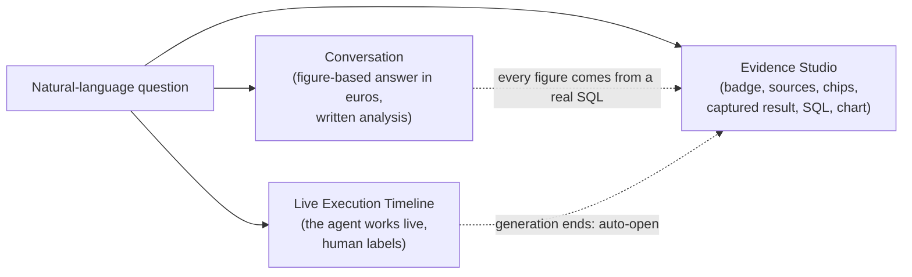

# Product Overview

> Audience: everyone (decision-makers, business users, technical newcomers). Last updated:
> 2026-06-18. Summary: what OWIsMind solves, its business domain (Orange/OWI revenue analysis),
> its users and its core value proposition, the trio of Conversation, live Timeline and Evidence
> Studio.

OWIsMind is a business agentic chat portal, delivered as a Dataiku DSS plugin
(id `owismind`, version `0.0.1`). The official plugin description is unambiguous: "Business
AI-agent chat portal: a Vue 3 webapp backed by a Flask backend that talks to Dataiku LLM Mesh agents
and stores conversations in a PostgreSQL connection via direct SQL" (`Plugin/owismind/plugin.json`).
Put differently: a user asks a business question in natural language, AI agents answer it with
real figures, and the product shows the evidence behind every answer.

## 1. The problem it solves

OWI/Orange business users need figures about their revenue, but those figures live in a SQL dataset
that you have to know how to query. Two classic obstacles arise: you have to write SQL (a rare skill
on the business side), and you have to trust an AI-generated answer (the risk of hallucination, of an
invented figure, of a fuzzy scope).

OWIsMind addresses both at once. It lets you ask a question in French or English and get a figure-based
answer that is reliable and traceable, without writing a single line of SQL and without having to trust
the model blindly. The product positioning is explicit: a trusted, professional, data-oriented portal
built on evidence and traceability, not an AI demo, not a consumer chatbot, not an opaque tool.

The differentiating key is therefore not the generation of the answer (plenty of tools can generate
text), but trust through evidence. Every figure shown comes from a real SQL result, the user sees the
agent working live, and they can inspect the exact data and the exact SQL that produced the answer.

Three product goals structure the whole product:

| Goal | What it means for the user |
|---|---|
| Productivity | Get a business analysis quickly, in natural language, without SQL expertise. |
| Trust | See the data, the steps, the SQL, the sources and the costs behind every answer. |
| Extensibility | Adding an agent, an artifact or a chart type is a matter of configuration, not a rewrite. |

## 2. The business domain: Orange/OWI revenue analysis

The current business core is the analysis of OWI/Orange customer revenue. It is the only domain
actually served by an agent in v3 (see the limitations in section 5). All the data rests on a single
source dataset, `DRIVE_Revenues` (about 175,000 rows, 20 columns, one row per combination of
scenario, offer, account and month).

### 2.1 The measure and the currency

The business measure is the `amount_eur` column: revenue, expressed in euros. The currency is not a
manual configuration, it is derived from the very name of the column (the `eur` suffix), via the
`metric_unit` logic. That is why every figure-based answer is shown in euros, with thousands separators
and the `€` symbol.

### 2.2 The scenarios (`Phase` column)

The `Phase` column carries the scenario, that is, the version of the measure. It takes five values, and
a firm business rule applies: NEVER SUM across different scenarios.

| `Phase` value | Meaning | Note |
|---|---|---|
| `ACTUALS` | Actual recorded revenue | Default scenario. Always plural, never `ACTUAL`. |
| `BUDGET` | Planned budget | Some BUDGET rows do not carry all the offer levels. |
| `FORECAST` | Forecast | |
| `Q3F` | Third-quarter forecast | |
| `HLF` | High level forecast | |

### 2.3 The offer hierarchy

An offer is described at four levels, from the broadest to the most technical:
`Product` > `Solution` > `SolutionLine` > `sirano_product`. The `sirano_product` level is the lowest,
the most technical, and it is NEVER used as a default: some rows (notably BUDGET) do not carry it,
which could make a total drop to zero. This hierarchy is not hard-coded into the agents' logic: it
lives in the business knowledge built separately (the profile and the Semantic Model instructions).

### 2.4 The other analysis axes

Beyond the scenario, the measure and the offer, `DRIVE_Revenues` carries the usual axes of a revenue
analysis: the customer (`Account_name`, `diamond_id`, `Parent_Group`, `carrier_code`), the partner or
indirect reseller (`Account_partner`, `distribution_type`), the commercial geography (`sales_zone`),
the sales entity (`sales_entity`, external `GCS` or internal Orange `GCP`), time (`year_month`), and
attribute columns such as `account_manager`, `area_manager` or `sales_director`.

An important point about the product philosophy: the business knowledge does not live hard-coded in the
code. It is built design-time by Dataiku Flow recipes, reviewable by a human, then consumed at runtime.
The recipes notably produce a profile (the "business brain": metrics, scenario, synonyms) and a value
index (the exact cell values) used to ground the terms typed by the user.

## 3. Users and use cases

### 3.1 Who uses OWIsMind

The target audience is OWI/Orange business users: analysts, sales staff, managers who want reliable
revenue figures without writing SQL. Each user sees only their own conversations and the agents they
are authorized to use. Identity is resolved server-side from the browser's authentication headers,
never from the request body. The first registered user automatically becomes administrator.

### 3.2 Typical questions

The revenue agent recognizes a series of business intents that cover the common analyses:

| Use case | Example question |
|---|---|
| Total | "What actual revenue did the HSBC account generate?" |
| Breakdown | "Revenue breakdown by solution line." |
| Ranking (top N) | "Top 10 customers by revenue." |
| Share of total | "What share of revenue does this product represent?" |
| Scenario comparison | "ACTUALS versus BUDGET for 2026." |
| Period comparison, trend | "Monthly revenue trend over the year." |
| Distinct values, count | "List the existing solution lines." |
| Data description | "What does this data contain, what can you do?" (answered from the profile, without SQL). |

> ROADMAP: the multi-agent "360" analysis (a single question that mobilizes several agents, a single
> conversation, a global timeline, one Evidence space per agent) is planned but awaits a second domain
> actually served by an agent. As it stands, only the revenue domain is active.

### 3.3 The screen journey

The user lands directly on the Chat screen (no home page). The available pages are Chat, Feedback, FAQ
and Settings / My Account. The Chat screen is made up of three spaces: the conversation sidebar on the
left, the conversation with its prompt and its timeline in the center, and the Evidence Studio on the
right (collapsible). In the input bar, `Enter` sends and `Shift+Enter` inserts a line break; sending is
blocked if the budget is reached or if the agent is unavailable; a discreet agent selector stays on the
Orchestrator by default.

## 4. The value proposition: grounded NL-to-SQL, with verifiable evidence

The value proposition can be stated in one phrase: grounded NL-to-SQL with trust evidence. Concretely,
the product translates a natural-language question into a figure-based answer in which every number is
traceable to a real SQL query. Three pillars support it.

1. Transparency by default. The user can always know which agent is acting, which step or which tool is
   running, which data and which SQL were used, and how much it costs. Technical details live in
   dedicated panels, never in the middle of the main answer.
2. Trust through evidence. The product distinguishes the evidence (what actually produced the answer:
   exact result, SQL, row count, filters, scope, source) from free exploration of the dataset
   (potentially on a sample).
3. Agent-agnostic modularity. The webapp does not contain the agents' business logic. Adding an agent
   is an act of configuration, not a rewrite.

### 4.1 The differentiating trio

The product is recognizable by three capabilities that work together.

- Conversation: the multi-turn dialogue. The orchestrator writes the analysis in the user's language,
  formats every amount in euros and presents the scope (scenario, period, entity). One example imposed
  by its persona: "Within the ACTUALS scope, across all periods (no year filter), the HSBC account
  generated 123,807 €."
- Live Execution Timeline: while the agent works, the user sees the steps unfold live, with human-readable
  labels by default (a debug mode shows the technical names). It is the timeline, and not a word-by-word
  text stream, that provides the usable "live" view.
- Evidence Studio: the Evidence panel on the right. It deterministically re-derives (zero LLM call) how
  the answer was produced: a verification badge, the sources, the filters as editable chips, the exact
  captured result, the collapsed SQL, and the artifacts (chart, table, KPI). It opens automatically when
  generation ends.

### 4.2 The honesty firewall: why you can trust it

Trust does not rest on a promise, but on a structural constraint. The orchestrator holds NO business
figure: every figure comes from a sub-agent that pulled it from a SQL. It therefore structurally cannot
invent a number. Its persona imposes an honesty firewall
(`OWIsMind_orchestrator.py`, function `build_system_prompt`):

- it never produces a business fact, a source or a capability itself;
- it never tells the user that a measure, a scenario or a record is missing, null or unavailable (only
  a specialist can say so, after looking);
- the only allowed form of "no" is the capability gap: "there is no AGENT yet for this domain". It will
  never say "the DATA does not exist";
- it never does arithmetic in its head, and it treats tool results as untrusted inputs to be verified.

On the display side, a product choice reinforces this stance: the Evidence verification badge is NEVER
green (solid = certified, dotted = partial, gray = declared), to avoid any false assurance.

## 5. High-level capabilities, and what is in flux

### 5.1 What the product does today

- Multi-turn agentic chat on `DRIVE_Revenues` revenue, across all `Phase` scenarios.
- Grounded NL-to-SQL: the user's terms are grounded on exact values via grounding, then the analytical
  SQL is written and executed by the Semantic Model Query tool (`revenue_semantic_query`,
  id `v4oqA6R`), on a Sonnet model in all modes, with a deterministic direct SQL engine as a technical
  fallback.
- Live timeline, Evidence Studio (read-only replay of the SELECT), chart / table / KPI artifacts rendered
  in the panel (interactive Chart.js charts).
- Per-message feedback, conversation editing and branches, persistent agent per conversation,
  stop-generation, token and cost tracking under each answer.
- FR and EN internationalization, light and dark theme, desktop-first responsive layout.

The cost modes are a logical key chosen by the user that drives the loop model, with no escalation (a
single model runs the whole loop):

| Mode | Loop model | Status |
|---|---|---|
| eco | Gemini 3.1 Flash-Lite | Default. |
| medium | Gemini 3.5 Flash | |
| high | Claude Sonnet 4.6 | |

> IN FLUX: the per-mode LLM Mesh ids (`GEMINI_FLASH_LITE_ID`, `GEMINI_FLASH_ID`, `SONNET_ID`) must
> match the LLM Mesh connection of the Dataiku instance; a wrong id breaks the corresponding mode. To
> be verified in DSS.

### 5.2 What the product does not do (limitations)

- No cross-dataset JOIN in a query: the sub-agent works on a single table, never a JOIN. The multi-agent
  "360" goes through the orchestrator, one agent per dataset.
- A single domain actually served (revenue). The other declared domains (`tickets`, `satisfaction`,
  `opportunities`, `delivery`, `billing`) do not have an agent yet: the orchestrator then answers with an
  honest capability gap, never with "the data does not exist".
- A single active capability per domain: a second revenue agent would require switching the first to
  `enabled=False`.
- Mobile out of scope for V1.
- No SSE streaming: DSS buffers SSE, so the product uses a polling transport (the frontend polls the
  backend every ~500 ms). The text answer often arrives in a block at the end; the usable live view
  remains the timeline.

> IN FLUX: the monthly budget limit (for example 50 EUR per user per month) has its storage ready
> (`webapp_usage_monthly_v1`), but the BLOCKING is not yet enforced. Token and cost tracking, on the
> other hand, is fully in place.

> IN FLUX: attribute lookups (for example "who is the account manager of account X?") are in transition.
> The managed tool `dataset_lookup` (`9FEzVZk`) and the `lookup` intent were REMOVED on
> 2026-06-18. Its replacement, the Custom Python tool `attribute_lookup` (`tools/attribute_lookup_tool.py`),
> is built and unit-tested, but its wiring is not finalized: `dataiku-agents/CLAUDE.md` calls it
> "not yet wired in", while the orchestrator code already starts a built-in path. Treat this point as not
> stabilized.

> ROADMAP: NOT wired in v3 are the `DRIVE_Revenues_Value_Catalog` dataset (a richer alias catalog) and
> the Python resolver `Drive_Revenues_resolve_filter_value`. The full Evidence Studio with six tabs
> (Evidence, Dataset, Chart, SQL, Trace, Cost) remains a future intention; the delivered version covers
> the essentials by replaying the SELECT read-only.

## 6. Where this product fits in the system

OWIsMind is made up of four layers: a Vue 3 frontend built into static assets served by DSS, a modular
Flask backend (`python-lib/owismind/`) that talks to the agents via LLM Mesh and persists in direct SQL
(`SQLExecutor2`, PostgreSQL, connection `SQL_owi`), two LangGraph Code Agents (Python env 3.11, the
orchestrator and the revenue sub-agent), and PostgreSQL storage. The Dataiku Flow does not run at runtime
(except for an optional write-only trace): it serves design-time to build the profile and the value
index.

The detailed system context diagram (the four layers and their exchanges) is drawn only once, in the
architecture overview. For the full diagram, see
[Architecture overview](../02-architecture/01-system-overview.md).

## See also
- [Scope and limitations](02-scope-and-limitations.md) - the detail of what the product does and does not do, and the in-flux points.
- [Glossary](03-glossary.md) - the precise definition of the terms used here (orchestrator, sub-agent, Evidence Studio, grounding, mode, Phase).
- [Architecture overview](../02-architecture/01-system-overview.md) - the four layers and the canonical system context diagram.
- [Getting started](../01-user-guide/01-getting-started.md) - open the application and ask a first question.
