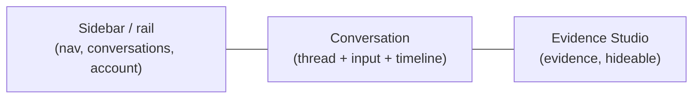

# Getting Started

> Audience: business user (analysts, sales representatives, OWI/Orange managers). Last updated:
> 2026-06-19. Summary: how to open OWIsMind in Dataiku DSS, understand the home screen, ask
> your first question and find your conversations again, with no technical prerequisites.

OWIsMind is a chat portal that lets you query your business data (first and foremost Orange telecom
revenues) in natural language, without writing a single line of code. You ask a question the way you
would ask a colleague, and the application returns a quantified answer, with the ability to verify where
every figure comes from. This guide walks you through from the very first screen to your first answer.

## Opening the application in DSS

OWIsMind is delivered as a webapp inside your Dataiku DSS instance. There is nothing to install on your
workstation: simply open the webapp address your administrator gave you, in your usual browser. The
application loads straight onto the **Chat** page (there is no intermediate landing page).

Because the application lives in DSS, your identity is already known: you are authenticated by DSS, and
OWIsMind reuses that connection. You therefore have neither a new password to remember nor a login form
to fill in.

> IN FLUX: if, when opening the application, you see a "Storage not configured" message in the center of
> the screen, it means an administrator has not yet chosen the SQL storage connection in the webapp
> settings. This is not an error on your side: notify your administrator (see the
> [FAQ and troubleshooting](04-faq-and-troubleshooting.md)). As long as this setting is missing, the chat
> remains unavailable.

## Your identity, resolved automatically

OWIsMind recognizes who you are without asking you anything. On opening, the application retrieves your
identity from DSS and derives a display name from your login identifier. For example, an identifier
`said.chaoui` becomes the display name `Said`, and your initials appear in a chip at the bottom left of
the screen.

In practice, this has two consequences for you:

- You only see **your** conversations. No one else can read your exchanges, and you do not see those of
  other users.
- You only see the **agents authorized** by the administrator. The list of available agents is set on the
  server side, not in the browser.

The very first user who opens the application after it is configured becomes an **administrator**:
they gain access to an administration page (an additional "Admin" button appears in the bottom menu). The
following users are standard users. If you are an administrator, you will in particular be able to choose
which agents are offered to others.

## The on-screen landmarks

The Chat screen is divided into three areas, from left to right. The right-hand area only appears on
demand.

| Area | What it is for |
|---|---|
| Sidebar / rail (left) | Navigation, the list of your recent conversations, and at the bottom your account avatar and the help menu. Collapses into a narrow icon rail. |
| Conversation (center) | The heart of the application: the conversation thread, the input area at the bottom, and the timeline that shows the agent at work. |
| Evidence Studio (right) | The Evidence panel: it explains how an answer was produced (source data, filters, calculation, SQL, charts). It opens on its own at the end of an answer and can always be hidden. |

### The sidebar and the icon rail

The sidebar contains, from top to bottom: the **OWIsMind logo** (the real Orange brand image), a
"New conversation" button (`+`), the **Agents** library link, your recent conversations listed by
title (the most recent first, loaded progressively as you scroll), a **Help** icon (`?`), and at
the very bottom your avatar (initials in a circle) that opens the account / settings menu. The
collapse button (`sb.collapse`) sits at the top of the sidebar, next to the logo. When collapsed,
the logo itself acts as the expand button; a second expand button also appears in the top bar when
the sidebar is in rail mode. The compact **icon rail** still gives you access to all destinations
via icons with tooltips (`rail.new`, `rail.agents`, `rail.help`, `rail.account`). The
conversation list is hidden in the rail but stays mounted so it is ready the moment you expand again.

The navigation links lead to: **Chat** (conversations), **Agents** (the agent library),
**My account** (formerly "Settings"), and if you are an administrator, **Administration**.

### The center: the home screen of a blank conversation

When no conversation is open, the center displays a plain home screen:

- a title, "What would you like to analyze today?" (i18n key `empty.title`);
- an introductory sentence with a link to the agent library (`empty.sub_*`);
- a practical tip (`empty.tip`): the more precise and well-formulated your request is (the terms used,
  the period, the scope), the better the answer will be;
- and, just below, the **input area** where you type your question.

This is deliberately minimal: no fake figures, no misleading suggestions, just enough to get started.

## Asking your first question

The procedure is immediate:

1. Type your question in the input area, at the bottom center of the screen. The prompt text reminds you
   to describe your request "as precisely as possible" (key `prompt.placeholder`).
2. Press **Enter** to send. To write on several lines without sending, use **Shift+Enter** (which inserts
   a line break).
3. The agent gets to work. You follow its progress live thanks to the **timeline** (the sequence of
   steps: it searches, it queries the data, it writes). See the [Using the chat](02-using-the-chat.md)
   guide for the detail of these steps.
4. The answer appears, and the **Evidence Studio** panel opens automatically on the right to show you
   where the result comes from. See [Understanding the results](03-understanding-evidence.md).

A few examples of questions suited to the domain currently covered (the revenues of the `DRIVE_Revenues`
dataset):

- "What is the actual revenue of the HSBC account?"
- "Break down revenues by solution line."
- "Top 10 customers by turnover."
- "Compare the 2026 budget and the actuals for roaming."
- "What does this data contain, what can you do?"

Good to know: the text answer often arrives **all at once, at the end** rather than word by word. This is
not a freeze: meanwhile, it is the timeline that shows you the agent is progressing. The technical reason
(no continuous text streaming) is described in the backend documentation; from a usage standpoint, rely
on the timeline.

By default, it is the **orchestrator** that answers: it converses with you, routes your question to the
appropriate specialist, and writes the analysis. You can also choose a specific agent and a response
**mode** (eco, medium, high); these settings are explained in
[Using the chat](02-using-the-chat.md).

> IN FLUX: only one domain is genuinely covered by an agent today, that of **revenues**. If you ask a
> question about another domain (tickets, satisfaction, etc.), the application honestly answers that it
> does "not yet have an agent for this domain", and never that the data does not exist. See
> [Scope and limitations](../00-overview/02-scope-and-limitations.md).

## Conversation and session: finding your way through history

Two simple notions structure your history. They carry the same object viewed from two angles, and it is
useful to distinguish them.

| Notion | What it is, from the user side |
|---|---|
| Conversation (session) | The complete thread of a discussion: your series of questions and the agent's answers, grouped together. This is what you find again in the sidebar, under a title. |
| Exchange | A single round trip within a conversation: a question from you and the corresponding answer. A conversation is a sequence of exchanges. |

A conversation carries a unique identifier. From your first exchange onward, this identifier is written
into the page address (in the form `/chat/<identifier>`): the conversation is then highlighted in the
sidebar, and you can reopen it later by clicking on it. The title shown in the list is derived
automatically from your first message (cleaned up and shortened); there is nothing to enter.

To start over from scratch, click **New conversation**: OWIsMind opens a blank thread with a new
identifier. Your previous conversation remains accessible in the sidebar, intact.

When you reopen an existing conversation, OWIsMind reloads its messages and resumes the agent from the
last exchange (if it is still authorized). You therefore pick up the discussion exactly where you left
it.

## The promise: verifiable answers

What distinguishes OWIsMind from a simple chatbot is **trust through evidence**. Every figure displayed
comes from a real result on your data, never from an invention by the AI. You can always:

- watch the agent work live (the timeline);
- open the Evidence Studio to inspect the data, the filters and the calculation behind an answer;
- consult, for each answer, a scope line that recalls the scenario (by default the `ACTUALS`), the period
  and the currency (in euros).

The Evidence Studio verification badge is, by product choice, **never green**: it aims to inform you
honestly of the level of evidence, without giving a false impression of absolute certainty. The detail of
this panel is covered in [Understanding the results](03-understanding-evidence.md).

## What comes next

You now know how to open the application, ask a question and find your conversations again. To go further:
choosing an agent, setting the response mode, editing or replaying a message, stopping a generation, and
reading the timeline, head to [Using the chat](02-using-the-chat.md). To understand your monthly usage
and budget, see [My account and budget](05-account-and-budget.md). To browse what the agents can do,
see [Agents and administration](06-agents-and-administration.md). If something does not go as expected,
the [FAQ and troubleshooting](04-faq-and-troubleshooting.md) lists the most common situations.

## See also
- [Using the chat](02-using-the-chat.md) - the prompt, the agent selector, the modes, the timeline, the versions and stopping.
- [Understanding the results](03-understanding-evidence.md) - the Evidence Studio from the user side (badge, chips, drill, charts).
- [My account and budget](05-account-and-budget.md) - theme, language, profile, the monthly budget gauge and what happens when it is reached.
- [Agents and administration](06-agents-and-administration.md) - browse the agent library; admin tasks (enable agents, author profiles, manage quotas).
- [FAQ and troubleshooting](04-faq-and-troubleshooting.md) - practical answers and frequent error messages.
- [Product overview](../00-overview/01-product-overview.md) - the problem solved and the differentiating trio.
- [Scope and limitations](../00-overview/02-scope-and-limitations.md) - what the product does and does not do yet.
