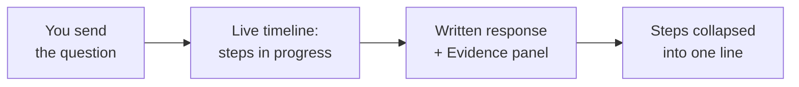
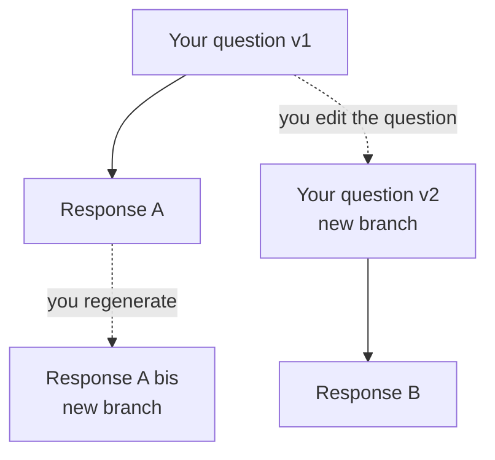

# Using the chat

> Audience: business user (analyst, sales representative, OWI/Orange manager). Last updated:
> 2026-06-18. Summary: how to ask an agent a question in OWIsMind, set the cost/quality mode, follow
> the agent working live, stop a generation, navigate the versions of a response and give feedback.

The chat is the central screen of OWIsMind. There, you converse in natural language with an AI agent
that queries your data on your behalf, without you writing any SQL. The screen reads in three columns:
the list of your conversations on the left, the current conversation and the input bar in the center,
and the Evidence Studio evidence panel on the right (which can be hidden). This document covers the
center column: asking a question, choosing an agent and a mode, reading the live execution, stopping,
and editing or regenerating a response. The right-hand panel has its own guide,
[Understanding the results](03-understanding-evidence.md).

## The input bar: asking a question

The input bar (the `PromptBar.vue` component) sits at the bottom of the center column. There, you type
your request into a text area that grows on its own as you write.

- `Enter` sends the question.
- `Shift+Enter` inserts a line break (useful for a multi-line request).

To the left of the bar are the agent selector and the mode selector (see below). To the right, a
microphone button and the send button.

> IN FLUX: the microphone button (voice dictation) is an honest placeholder with no transcription
> engine behind it. Clicking it only shows a "coming soon" message: voice never sends your request
> automatically (`PromptBar.vue`, function `micClick`).

Sending is blocked until certain conditions are met: no agent selected, agent unavailable, conversation
still loading, or storage not configured. In these cases, the send button stays greyed out. As long as
the backend has no SQL connection configured, the application displays a "storage not configured" state
and the chat is inactive.

### Writing a good question: be precise

OWIsMind is not a guessing engine: the more precise your request, the better the response. The empty
screen (before your first question) displays an explicit tip on this subject (`empty.tip`):

> Tip: the more precise and well-formulated your request, the terms used, the period, the scope, the
> better the response.

In practice, name what matters to frame the query:

| What to specify | Why it helps | Example |
|---|---|---|
| The entity or the customer | the agent anchors your term to an exact value in the database | "the HSBC account", "the EVPL product" |
| The scenario (`Phase`) | the figures exist in several versions (`ACTUALS`, `BUDGET`, `FORECAST`, `Q3F`, `HLF`) that are never mixed | "actuals vs budget" |
| The period | without a period, the agent uses all periods (and tells you so) | "YTD 2026", "for 2025" |
| The type of analysis | total, breakdown, top N, comparison, trend | "top 10 customers by revenue" |

If your term is ambiguous (for example an offer that could match several levels of the product
hierarchy), the agent most often decides on its own and tells you the choice it made, rather than
sending a question back to you. So you do not need to know the technical schema: phrase your request in
business language, and the agent does the rest.

In return, you get a written analysis, with the amounts formatted (thousands separators and the `€`
symbol) and a reminder of the scope used (scenario, period, entity). When the response relies on several
rows of data, the agent does not copy a table into the text: it renders it in the Evidence panel on the
right (chart, table or indicator) and comments in the conversation thread.

## Choosing an agent

To the left of the input bar, the agent selector (`AgentPicker.vue`) shows the agent that will answer
your next question. By default, it is the orchestrator (`OWIsMind_orchestrator`), the generalist entry
point that understands your question, routes it to the right specialist and writes the analysis.

The list of agents offered always comes from the server (the agents that an administrator has enabled
for your account): you only see what is actually available. A conversation remembers the agent chosen;
when you open an existing conversation, OWIsMind picks up the agent from the last exchange. A brand-new
conversation starts again from the last agent you used.

> In v3, only one business domain is actually equipped with an agent: revenue (`DRIVE_Revenues`, all
> Phases). If you ask a question about a domain not yet covered (for example support tickets), the
> orchestrator answers honestly that it does not yet have an agent for that domain. It will never say
> that the data "does not exist": this is the honesty firewall, detailed in
> [the agent system](../05-agents/02-orchestrator.md).

## Choosing a mode: Eco, Medium, High

The mode selector (`ModelModePicker.vue`), next to the agent selector, is a cost/quality slider. It
drives the power of the model that processes your question. A small pill displays the current mode with
a colored dot (green, orange, red); clicking it opens an explanation window.

| Mode | What for | Cost | Speed |
|---|---|---|---|
| Eco (default, recommended) | the vast majority of everyday questions | low (1/5) | very fast (5/5) |
| Medium | analyses that require a bit more finesse | moderate (3/5) | fast (3/5) |
| High | complex questions that warrant in-depth reasoning | high (5/5) | more deliberate (2/5) |

Eco is the default mode and carries a "Recommended" badge: it is the best balance of performance /
quality, and the most economical. The product recommendation is simple: stay in Eco, and reserve High
for the questions that truly warrant it. The window also reminds you that the more powerful modes
consume your monthly envelope of 50 € faster.

The mode window presents the three modes as a list on the left and the detail of the selected mode on
the right (description, cost gauge and speed gauge). Your choice applies only after you click
**Validate**; **Cancel** closes it without changing anything. It is a preference that is attached to
each question sent.

> IN FLUX: the 50 €/month envelope is currently a cost benchmark, not a blocking ceiling. Consumption
> tracking is in place (each response displays its tokens and its estimated cost), but automatic
> BLOCKING on overrun is not yet enabled.

Cost tracking is also visible under each response: a discreet line shows the input tokens, the output
tokens and the estimated cost of the exchange.

## The live execution timeline

When you send a question, the agent does not return the response instantly: it works (understand, route,
query the data, write). OWIsMind makes this work visible live as a timeline of steps, in the agent's
response bubble (`MessageAgent.vue`).

> The underlying transport is not word-by-word text streaming but polling every ~500 ms: the response
> text often drops in one block at the end, whereas the timeline advances continuously. So it is the
> timeline that shows you that progress is being made. The detail of this mechanism lives in
> [Backend - streaming and runs](../04-backend/03-streaming-and-runs.md).

During the generation, you see an activity banner with the steps as they happen (for example planning,
the call to the revenue specialist, the query execution, the writing of the response). The labels are in
human language by default, in your language. A timer indicates the elapsed time per step. When the agent
has several steps, only the most recent stay displayed on screen (a window of the last five) so as not
to overwhelm you.

Once the response is finished, all these steps collapse onto a single collapsible header line: "Agent
steps" followed by the number of steps and the total duration. Clicking it expands the detail if you
want to check what happened. It is a transparency marker, not an obstacle: the written response remains
the main element.

> IN FLUX: the exact list of steps displayed depends on the labels emitted by the agents, which are
> evolving. The interface handles this case robustly (an unknown label is simply humanized), so a new
> kind of step never breaks the display.

## Stopping a generation

While an agent is working, the send button on the input bar becomes a stop button (square "stop").
Clicking it requests that the current generation be stopped.

The stop is cooperative: the backend cuts off cleanly between two pieces of the response, it does not
kill the work abruptly. So you first see a blinking "Stopping..." indicator with a spinner, then the
final state appears:

- if the agent had already written some text, the partial is kept and marked with a small "Generation
  stopped" tag;
- if it had not yet produced anything, OWIsMind displays an honest "Response interrupted" message rather
  than an empty bubble.

Stopping a response does not remove it from the conversation: it stays in the thread, as it was at the
moment of the stop.

## The conversation tree: editing and regenerating

An OWIsMind conversation is not a simple linear list: it is a tree. You can start again from a previous
question without losing anything. Two actions create a new branch from the same point, and the old
version always remains accessible.

- **Editing your question**: hover over your bubble (on the right) and click the edit icon. An inline
  text area opens; on validating, OWIsMind creates a NEW sibling branch with your reformulated question
  (the old one is not erased). This is the way to correct or refine a poorly formulated request.
- **Regenerating the response**: under an agent response, the "Regenerate" button reruns the SAME prompt
  to obtain another response, also as a new sibling branch. Useful if the first response does not suit
  you, or if you want to replay it in another mode.

When a point in the conversation has several versions (because you edited or regenerated), navigation
arrows appear under the response, with a counter such as "2/3". The left and right arrows move you from
one version to another; OWIsMind then follows the branch you pinned.

You can also copy the text of a response (the "Copy" button) or that of your own question (on hovering
over your bubble).

## Giving feedback

Under each agent response, two thumbs-up / thumbs-down buttons let you rate the response. The feedback is
recorded immediately.

- A **thumbs-down** then opens a small window to specify what went wrong: you check one or more reasons
  (wrong response, incomplete response, off topic, other) and can add a free comment.
- A **thumbs-up** can also be commented on (via the "..." menu next to the actions, entry "Give detailed
  feedback") to say what you liked. In this case, the window asks only for a comment, not for reasons.

Your feedback is attached to the precise response you are rating and stays visible when you reopen the
conversation later. It helps the OWI team improve the agents.

## In summary

| You want to | How |
|---|---|
| Ask a question | Type in the bar, `Enter` to send, `Shift+Enter` for a new line |
| Switch agent | Agent selector to the left of the bar (default: orchestrator) |
| Set cost/quality | Mode selector (Eco recommended, Medium, High); validate in the window |
| Follow the work live | The step timeline in the response bubble |
| Stop | The send button becomes a stop button during generation |
| Correct a question | Hover over your bubble, edit icon (creates a branch) |
| Replay a response | The "Regenerate" button (creates a branch) |
| Navigate between versions | Arrows and "n/m" counter under the response |
| Give an opinion | Thumbs-up / thumbs-down, then reasons and comment |

## See also
- [Getting started](01-getting-started.md) - open the application and ask a first question.
- [Understanding the results](03-understanding-evidence.md) - the Evidence Studio panel on the right (badge, filters, drill, chart).
- [FAQ and troubleshooting](04-faq-and-troubleshooting.md) - practical answers and frequent error messages.
- [The orchestrator](../05-agents/02-orchestrator.md) - how the agent routes your question and the honesty firewall (technical reader).
- [Backend - streaming and runs](../04-backend/03-streaming-and-runs.md) - the polling mechanism behind the live timeline (technical reader).
