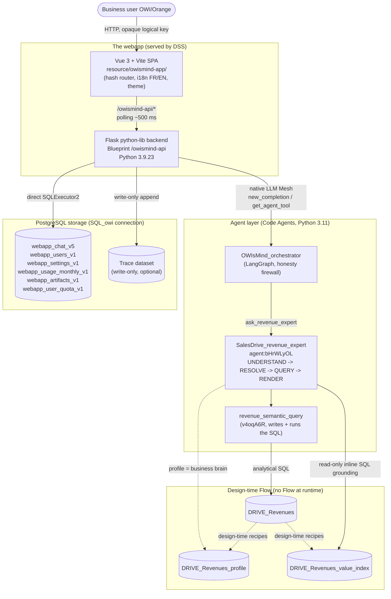

# Architecture overview

> Audience: developer, architect. Last updated: 2026-06-19. Summary: this document
> presents the big picture of OWIsMind (the four layers, their boundaries and their guiding
> principles) and serves as an entry point into the detailed documentation for each layer.

OWIsMind is a Dataiku DSS plugin (id `owismind`, version `0.0.1`) that delivers a portal for
business agentic chat. Its architecture reads as four stacked layers, connected by deliberately
narrow contracts. This document gives one sentence to each, draws the system context diagram
(the canonical home of that diagram), states the cross-cutting guiding principles, then points
to the documents that go deeper into each layer.

## The four layers in one sentence

| Layer | Where it lives | Its reason for being in one sentence |
|---|---|---|
| Vue 3 SPA (frontend) | `Plugin/owismind/frontend/`, built into static assets in `Plugin/owismind/resource/owismind-app/` | Renders the three screen areas (conversations sidebar, chat + timeline, Evidence Studio), sends opaque logical keys to the backend and displays the evidence. |
| Flask backend (python-lib) | `Plugin/owismind/python-lib/owismind/`, Python 3.9.23 env | A Flask Blueprint mounted under `/owismind-api` that resolves identity, applies the agent whitelist, runs the agent in a worker, persists in direct SQL and re-derives Evidence. |
| LLM Mesh agent layer (Code Agents) | `dataiku-agents/agents/`, pasted into DSS Code Agents, Python 3.11 env | The `OWIsMind_orchestrator` orchestrator routes to the revenue expert sub-agent `SalesDrive_revenue_expert` (`agent:bHrWLyOL`), both on LangGraph, which produce the answer and the SQL-grounded figures. |
| PostgreSQL storage (direct SQL) | `SQL_owi` connection (schema `public`), queried via `SQLExecutor2` | Keeps conversations, messages, usage, settings and artifacts in `_vN` tables, with no Flow at runtime (except the write-only trace). |

The Vue 3 frontend and the Flask backend together form what the documentation calls "the webapp".
The agent layer is separate: it does not live in the plugin zip, it is pasted by hand into two DSS
Code Agents from the repository (the source of truth). The backend, for its part, stays
model-agnostic: it consumes a generic LLM Mesh stream without knowing anything about LangGraph.

## System context diagram

This diagram is the canonical home of the OWIsMind system context. Other documents refer back to it
instead of redrawing it.

Quick read of the diagram: a user question flows down through the SPA, which only ever makes a short
HTTP call to `/owismind-api/*`. The backend resolves identity and the whitelist, then calls the
orchestrator over native LLM Mesh. The orchestrator routes to the sub-agent, which grounds the terms
with inline SQL on the value index, then has the analytical SQL written and run by the Semantic Model
Query tool. In parallel, the backend persists the application state in direct SQL on the `SQL_owi`
connection. The Flow recipes (dotted) run only at design-time, to build the profile and the value
index.

## A question's journey, from above

The detailed runtime flow (full sequence `/chat/start` -> worker -> agents -> `/chat/poll` -> persist
-> Evidence auto-open) has its canonical home in
[03-runtime-flows.md](03-runtime-flows.md). In one sentence per layer:

1. The SPA posts to `POST /owismind-api/chat/start` an opaque logical agent key, the message and the
   chosen mode, never a raw `agent_id` nor a table.
2. The backend validates the request, resolves the agent via the server whitelist, persists the user
   message (phase one), then launches a daemon worker thread that returns a `run_id`.
3. The worker runs the LangGraph orchestrator over native LLM Mesh; the orchestrator routes to the
   sub-agent, which produces the figures; the events (timeline, generated SQL, usage) are normalized
   and accumulated in an in-memory dict.
4. The SPA polls `GET /owismind-api/chat/poll` every ~500 ms and replays the events to animate the
   live timeline; at the end, the worker persists the answer (phase two), the usage, the trace and the
   artifacts (all best-effort).
5. The Evidence Studio panel deterministically re-derives, with no LLM, how the answer was produced
   (badge, sources, chips, computation, captured result, SQL) and opens automatically.

## Guiding principles (the cross-cutting invariants)

These principles run across the four layers: they explain why the boundaries are placed where they
are. Each is documented in more detail in an architecture decision (section 08).

### Direct SQL, no Flow at runtime

The backend persists ALL of its application state (conversations, messages, feedback, user registry,
settings, token/cost usage, artifacts) in direct SQL via `dataiku.SQLExecutor2` on the PostgreSQL
connection configured by the admin (`SQL_owi` by default), in the `public` schema. The rule is
summarized at the top of `storage/__init__.py`: "Direct SQL via SQLExecutor2 on the admin-configured
PostgreSQL connection (...) no DSS Flow at runtime." Concretely, this requires a fresh `SQLExecutor2`
per call (never shared across worker threads), a physical naming `{PROJECT_KEY}_{namespace}_{logical}`
built by `sql_config.full_table(...)`, table versioning with `_vN` (never an `ALTER` of structure), an
explicit `COMMIT` after each write, always-parameterized values (`sql_value` / `nullable_value`,
identifiers via `pg_identifier`), and a systematic `user_id` scoping in the `WHERE`. The only exception
to "no Flow" is the trace dataset, appended write-only via
`dataiku.Dataset(...).write_with_schema(...)` because a logged INSERT would inline a large JSON blob.
See [0003-sql-direct-sans-flow.md](../08-decisions/0003-sql-direct-sans-flow.md) and the detail in
[04-backend/04-storage-and-data-model.md](../04-backend/04-storage-and-data-model.md).

### Server-side agent whitelist, opaque logical key

The frontend never picks which agent to run in the clear: it sends an OPAQUE logical key (of the form
`ag_<hash>`), and the backend resolves it into `(project_key, agent_id)` via
`storage.settings.resolve_enabled_agent` against the agents an admin has enabled (persisted in
`webapp_settings_v1` under the key `enabled_agents`). A forged or disabled key resolves to `None` and
can never reach an executable agent. This whitelist is two-tiered: the backend resolves the
orchestrator, then the orchestrator's `CAPABILITIES` registry (the single extension point for adding a
sub-agent) resolves the sub-agent's id. The model never sees a raw `agent_id`: it sees a tool named
after the capability (`ask_revenue_expert`). See
[0004-whitelist-agents-serveur.md](../08-decisions/0004-whitelist-agents-serveur.md) and the security
framework [04-security-model.md](04-security-model.md).

### Repo = source of truth for the agents

The two Code Agents are not packaged in the plugin zip. They live in the repository
(`dataiku-agents/agents/OWIsMind_orchestrator.py` and `SalesDrive_revenue_expert.py`), which is the
source of truth, and are pasted by hand into their DSS Code Agents, in a Python 3.11 environment
(langchain and langgraph are installed there). The runtime contrast is central: the backend runs on
Python 3.9.23 (Flask, never langchain), while the agent layer requires Python 3.11 for LangGraph. When
one of the two files changes, BOTH are re-pasted together (some fixes live on both sides), and the
configuration ids are re-verified after pasting. See
[0005-langgraph-code-agents-python-311.md](../08-decisions/0005-langgraph-code-agents-python-311.md)
and the procedure in
[05-agents/07-deploying-and-editing-agents.md](../05-agents/07-deploying-and-editing-agents.md).

### Signal versus data: the orchestrator holds no figure

This is the system's strongest structural invariant. The orchestrator NEVER holds business data: every
figure comes from a sub-agent (SQL-grounded), so it structurally cannot make up a number. This "honesty
firewall" breaks down into several clean signal-versus-data separations:

- An artifact (`show_chart` / `show_table` / `show_kpi`) carries ONLY a display spec `{kind, title,
  chart|kpi}`, never the data rows. The data is the captured `result`, read separately via
  `/evidence/meta`; the Chart.js payload is rebuilt on the backend by `evidence/chart_payload.py`.
- The polled live timeline is deliberately light: the `result` key (captured rows) is stripped from the
  live events and is read only at persistence.
- Grounding (anchoring user terms onto exact cell values) is read-only inline SQL on
  `DRIVE_Revenues_value_index`: it is NOT a tool. The labels `resolve_filter_value` and
  `dataset_sql_query` that appear on the timeline are event names, not tool calls.

The only real DSS tool called at runtime in v3 is `revenue_semantic_query` (`v4oqA6R`), which writes
AND runs the analytical SQL over a Semantic Model (Sonnet) in all modes. See
[0008-evidence-trust-layer-et-artifacts.md](../08-decisions/0008-evidence-trust-layer-et-artifacts.md)
and [0010-grounding-et-semantic-model.md](../08-decisions/0010-grounding-et-semantic-model.md).

### Dataiku instance safety, everywhere

Every code path first asks itself whether it is risky, slow or overloading for the instance. This
translates into bounds at each layer: a cap on concurrent runs (`MAX_CONCURRENT_RUNS = 8`), a wall-clock
deadline (`MAX_RUN_SECONDS = 300.0`), TTL eviction of orphaned runs, caps on persisted text
(`MAX_PERSISTED_TEXT_CHARS = 262_144`), caps on captured results, a bounded depth for the ancestor chain
(`MAX_CHAIN_DEPTH = 200`), a bounded sub-agent fan-out (`MAX_PARALLEL_AGENTS = 3`). No generic SQL route
is exposed, and the frontend never picks a table, a connection or a query.

## Transport: polling, not SSE

The transport between the SPA and the backend is polling via a background thread, not Server-Sent
Events. DSS places an internal nginx in front of each webapp Python backend, which can buffer a long
`text/event-stream` response, so that the events would all arrive at once at the end. OWIsMind works
around this exactly like the production Dash app on the same instance: the agent runs in a worker
thread, its progress accumulates in a module-level dict (`_RUNS`), and the frontend polls that dict
with short requests that the proxy never buffers. Visible consequence: the text answer often lands in a
block at the end; what is genuinely usable live is the execution timeline, not word-by-word streaming.
The canonical home of the streaming-by-polling diagram is
[04-backend/03-streaming-and-runs.md](../04-backend/03-streaming-and-runs.md); see also
[0002-streaming-par-polling.md](../08-decisions/0002-streaming-par-polling.md).

## Points in flux (to be aware of)

> IN FLUX: the agent layer (`dataiku-agents/`) is being edited live by another engineer; some of the
> details below may diverge from the state of the repository at read time.

- `attribute_lookup` (`dataiku-agents/tools/attribute_lookup_tool.py`) is BUILT and unit-tested, and
  now WIRED as a BUILT-IN tool of the orchestrator (`LOOKUP_TOOL_NAME`, `_run_lookup` dispatch), but the
  constant `LOOKUP_TOOL_ID` is still EMPTY: it is therefore not operational until an admin has created
  the Custom Python tool in DSS and filled in the id (clean degradation to the specialist in the
  meantime). Its predecessor, the managed tool `dataset_lookup` (`9FEzVZk`) and the `lookup` intent, were
  REMOVED on 2026-06-18: attribute lookups (for example a client's account manager) are therefore in
  transition.
- `DRIVE_Revenues_Value_Catalog` and the Python resolver `Drive_Revenues_resolve_filter_value` are
  ROADMAP, NOT wired in v3.
- The per-mode LLM Mesh ids (`GEMINI_FLASH_LITE_ID`, `GEMINI_FLASH_ID`, `SONNET_ID`) must match the
  instance's LLM Mesh connection; a wrong id breaks the corresponding mode and must be verified in DSS.
- The monthly budget quota (50 USD per user per month): BOTH the storage AND the blocking are
  implemented (as of 2026-06-18). The table `webapp_user_quota_v1` holds per-user overrides;
  `storage/budget.py` resolves the effective limit; `POST /chat/start` calls `budget.has_budget`
  and returns `402 monthly_quota_exceeded` when enforcement is on and the limit is reached
  (fail-open: a storage error lets the run through and the spend is still recorded). The frontend
  mirrors this in `canSend` and a transparent budget banner in `ChatView`.
- The capture of the Evidence `result` is best-effort: the key for the tool span's rows is not confirmed
  on the instance, so the `result` may be absent.

A versioning detail to note for corpus consistency: the reference documentation under `docs/` is
sometimes outdated (for example, it describes `webapp_chat_v4` and `CONV_TITLE_MAXLEN = 140`). The CODE
prevails: the current chat table is `webapp_chat_v5` and `CONV_TITLE_MAXLEN = 56`.

## See also
- [Component map](02-component-map.md) - the detail of each layer's modules (Pinia stores, python-lib sub-packages, recipes).
- [Runtime flows](03-runtime-flows.md) - the full sequence of a chat turn, home of the runtime diagram.
- [Security model](04-security-model.md) - trust boundary, run-as-user, owner-scoping, whitelist.
- [Technology stack and dependencies](05-technology-stack.md) - Vue/Vite, Flask 3.9, LangGraph 3.11, PostgreSQL, versions.
- [Product overview](../00-overview/01-product-overview.md) - the problem solved and the differentiating trio that motivate this architecture.
- [Backend - streaming and run lifecycle](../04-backend/03-streaming-and-runs.md) - the home of the streaming-by-polling diagram.
- [Backend - storage and data model](../04-backend/04-storage-and-data-model.md) - direct SQL and the `_vN` tables in detail.
- [Agent system - overview](../05-agents/01-agent-system-overview.md) - orchestrator, sub-agent and frozen contracts.
- [ADR-0003 - Direct SQL, no Flow at runtime](../08-decisions/0003-sql-direct-sans-flow.md) - the why of direct SQL.
- [ADR-0004 - Server-side agent whitelist](../08-decisions/0004-whitelist-agents-serveur.md) - the opaque logical key.
