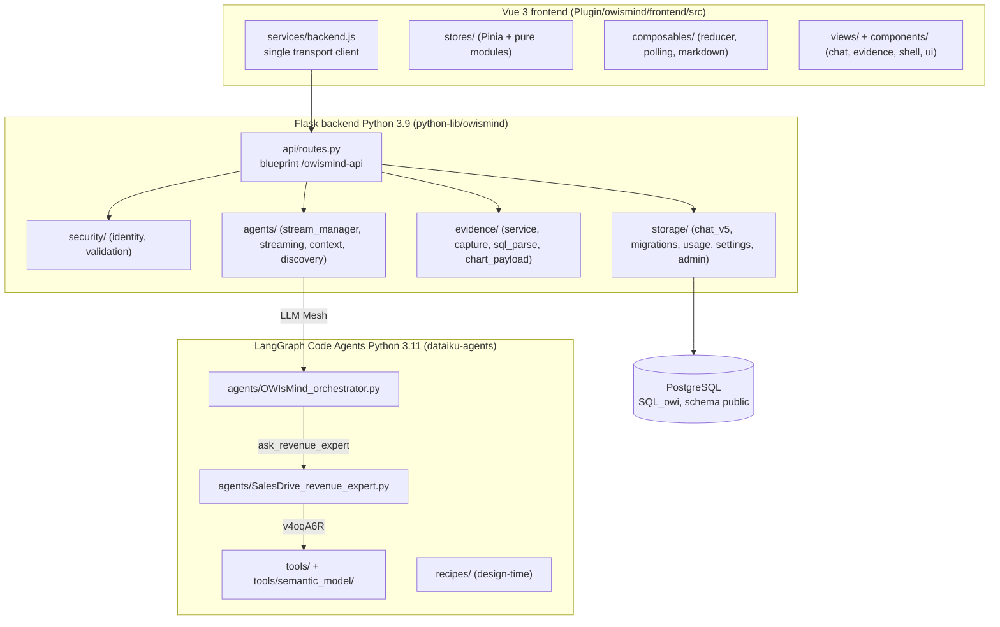

# Component map

> Audience: developer. Last updated: 2026-06-18. Summary: the layer-by-layer inventory of every major
> OWIsMind component (frontend, Flask backend, agent layer, SQL storage), with its responsibility and its
> exact file, so you know where everything lives before touching it.

OWIsMind breaks down into four layers: a Vue 3 frontend served as static assets, a modular Flask backend
(Python 3.9) in `python-lib/owismind/`, two LangGraph Code Agents (Python 3.11) called through LLM Mesh,
and direct SQL storage on PostgreSQL. This document catalogs the MODULES of each layer. For the overall
system context (who talks to whom, the trust boundary), see
[Architecture overview](01-system-overview.md), which holds the context diagram; this document holds the
MODULE map.

> IN FLUX: the agent layer (`dataiku-agents/`) is being edited live by another engineer. The transition
> points (the `attribute_lookup` tool wired as a built-in of the orchestrator but with `LOOKUP_TOOL_ID`
> empty, `Value_Catalog` on the roadmap, the `lookup` intent removed on
> 2026-06-18) are flagged at the bottom of this document and detailed in
> [The revenue expert sub-agent](../05-agents/03-revenue-expert-subagent.md).

## Overall map of modules by layer

The frontend knows ONLY logical keys (`agent_key`, `mode`) and structured data: it never reaches the SQL or
the agents directly, everything goes through `api/routes.py`. The agent layer is strictly separated from the
backend: these are two distinct Python runtimes (3.9 vs 3.11) that share no imports, they communicate solely
through LLM Mesh.

## Frontend layer

Root: `Plugin/owismind/frontend/src/`. Stack: Vue 3 (Composition API), Pinia, vue-router in hash
history, vue-i18n, markdown-it + DOMPurify, Chart.js. The detail lives in
[Frontend - state and stores](../03-frontend/02-state-and-stores.md) and
[Frontend - components and views](../03-frontend/03-components-and-views.md); below is the inventory.

### Transport and stores

| Module | File | Responsibility |
|---|---|---|
| Backend client | `services/backend.js` | The ONLY network point: every call goes through `getWebAppBackendUrl('/owismind-api/...')`, never a hardcoded URL. |
| Chat store | `stores/chat.js` | The active conversation as a TREE of exchanges, the sending state, the draft. `_runExchange` is the only place where an exchange is created and launched. |
| Session store | `stores/session.js` | Identity, list of enabled agents (picker), paginated list of conversations. Degrades gracefully outside DSS. |
| Evidence store | `stores/evidence.js` | State of the Evidence Studio panel: current exchange, server meta, local editable chips, row pagination, drill. |
| UI store | `stores/ui.js` | Single source of truth for preferences (theme, widths, language, `contextMessages`, `modelMode`), persisted in localStorage. |
| Conversation tree | `stores/conversationTree.js` | PURE module: `childrenOf`, `activeChildOf`, `buildActivePath` (the active path follows the override or the last child). |
| Conversation list | `stores/conversationList.js` | PURE module: `mergeConversations` (dedup), `upsertAndBump` (bumps to the top). |
| Agent selection | `stores/agentPick.js` | PURE module: `pickDefaultAgent` (last used, otherwise first). |
| Preference bounds | `stores/prefs.js` | PURE module: `clampContextMessages` (10-50), MIRROR of `security/validation.py` (the shared front/back contract). |

### Composables

| Module | File | Responsibility |
|---|---|---|
| Timeline reducer | `composables/timelineModel.js` | The heart of streaming: `applyEvent` turns the backend event stream into an ordered incremental list, mutated IN PLACE to drive the `reactive()` proxy. Pure (tested with `node:test`). |
| Polling transport | `composables/useChatStream.js` | The polling loop: `runChatStream` calls `startChat`, receives `run_id`/`exchange_id`, loops `pollChat` every 500 ms. |
| Evidence model | `composables/evidenceModel.js` | Pure helpers for chips and drill (`buildDrillLabels` aborts if a column is not mappable rather than lie about the scope). |
| Trust layer | `composables/evidenceProof.js` | `trustLevel(meta)` -> deterministic level (solid/dashed/muted, NEVER green); a v1 meta falls back to "declared". |
| SQL coloring | `composables/sqlPretty.js` | `formatSql`/`tokenizeSql` (SAFE coloring, every token escaped, never v-html). Never throws. |
| Markdown rendering | `composables/useMarkdown.js` | The ONLY v-html path: markdown-it `html:false` + DOMPurify. Hardens links (`target=_blank`, `rel=noopener`). |
| Miscellaneous | `composables/useToasts.js`, `useTr.js`, `useClickOutside.js`, `useReducedMotion.js` | Toast queue, `{fr,en}` -> locale resolution, click-outside listener, reduced-motion flag. |

### Views and components

| Module | File(s) | Responsibility |
|---|---|---|
| Shell | `components/shell/AppLayout.vue`, `MainTop.vue`, `Sidebar.vue` | CSS grid `sidebar | main | evidence`, resize handles, contextual title, lazy-loaded conversation list. |
| Chat view | `views/ChatView.vue` | Wires the route to the store: `chat.ensureSession(sid)`, stamps the `/chat/<sid>` URL on the first exchange, 3 states (needsConfig / hasMessages / empty). |
| Chat thread | `components/chat/ChatThread.vue` | Renders the `turns`, sticky-aware auto-scroll (F13 gate: never watches `turns`). |
| Agent message | `components/chat/MessageAgent.vue` | The most complex component: activity (ticker), body, SQL, token usage, feedback footer, version navigation. |
| Input | `components/chat/PromptBar.vue`, `AgentPicker.vue`, `ModelModePicker.vue` | Auto-grow textarea, agent picker (logical key), mode picker (eco/medium/high in a Modal). |
| Evidence panel | `components/evidence/EvidencePanel.vue` + `EvidenceTrust/Sources/Chips/Calc/Result/Table/Sql.vue` | Evidence/Chart/Table/KPI tabs; badge, sources, editable chips, calculation, captured result, drill, and collapsed SQL sections. |
| Artifacts | `components/evidence/ArtifactChart.vue`, `ArtifactTable.vue`, `ArtifactKpi.vue` | Chart.js rendering (payload built on the backend), captured table, KPI card. |
| UI primitives | `components/ui/` (`Icon`, `Button`, `Tabs`, `Menu`, `Modal`, `ToastHost`) | Shared building blocks (`index.js` barrel). |
| Registries | `registries/agentMeta.js`, `timelineSteps.js`, `faqContent.js` | OPTIONAL descriptive metadata (agent cards), `eventKind` -> label/icon mapping, static bilingual FAQ. |

## Flask backend layer

Root: `Plugin/owismind/python-lib/owismind/`. The webapp (`webapps/webapp-owismind-ai-agents/backend.py`)
is a thin bootstrap that calls `register_routes(app)`. Everything lives in sub-packages. Detail in
[Backend - overview and structure](../04-backend/01-overview-and-structure.md).

### api

| Module | File | Responsibility |
|---|---|---|
| Blueprint and routes | `api/routes.py` | The `owismind_api` blueprint (prefix `/owismind-api`), all the routes, the shared guards (`_evidence_guard`, `_admin_guard`) and the content-free logging hooks. Full catalog in [Backend - API reference](../04-backend/02-api-reference.md). |

### security

| Module | File | Responsibility |
|---|---|---|
| Identity | `security/identity.py` | `resolve_identity(headers)` -> `{user_id, display_name, groups}` via `get_auth_info_from_browser_headers`. 5 s TTL cache keyed on the Cookie (perf of `/chat/poll`). Derives the display name from the login. |
| Validation | `security/validation.py` | PURE validators (no DSS): `validate_chat_start_request`, `validate_feedback`, `validate_evidence_rows_request`, clamps that never raise. Bounds (`MAX_MESSAGE_LENGTH`, `MAX_EVIDENCE_PAGE`...) shared with the frontend. |

### agents (backend side, distinct from the Code Agents)

| Module | File | Responsibility |
|---|---|---|
| Run lifecycle | `agents/stream_manager.py` | Admission (`can_accept`), `start_run` (worker thread + `_RUNS` dict), `poll`, `request_stop`, phase 2 persistence (response + usage + trace + artifacts). Instance-safety caps. |
| Event normalization | `agents/streaming.py` | Normalizes LLM Mesh chunks into frontend events (field whitelist, 300-char label cap, `artifact` event, `_find_generated_sql`/usage capture). |
| Per-turn context | `agents/context.py` | `build_user_suffix` (`[Context - …]` block + `owi:mode`/`owi:lang` tokens), `MODEL_MODES`, `detect_prompt_language`, `flatten_exchanges_to_messages`. |
| Discovery | `agents/discovery.py` | Read-only listing of DSS projects and agents for the admin area (`AGENT_ID_PREFIX = "agent:"`). |

### evidence

| Module | File | Responsibility |
|---|---|---|
| Service | `evidence/service.py` | Stateless owner-scoped pipeline: re-derives the deterministic meta, re-executes the bounded read-only SELECT, computes the `verification_level`. |
| Capture | `evidence/capture.py` | STRUCTURAL bounding of `generated_sql` before serialization (`cap_sql_list`, row/column/cell caps), opportunistic capture of the `result`. |
| SQL parse | `evidence/sql_parse.py` | Best-effort parser of the stored SQL (columns, filters). |
| Explanation | `evidence/sql_explain.py` | PURE structured explanation (never-raises) that feeds the calculation steps. |
| Chart payload | `evidence/chart_payload.py` | Builds the Chart.js / KPI payload on the Python side (`build_chart_payload`, `build_kpi_payload`) from the captured `result`. |
| Query builders | `evidence/query_builders.py` | Construction of the Evidence queries (structured filters, drill, distinct). |
| Whitelist | `evidence/whitelist.py` | Discovery/restriction of the Evidence datasets. |
| Throttle | `evidence/throttle.py` | Per-user token bucket (`EVIDENCE_BUCKET_CAPACITY = 15`): absorbs a legitimate burst, refuses a scripted flood. |

The Evidence pipeline (Run -> Capture -> Persist -> Prove -> Explore) and the artifact pipeline are
detailed, with a diagram, in
[Backend - Evidence Studio and artifacts](../04-backend/05-evidence-and-artifacts.md).

## SQL storage layer

Root: `Plugin/owismind/python-lib/owismind/storage/`. All application state is persisted in direct SQL
via `SQLExecutor2` on the `SQL_owi` connection (PostgreSQL, schema `public`), without Flow at runtime (except
the write-only trace). The data model (the five tables, the `parent_exchange_id` tree) is detailed, with
its canonical diagram, in
[Backend - storage and data model](../04-backend/04-storage-and-data-model.md).

| Module | File | Responsibility |
|---|---|---|
| Config and safety | `storage/sql_config.py` | The foundation: connection resolution (`connection_name`, never hardcoded), `new_executor` (a FRESH executor per call), parameterization (`sql_value`, `pg_identifier`), naming `{PROJECT_KEY}_{namespace}_{logical}`, `storage_status`. |
| Idempotent DDL | `storage/migrations.py` | The only DDL (`CREATE TABLE IF NOT EXISTS`), the `_vN` strategy never an ALTER of structure, secondary indexes, `ensure_*_table()`. |
| Chat | `storage/chat_v5.py` | Two-phase write (`save_user_message` then `save_assistant_message`), owner-scoped feedback, reads (`list_conversations`, `messages_for_session`, `history_messages_for_chain`). Physical table `webapp_chat_v5`. |
| Pure SQL builders | `storage/sql_builders.py` | Builders that do NOT IMPORT `dataiku` (testable without DSS): conversation list, recursive ancestor CTE, usage upserts. |
| Usage | `storage/usage.py` | 3-level accounting: the 2 denormalized accelerators (lifetime cumulative users + monthly bucket) incremented in ONE transaction. `webapp_chat_v5` remains the authoritative source. |
| User registry | `storage/admin.py` | `record_user` (upsert + race-free election of the first admin via `pg_advisory_xact_lock`), `is_admin`, `set_admin`, anti-lockout guard. |
| Settings and whitelist | `storage/settings.py` | Global key-value store + the agent WHITELIST (`resolve_enabled_agent`: the enforcement point, resolves an opaque logical key, never a raw `agent_id` from the frontend). |
| Artifacts | `storage/artifacts.py` | Persistence of artifact specs (chart/table/kpi), never the data rows. Table `webapp_artifacts_v1`. |
| Pagination | `storage/pagination.py` | Opaque keyset cursor (encode/decode `(last_at, session_id)`), defensive decoding (malformed token -> first page). |
| Serialization | `storage/serialization.py` | `rows_to_json_safe` (pandas DataFrames -> serializable JSON, NaN -> None), `parse_json_list`. |
| Traces | `storage/chat_traces.py` | The ONLY exception to "no Flow": write-only append of the raw trace to a Flow dataset (`write_with_schema`, never query-logging). Best-effort. |

## Agent layer (LangGraph Code Agents)

Root: `dataiku-agents/`. Two Python 3.11 Code Agents re-pasted by hand from the repository (source of
truth), called through LLM Mesh. Each agent's loop and the collaboration contract are detailed in
[Agent system - overview](../05-agents/01-agent-system-overview.md).

| Module | File | Responsibility |
|---|---|---|
| Orchestrator | `agents/OWIsMind_orchestrator.py` | LangGraph "sub-agents as tools" loop: dialogue, route, render chart/table/kpi, write the analysis. Holds the `CAPABILITIES` registry (whitelist + manifest) and the honesty firewall. NEVER holds a business figure. |
| Revenue sub-agent | `agents/SalesDrive_revenue_expert.py` | UNDERSTAND -> RESOLVE -> QUERY -> RENDER pipeline (id `agent:bHrWLyOL`). Owns all the revenue figures; called by the orchestrator via the `ask_revenue_expert` tool. |
| Semantic tool | `tools/semantic_model/build_aligned_semantic_model.py`, `update_aligned_semantic_model.py` | Notebook scripts that create (CREATE + index) and update (in place, without re-indexing) the aligned Semantic Model (Sonnet 4.6) that `revenue_semantic_query` (`v4oqA6R`) points to. |
| Lookup tool | `tools/attribute_lookup_tool.py` | Custom Python agent tool: fast attribute read on a named object, without the Semantic Model. See the in-flux note below. |
| Design-time recipes | `recipes/profile_dataset_recipe.py`, `build_value_index_recipe.py`, `build_value_catalog_recipe.py` | Flow recipes that build the expertise from `DRIVE_Revenues`: the profile (business brain), the value index (grounding) and the value catalog (roadmap). They run design-time, never at chat runtime. |

The Flow recipes and their exact role in building the expertise are detailed, with their
canonical diagram, in
[Flow recipes and expertise building](../05-agents/05-flow-recipes-and-grounding.md).

### In-flux points of the agent layer (to flag)

> IN FLUX: `tools/attribute_lookup_tool.py` is BUILT and unit-tested
> (`tests/test_attribute_lookup.py`), and is now wired as a built-in tool of the orchestrator, but
> `LOOKUP_TOOL_ID` is still empty (not operational: the Custom Python DSS tool remains to be created).
> It REPLACES the managed `dataset_lookup` tool (`9FEzVZk`) and the `lookup` intent, both REMOVED from the
> sub-agent on 2026-06-18 (the intent no longer appears in `KNOWN_INTENTS`).

> ROADMAP: the `DRIVE_Revenues_Value_Catalog` dataset (produced by `build_value_catalog_recipe.py`) and the
> Python resolver `Drive_Revenues_resolve_filter_value` are NOT wired in v3: the current grounding is done
> with inline SQL on `DRIVE_Revenues_value_index` (this is NOT a tool). The labels
> `resolve_filter_value` and `dataset_sql_query` visible on the timeline are event labels, not real tool
> calls.

> IN FLUX: the per-mode LLM Mesh ids (`GEMINI_FLASH_LITE_ID`, `GEMINI_FLASH_ID`, `SONNET_ID`) must
> match the instance's LLM Mesh connection; a wrong id breaks the corresponding mode (to be verified in DSS).

## See also
- [Architecture overview](01-system-overview.md) - the system context diagram (the 4 layers).
- [Runtime flows](03-runtime-flows.md) - how these modules collaborate over a chat turn.
- [Frontend - overview and structure](../03-frontend/01-overview-and-structure.md) - the frontend detail.
- [Backend - overview and structure](../04-backend/01-overview-and-structure.md) - the backend detail.
- [Backend - storage and data model](../04-backend/04-storage-and-data-model.md) - the SQL model diagram.
- [Agent system - overview](../05-agents/01-agent-system-overview.md) - the loop of the two Code Agents.
- [Repository map](../09-maintenance/02-repository-map.md) - where everything lives on disk (Plugin/, dataiku-agents/, docs/).
