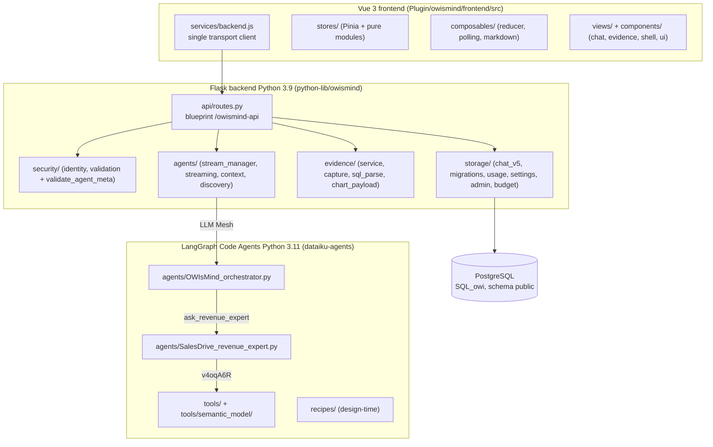

# Component map

> Audience: developer. Last updated: 2026-07-06. Summary: the layer-by-layer inventory of every major
> OWIsMind component (frontend, Flask backend, agent layer, SQL storage), with its responsibility and its
> exact file, so you know where everything lives before touching it.

OWIsMind breaks down into four layers: a Vue 3 frontend served as static assets, a modular Flask backend
(Python 3.9) in `python-lib/owismind/`, LangGraph Code Agents (Python 3.11, an orchestrator and its
sub-agents, duplicated per DSS project DEV/PROD_V1) called through LLM Mesh,
and direct SQL storage on PostgreSQL. This document catalogs the MODULES of each layer. For the overall
system context (who talks to whom, the trust boundary), see
[Architecture overview](01-system-overview.md), which holds the context diagram; this document holds the
MODULE map.

> The agent layer (`dataiku-agents/OWISMIND/`) is split DEV / PROD_V1 (develop in DEV, promote via
> `tools/promote_agents_to_prod.py`). The transition points (`Value_Catalog` on the roadmap, the
> `lookup` intent removed on 2026-06-18, the tickets sub-agent kept out of PROD) are flagged at the
> bottom of this document and detailed in
> [The revenue expert sub-agent](../05-agents/03-revenue-expert-subagent.md).

## Overall map of modules by layer

```mermaid
flowchart TB
  subgraph FE["Vue 3 frontend (Plugin/owismind/frontend/src)"]
    FEsvc["services/backend.js<br/>single transport client"]
    FEstore["stores/ (Pinia + pure modules)"]
    FEcomp["composables/ (reducer, polling, markdown)"]
    FEview["views/ + components/ (chat, evidence, shell, ui)"]
  end
  subgraph BE["Flask backend Python 3.9 (python-lib/owismind)"]
    BEapi["api/routes.py<br/>blueprint /owismind-api"]
    BEsec["security/ (identity, validation + validate_agent_meta)"]
    BEagt["agents/ (stream_manager, streaming, context, discovery)"]
    BEev["evidence/ (service, capture, sql_parse, chart_payload)"]
    BEsto["storage/ (chat_v5, migrations, usage, settings, admin, budget)"]
  end
  subgraph AG["LangGraph Code Agents Python 3.11 (dataiku-agents)"]
    AGorch["agents/OWIsMind_orchestrator.py"]
    AGsub["agents/SalesDrive_revenue_expert.py"]
    AGtool["tools/ + tools/semantic_model/"]
    AGrec["recipes/ (design-time)"]
  end
  DB[("PostgreSQL<br/>SQL_owi, schema public")]
  FEsvc --> BEapi
  BEapi --> BEsec & BEagt & BEev & BEsto
  BEagt -->|LLM Mesh| AGorch
  AGorch -->|ask_revenue_expert| AGsub
  AGsub -->|v4oqA6R| AGtool
  BEsto --> DB
```

The frontend knows ONLY logical keys (`agent_key`, `mode`) and structured data: it never reaches the SQL or
the agents directly, everything goes through `api/routes.py`. The agent layer is strictly separated from the
backend: these are two distinct Python runtimes (3.9 vs 3.11) that share no imports, they communicate solely
through LLM Mesh.

## Frontend layer

Root: `Plugin/owismind/frontend/src/`. Stack: Vue 3 (Composition API), Pinia, vue-router in hash
history, vue-i18n, markdown-it + DOMPurify, Chart.js. The detail lives in
[Frontend - state and stores](../03-frontend/02-state-and-stores.md) and
[Frontend - components and views](../03-frontend/03-components-and-views.md); below is the inventory.

### Transport and stores

| Module | File | Responsibility |
|---|---|---|
| Backend client | `services/backend.js` | The ONLY network point: every call goes through `getWebAppBackendUrl('/owismind-api/...')`, never a hardcoded URL. |
| Analytics client | `services/track.js`, `services/trackModel.js` | Best-effort usage tracking: a bounded queue drained to `POST /track` (flush on timer + `sendBeacon` on pagehide), no-op under impersonation. `trackModel.js` is the PURE queue/drain logic. |
| Chat store | `stores/chat.js` | The active conversation as a TREE of exchanges, the sending state, the draft. `_runExchange` is the only place where an exchange is created and launched. |
| Session store | `stores/session.js` | Identity, list of enabled agents (with their full editorial profile), paginated list of conversations, monthly usage status (exposes `budgetBlocked` from `/usage`). Degrades gracefully outside DSS. |
| Evidence store | `stores/evidence.js` | State of the Evidence Studio panel: current exchange, server meta, local editable chips, row pagination, drill. |
| UI store | `stores/ui.js` | Single source of truth for preferences (theme, widths, language, `contextMessages`, `modelMode`), persisted in localStorage. The mode boots to `smart` unconditionally and is NOT persisted (ephemeral, reset on send). |
| Sources store | `stores/sources.js` | Source Data Explorer state per (agent, dataset): the current dataset, filters (chips), search, sort, computed measures; talks to `/source/*` and `/evidence/aggregate`. |
| Screen-context store | `stores/screenContext.js` | The consent-gated on-screen snapshot (artifact specs + Source Data view) attached to the next question via the `[ON SCREEN NOW]` block; sticky by scope signature, removable. |
| Prompt-context store | `stores/promptContext.js` | Cell-to-agent values the user pinned ("use this value for the agent"), appended to the outgoing message. |
| Benchmark store | `stores/benchmark.js` | Benchmark consultation state (results, per-question attempt detail loaded lazily); talks to `/benchmark/*`. |
| Conversation tree | `stores/conversationTree.js` | PURE module: `childrenOf`, `activeChildOf`, `buildActivePath` (the active path follows the override or the last child). |
| Conversation list | `stores/conversationList.js` | PURE module: `mergeConversations` (dedup), `upsertAndBump` (bumps to the top). |
| Agent selection | `stores/agentPick.js` | PURE module: `pickDefaultAgent` (last used, otherwise first). |
| Preference bounds | `stores/prefs.js` | PURE module: `clampContextMessages` (10-50), MIRROR of `security/validation.py` (the shared front/back contract). |

### Composables

| Module | File | Responsibility |
|---|---|---|
| Timeline reducer | `composables/timelineModel.js` | The heart of streaming: `applyEvent` turns the backend event stream into an ordered incremental list, mutated IN PLACE to drive the `reactive()` proxy. Pure (tested with `node:test`). |
| Polling transport | `composables/useChatStream.js` | The polling loop: `runChatStream` calls `startChat`, receives `run_id`/`exchange_id`, loops `pollChat` every 500 ms. |
| Evidence model | `composables/evidenceModel.js` | Pure helpers for chips and drill (`buildDrillLabels` aborts if a column is not mappable rather than lie about the scope). |
| Trust layer | `composables/evidenceProof.js` | `trustLevel(meta)` -> deterministic level (solid/dashed/muted, NEVER green); a v1 meta falls back to "declared". |
| SQL coloring | `composables/sqlPretty.js` | `formatSql`/`tokenizeSql` (SAFE coloring, every token escaped, never v-html). Never throws. |
| Markdown rendering | `composables/useMarkdown.js` | The ONLY v-html path: markdown-it `html:false` + DOMPurify. Hardens links (`target=_blank`, `rel=noopener`). |
| Budget helpers | `composables/budgetModel.js` | PURE module: `formatMoney`, `usagePct`, `gaugePct`, `usageLevel`. Formatting and gauge math shared by the Budget card (Settings), the chat budget banner (ChatView) and the admin Quotas table (AdminView). No Vue dependency - pure functions. |
| Source Data helpers | `composables/sourceModel.js`, `sourceViewMemory.js`, `aggregateSurface.js` | PURE Source Data Explorer logic: filter/range/sniffing model, per-(agent, dataset) view persistence, and the shared aggregate-surface factory used by both the Source Data panel and the Evidence Source-data tab. |
| Screen/prompt context | `composables/screenContextModel.js`, `promptContextModel.js` | PURE reducers for the on-screen snapshot and the pinned cell values. |
| Benchmark helpers | `composables/benchmarkResults.js` | PURE shaping of the benchmark results for the consultation view. |
| Miscellaneous | `composables/useToasts.js`, `useTr.js`, `useClickOutside.js`, `useReducedMotion.js` | Toast queue, `{fr,en}` -> locale resolution, click-outside listener, reduced-motion flag. |

### Views and components

| Module | File(s) | Responsibility |
|---|---|---|
| Shell | `components/shell/AppLayout.vue`, `MainTop.vue`, `Sidebar.vue` | CSS grid `sidebar | main | evidence`, resize handles, contextual title, lazy-loaded conversation list. The sidebar in its collapsed state is a narrow RAIL (+ button, agents nav, help icon and profile). |
| Chat view | `views/ChatView.vue` | Wires the route to the store: `chat.ensureSession(sid)`, stamps the `/chat/<sid>` URL on the first exchange, 3 states (needsConfig / hasMessages / empty). Also owns the transparent budget banner (shown when `session.budgetBlocked` is true). |
| Agents view | `views/AgentsView.vue` | Agent library: search, card grid and full editorial profile sheet (tagline, description, capabilities, tools) sourced entirely from the backend - no hardcoded copy. |
| Admin view | `views/AdminView.vue` | Administration area: agent whitelist management (select agents, fill in their editorial profile via modal), user management, and the Quotas tab (global budget config + per-user override table). |
| Settings view | `views/SettingsView.vue` | "My account" screen: real Budget card (gauge, spent/limit, remaining, reset date, limit-source transparency) and Usage card (tokens month + lifetime) powered by `/usage` through the session store. |
| Pages | `components/pages/EmptyState.vue`, `PageShell.vue`, `SettingCard.vue` | Page-level layout primitives (empty state, page wrapper, settings card). |
| Chat thread | `components/chat/ChatThread.vue` | Renders the `turns`, sticky-aware auto-scroll (F13 gate: never watches `turns`). |
| Agent message | `components/chat/MessageAgent.vue` | The most complex component: activity (ticker), body, SQL, token usage, feedback footer, version navigation. |
| Input | `components/chat/PromptBar.vue`, `AgentPicker.vue`, `ModelModePicker.vue` | Auto-grow textarea, agent picker (logical key), mode picker (Smart/Pro/Claude in a Modal). PromptBar also hosts the screen-context consent banner. |
| Source Data Explorer | `components/sources/` (`SourceExplorer`, `SourcePanel`, `SourceTable`, `SourceChips`, `SourceCalc`, `SourceAnalyze`, `ColumnMenu`, `CellActionPopover`, `RangePopoverFields`) | No-AI dataset browsing: searchable/cascading filters, Calculer aggregates, date ranges, per-column menu + 3-state sort, cell-to-agent actions. |
| Admin impersonation | `features/admin-impersonate/` (3 files) | FENCED, easily removable "act as user" UI (admin-only, read-only consultation; kept for the beta). |
| Benchmark view | `views/BenchmarkSuggestView.vue` | In-plugin benchmark consultation page (results, per-question detail) and the "suggest a golden question" flow. |
| Evidence panel | `components/evidence/EvidencePanel.vue` + `EvidenceTrust/Sources/Chips/Calc/Result/Table/Sql.vue` | Evidence/Chart/Table/KPI tabs; badge, sources, editable chips, calculation, captured result, drill, and collapsed SQL sections. |
| Artifacts | `components/evidence/ArtifactChart.vue`, `ArtifactTable.vue`, `ArtifactKpi.vue` | Chart.js rendering (payload built on the backend), captured table, KPI card. |
| UI primitives | `components/ui/` (`Icon`, `Button`, `Tabs`, `Menu`, `Modal`, `ToastHost`) | Shared building blocks (`index.js` barrel). Square, flat, Orange-charter-compliant primitives that all views reuse. |
| Registries | `registries/timelineSteps.js`, `registries/faqContent.js` | `eventKind` -> label/icon mapping (timeline), static bilingual FAQ. NOTE: `registries/agentMeta.js` was REMOVED (2026-06-18): agent cards are now fed entirely from the `/agents` backend endpoint (admin-authored editorial profiles), with no hardcoded description client-side. |

## Flask backend layer

Root: `Plugin/owismind/python-lib/owismind/`. The webapp (`webapps/webapp-owismind-ai-agents/backend.py`)
is a thin bootstrap that calls `register_routes(app)`. Everything lives in sub-packages. Detail in
[Backend - overview and structure](../04-backend/01-overview-and-structure.md).

### api

| Module | File | Responsibility |
|---|---|---|
| Blueprint and routes | `api/routes.py` | The `owismind_api` blueprint (prefix `/owismind-api`), all the routes, the shared guards (`_evidence_guard`, `_admin_guard`) and the content-free logging hooks. Full catalog in [Backend - API reference](../04-backend/02-api-reference.md). |

### security

| Module | File | Responsibility |
|---|---|---|
| Identity | `security/identity.py` | `resolve_identity(headers)` -> `{user_id, display_name, groups}` via `get_auth_info_from_browser_headers`. 5 s TTL cache keyed on the Cookie (perf of `/chat/poll`). Derives the display name from the login. |
| Impersonation | `security/impersonation.py` | FENCED, easily removable admin "act as user": the `X-OWI-Impersonate` header is honored ONLY when the REAL caller is an admin; reads scope to the effective (impersonated) user, WRITE routes are BLOCKED. Read-only trust boundary; kept for the beta. |
| Validation | `security/validation.py` | PURE validators (no DSS): `validate_chat_start_request`, `validate_feedback`, `validate_evidence_rows_request`, `validate_agent_meta`, `validate_budget_amount`, `validate_quota_note`, clamps that never raise. `validate_agent_meta` sanitizes and bounds the admin-authored agent editorial profile (tagline, description, capabilities, tools, icon, badge) against the allowed icon set and hard character caps. All bounds are shared with or mirrored by the frontend. |

### agents (backend side, distinct from the Code Agents)

| Module | File | Responsibility |
|---|---|---|
| Run lifecycle | `agents/stream_manager.py` | Admission (`can_accept`), `start_run` (worker thread + `_RUNS` dict), `poll`, `request_stop`, phase 2 persistence (response + usage + trace + artifacts). Instance-safety caps. |
| Event normalization | `agents/streaming.py` | Normalizes LLM Mesh chunks into frontend events (field whitelist, 300-char label cap, `artifact` event, `_find_generated_sql`/usage capture). |
| Per-turn context | `agents/context.py` | `build_user_suffix` (`[Context - …]` block + `⟦owi:mode⟧`/`⟦owi:lang⟧` tokens), `MODEL_MODES` (`smart`/`pro`/`claude`), `detect_prompt_language`, `flatten_exchanges_to_messages`. Also builds the `[ON SCREEN NOW]` block (`build_screen_state`, `sanitize_source_state` never-raises) that carries the consent-gated Source Data view to the agent. |
| Discovery | `agents/discovery.py` | Read-only listing of DSS projects and agents for the admin area (`AGENT_ID_PREFIX = "agent:"`). |

### evidence

| Module | File | Responsibility |
|---|---|---|
| Service | `evidence/service.py` | Stateless owner-scoped pipeline: re-derives the deterministic meta, re-executes the bounded read-only SELECT, computes the `verification_level`. |
| Capture | `evidence/capture.py` | STRUCTURAL bounding of `generated_sql` before serialization (`cap_sql_list`, row/column/cell caps), opportunistic capture of the `result`. |
| SQL parse | `evidence/sql_parse.py` | Best-effort parser of the stored SQL (columns, filters). |
| Explanation | `evidence/sql_explain.py` | PURE structured explanation (never-raises) that feeds the calculation steps. |
| Chart payload | `evidence/chart_payload.py` | Builds the Chart.js / KPI payload on the Python side (`build_chart_payload`, `build_kpi_payload`) from the captured `result`. |
| Query builders | `evidence/query_builders.py` | Construction of the Evidence queries (structured filters, drill, distinct). |
| Whitelist | `evidence/whitelist.py` | Discovery/restriction of the Evidence datasets. |
| Throttle | `evidence/throttle.py` | Per-user token bucket (`EVIDENCE_BUCKET_CAPACITY = 15`): absorbs a legitimate burst, refuses a scripted flood. |
| Source Data service | `evidence/source_service.py` | Source Data Explorer backend: schema/meta, bounded paged rows, distinct values (cascading, POST `filters`/`scope_q`), all read-only on the discovered dataset. Serves `/source/*`. |
| Source search | `evidence/source_search.py` | Accent-insensitive value search and shape sniffing (e.g. ISO-date-valued string columns -> range mode). |
| Aggregate core | `evidence/aggregate_core.py` | Shared DB-aggregate engine (whitelisted fns count/count_distinct/sum/avg/median/min/max, type gate from the live schema, mandatory group LIMIT, totals query for exact percentages). Powers `POST /source/aggregate` AND `POST /evidence/aggregate` (the latter aggregates exactly the SQL-filtered evidence scope). |

The Evidence pipeline (Run -> Capture -> Persist -> Prove -> Explore) and the artifact pipeline are
detailed, with a diagram, in
[Backend - Evidence Studio and artifacts](../04-backend/05-evidence-and-artifacts.md).

### benchmark_view (in-plugin benchmark consultation)

| Module | File | Responsibility |
|---|---|---|
| Aggregate/read | `benchmark_view/aggregate.py`, `lab_io.py` | Read-only, cross-project reads of the separate `OWIsMind_LAB` DSS project's benchmark results (scored/summary/breakdown), plus lazy single-attempt detail. |
| Agent profile / schema | `benchmark_view/agent_profile.py`, `schema_check.py`, `schemas.py` | The agent-card benchmark block, source-table validation against the live schema, and the pure view shapes. Serves `/benchmark/*` and `/admin/benchmark/*`. |

### analytics and suggestions (storage)

| Module | File | Responsibility |
|---|---|---|
| Usage events | `storage/events.py` | Whitelist of 38 tracked events (source of truth) + pure `validate_events` (batch/prop caps, dedup) + `record_events` (one multi-row INSERT, best-effort). Backs `POST /track`, table `webapp_events_v1`. Impersonation drops before write. |
| Golden suggestions | `storage/suggestions.py` | Persistence of user-submitted golden-question suggestions (`webapp_golden_suggestions_v1`) captured from an answer, consumed by the `OWIsMind_LAB` launcher. |

## SQL storage layer

Root: `Plugin/owismind/python-lib/owismind/storage/`. All application state is persisted in direct SQL
via `SQLExecutor2` on the `SQL_owi` connection (PostgreSQL, schema `public`), without Flow at runtime (except
the write-only trace). The data model (the eight tables plus the `parent_exchange_id` tree) is detailed, with
its canonical diagram, in
[Backend - storage and data model](../04-backend/04-storage-and-data-model.md).

The eight application tables are: `webapp_chat_v5` (conversations and messages; carries the per-answer
`mode` column), `webapp_users_v1` (user registry with lifetime usage accumulators), `webapp_settings_v1`
(global key-value store, holding the agent whitelist and the global budget config under key
`monthly_budget`), `webapp_usage_monthly_v1` (monthly usage buckets, one row per `(user_id, month)`,
resets naturally on the 1st), `webapp_artifacts_v1` (artifact specs), `webapp_user_quota_v1` (per-user
monthly budget overrides), `webapp_golden_suggestions_v1` (benchmark golden-question suggestions), and
`webapp_events_v1` (usage-analytics events). All are created lazily on first use
(`CREATE TABLE IF NOT EXISTS`), never `ALTER`-ed structurally (the `mode` column was added with an
idempotent `ADD COLUMN IF NOT EXISTS`, not a `_v6` bump).

| Module | File | Responsibility |
|---|---|---|
| Config and safety | `storage/sql_config.py` | The foundation: connection resolution (`connection_name`, never hardcoded), `new_executor` (a FRESH executor per call), parameterization (`sql_value`, `pg_identifier`), naming `{PROJECT_KEY}_{namespace}_{logical}`, `storage_status`. |
| Idempotent DDL | `storage/migrations.py` | The only DDL (`CREATE TABLE IF NOT EXISTS`), the `_vN` strategy never an ALTER of structure, secondary indexes, `ensure_*_table()`. |
| Chat | `storage/chat_v5.py` | Two-phase write (`save_user_message` then `save_assistant_message`), owner-scoped feedback, reads (`list_conversations`, `messages_for_session`, `history_messages_for_chain`). Physical table `webapp_chat_v5`. |
| Pure SQL builders | `storage/sql_builders.py` | Builders that do NOT IMPORT `dataiku` (testable without DSS): conversation list, recursive ancestor CTE, usage upserts. |
| Usage | `storage/usage.py` | 3-level accounting: the 2 denormalized accelerators (lifetime cumulative users + monthly bucket) incremented in ONE transaction. `webapp_chat_v5` remains the authoritative source. |
| User registry | `storage/admin.py` | `record_user` (upsert + race-free election of the first admin via `pg_advisory_xact_lock`), `is_admin`, `set_admin`, anti-lockout guard. |
| Settings and whitelist | `storage/settings.py` | Global key-value store + the agent WHITELIST (`resolve_enabled_agent`: the enforcement point, resolves an opaque logical key, never a raw `agent_id` from the frontend). |
| Artifacts | `storage/artifacts.py` | Persistence of artifact specs (chart/table/kpi), never the data rows. Table `webapp_artifacts_v1`. |
| Pagination | `storage/pagination.py` | Opaque keyset cursor (encode/decode `(last_at, session_id)`), defensive decoding (malformed token -> first page). |
| Serialization | `storage/serialization.py` | `rows_to_json_safe` (pandas DataFrames -> serializable JSON, NaN -> None), `parse_json_list`. |
| Budget / quota | `storage/budget.py` | Monthly credit enforcement: `get_budget_config` (30 s in-process TTL cache), `has_budget` (the enforcement gate called by `/chat/start`; fail-open: a storage error lets the run through), `usage_status` (the caller's current-month spend + effective limit + remaining), `set_budget_config` and `set_user_quotas` / `clear_user_quotas` (admin writes). Two-layer limit resolution: per-user override in `webapp_user_quota_v1` > global temp boost > global default. Default 50 USD/month. |
| Traces | `storage/chat_traces.py` | The ONLY exception to "no Flow": write-only append of the raw trace to a Flow dataset (`write_with_schema`, never query-logging). Best-effort. |

## Agent layer (LangGraph Code Agents)

Root: `dataiku-agents/OWISMIND/{OWISMIND_DEV, OWISMIND_PROD_V1}/`. Python 3.11 Code Agents re-pasted by
hand from the repository (source of truth), called through LLM Mesh. Files are project-prefixed and
duplicated per DSS project (develop in DEV, promote to PROD via `tools/promote_agents_to_prod.py`). Each
agent's loop and the collaboration contract are detailed in
[Agent system - overview](../05-agents/01-agent-system-overview.md). Paths below are relative to a
project's directory.

| Module | File | Responsibility |
|---|---|---|
| Orchestrator | `agents/*_OWIsMind_orchestrator.py` | LangGraph "sub-agents as tools" loop: dialogue, route, render chart/table/kpi, write the analysis. Holds the `CAPABILITIES` registry (whitelist + manifest) and the honesty firewall. NEVER holds a business figure. DEV `038G7mlF` / PROD `Xrv7GvfG`. |
| Revenue sub-agent | `agents/*_SalesDrive_revenue_expert.py` | UNDERSTAND -> RESOLVE -> QUERY -> RENDER pipeline (DEV `agent:bHrWLyOL` / PROD `agent:uO5hEzAs`). Owns all the revenue figures; called by the orchestrator via the `ask_revenue_expert` tool. |
| Tickets sub-agent (DEV only) | `agents/*_CSSO_Trouble_Tickets_Expert.py` | Second sub-agent (DEV `agent:NcE9LD2i`), deliberately NOT promoted to PROD yet; in PROD the domain returns an honest capability gap. |
| Semantic tool | `semantic_model/build_aligned_semantic_model.py`, `update_aligned_semantic_model.py` | Notebook scripts that create (CREATE + index) and update (in place, without re-indexing) the aligned Semantic Model (Sonnet 4.6) that `revenue_semantic_query` points to. |
| Lookup tool | `tools/*_attribute_lookup_tool.py` | Custom Python agent tool: fast attribute read on a named object, without the Semantic Model. |
| Design-time recipes | `recipes/*` | Flow recipes that build the expertise from `DRIVE_Revenues`: the profile (business brain), the value index (grounding) and the value catalog (roadmap). They run design-time, never at chat runtime. |

The Flow recipes and their exact role in building the expertise are detailed, with their
canonical diagram, in
[Flow recipes and expertise building](../05-agents/05-flow-recipes-and-grounding.md).

### In-flux points of the agent layer (to flag)

> `attribute_lookup_tool.py` is BUILT, unit-tested and wired as a built-in tool of the orchestrator,
> with `LOOKUP_TOOL_ID` now filled in DEV (`UUoynaL`). It REPLACES the managed `dataset_lookup` tool
> (`9FEzVZk`) and the `lookup` intent, both REMOVED from the sub-agent on 2026-06-18 (the intent no
> longer appears in `KNOWN_INTENTS`).

> ROADMAP: the `DRIVE_Revenues_Value_Catalog` dataset and the Python resolver
> `Drive_Revenues_resolve_filter_value` are NOT wired in v1.1: the current grounding is done with inline
> SQL on `DRIVE_Revenues_value_index` (this is NOT a tool). The labels `resolve_filter_value` and
> `dataset_sql_query` visible on the timeline are event labels, not real tool calls.

> The per-mode LLM Mesh ids (`GEMINI_FLASH_LITE_ID`, `GEMINI_FLASH_ID`, `SONNET_ID`) must match the
> instance's LLM Mesh connection; a wrong id breaks the corresponding mode. Modes are Smart / Pro /
> Claude (keys `smart` / `pro` / `claude`).

## See also
- [Architecture overview](01-system-overview.md) - the system context diagram (the 4 layers).
- [Runtime flows](03-runtime-flows.md) - how these modules collaborate over a chat turn.
- [Frontend - overview and structure](../03-frontend/01-overview-and-structure.md) - the frontend detail.
- [Backend - overview and structure](../04-backend/01-overview-and-structure.md) - the backend detail.
- [Backend - storage and data model](../04-backend/04-storage-and-data-model.md) - the SQL model diagram.
- [Agent system - overview](../05-agents/01-agent-system-overview.md) - the loop of the two Code Agents.
- [Repository map](../09-maintenance/02-repository-map.md) - where everything lives on disk (Plugin/, dataiku-agents/, docs/).
