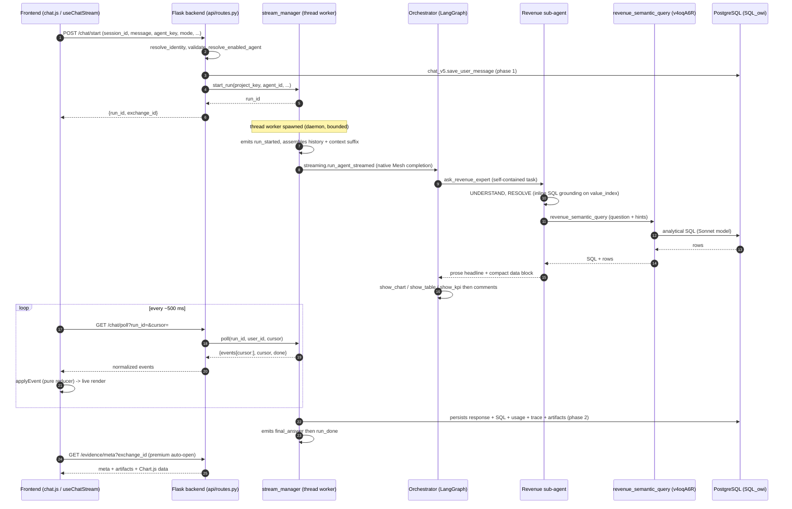
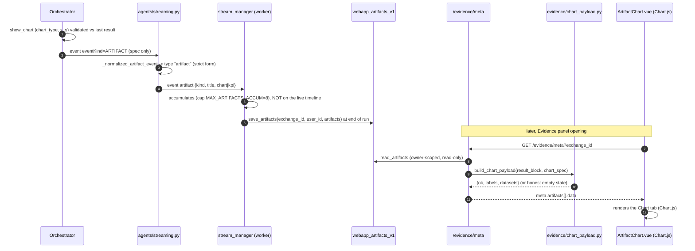
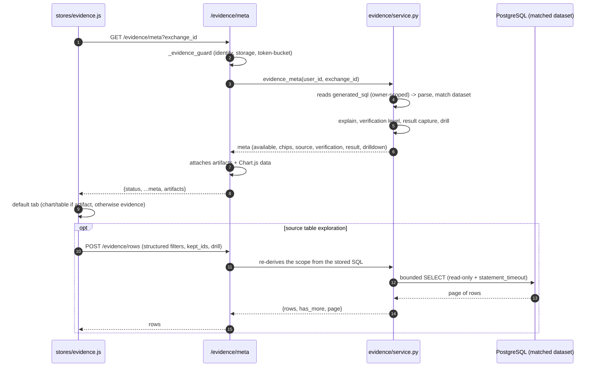

# Runtime flows

> Audience: developer. Last updated: 2026-06-19. Summary: this document is the canonical home
> for OWIsMind's runtime sequence diagrams (full chat turn, streaming-by-polling transport,
> artifact pipeline, Evidence panel opening), each one explained step by step beneath the diagram.

This document is the central reference for understanding what happens, in order and between which
actors, when a user sends a message. The other documents (API, backend streaming, frontend
communication, agents) point here rather than redrawing these sequences. Every actor named is real:
the Vue frontend, the Flask backend (`python-lib/owismind`), the two LangGraph Code Agents
(`OWIsMind_orchestrator` and `SalesDrive_revenue_expert`, `agent:bHrWLyOL`) called through LLM
Mesh, the Semantic Model Query tool (`revenue_semantic_query`, `v4oqA6R`), and PostgreSQL (connection
`SQL_owi`).

> IN FLUX: the `dataiku-agents/` layer is being edited live. The Code Agents that PRODUCE the raw
> events (NARRATION / AGENT_DONE / ARTIFACT, SQL tags) may evolve. The contract of the NORMALIZED
> events described here (the format the python-lib backend emits to the front) is, by contrast,
> stable. The managed tool `dataset_lookup` (`9FEzVZk`) and the `lookup` intent were REMOVED on
> 2026-06-18; their replacement `attribute_lookup` is built and now wired as a built-in tool of the
> orchestrator, with `LOOKUP_TOOL_ID` still empty (so not operational until the tool is created in
> DSS). None of these elements appear in the flows below.

---

## 1. A full chat turn, end to end

This is the system's major sequence. The diagram below is the canonical home: any other document
that needs it points here.



### The step detail

1. **`POST /chat/start`** (`api/routes.py`, function `chat_start`). The front sends only logical
   data: `session_id`, `message`, the OPAQUE agent key `agent_key`, plus `history_limit`,
   `parent_exchange_id`, `mode`, `webapp_lang`, `screen_context`. No sensitive technical key.
2. **Server-side validation and resolution.** The backend resolves identity from the headers
   (`resolve_identity`), validates the payload (`validate_chat_start_request`), checks that storage is
   configured (`sql_config.is_configured`), then resolves the opaque key into `(project_key, agent_id)`
   via `settings.resolve_enabled_agent`. A forged or disabled key returns `None` and a 404
   `agent_not_enabled`. The front never sees a raw `agent_id`.
3. **Admission pre-check** BEFORE any write: `stream_manager.can_accept(user_id)` returns
   `rate_limited` (429, per-user spacing) or `busy` (503, global cap). If admission passes, the
   budget gate runs next: `budget.has_budget(user_id)` checks whether the user's calendar-month
   spend in `webapp_usage_monthly_v1` has reached their effective monthly limit (per-user override
   in `webapp_user_quota_v1` or global default). If blocked, the route returns `402
   monthly_quota_exceeded` with the budget status in the body. If `has_budget` raises (storage
   error) the gate fails OPEN and the run proceeds. Both checks occur before any persistence,
   so no row is written for a refused request.
4. **Persistence phase 1.** `chat_v5.save_user_message` writes the user message into
   `webapp_chat_v5`, on the request thread, so that a write error surfaces as a clean HTTP error
   rather than in the worker.
5. **Context construction.** The backend infers the mode (server default `medium` if unknown), detects
   the response language from the raw message (`context.detect_prompt_language`), then appends to the
   current turn a compact suffix `[Context - User: ... · Today: ... · Web app language: ...]` followed
   by the machine-only tokens `owi:mode=...owi:lang=...`. This suffix is appended AT THE END
   (recency slot): small models honor an instruction placed in the last position better.
6. **Worker spawn.** `stream_manager.start_run` generates a `run_id = uuid4().hex`, records the run
   state in the `_RUNS` dict, and launches ONE daemon thread `_worker`. The route returns
   `{run_id, exchange_id}` immediately; the `agent_id` stays server-side, the front receives only the
   opaque `run_id`.
7. **On the worker side.** `_worker` emits `run_started`, assembles the multi-turn history
   (`chat_v5.history_messages_for_chain`, which walks the ancestor chain of THIS branch via a
   recursive, user-scoped CTE), builds the `ON SCREEN NOW` block (screen awareness, only if the
   Evidence panel is open on the front), then iterates `streaming.run_agent_streamed`.
8. **The orchestrator reasons and routes.** `OWIsMind_orchestrator` (LangGraph loop `agent -> tools ->
   agent`) decides to call the sub-agent via the `ask_revenue_expert` tool. The task is SELF-CONTAINED:
   the sub-agent does not see the conversation, the orchestrator names the entity, the exact
   scenario/phase and period. The central invariant: the orchestrator NEVER holds a business figure.
9. **The sub-agent grounds, then queries.** `SalesDrive_revenue_expert` runs its UNDERSTAND
   -> RESOLVE -> QUERY -> RENDER pipeline. RESOLVE grounds user terms against EXACT cell values via
   read-only inline SQL on `DRIVE_Revenues_value_index` (this is NOT a tool). QUERY calls the ONLY
   real DSS tool of the runtime, `revenue_semantic_query` (`v4oqA6R`), which WRITES AND EXECUTES the
   analytical SQL on a Sonnet-driven Semantic Model, in ALL modes.
10. **PostgreSQL returns the rows** to the tool, which passes them back to the sub-agent (SQL + rows).
    The sub-agent returns a prose headline plus a compact data block to the orchestrator (never a ready-
    to-copy markdown table).
11. **The orchestrator presents and comments.** It calls `show_chart` / `show_table` / `show_kpi` (the
    only authorized way to display tabular or multi-value data) then writes the analysis in prose in the
    user's language. Each show_* call is validated against the last real result (`_record_artifact`,
    case-insensitive column resolution).
12. **Polling runs in parallel** (section 2). While the worker progresses, the front polls
    `/chat/poll` every ~500 ms and applies each normalized event via the pure reducer
    `applyEvent` (`timelineModel.js`): the timeline, the streamed text and the SQL list render live.
13. **Persistence phase 2** (best-effort, a failure never aborts the run): the worker records the
    assembled response, the `generated_sql` list, the token usage, the RAW trace and the artifact specs.
    `chat_v5` applies `capture.cap_sql_list` just before `json.dumps` (mirror caps at the write point).
14. **Terminal events.** The worker ALWAYS emits `final_answer` first, then the terminal event:
    `run_done` (success), `stopped` (user stop, not an error), or `error` (timeout / abandonment /
    internal failure). The run's `done` flag is set AFTER these events, under the same lock as the poll:
    no final frame can be lost.
15. **Evidence auto-open (premium reveal).** On the front, if the version finished CLEANLY (`status ===
    'done'`) AND produced at least one successful SQL (`version.sql.some(q => q && q.success)`), the store
    calls `evidence.openForExchange(exchangeId, { auto: true })`. This triggers `GET /evidence/meta`
    (section 4). Never on `stopped` or `error`.

### Useful latencies and bounds

| Bound | Value | Effect |
|---|---|---|
| `POLL_INTERVAL_MS` | `500` | Nominal polling cadence on the front. |
| `MAX_CONCURRENT_RUNS` | `8` | Hard cap of simultaneous runs across the whole process. |
| `MAX_RUN_SECONDS` | `300.0` | Hard wall-clock deadline for a run (evaluated between chunks). |
| `ABANDON_AFTER_SECONDS` | `30.0` | Cuts a run if the browser has stopped polling. |
| `MAX_TOOL_LOOPS` | `8` | `agent <-> tools` cycles per turn on the orchestrator side. |
| `MAX_PARALLEL_AGENTS` | `3` | Bounded fan-out when several sub-agents are called. |

---

## 2. The transport: streaming-by-polling

The agent can take several seconds to answer (one LLM call, one SQL query). Rather than holding a
long HTTP response (which the internal DSS nginx buffers, causing the events to arrive all at once at
the end), OWIsMind runs the agent in a background thread worker and the front POLLS a process in-memory
dict at a short interval. Each poll is a short request that the proxy never buffers.

> This diagram is a LOCAL mini-schema of the transport, specific to this page. The exhaustive view of a
> run's lifecycle (`_RUNS` state, lock, TTL, abandonment, cooperative stop) is the canonical home of
> [04-backend/03-streaming-and-runs.md](../04-backend/03-streaming-and-runs.md); do not redraw it.

```mermaid
sequenceDiagram
    autonumber
    participant FE as useChatStream (loop)
    participant API as /chat/poll
    participant SM as stream_manager (_RUNS)
    participant W as thread worker

    Note over W: appends events to _RUNS[run_id].events
    loop until res.done
        FE->>API: GET /chat/poll?run_id=&cursor=N
        API->>SM: poll(run_id, user_id, N)
        SM->>SM: sets last_poll_at (heartbeat)
        SM-->>API: {events[N:], cursor=len(events), done}
        API-->>FE: events
        FE->>FE: applyEvent(target, evt) for each event
        FE->>FE: cursor = res.cursor ; sleep 500 ms
    end
```

### The transport detail

- **The cursor is a server counter, not a timestamp.** `poll` returns the slice `events[cursor:]`
  and the new cursor `len(events)`. The front BLINDLY reposts `res.cursor`: no cursor computation on
  the client side, so neither duplicate nor loss.
- **Tolerance to blips.** On a transient poll failure, `useChatStream` retries with exponential
  backoff `min(500 * 2**failures, 5000) ms`, up to `MAX_POLL_FAILURES = 5`. Beyond that, the error
  surfaces. The TERMINAL codes (`run_not_found`, `invalid_run_id`, `unauthenticated`) are handled
  differently: the run has disappeared (e.g. backend restarted mid-flight), an `error` event is applied
  (mapped to `run_lost` for `run_not_found`) and the loop exits cleanly, without a crash.
- **The heartbeat is used for abandonment detection.** Each poll sets `last_poll_at`. If the browser
  stops polling (tab closed) without an explicit stop, the worker cuts after `ABANDON_AFTER_SECONDS` to
  free the slot and stop burning tokens. Canceling the polling on the client side therefore does NOT
  stop the worker: the backend has its own detection.
- **The stop is COOPERATIVE.** The LLM Mesh stream has no cancel API; the worker can only cut BETWEEN
  two chunks. When the user stops, the front sets an optimistic `stopping` flag (the `Stopping...`
  indicator blinks) BUT keeps polling until the terminal `stopped` event that finalizes the partial
  response. The partial is already persisted: `stopped` is not an error.
- **The normalized events are backward-compatible.** The `applyEvent` reducer silently IGNORES any
  unknown `type`: adding a new event can never break the UI. The exact catalog
  (`run_started`, `agent_event`, `answer_delta`, `narration`, `generated_sql`, `usage_summary`,
  `final_answer`, `run_done`, `stopped`, `error`) is detailed on the backend side.

---

## 3. The artifact flow (show_chart -> Chart.js)

The system rigorously separates the SIGNAL (what the orchestrator asks to display) from the DATA (the
real rows). The `ARTIFACT` event carries only a SPEC (`{kind, title, chart|kpi}`), NEVER the rows.
The data is the already-captured `generated_sql` result, recombined later on the backend side.

> The artifact pipeline (event -> normalization -> persistence -> reshape) has its canonical home in
> [04-backend/05-evidence-and-artifacts.md](../04-backend/05-evidence-and-artifacts.md). The diagram
> below shows the end-to-end runtime PATH to situate the flow; the detail of the bounds and of the
> table lives in the backend Evidence document.



### The artifact flow detail

1. **The orchestrator requests the display.** It calls `show_chart` (or `show_table` / `show_kpi`),
   the only authorized way to display tabular or multi-value data (a markdown table in the text is
   forbidden). `_record_artifact` validates the call: `chart_type` in `("line", "bar", "pie")`,
   `x` and each `y` resolved against the EXACT columns of the last result (case-insensitive). An
   unknown column is refused by listing the valid columns.
2. **Emission of the ARTIFACT event.** The orchestrator emits a DSS event `eventKind == "ARTIFACT"`
   carrying `{kind, title, chart, kpi, label}`. The DATA is NOT in it.
3. **Normalization.** `agents/streaming.py` projects this event through `_normalized_artifact_event`
   onto a STRICT form (pure, never raises): `kind` in `{chart, table, kpi}`, bounded `title`, chart
   `{type, x, y[]}` with `y` bounded to 8 series. It becomes a dedicated normalized event of type
   `artifact`.
4. **Accumulation on the worker side.** The worker captures the spec in a list (cap
   `MAX_ARTIFACTS_ACCUM = 8`) and does NOT add it to the live timeline (the live label was already given
   by the ARTIFACT `agent_event`).
5. **Persistence at end of run.** Best-effort, `artifacts_storage.save_artifacts(exchange_id, user_id,
   artifacts)` writes an owner-stamped UPSERT into the `webapp_artifacts_v1` table (primary key
   `exchange_id`). A failure can never affect the on-screen response.
6. **Reshape at read time.** When the Evidence panel opens, the `/evidence/meta` route reads the specs
   (`read_artifacts`, owner-scoped, read-only) and, for each chart, computes `a["data"] =
   chart_payload.build_chart_payload(result_block, chart_spec)`; for each KPI,
   `build_kpi_payload(...)`. The Chart.js shaping (`{labels, datasets}`) is done SERVER-SIDE in trusted
   Python: the agent only said x / y / type. A mistyped column or a non-numeric cell degrades to an
   honest empty state (`{ok: false, reason: ...}`), never a broken chart.
7. **Front render.** `ArtifactChart.vue` renders the payload via Chart.js; `ArtifactTable.vue` renders
   the captured result. This is the culmination of the signal / data separation: the stored spec (signal)
   and the captured result (data) are recombined only at read time.

> IN FLUX: the key of the tool span's rows is not confirmed on the instance. The capture of the
> `result` is best-effort: it can be absent (`result_captured: false`), in which case the chart degrades
> to an empty state but the rest of the panel remains useful.

---

## 4. The Evidence panel opening

The evidence data does NOT travel through `/chat/poll`. The Evidence panel is a SEPARATE channel,
triggered either by auto-open after a successful run (step 15 of section 1), or by re-entering a
conversation. The evidence is re-derived in a PURELY DETERMINISTIC way (no LLM call) from the SQL
stored by the agent, which is the source of truth.



### The opening detail

1. **Common guard.** All `/evidence/*` endpoints pass through `_evidence_guard`: identity resolution
   (401 otherwise), storage configured (409 otherwise), chat table bootstrap (500 otherwise), then
   a per-user token-bucket (429 if flooding). The gate is placed AFTER the cheap auth/config path.
2. **`GET /evidence/meta`.** The client sends ONLY `exchange_id`; the table, the connection, the SQL and
   the dataset matching are resolved server-side. The exchange is owner-scoped: another user's exchange
   returns 404. The service reads the `generated_sql` column of `webapp_chat_v5` (always with `user_id`
   in the WHERE).
3. **Deterministic re-derivation.** From the stored SQL, `evidence/service.py` parses the query
   (best-effort, never raises), matches the source dataset by auto-discovery (no admin whitelist to
   configure), produces a structured business explanation (`sql_explain`, never raises), computes the
   verification level, exposes the captured result if present, and indicates whether drill-down is
   available. The verification level follows a deterministic scale: `declared` -> `source_identified`
   -> `scope_partial` -> `scope_exact` -> `calc_decomposed`, with `result_captured` orthogonal. The badge
   is NEVER green.
4. **Artifact attachment.** The route reads the artifact specs and attaches the Chart.js payload
   (section 3). Best-effort: a failure degrades to `artifacts: []`, never a 500.
5. **Default tab choice.** On the front, `evidence.js` computes the tab to show: `chart` or
   `table` if an artifact exists, otherwise `evidence`. Changing tab DOES NOT TOUCH `evidence.open` (the
   auto-scroll gate is gated on `open`, not on the active tab).
6. **Source table exploration (`POST /evidence/rows`).** The client NEVER sends SQL: editable chips
   travel as structured filters `{column, op, values}`, locked chips as `kept_ids` (re-derived
   server-side from its stored SQL), and the drill columns are re-derived on each call and re-validated
   server-side. The service reconstructs a bounded page (`PAGE_SIZE = 50`, `LIMIT PAGE_SIZE+1` for
   `has_more` without `COUNT(*)`) on the OWN connection of the matched dataset, read-only
   (`SET LOCAL transaction_read_only TO on`) with `statement_timeout` at 30 s.

> IN FLUX / nuances. Re-executing `/evidence/rows` shows TODAY's data: only the rows captured at
> execution time are "what the agent actually used". Historical exchanges predating the trust layer have
> neither tags nor `result`: the evidence degrades gracefully. The per-dataset source URL mapping for
> multi-source is deferred (only the single-source case attaches `source.url`).

---

## See also
- [04-backend/03-streaming-and-runs.md](../04-backend/03-streaming-and-runs.md) - canonical home of
  streaming-by-polling (run state, lock, TTL, abandonment, cooperative stop).
- [03-frontend/04-backend-communication.md](../03-frontend/04-backend-communication.md) - the same flow
  seen from the client side (HTTP client, polling loop, reducer, error codes).
- [04-backend/02-api-reference.md](../04-backend/02-api-reference.md) - the `/owismind-api/*` endpoints,
  their payloads and their HTTP codes.
- [04-backend/05-evidence-and-artifacts.md](../04-backend/05-evidence-and-artifacts.md) - canonical home
  of the artifact pipeline and of the Evidence opening/proof (capture, levels, chart_payload).
- [05-agents/01-agent-system-overview.md](../05-agents/01-agent-system-overview.md) - the agent loop
  (LangGraph orchestrator + UNDERSTAND/RESOLVE/QUERY/RENDER sub-agent).
- [02-architecture/02-component-map.md](02-component-map.md) - the per-layer component map.
- [08-decisions/0002-streaming-par-polling.md](../08-decisions/0002-streaming-par-polling.md) - the
  architecture decision that motivates polling rather than SSE.
