# Frontend - overview and structure

> Audience: frontend developer. Last updated: 2026-06-19. Summary: how the Vue
> 3 + Vite application starts up (bootstrap, theme set before mount), how `src/` is organized, and how the
> HASH router, i18n and theming are wired.

The OWIsMind frontend is a Vue 3 + Vite SPA, located under `Plugin/owismind/frontend/`, built into
static assets served by Dataiku DSS. This page covers the structure and bootstrapping of the source code;
the stores, components, backend communication and build each have their own page (see
`## See also`).

## Stack and organization of `src/`

The versions are pinned in `Plugin/owismind/frontend/package.json`: `vue` `^3.5.34` (Composition API,
`<script setup>`), `pinia` `^3.0.4` (setup stores), `vue-router` `^5.1.0` (HASH mode), `vue-i18n`
`^11.4.4` (`legacy:false`), plus `chart.js`, `markdown-it` and `dompurify` for rendering. The bundler is
`vite` (`^8.0.12`) with `@vitejs/plugin-vue`. The `package.json` is set to `"type": "module"`. The scripts
are `dev` (`vite`), `build` (`vite build`), `preview` (`vite preview`) and `test` (`node --test
test/*.test.js`).

Important note: no test framework is installed (no Vitest). The pure tests use the native `node:test`
runner and live OUTSIDE of `src/`, under `Plugin/owismind/frontend/test/` (never built or zipped). The
project's NO INSTALL rule applies everywhere: the agent never installs a dependency.

The `src/` tree groups the entry point, the shell, and one folder per responsibility:

```mermaid
graph TD
  SRC["src/"]
  SRC --> MAIN["main.js (bootstrap)"]
  SRC --> APP["App.vue (thin shell)"]
  SRC --> ROUTER["router/ (index.js, HASH)"]
  SRC --> I18N["i18n/ (index.js, messages.json, extra.js, langs.json)"]
  SRC --> STYLES["styles/ (tokens.css, base.css)"]
  SRC --> STORES["stores/ (ui, session, chat, evidence, + pure modules)"]
  SRC --> COMPO["composables/ (useTr, useMarkdown, budgetModel, timelineModel...)"]
  SRC --> REG["registries/ (timelineSteps, faqContent)"]
  SRC --> SERV["services/ (backend.js)"]
  SRC --> COMP["components/ (chat, evidence, pages, shell, ui)"]
  SRC --> VIEWS["views/ (ChatView, SettingsView, AdminView, AgentsView...)"]
  SRC --> ASSETS["assets/ (orange-logo.png)"]
```

| Folder | Role | Detail |
|---|---|---|
| `main.js` | Bootstrap: creates the app, sets the theme, mounts on `#app`. | This page. |
| `App.vue` | Thin shell: renders `AppLayout` + `ToastHost`, resolves identity once. | This page. |
| `router/` | HASH router (`index.js`): route table, admin guard. | This page. |
| `i18n/` | EN/FR i18n: pristine `messages.json` + `extra.js` overrides + `langs.json`. | This page. |
| `styles/` | Theme layer: `tokens.css` (design tokens, Orange charter), `base.css` (reset + keyframes). | This page. |
| `stores/` | Pinia state: `ui`, `session`, `chat`, `evidence` + pure modules. | [State and stores](02-state-and-stores.md). |
| `composables/` | Reusable logic: `useTr`, `useMarkdown`, `budgetModel`, `timelineModel`... | [Components and views](03-components-and-views.md). |
| `registries/` | Extensible data: `timelineSteps`, `faqContent`. (Note: `agentMeta.js` has been DELETED - agent profiles are now admin-authored, see below.) | [Components and views](03-components-and-views.md). |
| `services/` | `backend.js`: one function per `/owismind-api/*` route. | [Backend communication](04-backend-communication.md). |
| `components/` | Components by domain: `chat/`, `evidence/`, `pages/`, `shell/`, `ui/`. | [Components and views](03-components-and-views.md). |
| `views/` | Routed views (lazy): `ChatView`, `SettingsView`, `AdminView`, `AgentsView`... | [Components and views](03-components-and-views.md). |

The full map of modules by layer (Pinia stores, python-lib sub-packages, recipes) has its
canonical home in [Component map](../02-architecture/02-component-map.md).

## Bootstrap: `main.js`

The `src/main.js` file is short but its order of operations is meaningful. The
exact sequence:

1. Import the global styles IN ORDER: `./styles/tokens.css` THEN `./styles/base.css`. The order is
   load-bearing because `base.css` consumes the tokens defined by `tokens.css` (colors, spacing,
   keyframes). Reversing the import would yield unresolved values.
2. Set the theme on `<body data-theme>` BEFORE the mount. The code reads `localStorage.getItem('owismind.theme')`,
   validates the value to `'dark'` or `'light'`, falls back to `'light'` by default, and catches any exception
   (localStorage unavailable) to fall back to `'light'` as well. This is a critical invariant: see
   the Theming section below.
3. Create the app: `createApp(App).use(pinia).use(i18n).use(router)`, with `pinia = createPinia()`.
4. DEV-only hook: `if (import.meta.env.DEV) { window.__pinia = pinia }`. It exposes the store to seed
   a demo without a backend; it is tree-shaken out of production builds.
5. `app.mount('#app')`. The `#app` target is the container declared in `index.html`.

`App.vue` is a thin shell: it renders `<AppLayout/>` and `<ToastHost/>`, and on `onMounted` it calls
`session.ensureLoaded()` to resolve identity exactly once. The whole thing is best-effort: the shell
displays even outside DSS (backend absent), the stores degrade gracefully.

## HASH router: `router/index.js`

The router is built with `createWebHashHistory()`. This choice is explicit and documented at the top of the
file: the DSS webapp is served at a fixed URL WITHOUT server-side SPA rewriting. A path-based
history (`createWebHistory`) would therefore yield a 404 on reload or on a deep link, because DSS does not know how to
rewrite `/chat/<id>` to `index.html`. The hash keeps all navigation client-side and reload-safe.
This decision has its dedicated ADR: [ADR-0001 - Vue SPA served by DSS](../08-decisions/0001-vue-spa-servie-par-dss.md).

### Route table

All views are lazy-loaded (`() => import('../views/X.vue')`) to keep the initial chat bundle
light. The `meta` carry i18n KEYS (`eyebrow`, `title`, `desc`), not text.

| `name` | path | view | meta |
|---|---|---|---|
| (redirect) | `/` -> `/chat` | - | - |
| `chat` | `/chat/:sessionId?` | `ChatView` | - |
| `settings` | `/settings` | `SettingsView` | `eyebrow:'set.eyebrow'`, `title:'set.title'` |
| `feedback` | `/feedback` | `FeedbackView` | `eyebrow:'fb.eyebrow'`, `title:'fb.title'` |
| `faq` | `/faq` | `FaqView` | `eyebrow:'faq.eyebrow'`, `title:'faq.title'` |
| `agents` | `/agents/:agentId?` | `AgentsView` | `eyebrow:'ag.eyebrow'`, `title:'ag.title'` |
| `project` | `/project/:projectId` | `ProjectView` | `eyebrow:'pj.eyebrow'`, `title:'sb.projects'` |
| `support` / `releases` / `accessibility` / `cgu` / `privacy` / `about` | `/...` | `PagePlaceholder` | i18n keys per target |
| `admin` | `/admin` | `AdminView` | `eyebrow:'admin.eyebrow'`, `title:'admin.title'`, `requiresAdmin:true` |
| (catch-all) | `/:pathMatch(.*)*` -> `/chat` | - | - |

The six help-menu targets (`support`, `releases`, `accessibility`, `cgu`, `privacy`, `about`)
share a single `PagePlaceholder` view driven by their meta i18n keys. This is intentional: these pages
do not yet have real content, and the display stays honest (a labeled empty state, not fake
content) in the meantime.

The `:sessionId?` segment of the `chat` route is the conversation id stamped into the URL on the first
exchange.

### Admin guard

The router installs an asynchronous `beforeEach`. If the target route does not carry `meta.requiresAdmin`, it
lets it through immediately. Otherwise, it runs `await session.ensureLoaded()` (memoized) then gates on
`session.isAdmin`: if the user is an admin they pass, otherwise they are redirected to `{ name: 'chat' }`.

Important: this guard is only a UX convenience. The real authorization decision stays SERVER-side (the
backend admin routes return 403). On the frontend, `session.isAdmin` is a ref fed by the
`me.is_admin` field returned by `/me`; as long as identity is not loaded it is `false`. The
`ensureLoaded()` method is memoized (`if (!_initPromise) _initPromise = init()`), which makes it safe to call
from several places (the guard and the `onMounted` of `App.vue`) without duplicating the identity request.

## i18n: pristine `messages.json` + `extra.js`

The `src/i18n/` folder contains `index.js` (setup), `messages.json`, `extra.js` and `langs.json`.

### Setup (`i18n/index.js`)

The instance is created as follows: `createI18n({ legacy:false, globalInjection:true, locale:detectLocale(),
fallbackLocale:'en', messages, warnHtmlMessage:false, missingWarn:false, fallbackWarn:false })`.

- `legacy:false` enables the Composition API (`useI18n()`), `globalInjection:true` exposes `$t` in
  templates.
- `warnHtmlMessage:false` because a few keys carry trusted canned HTML (for example
  `default.answer_html`).
- Locale detection (`detectLocale`) first reads `localStorage.getItem('owismind.lang')` if the value
  is supported; otherwise `navigator.language` truncated to 2 letters; otherwise `'en'`. The constant
  `STORAGE_KEY = 'owismind.lang'` is the key already used by the original mockup.
- English (`'en'`) is the DEFAULT locale and the `fallbackLocale`. A user with no stored choice and
  a non-English browser still lands in English.
- `SUPPORTED` is derived from `langs.json` (`langs.map(l => l.id)`), and `AVAILABLE_LOCALES = langs` is exported
  for the language selector.

### `messages.json` stays PRISTINE, every addition goes into `extra.js`

This is a central architectural decision (invariant F6): `messages.json` is a 1:1 port of the
`window.OWI_I18N` of the original mockup (removed from the repo after conversion). It stays PRISTINE,
never edited by hand. Every new string (or any override) goes into `i18n/extra.js`, as a flat key
per locale: `export const extraMessages = { fr: {...}, en: {...} }`.

Two domain catalogs are merged at setup, AFTER `messages` is loaded, via
`i18n.global.mergeLocaleMessage('fr'|'en', ...)`:

1. `timelineMessages.fr/en`, exported from `registries/timelineSteps.js` (labels for the `eventKind` of the
   live timeline).
2. `extraMessages.fr/en`, from `i18n/extra.js` (strings for the more recent UI phases).

Because the merge happens AFTER `messages`, `extra.js` can OVERRIDE a key of `messages.json`:
the override wins. Concrete example: `'prompt.placeholder'` is redefined in `extra.js` and `'empty.tip'` is
added there. The source `messages.json` does not need to be touched for this.

Key families in `extra.js`: generic `x.*` (for example `x.close`), `set.*`, `sb.*`, `chat.*`,
`fb.*`, `msg.*`, `faq.*`, `ag.*` (agents library including `ag.badge.*`), `pj.*`, `admin.*` (including
`admin.tab.*` and `admin.quotas.*`), `ev.*` (Evidence Studio), `art.*` (artifacts
tabs), `mode.*` (mode selector) and `ev.exp.*` (trust layer computation steps, frozen `kind`
enum). The philosophy is the honest empty state: a "coming soon" label, never a fake figure.

### LIST interpolation

The positional placeholders `{0}` / `{1}` / `{2}` inherited from the mockup map directly onto vue-i18n's
list interpolation: you call `t('key', [arg0, arg1])`. Examples: `'sb.no_results':
'Aucune conversation pour "{0}"'`, `'ev.exp.filter_in': 'Filtrer : {0} parmi {2} ({1} valeur(s))'`. The
column names passed as parameters stay verbatim (never translated).

### Languages and switching (`langs.json`)

`langs.json` is a list of locale objects `{id, label, short, flag, htmlLang}`: `fr` (`Francais` / `FR`
/ `fr`) and `en` (`English` / `EN` / `en`). The functions exported by `index.js`:

- `setLocale(id)` validates the id against `SUPPORTED`, writes `i18n.global.locale.value`, persists the key
  `owismind.lang` and sets `document.documentElement.lang` via `htmlLangFor(id)`.
- `currentLocale()` reads the active locale.
- At boot, `document.documentElement.lang` is already set to match the detected locale.

The `ui` store keeps a reactive MIRROR of the language: `setLang(id)` calls `setLocale(id)` then
`lang.value = currentLocale()`. The store NEVER persists the language itself: `setLocale` owns the
key `owismind.lang`, which avoids a second competing persistence system.

Distinction to remember: the INTERFACE STRINGS go through `$t` / `t` (vue-i18n); the bilingual DATA
in `{fr, en}` format (FAQ content) goes through the `useTr()` composable, whose
`tr(v)` function passes a string through as-is and resolves a `{fr, en}` object on the current locale
with fallback `cur -> fr -> en -> first value`. `useTr` is reactive on the locale ref, so
the templates re-render on a language change.

> Adding a language: add its block in `langs.json`, a locale block in `messages.json`, and the
> corresponding field on every `{fr, en}` data object.

## Theming: Orange charter + `body[data-theme]`

### Orange design system

The OWIsMind UI follows a strict Orange brand charter, documented in full at
`docs/cadrage/CHARTE_ORANGE_UI.md`. The rules are non-negotiable (project rule #10) and must be
consulted before any styling work. Key principles:

- Color: white / near-black as the base, with a SINGLE orange `#FF7900` used as a RARE accent on active
  states and primary actions only.
- Geometry: square corners everywhere (`border-radius: 0`). Only avatars/logo chips are round. The
  token `--square: 8px` is for icon chips (the orange logo square shape), not for general radius.
- Typography: `--font-sans: "Helvetica Neue", Helvetica, Arial, sans-serif`. H1 at 36px / weight 800
  (`--fw-heavy`). An orange uppercase eyebrow (small-caps label, `--tracking-eyebrow`). An orange
  52px-tall, 4px-wide title-bar decoration under the H1.
- Flat surfaces, 1px borders (`--border`), minimal shadows (`--shadow`).
- Brand mark: ALWAYS the real image `src/assets/orange-logo.png`, bundled by Vite. Never reconstructed
  in CSS (a CSS-generated square is forbidden, even if it "looks the same").

Absolute bans: `color-mix()`, blur / `backdrop-filter`, gradients, glow / large box-shadows, emoji in
UI, a global orange focus-ring, and any CSS-reconstructed brand mark.

Dark theme via `body[data-theme="dark"]` + tokens (see below). In dark mode, `--orange-text` switches to
`#ffb066` (a lighter orange that clears WCAG AA on dark backgrounds) and status tints are more saturated.

### Single source: `tokens.css`

`src/styles/tokens.css` is the single source of the theme layer. Its structure:

- `:root` carries the THEME-INDEPENDENT tokens: the Orange brand (`--orange: #ff7900`, `--orange-deep`,
  `--orange-soft`, `--orange-line`), the 8px-anchored spacing (`--s-1` to `--s-12`), the typography
  (`--font-sans`, `--font-mono`, scale `--fs-xs` to `--fs-3xl`), the weight scale (`--fw-regular`,
  `--fw-medium`, `--fw-semibold`, `--fw-bold`, `--fw-heavy: 800`), tracking presets
  (`--tracking-tight`, `--tracking-eyebrow`), the radius tokens (`--r-xs`, `--r-sm`, `--r`, `--r-lg`,
  `--r-pill`) and the square chip token (`--square: 8px`), the chat column measure (`--chat-col: 90%`,
  `--chat-col-max: 1200px`), the collapsed-rail width (`--rail-w: 60px`), the motion
  (`--ease`, `--ease-out`, `--dur`, `--dur-slow`), the z-index scale (`--z-menu: 60` < `--z-overlay: 200` <
  `--z-modal: 201` < `--z-toast: 2100`) and the default status colors (`--success`, `--danger`,
  `--warn`, `--info`).
- The SEMANTIC TOKENS (surface, text, border) are defined under two selectors swapped on
  `<body>`: `body[data-theme="light"]` and `body[data-theme="dark"]`. Each provides `--bg`, `--surface`,
  `--surface-2`, `--surface-hover`, `--border`, `--border-strong`, `--text`, `--text-2`, `--text-3`,
  `--shadow`, orange tints (`--orange-soft-dark`, `--orange-on-dark`, `--orange-text`) and
  status tints (`--success-soft`, `--danger-soft`).

Two implementation points to know. First, `--orange-text` is a darkened version of the orange
in light mode (`#b85700`) to pass the WCAG AA 4.5:1 contrast on a white background (the brand orange is
too light for small text). Second, the status tints `--success-soft` / `--danger-soft` have in
dark mode a more vivid tint and slightly more opacity: the light-theme values washed out
to invisible on a dark surface.

### `base.css`: reset and utilities

`src/styles/base.css` is imported AFTER `tokens.css`. It provides the `box-sizing` reset,
`html, body { height: 100% }`, `body { overflow: hidden }` (fixed-viewport shell, scroll lives in the
inner regions), the form-control reset, `::selection { background: var(--orange) }` and
a custom scrollbar, the shared keyframes (`slide-up`, `pulse-dot`, `shimmer-sweep`), and a few
utilities (`.mono`, `.muted`, `.u-no-shrink`).

### Theme application and reconciliation

The theme is set at two moments, consistently:

1. At boot, in `main.js`, BEFORE the mount (cf. Bootstrap above). This is the non-negotiable invariant:
   the semantic tokens (`--bg`, `--surface`, `--text`...) exist ONLY under `body[data-theme]`.
   Forgetting to set the attribute would produce a flash of unresolved tokens on the first render.
2. At the setup of the `ui` store, which re-applies the theme idempotently (`applyTheme(theme.value)`, which
   writes `document.body.dataset.theme`).

The `ui` store (`src/stores/ui.js`) is then the single source of preferences (theme, language mirror,
sidebar and evidence widths, context window, model mode). The theme functions: `setTheme(t)`
validates `'light' | 'dark'`, updates the ref, persists the key `owismind.theme` and writes
`document.body.dataset.theme`; `toggleTheme()` switches. The default is `'light'`, faithful to the mockup.

localStorage keys managed by `ui.js`: `owismind.theme` (theme), `owismind.sidebarCollapsed`,
`owi.sidebarW` and `owi.evidenceW` (mockup keys, widths), `owismind.contextMessages` (context
window) and `owismind.modelMode`. The model mode is one of the keys `['eco', 'medium', 'high']`, default
`'eco'`: eco = Gemini 3.1 Flash-Lite (fast, low-cost, default), medium = Gemini 3.5 Flash, high =
Claude Sonnet. The fine-grained management of the `ui` store (and of the pure modules `prefs` / `conversationList` /
`conversationTree` / `agentPick`) is detailed in [State and stores](02-state-and-stores.md).

> Theming gotcha (F2): in a `<style scoped>`, a theme override must place the ENTIRE SELECTOR
> inside `:global(body[data-theme="dark"] .x)`, otherwise the scoped descendant is lost. Do not use
> `color-mix` (banned by the Orange charter): prefer `rgba` with a `:global` override, or the token
> `--orange-soft-dark`.

## In-flux points and pitfalls

- The hash of the built assets changes on every build: it is not a stable identifier, never document it
  as such. The build pipeline and the move from `index.html` to `body.html` are covered by
  [Build and assets](05-build-and-assets.md).
- `messages.json` must never be edited by hand: every new string or override goes into
  `extra.js`, and the `extra.js` merge can intentionally mask a key of `messages.json`.
- The import order `tokens.css` then `base.css` is load-bearing, just like setting `body[data-theme]`
  before the mount.
- The `registries/agentMeta.js` file has been DELETED. Agent descriptions now come from the backend
  (`/agents`), authored by the admin in `AdminView`. There is no static registry of agent profiles.

## See also
- [Frontend - state and Pinia stores](02-state-and-stores.md) - the `ui` store (theme, language, mode) and the pure modules.
- [Frontend - components and views](03-components-and-views.md) - the component tree, the lazy routed views, the composables.
- [Frontend - backend communication](04-backend-communication.md) - `services/backend.js`, the opaque agent key, the polling.
- [Frontend - build and assets](05-build-and-assets.md) - Vite `base` / `outDir`, the move to `body.html`, the hashes.
- [Component map](../02-architecture/02-component-map.md) - canonical home of the modules-by-layer map.
- [ADR-0001 - Vue SPA served by DSS](../08-decisions/0001-vue-spa-servie-par-dss.md) - the rationale behind the HASH router.
