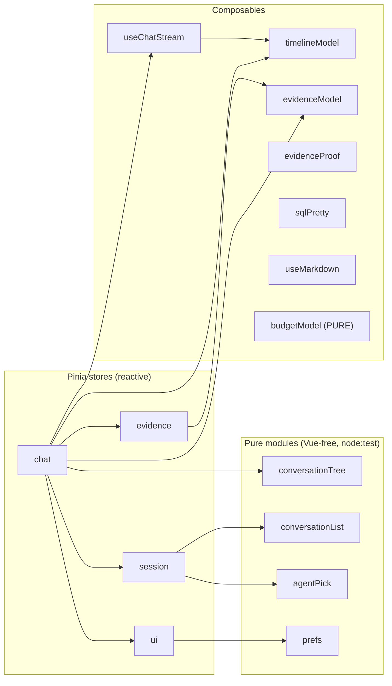
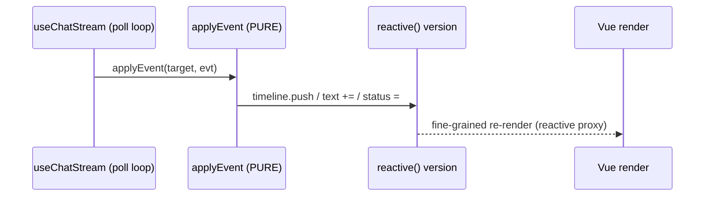

# Frontend - state and Pinia stores

> Audience: frontend developer. Last updated: 2026-06-19. Summary: how OWIsMind chat state
> is organized (4 Pinia stores, pure Vue-free modules, composables) and how the
> "version mutated in place via applyEvent" reactivity model enables live streaming.

The OWIsMind frontend (Vue 3, Composition API, Pinia 3) is built on a strict separation: a
small number of REACTIVE Pinia stores hold the application state, and around them orbit
PURE modules (zero Vue imports, testable with `node:test`) that contain all the
deterministic logic. This page details each store, each pure module, and the central
reactivity mechanism that brings the chat timeline to life in real time.

This entire document is grounded in the real code under
`Plugin/owismind/frontend/src/`. For the file tree and the bootstrap (hash router,
i18n, theme), see the frontend overview; for the components that consume these stores,
see the components and views.

## 1. Map of stores and modules

The `src/stores/` directory mixes two kinds of files that must be clearly distinguished:

| File | Nature | Role |
|---|---|---|
| `chat.js` | Pinia store (`defineStore('chat')`) | Active conversation as a TREE of exchanges, sending, draft. |
| `session.js` | Pinia store (`defineStore('session')`) | Identity, list of activatable agents, paginated conversation list, monthly usage/budget. |
| `evidence.js` | Pinia store (`defineStore('evidence')`) | Evidence Studio panel: server meta, editable chips, row pagination. |
| `ui.js` | Pinia store (`defineStore('ui')`) | SINGLE source of truth for preferences (theme, language, widths, mode, context window). |
| `conversationTree.js` | PURE module (no `defineStore`) | Tree walks (`childrenOf`, `activeChildOf`, `buildActivePath`). |
| `conversationList.js` | PURE module | Dedup and bump of the side list (`mergeConversations`, `upsertAndBump`). |
| `agentPick.js` | PURE module | Default agent selection (`pickDefaultAgent`). |
| `prefs.js` | PURE module | Bounds and coercion of the context window (`clampContextMessages`). |

So there are EXACTLY 4 Pinia stores. The other four files in the folder are not stores:
they are pure helpers, with no state and no Vue imports, imported by the stores. This boundary
is intentional: the deterministic logic lives in pure modules covered by `node:test`
(`test/*.test.js`), which gives a non-regression guarantee without installing an
additional runner (NO INSTALL rule).



## 2. The central reactivity model: the version mutated in place

This is the key to all live streaming, and the most important contract to understand before reading
the stores. Each chat exchange corresponds to a "response version" object created by
`reactive(createAnswerState())` in `chat.js` (local helper `newVersion`). The PURE reducer
`applyEvent` (in `composables/timelineModel.js`) receives the stream of normalized backend events and
MUTATES this object IN PLACE: it does `state.timeline.push(...)`, `last.text += delta`, `state.status =
'done'`, and so on.

The subtle point: `applyEvent` imports NOTHING from Vue (it stays pure, so it is testable outside the
browser), but because the object it mutates is a `reactive()` proxy, these nested mutations trigger a
fine-grained, live re-render on the Vue side. In other words, the same pure function drives both the
`node:test` tests and the real-time display. The store is solely responsible for wrapping the state in
`reactive()`; the reducer knows nothing about Vue.



Corollaries to respect:
- never add a Vue import in `timelineModel.js` (it would break pure testability);
- the display selectors (`timelineEvents`, `timelineSegments`, `timelineSignature`, and so on) are
  read-only functions: they READ the timeline without mutating it, so the ids stay stable and the
  auto-scroll trigger of `ChatThread` (gate F13) is not affected.

## 3. The `chat` store: the conversation as a tree

`chat.js` is the central store. Its responsibility: the active conversation modeled as a
TREE of exchanges (not a flat list), the sending state and the prompt draft. It encapsulates the
transport (`useChatStream`) and the `session` store (selected agent, history window).

### 3.1 Shape of the state

Main refs: `activeSessionId` (session id, generated by `crypto.randomUUID()` with a
fallback `sess-...`), `exchanges` (flat list of reactive exchanges), `overrides` (map `parentKey ->
chosen child id`, for navigation between versions), `draft`, `sending`, `errorMsg`,
`threadLoading`, `threadError`.

An exchange has the shape:

```js
reactive({ uid, id, parentId, userText, version, createdAt })
```

- `uid` is the STABLE render key, assigned once and NEVER modified. The `v-for` of
  `ChatThread` is keyed on `uid`, not on `id`, to avoid a mid-stream remount (rule F12).
- `id` is `null` during the live run, then reconciled to the backend id via the `onExchangeId`
  callback.
- `createdAt` is a monotonic client clock (`nextStamp()` = ISO + `#` + counter) that guarantees
  fresh exchanges sort AFTER older ones, and after history lines (which carry a server timestamp).
- `version` is the `reactive(createAnswerState(...))` object described in section 2: the display
  timeline plus the SQL, the usage and the persisted feedback.

The active path in the tree is a pure computed: `turns = computed(() =>
buildActivePath(exchanges.value, overrides.value))`. It is a deterministic read of the tree,
delegated to the pure module `conversationTree.js` (section 6).

### 3.2 Key mechanics

- Cancellation token. A closure variable `activeToken = { cancelled }` makes it possible to stop an
  abandoned poll loop: switching conversation or starting a more recent run calls
  `cancelActive()`, which sets `cancelled = true`. The poll loop checks this flag before and after
  each `await`.
- Stop race before the run id. `activeRunId` and `stopPending` cover the case where the user
  clicks stop BEFORE `/chat/start` has returned the `run_id`: `onRunId` then triggers the stop
  as soon as the id arrives.
- `activeVersion` holds the in-flight version so that an explicit stop can set the
  `stopping` flag.
- `canSend` (computed) requires `!sending && !threadLoading && !threadError && !session.needsConfig &&
  !session.budgetBlocked && session.hasAgents && !!session.selectedAgentKey`. The
  `threadLoading`/`threadError` guards are critical: after a failed or still-in-flight conversation
  switch, `exchanges` still holds the OLD thread; a send would then persist under the NEW session id
  with a parent from the OLD one (cross-conversation corruption). The `session.budgetBlocked` guard
  disables sends proactively when the user has exhausted their monthly credit and enforcement is on
  (the server-side gate in `/chat/start` is the real authority; this guard is a UI convenience).
- `_runExchange(userText, parentId)` is the ONLY place where an exchange is created then run. It pushes
  a new exchange, removes the override set on the parent (the fresh branch stays active), captures
  the sidebar bump data (`runSessionId`/`runTitle`) AT THE START of the run (not in the
  `finally`, which may run after cancellation when the store already holds another conversation),
  builds `screenContext` (Evidence screen awareness) when the panel is open, then calls
  `runChatStream`. At the end of a clean run that produced at least one successful SQL, it
  auto-opens Evidence via `evidence.openForExchange(exch.id, { auto: true })`.
- Budget race handling. If `/chat/start` returns a 402 `monthly_quota_exceeded` error (the user's
  budget gate flipped on between the send click and the actual start), the store drops the optimistic
  exchange from `exchanges` (no empty error bubble in the thread) and refreshes the usage via
  `session.loadUsage()` in the `finally` block, so the budget banner appears immediately.

The three ways to create an exchange illustrate the tree nature of the model:

| Action | Result in the tree |
|---|---|
| `send(text)` | Child of the LAST turn (conversation continuation). |
| `editTurn(turn, newText)` | NEW SIBLING, same parent, new text (nothing is deleted). |
| `regenerateTurn(turn)` | NEW SIBLING, same prompt (a new version of a response). |
| `setTurnVersion(turn, idx)` | Pins a sibling via `overrides` (ignores a still-live sibling, `id === null`). |

- `stopGeneration()` is a COOPERATIVE stop. The LLM Mesh stream has no cancellation API: the
  worker can only cut BETWEEN two chunks. The store POSTs `/chat/stop`, KEEPS polling, sets
  `activeVersion.stopping = true` (the "Stopping..." banner) and does NOT finalize itself: it is the
  terminal event `stopped` that does so.
- `openSession(sessionId)` lazily loads the lines via `fetchConversation` and rebuilds the
  tree. It does NOT CLEAR `exchanges` (no "new conversation" flash). The conversation's agent
  is adopted only AFTER the agent list has loaded
  (`ensureLoaded().then(adopt)`), because `/conversation` (a single round trip) can win the race
  against `/me` then `/agents` (two round trips).
- `ensureSession(sessionId)` is the route -> store bridge called by `ChatView`. It skips the refetch
  if the conversation is already in memory and clean, otherwise it delegates to `openSession`. In both
  cases it restarts the Evidence continuity.
- `_autoOpenEvidence` reopens Evidence on the LAST SQL-bearing exchange of the active branch,
  via the pure helper `lastEvidenceExchangeId(turns)`.
- `rowToExchange(r)` maps a `/conversation` line to a "done" exchange. The persisted response
  becomes ONE single text block: the live timeline is not persisted, so we reconstruct it as
  a single block. This function also reloads the token usage (`usageFromRow`) and the feedback
  (rating 0/1, reasons, comment).

After every completed run, `_runExchange`'s `finally` block calls `session.loadUsage()` (fire-and-forget)
to refresh the monthly budget figures in the profile card and the chat banner.

## 4. The `session` store: identity, agents, conversation list, budget

`session.js` carries four things: the identity of the logged-in user, the list of
ACTIVATABLE agents (which feeds the picker and the agents library), the paginated list of conversations
(names only), and the monthly budget/usage status. Everything
degrades gracefully outside DSS (when `getWebAppBackendUrl` is absent), so that the shell
always renders.

State: `user` (`{ user_id, groups, display_name }`), `isAdmin`, `needsConfig`, `agents`
(`[{ key, label, tagline, description, capabilities, tools, icon, badge }]` coming from `/agents`),
`selectedAgentKey`, `loading`, `error`, then `usage` (monthly budget status from `/usage`, `null` until
loaded), then the paginated list `conversations` (`[{ id, title, lastAt }]`), `convCursor`,
`convHasMore`, `convLoading`, `convError`.

The frontend never receives a raw `agent_id`: `agents` carries only an opaque LOGICAL key, a label, and
the admin-authored profile fields (tagline, description, capabilities, tools, icon, badge). Resolution to
the real identifier happens server-side (whitelist, rule #4). The profile fields are optional - an agent
whose profile has not been filled in by the admin renders with honest fallbacks in `AgentsView`.

Notable mechanics:
- `LAST_AGENT_KEY = 'owismind.lastAgentKey'` (localStorage): a FRESH conversation defaults to the
  last explicitly chosen agent.
- `ensureLoaded()` memoizes `init()` into a single promise, once (idempotent): the identity is loaded
  first, then agents, the first page and `loadUsage()` only if the webapp is configured.
- `loadFirstConversations(count)` shares a `_firstConvPromise` promise that DE-DUPLICATES the call
  triggered IN PARALLEL by `init()` and by the Sidebar: the first page is never fetched twice
  per load.
- `loadUsage()` fetches `/usage` (the caller's monthly budget status: spend, effective limit, remaining,
  reset date, lifetime counters, enforcement flag and blocked flag). Best-effort: a read failure leaves
  `usage` as-is; the backend gate in `/chat/start` remains authoritative.
- `budgetBlocked` (computed): `true` when `usage.value && usage.value.enforced !== false &&
  usage.value.blocked`. Used by `chat.canSend` to disable the send button proactively.
- `bumpCurrentConversation(item)` delegates to `upsertAndBump` to move a conversation to the top
  after a send.
- `adoptAgentFromExchanges(rows)`: opening a conversation adopts the agent of the MOST RECENT exchange
  (if it is still active), without persisting (opening a history must not change the last-used
  default).
- `displayName` and `initials` are derived (the initials take the first two letters of the name
  parts).

## 5. The `evidence` store: the evidence panel

`evidence.js` manages the state of the Evidence Studio panel: which exchange it shows, the last
`/evidence/meta` response (columns, chips, sql), the editable LOCAL state of the chips and the row page. Like
`chat`, it uses sequence numbers so that a stale response can never overwrite a
more recent one.

State: `open`, `exchangeId`, `meta`, `activeTab` (`'evidence' | 'chart' | 'table' | 'kpi'`), `chips`
(editable local state), `includeAdvanced`, `rows` (lazily accumulated, capped at `MAX_ROWS =
500`), `page`, `hasMore`, `sort`, `selectedTable` (multi-table selector), `drill` (drill-down of the
trust layer v2), `loading`, `rowsLoading`, `error` (meta level: blanks the whole panel),
`rowsError` (rows level: the chips stay mounted and recoverable).

Sequence guards (closure variables): `seq` for open/close transitions, `rowsSeq` for
out-of-order row responses (the last REQUEST wins, not the last response to arrive),
`userChipSeq` for the keys of user-added chips. The constant `MAX_PAGE = 20`
mirrors the backend `MAX_EVIDENCE_PAGE`.

Notable mechanics:
- `openForExchange(id, opts)` has TWO paths. In `auto: true` mode (the end-of-generation reveal)
  it is STAGED: it fetches the meta WITHOUT touching the current panel, and commits only if `m.available`
  is true and no user open/close happened in the meantime (the `seqAtStart` guard). A degraded
  or failed auto reveal must never erase what the user is looking at. In manual mode (the
  per-message button), it opens immediately, degraded view included.
- `_loadRows(mySeq, opts)` loads ONE page. `append: false` resets to page 0, `append: true`
  concatenates the next page (infinite scroll, capped at `MAX_ROWS`). Tri-state result: `true`
  (success), `false` (failure), `null` (superseded). It adopts the page ECHOED by the server, because the
  backend silently clamps deep pages.
- `drillIntoResultRow(rowIndex)` pivots to the SOURCE ROWS behind a captured result
  row. The labels come from the pure helper `buildDrillLabels`, which returns `null` if a column
  is unmappable: we abort silently rather than lie about the scope. A pre-drill snapshot
  is kept for `exitDrill`.
- `setTable(name)` switches to another matched source dataset and resets the filters (the schema
  differs). `setSort(column)` toggles asc/desc.
- Editing the chips (`removeChip`, `setChipValues`, `addFilter`, `removeAdvanced`, `resetToAgent`)
  resets to page 0 and calls `refreshRows()`.
- `setActiveTab(key)` does NOT TOUCH `open`: the scroll gate of `ChatThread` is guarded on
  `evidence.open`, not on `activeTab` (rule F13). This is an invariant never to break.

The full Evidence capture/evidence pipeline (on the backend side) and its canonical diagram live
elsewhere: see Backend - Evidence Studio and artifacts. Here, we describe only the frontend state.

## 6. The pure modules (Vue-free)

These four files are not stores: they have neither reactive state nor Vue imports. They
concentrate the deterministic logic and are covered by `node:test`.

- `conversationTree.js` exposes `childrenOf`, `activeChildOf`, `buildActivePath`. The active path
  follows, at each node, the override child if set, otherwise the LAST child by `createdAt` (tiebreak
  by `id`). `buildActivePath` returns `[{ exchange, siblings, versionIdx }]` with an anti-cycle
  guard (`exchanges.length + 1` iterations maximum).
- `conversationList.js` exposes `mergeConversations` (dedup by id, the existing one wins) and
  `upsertAndBump` (moves a conversation to the top).
- `agentPick.js` exposes `pickDefaultAgent(agents, lastKey)`: the last agent used if it is
  still active, otherwise the first in the list.
- `prefs.js` exposes `clampContextMessages` (bounds 10 to 50, default 20) plus the constants
  `CONTEXT_MESSAGES_MIN/MAX/DEFAULT`. Its header is explicit: these bounds are the MIRROR of
  `security/validation.py` on the backend side. Frontend and backend share ONE contract: the
  persisted preference and the server SQL LIMIT can never diverge.

## 7. The `ui` store: preferences (single source of truth)

`ui.js` is the SINGLE source of truth for preferences (it replaces the `window.STATE` of the
original mockup). The header (`MainTop`) and the Settings page (`SettingsView`) read and write it,
so a change in one place is reflected instantly in the other. Each preference is persisted
in localStorage under ONE dedicated key.

| Pref (ref) | localStorage key | Bounds / default |
|---|---|---|
| `theme` | `owismind.theme` | `'light'` / `'dark'`, default `'light'`. |
| `sidebarCollapsed` | `owismind.sidebarCollapsed` | flag `'1'`/`'0'`. |
| `sidebarW` | `owi.sidebarW` (key inherited from the mockup) | clamp 200 to 420, default 260. |
| `evidenceW` | `owi.evidenceW` | clamp min 360, max `innerWidth - 520`, default 480. |
| `lang` | (none here) | MIRROR of the i18n locale; never persisted by this store. |
| `contextMessages` | `owismind.contextMessages` | clamp 10 to 50 via `prefs.js`. |
| `modelMode` | `owismind.modelMode` | one of the `MODEL_MODES` keys, default `eco`. |

Important points:
- `MODEL_MODES = ['eco', 'medium', 'high']`, default `eco`. The file comment indicates the
  mapping: `eco` = Gemini 3.1 Flash-Lite (the economical default), `medium` = Gemini 3.5
  Flash, `high` = Claude Sonnet. The frontend defaults to `eco`; the server defaults to `medium`
  when `mode` is absent or unrecognized (verified in `api/routes.py`). The frontend sends ONLY the
  logical key `mode`, never a model id: the real id is resolved server-side.
  > IN FLUX: the mode -> model mapping lives on the agent side (currently being edited LIVE). The frontend
  > is sensitive only to the `mode` key, so it is insensitive to a Mesh id adjustment (for example
  > `flash-lite` vs `flash-light`). Document the exact ids in the agents documentation, not here.
- `applyTheme(t)` writes `document.body.dataset.theme`, applies immediately and is idempotent with the
  pre-mount set in `main.js`.
- `setSidebarCollapsed(v, persistChoice = true)`: with `persistChoice = false`, the collapse is
  AUTOMATIC (for example when Evidence opens) and does NOT overwrite the user preference. Only an
  explicit toggle decides what will be restored in the next session.
- `setLang(id)` delegates to `setLocale` (which validates the id, applies it to vue-i18n, persists it under
  `owismind.lang` and sets `<html lang>`), then mirrors the resolved locale into `lang`. This store never
  persists the language itself, to avoid a second persistence system.

## 8. Composables: from transport to render

The composables split into two families: PURE (no Vue imports, tested by `node:test`) and
TIED to the Vue lifecycle. The table below summarizes the ones that hold state; for the components
that consume them, see the components and views.

| Composable | Family | Role |
|---|---|---|
| `timelineModel.js` | PURE | Reducer `applyEvent` + read-only selectors; the core of streaming (see section 2). |
| `useChatStream.js` | Vue lifecycle (transport) | `/chat/poll` polling loop that pushes events into `applyEvent`. |
| `evidenceModel.js` | PURE | Chip shape, `buildRowsPayload`, `buildDrillLabels`, `lastEvidenceExchangeId`. |
| `evidenceProof.js` | PURE | Trust layer: `trustLevel`, `calcStepArgs`, `resultPreview`, `droppedNote`. |
| `sqlPretty.js` | PURE | `formatSql`, `tokenizeSql`, `highlightSqlLines` for SAFE SQL coloring. |
| `budgetModel.js` | PURE | Budget/usage display helpers: `formatMoney`, `formatTokens`, `formatShortDate`, `usagePct`, `gaugePct`, `usageLevel`. |
| `useMarkdown.js` | Vue lifecycle | `renderMarkdown`: the ONLY LLM text -> HTML path, sanitized. |
| `useTr.js` | Vue lifecycle | Resolves a `{ fr, en }` object to the current locale (DATA, not UI). |
| `useToasts.js` | Vue lifecycle | Module-level reactive queue + auto-dismiss. |
| `useClickOutside.js` / `useReducedMotion.js` | Vue lifecycle | Lifecycle-tied UI helpers. |

### 8.1 `timelineModel.js`: the pure reducer and its selectors

`createAnswerState(over)` builds the shape of the response version:

```js
{ timeline:[item], sql:[{sql,success,row_count}], usage, status, stopping, error,
  showSql, exchangeId, feedbackRating, feedbackReasons, feedbackComment, _seq }
```

The feedback fields are OUT-OF-BAND (persisted server-side per exchange): `applyEvent` never touches
them, it is the store / the message component that sets them.

The timeline items are discriminated by `kind`, each with a stable `id` and an arrival `seq`:
`event`, `text` (with `open` = still merging deltas), `error`, and `narration` (TRANSIENT,
live-only, never persisted).

`applyEvent(state, evt)` handles each backend event type: `run_started`, `agent_event` (->
`pushEvent`), `answer_delta` (-> `appendText`, which MERGES consecutive deltas of the same block),
`narration` (-> `pushNarration`), `generated_sql` (pushes into `state.sql`, outside the timeline),
`usage_summary` (-> `state.usage`), `final_answer` (-> `pushFinalAnswer`, which does NOT DUPLICATE the
text already streamed), `run_done`, `stopped` (status `'stopped'`, NOT an error), `error`. Any UNKNOWN
type is SILENTLY ignored: a new event can never break the UI.

The read-only selectors serve display grouping (never a mutation):
- `answerText(state)` concatenates the text blocks (for copying).
- `timelineSignature(state)` is a cheap change signature (`length|textLen|status`)
  that drives auto-scroll re-checks.
- `timelineEvents` / `timelineBodyItems` separate activity from body (the body only whitelists
  `text` and `error`, and EXCLUDES the transient narration).
- `timelineSegments` splits the timeline into chronological SEGMENTS for the LIVE view: consecutive
  events are grouped, text and errors stay in place. Narration is SKIPPED there
  (otherwise it would duplicate the labels and break the 5-line LIVE window).
- `stepStampDiff` and `activitySummary` derive durations from the backend stamps: `elapsedSeconds` is
  the elapsed-since-the-start-of-the-run, so the total is the MAX, never a sum.
- `usageFromRow(row)` reconstructs `usage` from a persisted line (`input_tokens`, `output_tokens`,
  `total_tokens`, `estimated_cost` -> `promptTokens`, `completionTokens`, `totalTokens`,
  `estimatedCost`), and returns `null` if nothing was stored.

### 8.2 `useChatStream.js`: the polling transport

This is the transport, carried over VERBATIM in its behavior from the mockup. Constants:
`POLL_INTERVAL_MS = 500`, `MAX_POLL_FAILURES = 5` (with backoff bounded at `MAX_BACKOFF_MS = 5000`),
and `TERMINAL_CODES = { run_not_found, invalid_run_id, unauthenticated }`.

`runChatStream({ ... })` calls `startChat`, receives `run_id` and `exchange_id` (relayed via
`onRunId` / `onExchangeId`), then loops on `pollChat(runId, cursor)`. Each event is passed to
`applyEvent(target, evt)` where `target` is the reactive version. The `token.cancelled` flag is
checked BEFORE and AFTER each `await` (anti-race on conversation switch). A `run_not_found`
after a backend restart is treated as RECOVERABLE (an error event `run_lost`), not as a
crash.

The transport (worker, `_RUNS` dict, poll cursor) is detailed on the backend side; the canonical
diagram of streaming-by-polling lives there. See Backend - streaming and run lifecycle.

### 8.3 `evidenceModel.js`: pure Evidence model

The shape of the local chip is `{ key, id, column, op, values, editable, source }`. The key is
`'a<id>'` for agent chips and `'u<n>'` for those added by the user. The
`/evidence/rows` payload NEVER carries SQL: the editable chips travel as structured filters
`{ column, op, values }`, and the locked agent chips travel as `kept_ids` only (the
backend re-derives them from the stored SQL by id). `buildDrillLabels` returns `null` if a column is
unmappable (silent abort rather than lying about the scope), with a backend-mirror cap of 8
labels. `lastEvidenceExchangeId(turns)` returns the last turn of the active branch whose response
has a successful SQL.

### 8.4 `budgetModel.js`: pure budget display helpers

`composables/budgetModel.js` is a PURE module (no Vue imports), testable with `node:test`, that
contains all the presentation math for budget / usage data. It is used by `SettingsView`,
`ChatView` (the budget banner) and `AdminView` (the Quotas tab).

Key exports:
- `toNum(value, fallback)`: safe numeric coercion (non-finite -> fallback).
- `formatMoney(amount, locale, currency)`: locale-aware US-dollar string with dynamic precision
  (tiny non-zero amounts use 4 decimal places so they never display as "$0.00").
- `formatTokens(n, locale)`: locale-grouped integer token count.
- `formatShortDate(iso, locale)`: short locale-aware date string (empty string when absent or
  unparseable; callers hide the line rather than show "Invalid Date").
- `usagePct(spent, limit)`: percentage consumed (can exceed 100; a zero limit reads as 100 once
  anything was spent).
- `gaugePct(spent, limit)`: same, clamped to [0, 100] for the visual gauge bar.
- `usageLevel(usage)`: coarse severity `'off'` (enforcement disabled) / `'over'` (blocked or at/past
  the limit) / `'warn'` (>= 80%) / `'ok'`.

The backend is the single source of truth for the limit RESOLUTION and the blocked flag; these helpers
only derive the presentational bits.

### 8.5 `useMarkdown.js`: the ONLY v-html path

`renderMarkdown(text)` is the ONLY place where LLM (untrusted) text becomes HTML. It uses
markdown-it with `html: false` (never raw HTML from the model), then a DOMPurify pass (defense in
depth). A hook hardens the links (`target=_blank` + `rel=noopener noreferrer`). This is a security point
not to bypass: no other path may inject HTML coming from the model.

### 8.6 `sqlPretty.js`, `evidenceProof.js`, `useTr.js`

- `sqlPretty.js` formats and tokenizes the SQL for display: `formatSql` (line breaks per
  clause), `tokenizeSql` (classification `kw`/`str`/`num`/`text`), `highlightSqlLines`. The
  coloring is SAFE: each token is rendered as escaped text, never via v-html. None of the
  functions throw (degradation to a text token).
- `evidenceProof.js` carries the trust layer. `trustLevel(meta)` returns `{ key, tone }` with a tone
  `solid`/`dashed`/`muted`, NEVER green: the badge never lies. Every meta field is OPTIONAL,
  so a v1 meta falls back to the honest floor `declared`. `calcStepArgs`, `resultPreview` and
  `droppedNote` derive the calculation/result sections. The full deterministic scale of the
  levels lives on the backend side (see Backend - Evidence Studio and artifacts).
- `useTr.js` resolves a `{ fr, en }` object to the current locale (fallback fr -> en -> first). It
  serves for DATA (FAQ content, fixtures), not for the UI (which uses `$t`/`t`).

## 9. Shared frontend / backend contracts (not to break)

Several frontend constants are exact MIRRORS of server bounds. Misaligning them would silently break
consistency:

| Frontend contract | Source | Backend mirror |
|---|---|---|
| `clampContextMessages` bounds 10 to 50 | `stores/prefs.js` | `security/validation.py` (SQL LIMIT). |
| `evidence.MAX_PAGE = 20` | `stores/evidence.js` | `MAX_EVIDENCE_PAGE`. |
| `buildDrillLabels` cap 8 | `composables/evidenceModel.js` | server refusal beyond 8 keys. |
| Event label cap 300 chars | `timelineModel.js` (`pushEvent`) | `streaming.py`. |
| Budget validation bounds | `TAGLINE_MAX=120`, `DESC_MAX=700` in `AdminView.vue` | `security/validation.py::validate_agent_meta` (tagline 120, desc 700, caps 8x120, tools 16x48). |

Finally, the payload sent by the frontend to `/chat/start` contains only LOGICAL keys:
`{ sessionId, message, agentKey, historyLimit, mode, webappLang, screenContext, parentExchangeId }`.
`agentKey` and `mode` are opaque; the real `agent_id` and the model are resolved server-side (whitelist,
rule #4).

## 10. Points in flux

> IN FLUX: the agent layer (`dataiku-agents/`) is being edited live. The
> `eventKind` values actually emitted (and therefore the displayed timeline labels) may diverge from the
> `KNOWN` table of the `timelineSteps` registry. The code handles this case (`humanize` fallback and
> priority to the backend label), but the exact list of kinds is not frozen. An `eventKind` never emitted just
> goes unused: it is harmless (for example `ESCALATING`, a vestige of an escalation removed on the
> agent side).

> IN FLUX: the `kpi` tab is wired on the frontend side (`activeTab` accepts `'kpi'`, and the Evidence
> panel knows how to display it), but its actual presence depends on the backend emitting an artifact of kind
> `kpi`. This is not guaranteed in the frontend area; do not assume that a KPI will always be
> rendered.

> ENFORCEMENT STATUS: the monthly-budget block (402 `monthly_quota_exceeded` from `/chat/start`,
> `session.budgetBlocked`, the budget banner in `ChatView`) is fully CODED. It has not yet been
> validated on the DSS instance. The frontend correctly handles the 402 and refreshes the usage status
> after every run.

## See also
- [Frontend - overview and structure](01-overview-and-structure.md) - bootstrap, hash router, i18n, theme.
- [Frontend - components and views](03-components-and-views.md) - the components that consume these stores.
- [Frontend - backend communication](04-backend-communication.md) - the client and the call catalog.
- [Backend - streaming and run lifecycle](../04-backend/03-streaming-and-runs.md) - the canonical polling diagram.
- [Backend - Evidence Studio and artifacts](../04-backend/05-evidence-and-artifacts.md) - the capture, the levels and the artifact pipeline.
- [Component map](../02-architecture/02-component-map.md) - where these modules sit in the architecture.
