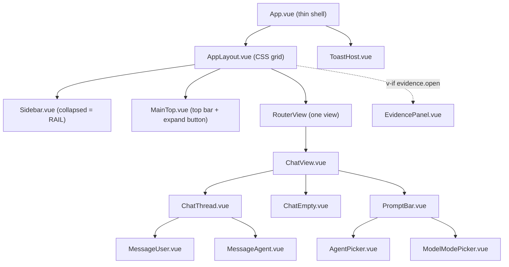
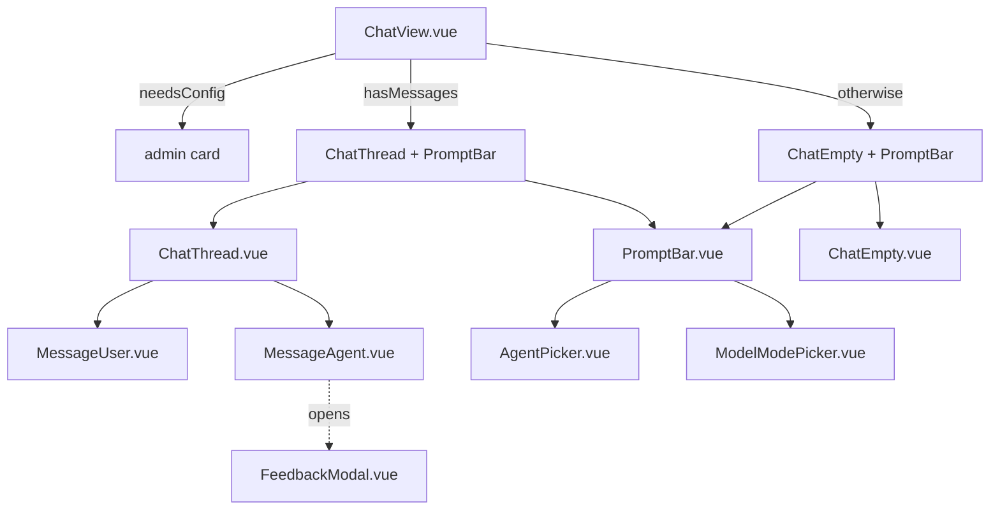
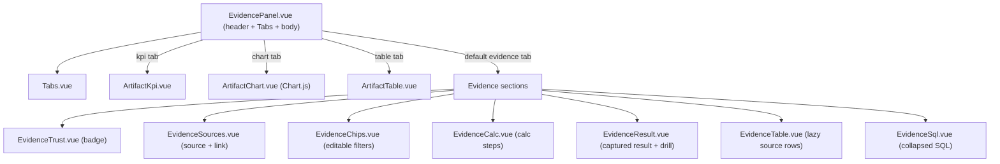

# Frontend - components and views

> Audience: frontend developer. Last updated: 2026-06-19. Summary: the Vue 3 component hierarchy
> (shell, chat, evidence, ui), the routed views (including the new AgentsView + AdminView),
> the registries, and the rendering guards that govern the sensitive components.

This document maps the presentation layer: who renders what, how the tree is composed, and which
non-obvious rendering rules govern the sensitive components (scroll, version navigation, Evidence
tabs). The reactive state that feeds these components (Pinia stores, timeline reducer) is covered
elsewhere: see [Frontend - state and stores](02-state-and-stores.md). Network calls are covered in
[Frontend - backend communication](04-backend-communication.md).

The entire layer is Vue 3 Composition API (`<script setup>`), single-file `.vue` components. The
source code lives under `Plugin/owismind/frontend/src/`. The paths cited in this document are relative
to `src/`.

## Tree overview

The root component `App.vue` is a thin shell: it mounts the layout grid and the global toast host, and
resolves identity once at mount (`session.ensureLoaded()` in `onMounted`). Everything else descends
from `AppLayout.vue`.

The Evidence panel (`EvidencePanel.vue`) is mounted conditionally by `AppLayout` (`v-if`
`evidence.open`) in the grid's third column, not by `ChatView`. This is intentional: a run's polling
loop lives in the store and survives an unmount of `ChatView`, so opening the panel must be driven at
the layout level (see the shell section below).

## Shell family

Four components lay out the application chrome. The design follows the Orange charter (square geometry,
flat fills, 1px rules, orange used as a rare accent for the active sidebar item bar).

| Component | File | Role |
|---|---|---|
| `App.vue` | `App.vue` | Root: `AppLayout` + `ToastHost`, `ensureLoaded()` at mount. |
| `AppLayout.vue` | `components/shell/AppLayout.vue` | CSS grid `sidebar | main | evidence`, resize handles, opening/closing of the Evidence panel. |
| `Sidebar.vue` | `components/shell/Sidebar.vue` | Brand (real `orange-logo.png`), navigation, paginated conversation list (lazy via IntersectionObserver), footer menus. Collapsed = ICON RAIL. |
| `MainTop.vue` | `components/shell/MainTop.vue` | Contextual top bar: page title, quick theme and language controls, sidebar expand button (shown when collapsed). |

### Sidebar: full panel and ICON RAIL

`Sidebar.vue` is ONE mounted component with TWO visual layouts - both driven by `ui.sidebarCollapsed`.
It is never remounted on collapse/expand, so the conversation list is never re-fetched.

- Full panel: brand logo image, new conversation button, Agents link, conversation list, footer help and
  account menus.
- Icon RAIL (collapsed): a thin `--rail-w: 60px` column with: the brand logo (real PNG, never a
  CSS-reconstructed square), a "+" new-conversation button, a Agents/library button, then at the bottom
  a help "?" button and the account avatar. The active route is indicated by a small inset orange bar
  on the left edge of the icon.

The expand button is in `MainTop.vue` (not in `Sidebar`). It becomes visible only when
`ui.sidebarCollapsed` is true.

The rail's conversation list is `v-show` (not `v-if`), so it is mounted once and never re-fetched.
The `topUp` guard prevents sending `/conversations` queries while the rail is collapsed (height 0).

`AppLayout.vue` carries two non-trivial behaviors worth knowing:

- Leaving the chat route (Settings, FAQ, Agents) closes Evidence. The `watch` is set on
  `[() => route.name, () => evidence.open]`: it closes the panel as soon as we are no longer on `chat`,
  which plugs two async leaks (an auto-open whose `/evidence/meta` returns AFTER navigation, and an
  end-of-run auto-open triggered while the user is on a non-chat page).
- Opening Evidence automatically collapses the sidebar to make room:
  `watch(() => evidence.open, ...)` calls `ui.setSidebarCollapsed(true, false)`. The second argument
  `false` (`persistChoice`) is crucial: this automatic collapse NEVER overwrites the persisted user
  preference (see the `ui` store in [Frontend - state and stores](02-state-and-stores.md)).

The resize handles use pointer capture (`setPointerCapture`) so that the release is received even when
the pointer leaves the DSS iframe.

## Chat family

This is the densest area of the application. `ChatView.vue` (the routed view) wires the route to the
store, then delegates rendering to three states.

### ChatView.vue

The view is thin: it reads `route.params.sessionId` and calls `chat.ensureSession(sid)` (or
`chat.newConversation()` if there is no sessionId), with `immediate`. A second `watch` on
`chat.exchanges.length` stamps the URL `/chat/<sid>` at the first exchange.

The template has three mutually exclusive branches, in the order of `v-if` / `v-else-if` / `v-else`:

1. `session.needsConfig`: administration card (the SQL connection is not configured).
2. `chat.hasMessages`: `ChatThread` plus the prompt area (`prompt-wrap` + `PromptBar`).
3. Otherwise: the empty stage (`ChatEmpty` + `PromptBar` in `prompt-wrap in-empty`).

A centered loading overlay (`thread-loading`) is shown on top during a conversation switch. Thread errors
(`chat.threadError`, `chat.errorMsg`) are rendered above the `PromptBar` in both branches that show it.

**Budget banner**: when `session.budgetBlocked` is true, `ChatView` renders a transparent informational
banner above the prompt explaining why sends are paused and when the budget resets (from
`session.usage.next_reset`). The banner uses `budgetMsg` derived from `budgetModel.formatMoney` and
`budgetModel.formatShortDate`. The stable error code `monthly_quota_exceeded` from `/chat/start` (a race
where the gate flipped after the send click) is also translated to this human message via `friendlyError`.

### ChatThread.vue

Renders `chat.turns` (the active path of the exchange tree) in a `v-for`. Non-negotiable point
(rule F12): the `v-for` key is `turn.exchange.uid`, NEVER `id`. `uid` is stable from creation; `id` is
`null` during the live run, then reconciled to the backend id, so keying on it would cause a remount
mid-stream.

`ChatThread` is also the sole auto-scroll handler, sticky-aware. A computed `signature` combines
`turns.length`, the `timelineSignature` of the latest version and `versionIdx`. Four scroll watchers
exist, and their scope is rule F13:

- `signature`, but GATED on `chat.sending`: otherwise version navigation would recompute the signature
  and pull the view to the bottom, burying the version arrows.
- `chat.exchanges.length`: re-pin on a new exchange.
- `chat.activeSessionId`: re-pin on a conversation switch.
- `evidence.open`: a `toBottom`, because opening or closing the panel resizes the central column and
  loses the anchor to the bottom.

`ChatThread` NEVER watches `chat.turns` directly (otherwise every stream tick would re-trigger the
scroll). A user who has already scrolled is never forcibly pulled down (`NEAR_BOTTOM_PX = 120`).

### MessageAgent.vue

The most complex chat component. It renders an agent message in four zones, top
to bottom: the header, the grouped activity block (the agent's reasoning and tool steps), the response
body (text and error blocks, in arrival order), then the collapsible SQL panel and the action footer.

Its display model is entirely derived from the pure timeline reducer via read-only selectors imported
from `composables/timelineModel.js`: `timelineEvents` (the activity steps), `timelineBodyItems`
(the body), `timelineSegments` (the segmented live view) and `activitySummary`. The active version is
`v = computed(() => props.turn.exchange.version)`.

Behaviors worth knowing:

- LIVE view versus TERMINAL view. While live, the timeline renders in chronological segments: each phase
  of events is a ticker bounded to the last `LIVE_WINDOW = 5` lines (older ones fade under a mask, via a
  `TransitionGroup` with `appear`), and the intermediate responses stay interleaved between the phases.
  When terminal, all events collapse into a single collapsible header line.
- Per-step timer. The current step ticks from its client-side arrival; a sealed step shows
  `stepStampDiff` (the backend stamps are authoritative). The tick is gated on `activityLive && chat.sending`
  to avoid a zombie interval.
- Feedback. `like()` and `dislike()` persist immediately via `submitFeedback` and mutate
  `v.feedbackRating`; `dislike` then opens the `FeedbackModal`. The `...` menu opens the detailed modal
  for the current rating.
- Usage. A line `up in / down out tokens / ~$cost` is rendered, either live or reconstructed from the
  persisted row.
- Honest stop states: `interruptedEmpty` (stop before any text), `stoppedWithText` (partial + marker)
  and a "Stopping..." banner while awaiting the terminal.
- The model text is rendered by the ONLY `v-html` path in the app (markdown sanitized via
  `renderMarkdown`, see [Frontend - state and stores](02-state-and-stores.md)).
- Version navigation: `versionCount = props.turn.siblings.length`, `prevVersion` / `nextVersion` call
  `chat.setTurnVersion`. Because the parent `v-for` is keyed on `uid`, switching siblings REMOUNTS the
  component (rule F12).

### The other chat components

| Component | File | Role |
|---|---|---|
| `MessageUser.vue` | `components/chat/MessageUser.vue` | User bubble; on hover, copy and edit. Editing creates a NEW sibling (`editTurn`), nothing is deleted. |
| `PromptBar.vue` | `components/chat/PromptBar.vue` | Auto-grow textarea + `AgentPicker` + `ModelModePicker` + mic + send/stop button. `canSend` from `chat` disables the button (budget blocked, sending, config missing). |
| `AgentPicker.vue` | `components/chat/AgentPicker.vue` | `Menu` bound to `session.selectedAgentKey`. The list comes from `/agents` (opaque logical keys). |
| `ModelModePicker.vue` | `components/chat/ModelModePicker.vue` | Mode pill + two-panel `Modal`. |
| `ChatEmpty.vue` | `components/chat/ChatEmpty.vue` | Empty stage of a fresh conversation (suggestions, precision tip). |
| `FeedbackModal.vue` | `components/chat/FeedbackModal.vue` | Detailed feedback modal (rating, reasons, comment). |

`ModelModePicker.vue` deserves a word. It is a pill in the prompt bar that opens a two-panel `Modal`
(the three modes on the left, a cost/speed detail on the right). Constants:
`COST = { eco: 1, medium: 3, high: 5 }`, `SPEED = { eco: 5, medium: 3, high: 2 }`, `PILL_LEVEL`
(green/orange/red dot on the pill). Selection happens on CLICK (not on hover) with a Cancel / Confirm
footer: the pending value (`selected`) is only applied on confirmation, via `ui.setModelMode`. Eco is
the recommended default. The header comment documents the mapping (eco = Gemini 3.1
Flash-Lite, medium = Gemini 3.5 Flash, high = Claude Sonnet), but the frontend sends ONLY the logical
key `mode`: the real model id is resolved server-side (whitelist rule).

> IN FLUX: the per-mode model mapping documented in `ModelModePicker.vue` and the `ui` store is
> indicative. The LLM Mesh ids (`GEMINI_FLASH_LITE_ID`, `GEMINI_FLASH_ID`, `SONNET_ID`) are resolved on
> the agent layer and must match the instance's connection. The frontend only carries the `mode` key, so
> it is insensitive to these ids.

## Evidence family

`EvidencePanel.vue` is the container of the Evidence panel (Evidence Studio). Sub-tree:

`EvidencePanel.vue` renders four states: skeleton (loading), error, degraded (badge "declared" + reason)
and interactive. Two rendering mechanics are worth knowing:

- `enriched = !!(meta.value && meta.value.verification)`: a v1 meta (without a `verification` block) must
  render exactly as before the trust layer, with no badge or extra label. Each evidence section guards
  itself on its own optional meta fields.
- The tabs are derived from `meta.artifacts`: `'evidence'` is always present; a `'chart'`, `'table'` or
  `'kpi'` tab is only added if an artifact of that `kind` exists. The active tab is a `get/set` computed
  bound to the store; the `set` calls `evidence.setActiveTab` and NEVER touches `evidence.open`
  (rule F13: the `ChatThread` scroll gate observes `open`, not `activeTab`).

The full pipeline that produces these tabs (agent-side `ARTIFACT` event -> normalization ->
`webapp_artifacts_v1` -> `/evidence/meta`) has its canonical home on the backend side: see
[Backend - Evidence Studio and artifacts](../04-backend/05-evidence-and-artifacts.md).

| Component | File | Role |
|---|---|---|
| `EvidenceTrust.vue` | `components/evidence/EvidenceTrust.vue` | Verification-level badge (never green), shown if meta is enriched. |
| `EvidenceSources.vue` | `components/evidence/EvidenceSources.vue` | Source dataset; the name becomes an `<a target="_blank" rel="noopener noreferrer">` when `meta.source.url` is present. |
| `EvidenceChips.vue` | `components/evidence/EvidenceChips.vue` | Editable filters (`=` / `IN` picker, add, reset). |
| `EvidenceCalc.vue` | `components/evidence/EvidenceCalc.vue` | i18n calculation steps. |
| `EvidenceResult.vue` | `components/evidence/EvidenceResult.vue` | Exact captured result + per-row drill. |
| `EvidenceTable.vue` | `components/evidence/EvidenceTable.vue` | Lazy rows of the source table (infinite scroll). |
| `EvidenceSql.vue` | `components/evidence/EvidenceSql.vue` | The agent's SQL, collapsed, syntax highlighting via `sqlPretty`. |
| `ArtifactChart.vue` | `components/evidence/ArtifactChart.vue` | Chart.js chart (payload built on the Python side). |
| `ArtifactTable.vue` | `components/evidence/ArtifactTable.vue` | Artifact table (captured result). |
| `ArtifactKpi.vue` | `components/evidence/ArtifactKpi.vue` | KPI tile. |

`EvidenceSources.vue` is gated on `meta.source` (a v1 meta without that block renders nothing). The
clickable link only appears when `source.url` is filled in (Dataiku link configured on the agent, styled
with `--orange-text` for AA contrast).

> IN FLUX: the concrete presence of the `'kpi'` tab (and of the `source.url` link) depends on the
> backend and the agent configuration. On the frontend side everything is wired, but the emission of a
> `kind: 'kpi'` artifact and the filling of `source.url` are not guaranteed by this layer.

## ui family (shared primitives)

The shared primitives are exported by a barrel: `components/ui/index.js`
(`import { Button, Icon, Tabs, Menu, Modal, ToastHost } from '@/components/ui'`).

All primitives follow the Orange charter: flat/square styling, `border-radius: 0` on `Button` and
`Modal`, 1px border rules, no gradients or blur.

| Primitive | File | Variants / note |
|---|---|---|
| `Icon.vue` | `components/ui/Icon.vue` | Icon registry `icons.js`. Used everywhere. |
| `Button.vue` | `components/ui/Button.vue` | Variants: `primary`, `ghost`, `danger`, `link`, `icon`. Square and flat (Orange charter). Props: `variant`, `icon`, `disabled`, `type`, `block`. |
| `Menu.vue` | `components/ui/Menu.vue` | `AgentPicker`, `Sidebar` (help/user menus), `MessageAgent` (`...`). |
| `Modal.vue` | `components/ui/Modal.vue` | Square/flat overlay. Used by `ModelModePicker`, `FeedbackModal`, agent profile editor in `AdminView`. |
| `Tabs.vue` | `components/ui/Tabs.vue` | `EvidencePanel` (Evidence/Chart/Table/KPI tabs), `AdminView` (admin navigation tabs). |
| `ToastHost.vue` | `components/ui/ToastHost.vue` | Mounted once in `App.vue`, fed by `useToasts`. |

There is also a second barrel for the building blocks of the secondary pages: `components/pages/index.js`
exposes `PageShell`, `SettingCard` and `EmptyState`.

| Primitive | File | Used by |
|---|---|---|
| `PageShell.vue` | `components/pages/PageShell.vue` | Secondary views (Settings, Agents, Admin, FAQ, Feedback). Accepts `eyebrow`, `title`, `desc`, `wide` props; renders the Orange H1 + title-bar decoration. |
| `SettingCard.vue` | `components/pages/SettingCard.vue` | A labelled settings section card. Used in `SettingsView` and `AdminView`. |
| `EmptyState.vue` | `components/pages/EmptyState.vue` | Honest empty state (icon + title + optional description). Used throughout. |

## Views and routes

The router (`router/index.js`) uses `createWebHashHistory`: a deliberate choice, because the DSS webapp
is served at a fixed URL with no server-side SPA rewrite. See the dedicated ADR:
[ADR-0001 - Vue SPA served by DSS](../08-decisions/0001-vue-spa-servie-par-dss.md).

| Route | Name | View | Note |
|---|---|---|---|
| `/` | (redirect) | -> `/chat` | |
| `/chat/:sessionId?` | `chat` | `ChatView.vue` | Main view, optional `sessionId`. |
| `/settings` | `settings` | `SettingsView.vue` | Lazy. Renamed "My account" in the UI. |
| `/feedback` | `feedback` | `FeedbackView.vue` | Lazy. |
| `/faq` | `faq` | `FaqView.vue` | Lazy; fed by `faqContent.js`. |
| `/agents/:agentId?` | `agents` | `AgentsView.vue` | Lazy. Profiles from backend, NOT from a static registry. |
| `/project/:projectId` | `project` | `ProjectView.vue` | Lazy. |
| `/support`, `/releases`, `/accessibility`, `/cgu`, `/privacy`, `/about` | (per target) | `PagePlaceholder.vue` | Help-menu targets, driven by `meta` i18n keys. |
| `/admin` | `admin` | `AdminView.vue` | `meta.requiresAdmin: true`. |
| `/:pathMatch(.*)*` | (catch-all) | -> `/chat` | |

All dedicated views are lazy-imported (`() => import(...)`) to keep the chat bundle light. The `/admin`
route is guarded by a `beforeEach` that resolves identity (memoized via `session.ensureLoaded()`) then
redirects to `chat` if the user is not `isAdmin`.

### SettingsView.vue ("My account")

`SettingsView` is renamed "My account" in the UI (`set.title` key in i18n). It shows:
- Profile card: display name, Dataiku user id, groups (from `/me`). The "edit profile" button is
  disabled (no edit-name route yet).
- Theme and language controls (wired to `ui.setTheme` / `ui.setLang`).
- Context window slider (wired to `ui.setContextMessages`).
- Budget card (REAL): monthly credit gauge (spent / limit), remaining, reset date, transparency line
  explaining the source of the limit (default / global temp boost / per-user override). Uses
  `composables/budgetModel.js` helpers for formatting. Refreshed on mount via `session.loadUsage()`.
- Usage card (REAL): this-month tokens + spend and lifetime counters. No mock figures.

### AgentsView.vue

`AgentsView` is the public agents library. It is driven entirely by `session.agents` (the list from
`/agents`), which already includes the admin-authored profile fields (`tagline`, `description`,
`capabilities`, `tools`, `icon`, `badge`). There is NO static registry enrichment: `agentMeta.js` has
been DELETED.

- LIST mode (no `:agentId` param): search bar + square cards, one per agent. An agent whose admin has
  not filled in a profile shows a minimal honest card (`hasProfile: false` renders a "profile to
  complete" state - never invented capabilities).
- DETAIL mode (`:agentId` param): full editorial profile card (tagline, description, capabilities list,
  tools list, badge), with a CTA that preselects the agent and navigates to `/chat`.
- Search filters on `name`, `tagline`, `desc`.
- Count display (`ag.count` i18n key).

Profile fields come from `session.agents[i]` which already carries the data from `GET /agents`. A field
that the admin left empty degrades silently to `''` / `[]` (never shows an invented value).

### AdminView.vue

`AdminView` is the admin console (server-gated at 403 + client-guarded by `meta.requiresAdmin`).

Navigation uses `Tabs.vue` with five tabs:
- `overview`: storage info (connection, project_key, table list).
- `agents`: enabled agent whitelist + profile editor (modal).
- `users`: user list + admin flag toggle.
- `quotas`: global monthly budget config + per-user override table.
- `activity`: explicit empty state (no backend yet, never fake KPIs).

**Agents tab - profile editor**: besides enabling/disabling agents, an admin authors each agent's
display profile via a `Modal` editor. The editable fields:
- Icon (dropdown from `AGENT_ICONS` list: `robot`, `sparkle`, `sparkles`, `trendUp`, `chart`, ..., 20 entries - must match the server-side whitelist in `security/validation.py::validate_agent_meta`).
- Badge (one of `''`, `default`, `new`, `beta`).
- Tagline (single line, max `TAGLINE_MAX = 120` chars).
- Description (textarea, max `DESC_MAX = 700` chars).
- Capabilities (multiline text - each line is one bullet, max 8 lines of 120 chars).
- Tools (multiline text - each line is one tool label, max 16 lines of 48 chars).

On save, `saveAdminAgents(agents)` posts `{ agents: [{ project_key, agent_id, profile? }] }`. The
server re-validates each profile via `validate_agent_meta` (pure, never raises) and sanitizes it before
storage. The profile is stored INSIDE the existing `enabled_agents` JSON in `webapp_settings_v1` (no
new table). The label used in `AgentsView` comes back from `/agents` without ever leaking
`agent_id` or `project_key`.

**Quotas tab**: global budget config (`limit_usd`, `enabled` toggle, optional temporary boost with
`temp_limit_usd` + `temp_days`) and a per-user override table (set or clear a limit override for one /
several / all users, permanent or with an expiry in days). The backend routes are
`GET/POST /admin/budget` (global config + overview) and `POST /admin/budget/users` (per-user set/clear).
All budget math for display uses `composables/budgetModel.js`.

Note: admins ARE subject to the monthly budget. There is no exemption for admin users.

## Registries (static metadata)

Two static tables survive under `registries/`. The third (`agentMeta.js`) has been DELETED.

### timelineSteps.js

`timelineSteps.js` maps an `agent_event.eventKind` to `{ i18n key, icon }` for the live timeline, via a
`KNOWN` table (`AGENT_TURN_START`, `AGENT_TOOL_START`, `START`, `PLANNING`, `CALLING_AGENT`, etc.). The
associated i18n strings are exported in `timelineMessages` (fr/en) and merged into the vue-i18n catalog
at setup.

Resolution rule (`resolveTimelineStep(eventKind, label)`): when the backend provides a non-empty
`label`, that label WINS over the registry (the orchestrator knows the business phrasing better than a
static table); the icon, however, stays resolved from the `kind`. An unknown `eventKind` goes through
`humanize`, which strips the prefixes `SUB_AGENT_AGENT_`, `SUB_AGENT_`, `AGENT_` then humanizes; a kind
like `UNKNOWN_CHUNK_TYPE:*` falls back to the generic step `tl.kind.step`. Consequence: an eventKind
never seen never breaks the display.

> IN FLUX: the agent layer (`dataiku-agents/`) is being edited live; the eventKinds actually emitted may
> diverge from the `KNOWN` table. The code handles this case (`humanize` fallback or backend label), but
> the exact list of kinds is not frozen. Note: the `ESCALATING` entry (`tl.kind.escalating`) remains in
> the registry even though escalation has been removed on the agent side; it is a harmless leftover (a
> kind that is never emitted simply stays unused).

### faqContent.js

`faqContent.js` carries static bilingual Q/A (there is no FAQ backend; this is curated documentation).
The structure is `[{ title: {fr,en}, qs: [{ q: {fr,en}, a: {fr,en} }] }]`, rendered by the `FaqView.vue`
view, which adds a client-side search. The groups cover General, Data and Evidence, Budget and
Troubleshooting.

### Note: agentMeta.js has been DELETED

The `agentMeta.js` registry that previously carried hardcoded agent descriptions (`owismind`, `cooper`,
`revenues`, `tickets`, `cx`, `opps`) has been DELETED. Agent profiles are now ADMIN-AUTHORED via the
profile editor in `AdminView` and stored server-side. `AgentsView` now reads exclusively from
`session.agents` (the `/agents` backend response). The `resolveAgentMeta(label)` function (including its
substring fallback) no longer exists. Any reference to `agentMeta` in existing code or documentation is
STALE.

## See also
- [Frontend - overview and structure](01-overview-and-structure.md) - bootstrap, hash router, i18n, theme.
- [Frontend - state and stores](02-state-and-stores.md) - the Pinia stores and the reducer that feed these components.
- [Frontend - backend communication](04-backend-communication.md) - the transport client and the polling loop.
- [Frontend - build and assets](05-build-and-assets.md) - Vite, theme tokens, generation of body.html.
- [Backend - Evidence Studio and artifacts](../04-backend/05-evidence-and-artifacts.md) - canonical home of the artifact pipeline.
- [ADR-0001 - Vue SPA served by DSS](../08-decisions/0001-vue-spa-servie-par-dss.md) - the hash router choice.
