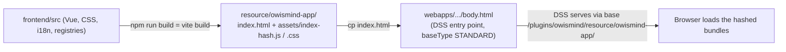

# Frontend - build and assets

> Audience: frontend developer. Last updated: 2026-06-18. Summary: how the Vue 3
> + Vite frontend is compiled into static assets served by DSS (canonical `base` and `outDir`), how
> the built `index.html` becomes the webapp's `body.html`, and which rules govern this chain
> (NO INSTALL, never edit `resource/` by hand, throwaway compile-check).

The OWIsMind frontend is not served by a Node server: it is compiled once into hashed static bundles,
and those files then travel inside the plugin and are served by Dataiku DSS at a fixed URL. This
document describes this frontend build pipeline. The full operational view (the
what-to-rebuild-when matrix, zip packaging, DSS deployment) lives in
[06-operations/02-build-package-deploy.md](../06-operations/02-build-package-deploy.md); this page
focuses on what a frontend developer needs to know before touching `frontend/src`.

## 1. Overview of the chain

The frontend build has two chained outputs: Vite produces `resource/owismind-app/`, then its
`index.html` is copied over to the webapp's `body.html`. Both operations are automated by the
`/build-plugin` skill (`.claude/skills/build-plugin/SKILL.md`).



Key point: DSS serves the webapp via `body.html`, never via `index.html`. The `body.html` must
therefore point to the same bundles as those written into `resource/owismind-app/assets/`. Because the
name of each bundle contains a content hash that changes with every build, copying `body.html` is an
integral part of every build (see section 5).

## 2. The Vite configuration (`vite.config.js`)

File: `Plugin/owismind/frontend/vite.config.js`. Three settings carry the entire deployment
contract:

```js
export default defineConfig({
  plugins: [vue()],
  base: '/plugins/owismind/resource/owismind-app/',
  build: {
    outDir: '../resource/owismind-app',
    emptyOutDir: true,
  },
})
```

| Setting | Value | Role |
|---|---|---|
| `base` | `/plugins/owismind/resource/owismind-app/` | Public URL under which DSS serves the plugin's static assets. Vite prefixes every asset path (script, css, modulepreload, favicon) with this base in the generated `index.html`. |
| `build.outDir` | `../resource/owismind-app` | Build target, relative to `frontend/`. It therefore points to `Plugin/owismind/resource/owismind-app/`, sibling of the `frontend/` folder. |
| `build.emptyOutDir` | `true` | Purges the output folder before writing: the old hashed files disappear. A side effect to be aware of, see section 7. |
| `plugins` | `[vue()]` | `@vitejs/plugin-vue`, the only required plugin. |

These two names (`base` and `outDir`) are CANONICAL: never change them. The rule is restated in
`Plugin/owismind/frontend/CLAUDE.md` (section "Build & output") and in the `/build-plugin` skill. The
reason is mechanical: `base` is the URL where DSS physically exposes the plugin's resource folder (id
`owismind`, resource folder `owismind-app`), and these paths are already hard-wired into the deployed
`body.html`. Changing `base` mandatorily requires rebuilding AND copying `body.html` over again,
otherwise DSS serves a `body.html` that points to a wrong URL and all assets return 404.

## 3. What the build starts from: the source `index.html`

The source entry point is `Plugin/owismind/frontend/index.html`. It is deliberately minimal:

```html
<!doctype html>
<html lang="fr">
  <head>
    <meta charset="UTF-8" />
    <link rel="icon" type="image/svg+xml" href="/favicon.svg" />
    <meta name="viewport" content="width=device-width, initial-scale=1.0" />
    <title>OWIsMind</title>
  </head>
  <body>
    <div id="app"></div>
    <script type="module" src="/src/main.js"></script>
  </body>
</html>
```

It declares the mount target `<div id="app">` and loads `/src/main.js`. The application bootstrap
(style ordering, theme applied to `<body data-theme>` before mount, creation of the Pinia/i18n/router
app) lives in `main.js` and is described in
[01-overview-and-structure.md](01-overview-and-structure.md). The source `favicon.svg` is in
`Plugin/owismind/frontend/public/`: Vite copies it as-is into the output.

## 4. The build output: `resource/owismind-app/`

`npm run build` (alias for `vite build`) writes into `Plugin/owismind/resource/owismind-app/`:

- a rewritten `index.html` (favicon and scripts prefixed with `base`, the source `<script src="/src/main.js">`
  replaced by the hashed bundles);
- an `assets/` folder containing the content-hashed bundles: the entry chunk
  `assets/index-<hash>.js`, its CSS `assets/index-<hash>.css`, the lazy chunks per view
  (`ChatView-<hash>.js`, `AdminView-*`, `AgentsView-*`, `SettingsView-*`, etc., with their twin
  `.css` files), the shared chunks (`Icon-<hash>.js`, `session-<hash>.js`, `useTr-<hash>.js`,
  `pages-<hash>.js`) and the image asset `orange-logo-<hash>.png`;
- the `favicon.svg` copied from `public/`.

The code-splitting (lazy chunks per view) follows from the lazy-loading of routes, described in
[01-overview-and-structure.md](01-overview-and-structure.md): only the bare minimum needed for the chat is
loaded upfront, the rest arrives on demand.

The rewritten `index.html` looks like this (real observed excerpt, hashes liable to change):

```html
<link rel="icon" type="image/svg+xml" href="/plugins/owismind/resource/owismind-app/favicon.svg" />
<script type="module" crossorigin src="/plugins/owismind/resource/owismind-app/assets/index-DCY_crmu.js"></script>
<link rel="modulepreload" crossorigin href="/plugins/owismind/resource/owismind-app/assets/Icon-R0zNmMF0.js">
<link rel="modulepreload" crossorigin href="/plugins/owismind/resource/owismind-app/assets/session-lX0dumx_.js">
<link rel="stylesheet" crossorigin href="/plugins/owismind/resource/owismind-app/assets/Icon-xzaNi_GI.css">
<link rel="stylesheet" crossorigin href="/plugins/owismind/resource/owismind-app/assets/index-D7fJBFZD.css">
```

> IN FLUX: the hash of each bundle (here `index-DCY_crmu.js`) CHANGES with every build. It is not a stable
> identifier. The project memory cites older or newer hashes depending on the session
> (for example `index-CrvKHGTt.js`); none of these hashes should be treated as a fixed reference.
> The only stable invariant is the `base` prefix `/plugins/owismind/resource/owismind-app/`.

### The output folder is versioned (deliberate exception)

`resource/owismind-app/` is TRACKED in git, which is unusual for a build folder. This is a deliberate
exception, documented at the top of `.gitignore`: the NO INSTALL policy (section 6) forbids a fresh
clone from reinstalling the toolchain to recompile. The plugin payload must therefore travel inside the
repository to remain packageable. This is the sole exception to the "regenerable outputs are
ignored" philosophy; the deliverable zip (`Plugin/ready-for-dataiku/`) itself remains ignored.
Corollary: this folder is NEVER edited by hand (see section 7), it is regenerated.

## 5. From `index.html` to `body.html`

DSS serves the webapp (descriptor `webapp.json`, `"baseType": "STANDARD"`) via a `body.html` file, not
via `index.html`. The last build step therefore copies the built `index.html` over to the webapp's
`body.html`:

```bash
cp Plugin/owismind/resource/owismind-app/index.html \
   Plugin/owismind/webapps/webapp-owismind-ai-agents/body.html
```

After this copy, `body.html` is a byte-identical copy of the built `index.html` (verified: `diff`
of the two files = identical). It therefore carries exactly the same asset hashes. This is precisely
why the copy must be redone on EVERY build: since the hash changes with each compilation, a
`body.html` that was not refreshed would point to an old hash, and DSS would serve nonexistent assets (404).

The `/build-plugin` skill validates the copy with a `grep`: it checks that the prefix
`/plugins/owismind/resource/owismind-app/` is indeed present in `body.html`. If this grep fails, the
asset base is missing and the app will not load.

> NOTE (gotcha F10): the Bash `cp` is the nominal path and it is allowed by the harness permissions.
> Editing `body.html` directly via `Edit`/`Write`, however, may be blocked depending on the context; the
> documented fallback is then to write the file via the `Write` tool. The practical rule stays: do not
> recreate this file by hand, derive it from the build.

### The STANDARD slots `app.js` and `style.css`

The STANDARD webapp descriptor mandates two files `app.js` and `style.css` alongside `body.html`.
They are present but EMPTY of logic, and must never be deleted (DSS requires them):

- `app.js` contains a single comment: the application logic is loaded from `body.html`, and the
  legacy DSS template JavaScript has been intentionally removed.
- `style.css` is a single comment: all styling goes into the Vite bundle scoped to `App.vue`. The
  file stays valid (empty) because the descriptor requires it.

All of the application's behavior and all of its style therefore live in the Vite bundles referenced by
`body.html`, not in these slots.

## 6. NO INSTALL: the rule that structures everything

This is the project's non-negotiable rule #1: the agent NEVER installs a dependency (no `npm install`,
`npm ci`, `npm i`, `yarn add`, `pnpm add`, `npx` install, etc.). Only the user installs. This
policy is enforced as defense in depth:

- Harness permissions (`.claude/settings.json`): every install command is listed in
  `permissions.deny`, and direct writes under `resource/owismind-app/**` are blocked there.
- PreToolUse hook (`.claude/hooks/guardrail.sh`): intercepts any `Bash` call whose `"command"` field
  matches an install (regex covering npm/yarn/pnpm/pip/pipenv/poetry/conda/brew/npx) and BLOCKS (exit 2,
  message returned to the model). Pure bash + grep on the raw JSON, with no external dependency.
- Documentation: the rule is restated at session start and in all the skills.

Consequence for the build: the `/build-plugin` skill starts with a preflight that checks for the presence of
`Plugin/owismind/frontend/node_modules`:

```bash
test -d Plugin/owismind/frontend/node_modules && echo "node_modules OK" || echo "MISSING"
```

If the folder is missing, the build STOPS and asks the user to install it themselves. The agent never
attempts the install (it would be refused by the hook anyway). This is also the rationale for the
git exception in section 4: since a fresh clone cannot reinstall the toolchain, the built frontend
must already be in the repository.

## 7. Never edit `resource/owismind-app/` by hand

The output folder is GENERATED. The rule (restated in `frontend/CLAUDE.md` and enforced by the
guardrail): you edit the source (`frontend/src`, and for the backend `python-lib/` or `webapps/`), then
re-run `/build-plugin`. Rule 2 of `guardrail.sh` blocks any write (`Edit`/`Write`) whose
`file_path` falls under `resource/owismind-app` or `ready-for-dataiku`, with an explicit message inviting
you to regenerate rather than edit.

The risk is compounded by `emptyOutDir: true`: a build purges the output folder before writing. Any
manual modification that might have survived would be overwritten at the next build anyway. Worse, since
`outDir` points directly to the deployed folder, a `vite build` launched outside the skill OVERWRITES the
deployed app. Hence the rule in the next section.

## 8. Throwaway compile-check (validate without touching the app)

To check that a change to `frontend/src` compiles, without touching the deployed output folder,
you launch a build toward a throwaway target:

```bash
./node_modules/.bin/vite build --outDir /tmp/owi_buildcheck --emptyOutDir
rm -rf /tmp/owi_buildcheck
```

An absolute rule follows from this: NEVER launch a `vite build` that writes into `resource/` outside the
`/build-plugin` skill. Since `outDir` points to the deployed folder with `emptyOutDir: true`, a rogue
build would overwrite the app served by DSS. The compile-check explicitly redirects `--outDir` to `/tmp`
to avoid this trap, then cleans up.

The frontend tests are likewise install-free: `npm run test` is an alias for `node --test
test/*.test.js`, Node's native runner (no Vitest installed). These pure tests live under
`frontend/test/` and never enter the build nor the zip. See
[07-testing/01-test-strategy.md](../07-testing/01-test-strategy.md).

## 9. The frontend never enters the zip

Packaging (`/package-plugin`) only stages the runtime: `plugin.json`, `python-lib/`, `resource/`,
`webapps/`. The Vue sources never travel inside the zip: `frontend/` and `node_modules/` are excluded
by name. What travels in the archive is the build artifact (`resource/owismind-app/`), not the
sources. This is the project's non-negotiable rule #5. The details of packaging and of the
what-to-rebuild-when matrix (a frontend-only change = build + package + upload + browser refresh, with no
backend restart) are in
[06-operations/02-build-package-deploy.md](../06-operations/02-build-package-deploy.md).

## 10. Recap of the invariants

| Invariant | Where it is enforced |
|---|---|
| `base` = `/plugins/owismind/resource/owismind-app/`, `outDir` = `../resource/owismind-app`: canonical | `frontend/vite.config.js`, `/build-plugin` skill |
| `body.html` copied from the built `index.html` on EVERY build (hash changes) | `/build-plugin` skill (steps 3-4) |
| `body.html` = byte-identical copy of the built `index.html` | verified by `diff` |
| Slots `app.js` / `style.css` empty but never deleted | STANDARD webapp descriptor |
| NO INSTALL: no install by the agent | `settings.json` (deny) + `guardrail.sh` (hook) + `/build-plugin` preflight |
| `resource/owismind-app/` tracked (exception) but never edited by hand | `.gitignore` (top) + `guardrail.sh` rule 2 |
| Build toward `resource/` only via `/build-plugin`; otherwise compile-check toward `/tmp` | `emptyOutDir: true` overwrites the app |
| Frontend never in the zip | `/package-plugin` skill (exclusions by name) |

## See also

- [03-frontend/01-overview-and-structure.md](01-overview-and-structure.md) - bootstrap (`main.js`), hash router, i18n, theme: what the build embeds.
- [03-frontend/04-backend-communication.md](04-backend-communication.md) - how the served bundles talk to the backend (`getWebAppBackendUrl`, polling).
- [06-operations/02-build-package-deploy.md](../06-operations/02-build-package-deploy.md) - full build/package/deploy chain, what-to-rebuild-when matrix, manual DSS upload.
- [07-testing/01-test-strategy.md](../07-testing/01-test-strategy.md) - frontend pure-logic suites (`node:test`), NO INSTALL, compile-check.
- [09-maintenance/01-contributing-and-conventions.md](../09-maintenance/01-contributing-and-conventions.md) - non-negotiable rules (NO INSTALL, do not edit generated outputs).
