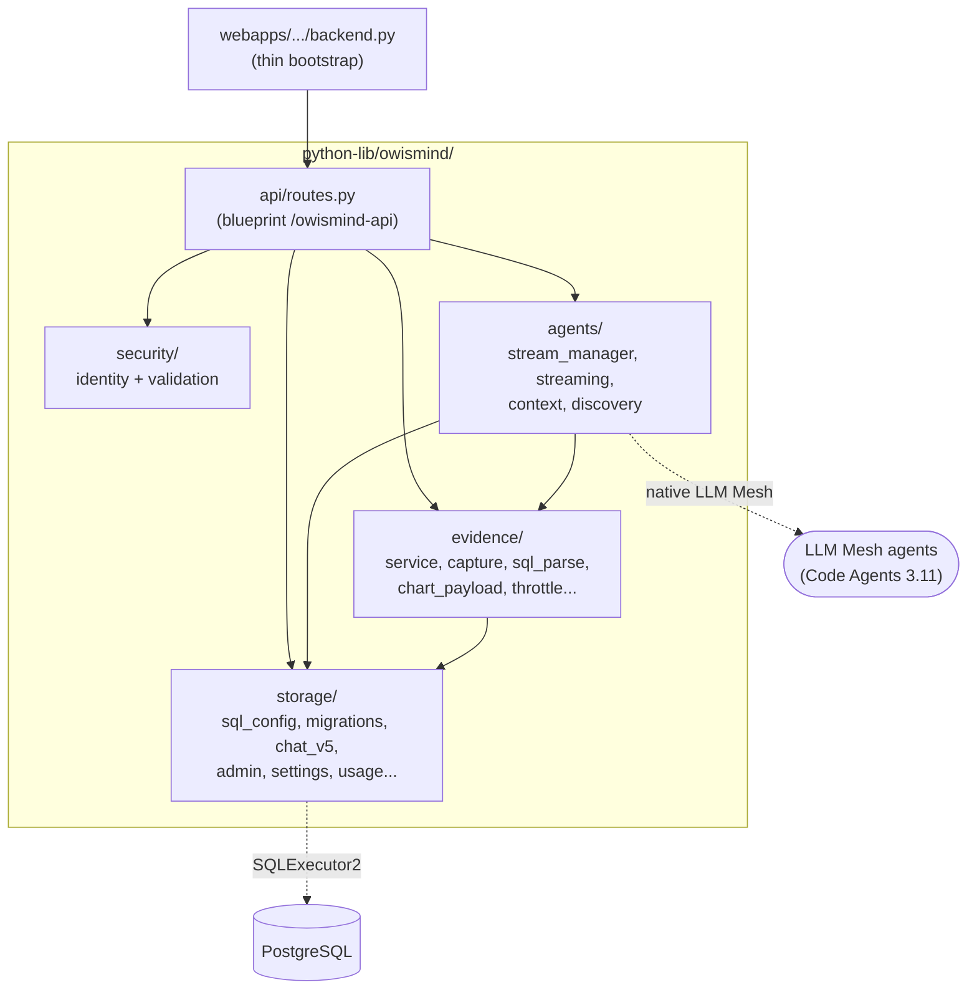

# Backend - overview and structure

> Audience: backend developer. Last updated: 2026-06-18. Summary: how the OWIsMind Flask backend
> is assembled (thin bootstrap, `/owismind-api` blueprint, `before_request` hooks), how the
> `python-lib/owismind/` package is split into sub-packages (api, agents, evidence, security,
> storage), and which cross-cutting conventions (Python 3.9, stable error codes, owner-scoping)
> govern the whole layer.

The OWIsMind backend is a **STANDARD DSS WebApp with a Python backend** (`hasBackend: "true"`
in `webapp.json`). It is a **Flask** server that acts as an intermediary between the Vue 3 frontend (served
as static assets by DSS) on one side, and the LLM Mesh agents plus the PostgreSQL database on the other. It never
reasons on its own: it validates, routes, persists, and normalizes events. The observed code
runs on **Python 3.9.23** (no FastAPI, no langchain in the backend; LangGraph lives in the
Code Agents in the 3.11 env, outside the zip).

## 1. The entry point: a deliberately thin bootstrap

DSS instantiates the Flask `app` object and injects it into the webapp's backend module via a star-import.
The file `webapps/webapp-owismind-ai-agents/backend.py` therefore contains no logic: it imports
the `app` provided by DSS, then wires the plugin's routes onto it.

```python
from dataiku.customwebapp import *          # provides the Flask `app` object
from owismind.api.routes import register_routes
register_routes(app)
```

Everything else lives in `python-lib/owismind/`. This split is a structural rule of the plugin: the
webapp component stays short, the logic lives in the importable, testable library. The frontend
counterpart of this bootstrap, `app.js`, is likewise empty: the entire frontend arrives via `body.html`
(Vue/Vite bundle). There is no logic on the `app.js` side.

`register_routes(app)` (in `api/routes.py`) does four things at boot:

1. `app.register_blueprint(api)`: mounts the blueprint under its prefix.
2. `sql_config.apply_log_level()`: applies the log level chosen by the admin (`log_level` param).
3. logs the resolved `storage_status()` (connection, project key, physical table names).
4. logs the **live route table**: all rules starting with `/owismind-api`, sorted, with
   their count. This last log is an operational landmark: in the DSS backend log, it confirms which
   build is running and how many routes are mounted.

Steps 2 and 3 are wrapped in a `try/except` that logs the exception without failing the
boot: an unreadable storage config must not prevent the app from starting (it will simply declare
itself "not configured", see section 4).

## 2. The `/owismind-api` blueprint

All routes are carried by a single Flask blueprint defined in `api/routes.py`:

```python
api = Blueprint("owismind_api", __name__, url_prefix="/owismind-api")
```

The `/owismind-api` prefix is the root of the whole HTTP API. The app's health is checked via
`GET /owismind-api/ping`. The complete catalog of endpoints (payloads, error codes, HTTP statuses)
is the subject of a dedicated document: see [Backend - API reference](02-api-reference.md).

### 2.1 The request hooks: `before_request` and `after_request`

Two hooks trace every request. Key point: they are decorated `@api.before_request` /
`@api.after_request`, hence **blueprint-scoped**. They fire ONLY for `/owismind-api/*`, not
for DSS's internal health-pings nor for static assets.

| Hook | Decorator | What it does |
|---|---|---|
| `_log_request_start` | `@api.before_request` | Sets `g._owi_t0 = time.time()` (timer) and logs `→ <method> <path>`. |
| `_log_request_end` | `@api.after_request` | Computes the duration since `g._owi_t0` and logs `← <method> <path> -> <status> (<ms> ms)`. |

The **request content is NEVER logged** (hygiene and privacy): only the meta (method,
path, status, duration) is. This content-free discipline is found throughout the backend (the
logs of `/chat/start`, for instance, carry `user_id`, `session_id`, `agent_key`, `msg_len`, never the
text of the message). It is a safety principle of the layer, not an implementation detail.

## 3. The map of the sub-packages of `python-lib/owismind/`

The library is split into five thematic sub-packages, plus the root package. Each sub-package
has a clear responsibility. The canonical diagram of the component map (modules by layer) lives
in [Component map](../02-architecture/02-component-map.md); the mini-diagram below shows
only the direction of the backend's internal dependencies (who calls whom), for the benefit of the backend reader.



Reading: `api/routes.py` is the crossroads. It calls `security/` to authenticate and validate,
`storage/` to persist and re-read, `agents/` to launch and follow a run, `evidence/` to re-derive
the evidence. The `agents/` and `evidence/` sub-packages themselves rely on `storage/`; the backend
only talks to the agents via native LLM Mesh, and to the database only via `SQLExecutor2`.

### 3.1 `api/` - the HTTP layer

The only functional module is `routes.py`: it defines the blueprint, the request hooks, the helper
`_logical_key` (derivation of an opaque agent key), the shared guards (`_evidence_guard`,
`_admin_guard`), the sanitizer `_sanitize_screen_context`, and the full set of endpoint handlers. The
package `__init__.py` simply documents that the blueprint is mounted under `/owismind-api` by
`register_routes()`. It is the backend's single HTTP entry point: there is no generic
SQL route, and the frontend never chooses a table, a connection, or a query.

### 3.2 `security/` - identity and validation (the frontend is never trusted)

Two modules, and the guiding principle of the sub-package: **the frontend is never trusted**.

- `identity.py`: `resolve_identity(headers)` resolves the caller from the authenticated
  browser headers (`api_client().get_auth_info_from_browser_headers`), never from the request body.
  It returns `{user_id, display_name, groups}`. The `user_id` is the DSS login (`authIdentifier`); DSS does
  not provide a display name, so it is DERIVED from the login (`derive_display_name` / `derive_full_name`,
  `firstname.lastname` convention). A per-process cache with a short TTL (`_AUTH_TTL_SECONDS = 5.0`, keyed on a
  SHA-256 of the Cookie) collapses the repeated resolutions of `/chat/poll` (which re-resolves the caller on each
  poll, roughly twice per second per live chat). A failure raises `IdentityError`, which the route maps to
  `401 unauthenticated`.
- `validation.py`: a set of PURE validators (no DSS dependency, testable outside the runtime) that
  bound and coerce the frontend payloads. `ValidationError(code, message=None)` carries a stable
  `code` rendered as-is to the frontend (for example `empty_message`, `agent_key_too_long`,
  `invalid_filter_op`). Some validators RAISE (the required fields), others CLAMP without ever
  raising (`validate_history_limit` clamps `[10, 50]`, `validate_conversations_limit` clamps `[1, 60]`).
  The validation detail is documented in
  [Backend - security and validation](06-security-and-validation.md).

### 3.3 `agents/` - the bridge to LLM Mesh and the run lifecycle

Four modules carry all the interaction with the agents, without ever reasoning themselves.

- `stream_manager.py`: the lifecycle of a run. This is where the shared state `_RUNS` lives
  (module-level dict guarded by a `threading.Lock`), the admission gate `can_accept`, the launch
  of the worker thread `start_run`, the `poll` loop, the cooperative stop `request_stop`, and the TTL
  eviction. The transport is a **streaming-by-polling**: the agent runs in a daemon thread, the frontend
  queries `/chat/poll` every ~500 ms. All of this is detailed in
  [Backend - streaming and run lifecycle](03-streaming-and-runs.md).
- `streaming.py`: `run_agent_streamed` executes ONE agent completion via native LLM Mesh
  (`project.get_llm(agent_id).new_completion()`) and **normalizes** the raw chunks into
  JSON-safe events (`run_started`, `agent_event`, `answer_delta`, `generated_sql`, `usage_summary`,
  `final_answer`, `run_done`, `error`). A strict key whitelist (`_EVENT_PASSTHROUGH_KEYS`)
  prevents the orchestrator's internal payloads from reaching the polled timeline.
- `context.py`: a PURE module (no `dataiku` import) that assembles the multi-turn payload sent to the
  agent. It builds the context suffix appended AT THE END of the current message (who is asking, the date,
  the language, the control tokens `owi:mode=…` / `owi:lang=…`), detects the response language
  (`detect_prompt_language`), exposes `MODEL_MODES = ("eco", "medium", "high")`, and flattens the
  ancestor chain into messages.
- `discovery.py`: a STRICTLY read-only module that lists the projects and agents visible to the webapp's
  identity. It feeds the admin area to build the whitelist of activatable agents; never any
  create/modify/delete.

### 3.4 `evidence/` - deterministic re-derivation of the evidence

The Evidence Studio sub-package re-executes, in a DETERMINISTIC way (zero LLM), the stored SELECT scope of
a response, read-only and owner-scoped. The pure analysis (`sql_parse.py`, `query_builders.py`,
`whitelist.py`) is dataiku-free and testable; only `service.py` touches the DSS runtime. The modules:
`service.py` (the stateless pipeline), `capture.py` (opportunistic capture of the `result` + mirror caps),
`sql_parse.py` / `sql_explain.py` (parsing and structured explanation of the SQL), `chart_payload.py`
(Chart.js / KPI shaping), `throttle.py` (per-user token-bucket) and `whitelist.py`. The detail lives in
[Backend - Evidence Studio and artifacts](05-evidence-and-artifacts.md).

### 3.5 `storage/` - all application state in direct SQL

The largest sub-package. It persists ALL the application state (conversations, messages, feedback,
user registry, global settings, token/cost usage, artifacts) in **direct SQL via `SQLExecutor2`** on
a PostgreSQL connection, **with no Flow at runtime** (with a single exception: the write-only trace
dataset, `chat_traces.py`). Key modules: `sql_config.py` (the foundation: connection, physical naming
`{PROJECT_KEY}_{namespace}_{logical}`, parameterization and identifier helpers), `migrations.py`
(idempotent DDL, `_vN` strategy with no structural `ALTER`), `chat_v5.py` (two-phase writing,
conversation tree, reads), `admin.py` and `settings.py` (user registry + agent whitelist),
`usage.py` (usage accounting), plus the pure helpers `sql_builders.py`, `pagination.py`,
`serialization.py`. The current chat table is `webapp_chat_v5` (never `webapp_chat_v4`). The complete
data model is documented in
[Backend - storage and data model](04-storage-and-data-model.md).

## 4. Cross-cutting conventions (apply to the whole layer)

These rules are common to all the sub-packages; knowing them saves re-reading each module.

### 4.1 Response shape and stable error codes

- Success: `{"status": "ok", ...}` (often a splat of the result dict).
- Error: `{"status": "error", "error": <code>}` with an HTTP status. The **error codes are
  stable, machine-readable strings** (never an internal detail nor a stack trace). The frontend maps
  these codes to i18n messages. The error contract IS the API.

| Error code | HTTP status | When |
|---|---|---|
| `unauthenticated` | 401 | `resolve_identity` fails (except `/ping`). |
| `storage_not_configured` | 409 | No SQL connection chosen (except `/ping` and `/me`). |
| `agent_not_enabled` | 404 | `agent_key` forged/stale, does not resolve against the whitelist. |
| `rate_limited` | 429 | Per-user spacing (< 1 s between two starts). |
| `busy` | 503 | Global concurrency cap reached (8 runs). |
| `<ValidationError.code>` | 400 | Invalid payload (the exact code comes from the validator). |
| `forbidden` | 403 | Non-admin caller on an `/admin/*` route. |

### 4.2 Authentication mandatory except `/ping`

Every route calls `resolve_identity(request.headers)`. Only `/ping` is reachable without auth, and it
deliberately exposes no storage config (since it is public). `/me` tolerates the absence of
config (it returns `needs_config: true` rather than a 409).

### 4.3 Storage guard

Except `/ping` and `/me`, every route refuses if `sql_config.is_configured()` is false, with
`409 storage_not_configured`. The app never guesses a connection: as long as the admin has not chosen
one in the webapp Settings, the backend declares itself "not configured" instead of opening an
arbitrary connection.

### 4.4 Identity never from the body, run-as-user

The `user_id` ALWAYS comes from the authenticated browser headers, never from the request body. The frontend
only sends logical data (`session_id`, `message`, `agent_key`, etc.). Important subtlety:
all the backend's DSS calls (identity resolution, `SQLExecutor2`, `get_agent_tool`, discovery)
execute under the **run-as** identity under which the webapp's backend runs, NOT under the browser
caller. The resolved `user_id` serves only for application-level scoping. Security therefore relies on
server-side owner-scoping (all chat and Evidence reads/writes carry `WHERE ... user_id = ...`)
and on the agent whitelist, not on per-user DSS rights. See
[Security model](../02-architecture/04-security-model.md) for the framing of this trust
boundary.

### 4.5 Agent whitelist resolved server-side

The frontend sends an OPAQUE logical key `agent_key` (form `ag_<12 hex>`), derived by `_logical_key`
from a stable hash of `project_key:agent_id`. The backend resolves it into `(project_key, agent_id)` via
`settings.resolve_enabled_agent`, against the agents an admin has enabled (persisted in
`webapp_settings_v1`). A forged or disabled key resolves to `None`. **A raw `agent_id` is never
accepted nor returned to the frontend.** This is the project's non-negotiable rule #4.

### 4.6 Python 3.9, instance safety

The observed backend is Python 3.9.23. We do not assume that FastAPI or langchain work here. The
safety of the Dataiku instance is a baseline constraint: bounded/read-only/parameterized SQL, explicit
COMMIT, a FRESH `SQLExecutor2` per call, caps everywhere, and no heavy/blocking/unbounded work
in a request handler.

> IN FLUX: the agent layer (`dataiku-agents/`, Python 3.11 env, outside the backend zip) is being edited
> live by another engineer. The `eventKind` values emitted by the Code Agents (NARRATION, AGENT_DONE,
> ARTIFACT) could evolve; the python-lib backend (3.9, Flask) stays model-agnostic and
> consumes a generic LLM Mesh stream. The frozen span `semantic-model-query` (the name of the tool whose trace
> carries the SQL) is a contract shared between the two layers: any rename on the agent side would break the
> trace extraction.

## 5. The webapp parameters that drive the backend

`webapp.json` declares four parameters (DSS Settings, populated by
`resource/compute_available_connections.py`) that condition the backend's behavior:

| Param | Type | Role |
|---|---|---|
| `sql_connection` | SELECT | PostgreSQL storage connection. Absent -> `is_configured()` false -> most routes return `409 storage_not_configured`. Resolved via `connection_name()`, never hardcoded. |
| `table_prefix` | optional STRING | Prefix inserted after the project key (regex `^[A-Za-z0-9_-]{1,16}$`). Invalid/too long -> IGNORED (logged once, flagged to the admin). |
| `traces_dataset` | optional SELECT | Flow dataset where the raw trace of each run is appended (write-only). Missing/incompatible -> trace skipped, never breaks the chat. |
| `log_level` | SELECT (default INFO) | Verbosity of the backend log, applied at boot by `apply_log_level()`. |

The descriptor also carries `"baseType": "STANDARD"`, `"hasBackend": "true"`, `"noJSSecurity": "false"`.

## See also
- [Backend - API reference](02-api-reference.md) - the complete catalog of `/owismind-api/*` endpoints, payloads and codes.
- [Backend - streaming and run lifecycle](03-streaming-and-runs.md) - the worker, the polling, the stop, the caps of the `agents/` sub-package.
- [Backend - storage and data model](04-storage-and-data-model.md) - the `_vN` tables, the conversation tree, the usage, the SQL naming.
- [Backend - Evidence Studio and artifacts](05-evidence-and-artifacts.md) - capture, sql_parse/explain, verification levels, chart_payload.
- [Backend - security and validation](06-security-and-validation.md) - payload validation, SQL safety, read-only guards.
- [Component map](../02-architecture/02-component-map.md) - the canonical diagram of modules by layer.
- [Security model](../02-architecture/04-security-model.md) - trust boundary, run-as-user, owner-scoping, whitelist.
