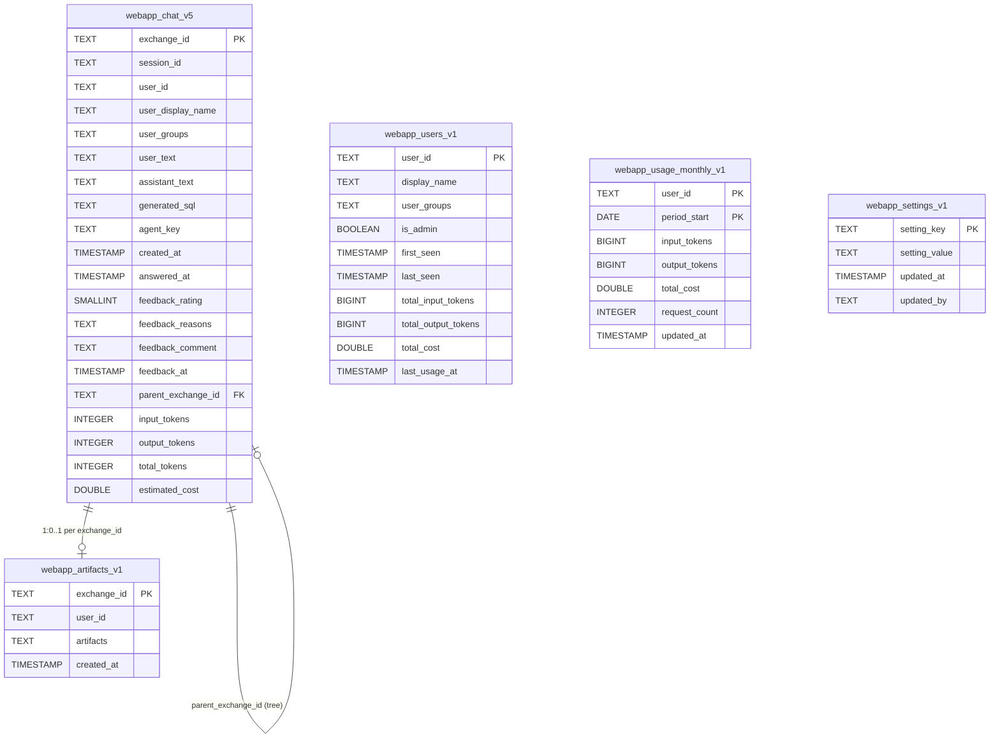

# Backend - storage and data model

> Audience: backend developer, DBA. Last updated: 2026-06-18. Summary: how the OWIsMind backend
> persists all of its state in direct SQL (PostgreSQL via `SQLExecutor2`), with the detail of each
> `_vN` table, the conversation tree, the 3-level usage accounting, and the instance safety
> guardrails.

## 1. Structuring principles

The backend persists ALL of its application state (conversations, messages, feedback, users
registry, global settings, token/cost usage, artifact specs) in **direct SQL** via
`dataiku.SQLExecutor2`, on a **PostgreSQL** connection (schema `public`). There is **no Flow at
runtime**, with a single exception: the traces dataset (write-only, see section 9). The
`storage/__init__.py` module sums up the rule: "Direct SQL via SQLExecutor2 on the admin-configured
PostgreSQL connection (...) no DSS Flow at runtime."

The non-negotiable invariants (project rule #3, memory L008) govern the whole sub-package
`Plugin/owismind/python-lib/owismind/storage/`:

- **Admin-configured connection, never hard-coded.** `connection_name()` reads it from the webapp
  config (param `sql_connection`, documented default `SQL_owi`). As long as it is not set,
  `is_configured()` returns `False` and the app declares itself "not configured" rather than
  guessing.
- **A FRESH `SQLExecutor2` per call** (`new_executor()`): the object carries transactional state, so
  it must never be shared between Flask worker threads.
- **Physical naming** `{PROJECT_KEY}_{namespace}_{logical}`, with the `owismind` namespace always
  present.
- **`_vN` versioning, never a structural `ALTER`** (except for the single additive relaxation
  described in 3.3).
- **Explicit COMMIT after every write** via `pre_queries=[...]` + `post_queries=["COMMIT"]`.
- **Always parameterized values** via `sql_value()` / `nullable_value()`; identifiers via
  `pg_identifier()`; never a raw f-string around user content.
- **Every read/write is owner-scoped** by `user_id` in the `WHERE`.

> IN FLUX (doc legacy vs code divergence): `docs/data-model.md` is OUTDATED. It describes
> `webapp_chat_v4` and `CONV_TITLE_MAXLEN = 140`, whereas the LIVE code uses `webapp_chat_v5` (usage
> columns added) and `CONV_TITLE_MAXLEN = 56`. It mentions neither `webapp_usage_monthly_v1`, nor
> `webapp_artifacts_v1`, nor the lifetime columns of `webapp_users_v1`. The CODE prevails; this page
> reflects it.

## 2. `sql_config.py`: the configuration and safety foundation

Everything else in `storage/` depends on this module.

### 2.1 Connection and project key resolution

The webapp config is read ONCE and **cached for the life of the process** (`_webapp_config()`). DSS
restarts the backend when the config changes, so the cache is safe; an unreadable config yields an
empty dict (app "not configured"), never an exception.

`connection_name()` handles the "param shapes" where the value arrives wrapped in a dict
(`val.get("name") or val.get("connection") or val.get("value")`). The project key is resolved once at
import, in this priority order: environment variable `OWISMIND_PROJECT_KEY` -> webapp config
`project_key` -> `dataiku.default_project_key()` -> constant `FALLBACK_PROJECT_KEY`
(= `OWISMIND_DEV`). The pair `(PROJECT_KEY, PROJECT_KEY_SOURCE)` is exposed to the admin.

### 2.2 `new_executor()`

ALWAYS returns a new `SQLExecutor2(connection=conn)`. It raises a `RuntimeError` when no connection is
configured: this is a defensive backstop (the routes guard with `is_configured()` first). We NEVER
open a connection that the admin has not explicitly chosen.

### 2.3 Value and identifier parameterization

| Helper | Role |
|---|---|
| `sql_value(value)` | THE value parameterization point for user values: `toSQL(Constant(value), dialect=DIALECT)`. |
| `nullable_value(value)` | Returns the `NULL` keyword for `None`/`""`, otherwise `sql_value(value)` (an optional field stores SQL NULL, not an empty string). |
| `bool_literal(value)` | Inlines `true`/`false` (bare SQL keyword) for booleans already type-checked server-side. |
| `pg_identifier(name)` | Validates via `_IDENTIFIER_RE`, **rejects > 63 bytes** (`_MAX_IDENTIFIER_BYTES`, NAMEDATALEN - 1) then double-quotes, escaping `"` -> `""`. |

`pg_identifier` rejects identifiers that are too long so as NOT to let PostgreSQL truncate silently
(two distinct logical names could otherwise collide onto the same physical name). Scrap-yard rule:
NEVER pass user input to `pg_identifier`, NEVER use `sql_value` for an identifier.

> Important: `SQLExecutor2` has **no server-side bind** (official DSS API reference). `sql_value`
> always inlines the value into the TEXT of the statement, and DSS LOGs every `SQLExecutor2` query in
> full. This is the direct root cause of two design choices: the text caps (section 4) and the choice
> of a write-only dataset for traces (section 9).

### 2.4 Table naming

- `_namespace()` returns `owismind`, or `{prefix}-owismind` when a valid admin prefix is configured.
- `physical_table(logical)`: `"{PROJECT_KEY}_{namespace}_{logical}"`. Example without prefix:
  `webapp_chat_v5` -> `OWISMIND_DEV_owismind_webapp_chat_v5`.
- `full_table(logical)`: fully qualified and quoted reference, e.g.
  `public."OWISMIND_DEV_owismind_webapp_chat_v5"`.

The admin prefix (`_resolve_table_prefix()`) is validated by `_PREFIX_RE` (`^[A-Za-z0-9_-]{1,16}$`,
bounded at 16 characters to stay under the 63-byte limit). An invalid or too-long prefix is
**ignored** (no prefix) and the warning is emitted ONCE only (resolved once, cached). The triple
`(effective, raw_input, ignored)` is surfaced to the admin by `storage_status()`, so they know their
prefix was ignored instead of failing silently.

`storage_status()` returns the resolved config for the admin area: `configured`, `connection`,
`project_key`, `project_key_source`, `table_prefix` (effective), `table_prefix_input`,
`table_prefix_ignored`, `namespace`, `traces_dataset`, and the `tables` mapping (physical names of
`webapp_chat_v5`, `webapp_users_v1`, `webapp_settings_v1`, `webapp_usage_monthly_v1`).

## 3. `migrations.py`: idempotent DDL and the `_vN` strategy

DDL lives ONLY here, never inline in a public route. Tables are created lazily on the FIRST write, via
an internal guarded helper `_ensure_table()`. Strategy: a new row format = a new `_vN` table, never a
structural `ALTER`.

Logical names: `CHAT_V5_LOGICAL = "webapp_chat_v5"`, `USERS_V1_LOGICAL = "webapp_users_v1"`,
`SETTINGS_V1_LOGICAL = "webapp_settings_v1"`, `USAGE_MONTHLY_V1_LOGICAL = "webapp_usage_monthly_v1"`,
`ARTIFACTS_V1_LOGICAL = "webapp_artifacts_v1"`.

Chat table history: v2 (+`generated_sql`) -> v3 (+feedback columns) -> v4
(+`parent_exchange_id`) -> **v5 (+token/cost usage columns)**. At each switch the new table starts
EMPTY; the old one is left INERT (never dropped by the backend, its old conversations simply stop
surfacing).

### 3.1 Data model diagram

Canonical home of the SQL data model (this page). The 5 tables and the `parent_exchange_id` tree edge:



Reading note: no physical SQL foreign-key constraint links these tables (the coupling is at the
application level). `user_id` is not a declared foreign key toward `webapp_users_v1`; it serves as the
owner scoping key. The `parent_exchange_id` edge is a logical self-reference (the conversation tree,
section 7).

### 3.2 The 5 tables and their columns

**`webapp_chat_v5`**: one chat exchange per row, written in two phases.

| Column | Type | Role |
|---|---|---|
| `exchange_id` | `TEXT PRIMARY KEY` | id generated in Python (`uuid4().hex`), no readback. |
| `session_id` | `TEXT` | conversation id (groups exchanges). |
| `user_id` | `TEXT` | owning DSS login; scoping key for ALL reads/writes. |
| `user_display_name` | `TEXT` | denormalized SNAPSHOT of the name at write time, not back-updated. |
| `user_groups` | `TEXT` | JSON list of DSS groups at write time. |
| `user_text` | `TEXT` | RAW user message (bounded by `MAX_PERSISTED_TEXT_CHARS`). |
| `assistant_text` | `TEXT` | response, filled in phase 2 (`NULL` until then). |
| `generated_sql` | `TEXT` | JSON list of SQL items, or `NULL` (section 5). |
| `agent_key` | `TEXT` | OPAQUE logical agent key, never the raw `agent_id`. |
| `created_at` | `TIMESTAMP NOT NULL DEFAULT now()` | phase 1 timestamp (DB default). |
| `answered_at` | `TIMESTAMP` | phase 2 timestamp (`now()` on the response UPDATE), `NULL` otherwise. |
| `feedback_rating` | `SMALLINT` | `0` / `1` / `NULL`. |
| `feedback_reasons` | `TEXT` | JSON list of reasons (whitelisted on the caller side). |
| `feedback_comment` | `TEXT` | bounded free-form comment. |
| `feedback_at` | `TIMESTAMP` | feedback timestamp (`NULL` on clear). |
| `parent_exchange_id` | `TEXT` | tree edge; `NULL` = root. |
| `input_tokens` | `INTEGER` | prompt tokens of the run (usage footer). |
| `output_tokens` | `INTEGER` | completion tokens of the run. |
| `total_tokens` | `INTEGER` | total tokens of the run. |
| `estimated_cost` | `DOUBLE PRECISION` | estimated cost of the run. |

The name/date prefix and the history injected into the agent are computed at build-time, never stored:
the stored `user_text` remains the RAW message. The usage columns are **AUTHORITATIVE**:
`webapp_users_v1` and `webapp_usage_monthly_v1` are reconstructible by summing `webapp_chat_v5`.

**`webapp_users_v1`**: users/admins registry (1 row per user who has opened the webapp at least once),
PK `user_id`. Columns: `display_name`, `user_groups` (JSON), `is_admin`
(`BOOLEAN NOT NULL DEFAULT false`), `first_seen`, `last_seen`, and the LIFETIME counters
`total_input_tokens` / `total_output_tokens` (`BIGINT NOT NULL DEFAULT 0`), `total_cost`
(`DOUBLE PRECISION NOT NULL DEFAULT 0`), `last_usage_at` (`TIMESTAMP`).

**`webapp_settings_v1`**: global key-value config (NOT per user), PK `setting_key`. Columns:
`setting_value` (JSON), `updated_at`, `updated_by`. This is the generic store where the agents
whitelist lives (section 8).

**`webapp_usage_monthly_v1`**: bucket per (user, calendar month). Columns: `user_id`, `period_start`
(`DATE`), `input_tokens` / `output_tokens` (`BIGINT NOT NULL DEFAULT 0`), `total_cost`
(`DOUBLE PRECISION NOT NULL DEFAULT 0`), `request_count` (`INTEGER NOT NULL DEFAULT 0`), `updated_at`.
The **composite PK `(user_id, period_start)`** guarantees exactly one row per month: the future
monthly quota is a single lookup by PK, with no reset job (a new month is naturally a new row).

**`webapp_artifacts_v1`**: artifact specs (chart/table/kpi) rendered by the orchestrator, PK
`exchange_id`. Columns: `user_id`, `artifacts` (JSON), `created_at`. Only the SPEC is stored, never the
data rows (reused from the captured `generated_sql.result`).

### 3.3 Additive ADD COLUMN: the only relaxation of no-ALTER

`_ALTERS_BY_LOGICAL` carries only `USERS_V1_LOGICAL`: 4 `ADD COLUMN IF NOT EXISTS` clauses
(`total_input_tokens`, `total_output_tokens`, `total_cost`, `last_usage_at`). Explicit justification
(user authorization 2026-06-11): ADDITIVE counters on the existing registry must not lose the rows
already carried (admin flags, `first_seen`). Idempotent: no-op once applied, and on a fresh table that
already has the column via its `CREATE` DDL.

### 3.4 Secondary indexes

`_INDEXES_BY_LOGICAL` carries only `CHAT_V5_LOGICAL`: `(user_id, created_at DESC)` (suffix `uc_idx`,
for the conversation list) and `(user_id, session_id, created_at DESC)` (suffix `usc_idx`, for
per-session reads). `CREATE INDEX IF NOT EXISTS` is considered ADDITIVE (not a structural ALTER). The
ancestors CTE walks up by PK `exchange_id`, so no dedicated index.

### 3.5 `_ensure_table()` and the `ensure_*` wrappers

`_ensure_table(logical)` is process-guarded: a `_ensured_tables` set + a `threading.Lock`
(double-check locking) avoid re-emitting the DDL on every request. It builds
`pre = [ddl] + [ALTER...] + [CREATE INDEX...]` in ONE transaction, then
`query_to_df("SELECT 1 ...", pre_queries=pre, post_queries=["COMMIT"])`. `CREATE TABLE IF NOT EXISTS`
stays idempotent and concurrency-safe if two requests cross. Public wrappers, called on the first
write of each domain: `ensure_chat_table()`, `ensure_users_table()`, `ensure_settings_table()`,
`ensure_usage_monthly_table()`, `ensure_artifacts_table()`.

## 4. `chat_v5.py`: two-phase write, caps, reads

### 4.1 The two-phase write pattern

**Phase 1** - `save_user_message(session_id, identity, user_text, agent_key, parent_exchange_id=None)`
generates `exchange_id = uuid4().hex`, normalizes the groups into a JSON list, bounds `user_text` via
`_bounded()`, `INSERT`s the row with `assistant_text = NULL`, `generated_sql = NULL`,
`answered_at = NULL` (`created_at` defaulted by the DB), COMMITs, and returns `exchange_id`. The full
INSERT text is NOT logged at INFO (it would inline the message body); only a compact log is emitted.
This phase runs in the REQUEST THREAD, so a write error becomes a clean HTTP 500, not a silent error
in the worker.

**Phase 2** - `save_assistant_message(exchange_id, assistant_text, generated_sql=None, usage=None)`
does a single atomic `UPDATE` that fills `assistant_text`, `generated_sql`, the 4 usage columns and
`answered_at = now()`, matching on the phase-1 `exchange_id`. Everything in the same UPDATE so that the
per-exchange usage record (source of truth) lands WITH the response. It is called best-effort from the
worker (`agents/stream_manager`): a storage error does not abort the run, the user already has the
response on screen.

The `usage` parameter = the run's `usage_summary` footer totals
(`promptTokens` / `completionTokens` / `totalTokens` / `estimatedCost`), or `None` for a run stopped
early without a footer. Each value passes through `_usage_literal()`: missing / non-numeric /
negative -> SQL `NULL`; floats are formatted with fixed decimals (`{:.10f}`) to avoid scientific
notation, and inlined as bare literals (server-computed, controlled value, on the `bool_literal`
model).

### 4.2 The text cap and the "CRU log safety"

`MAX_PERSISTED_TEXT_CHARS = 262_144` bounds the STORED text (the LIVE response is bounded separately by
`stream_manager.MAX_ANSWER_CHARS`). The reason is "CRU log safety": DSS logs every `SQLExecutor2`
query (full text), `SQLExecutor2` has no server bind, so `sql_value` always inlines the value into the
logged statement; a scenario that materializes those logs into a dataset can trip the line-length
limit if an SQL cell is too long.

> Critical guard: `_bounded()` must NEVER touch the `generated_sql` JSON. Its truncation marker would
> corrupt decoding. Bounding `generated_sql` is STRUCTURAL via `capture.cap_sql_list()` BEFORE
> serialization (section 5).

### 4.3 Out-of-band feedback

`save_feedback(user_id, exchange_id, rating, reasons, comment)` does an
`UPDATE ... WHERE exchange_id = ... AND user_id = ...` (owner-scope: a user only rates their own
messages, no-op at 0 rows otherwise). `rating` in `{0, 1, None(clear)}`, `reasons` -> JSON list,
`comment` bounded; `feedback_at = now()` only when a rating is posted, `NULL` on clear (fixed SQL
literal, never user input).

### 4.4 Reads and key projection

- The stable column order for re-reads lives in `_COLUMNS` (including `generated_sql`, feedback,
  `parent_exchange_id`, the 4 usage columns): the front reuses a single `rowsToMessages` mapper.
- `history_messages_for_chain(user_id, parent_exchange_id, max_messages)` builds the agent context:
  the ancestors chain (section 7). Returns `[]` if there is no parent. The limit is validated by
  `validate_history_limit` (default 20, bounded `[10, 50]`), the number of exchanges to read derives
  from `exchanges_to_fetch(limit)` = `ceil(limit/2)`, and the result is flattened by
  `flatten_exchanges_to_messages` (the SQL is attached to the assistant turn as grounding).
  `MAX_CHAIN_DEPTH = 200` bounds the recursive walk (anti-cycle).
- `list_conversations(user_id, cursor_token, limit)` returns NAMES only (never message bodies), with
  keyset pagination (section 6). `CONV_TITLE_MAXLEN = 56`.
- `messages_for_session(user_id, session_id, cap=SESSION_MESSAGES_CAP)` returns all exchanges of ONE
  session (chronological), user+session scoped, bounded `SESSION_MESSAGES_CAP = 500`. Decodes
  `user_groups`, `generated_sql` and `feedback_reasons` into lists.

On the `/conversation` re-read, `_project_sql_items` projects the `generated_sql` items onto
`_SQL_ITEM_PUBLIC_KEYS = ("sql", "success", "row_count", "sql_id", "step_index", "agent_key")`: the
captured `result` is DELIBERATELY projected OUT (the thread stays light; only `/evidence/meta` returns
the stored `result`). Legacy or non-dict items pass through as-is (a corrupted cell never breaks a
response).

## 5. `generated_sql` and structural bounding

A `generated_sql` item is a dict `{sql, success, row_count}` plus the optional trust-layer keys
`sql_id` / `step_index` / `agent_key` / `result`. Before serialization, `cap_sql_list()`
(`evidence/capture.py`, a PURE module without `dataiku`) bounds the list:

1. each item: `sql` truncated to `MAX_ITEM_SQL_CHARS = 20_000`, tags to 300 characters, and the
   `result` re-capped by `cap_result` (rows to `MAX_RESULT_ROWS = 200`, cols to `MAX_RESULT_COLS = 50`,
   cell to `MAX_CELL_CHARS = 256`, JSON to `MAX_RESULT_JSON_CHARS = 100_000`);
2. the list is bounded to the `MAX_SQL_ITEMS = 20` most RECENT items;
3. the serialized list is adjusted under `MAX_PERSISTED_TEXT_CHARS = 262_144` (mirror of chat_v5) by
   removing items.

This is what closes the "hole" of the formerly unbounded sql_json. All caps are STRUCTURAL (dropped
rows, `truncated` flag flipped), never a text marker inside the JSON. An empty list stores SQL `NULL`
via `nullable_value`, so that "no SQL" re-reads cleanly.

## 6. Reads, keyset pagination and serialization

### 6.1 Pure SQL builders

The builders in `sql_builders.py` DO NOT IMPORT `dataiku`: they assemble the exact SQL text from
fragments ALREADY escaped by the caller (values via `sql_value`, table via `full_table`), which makes
them testable in unittest without a DSS runtime, to assert the SHAPE (notably that every read is always
scoped to a single `user_id`).

### 6.2 Keyset pagination

`pagination.py` encodes an opaque cursor over `(last_at_iso, session_id)` separated by
`_SEP = "\x1f"` (unit separator, never present in an ISO timestamp or a uuid), in urlsafe base64
(`encode_cursor` / `decode_cursor`). Decoding is DEFENSIVE: any malformed token degrades to `None`
(= "first page"), never raises.

`build_conversation_list_query` returns one row per `session_id`. The title is the first `user_text` of
the session, CLEANED into a one-line name:

```sql
COALESCE(LEFT(BTRIM(regexp_replace(
  (ARRAY_AGG(user_text ORDER BY created_at ASC, exchange_id ASC))[1],
  '[[:space:]]+', ' ', 'g')), 56), '') AS title
```

(newlines/tabs/repeated spaces collapsed, trim, then truncation to `CONV_TITLE_MAXLEN = 56`).
`[[:space:]]` is the POSIX class, no backslash to mangle via `str.format`. `last_at` =
`MAX(created_at)`. The cursor clause is
`WHERE (last_at < {cl}) OR (last_at = {cl} AND session_id < {cs})`, ordering
`ORDER BY last_at DESC, session_id DESC`. We fetch `page + 1` rows to compute `has_more`. The title is
DERIVED (no DB title column), therefore retroactive and migration-free (a future title column = the
deferred AI-title feature).

`build_session_messages_query`: `SELECT {columns} FROM {table} WHERE user_id = {user} AND
session_id = {session} ORDER BY created_at ASC, exchange_id ASC LIMIT {c}`.

### 6.3 JSON-safe serialization

`rows_to_json_safe(df)` converts a pandas DataFrame (return of `SQLExecutor2`) into JSON-serializable
records: timestamps -> ISO 8601, any NaN/NaT -> `None`. Crucial subtlety: the cast to `object` is done
BEFORE the `where(mask, None)`, otherwise in a numeric column (e.g. an all-NULL TEXT column typed as
float64 by pandas) the `None` would be re-coerced into NaN, which jsonify would emit as the bare token
`NaN` (invalid JSON). `parse_json_list(raw)` decodes a JSON-list cell and tolerates NULL / empty /
malformed (returns `[]`).

## 7. Conversation tree model

`parent_exchange_id` turns `webapp_chat_v5` (flat) into a TREE: each exchange points to the exchange it
branched from; `NULL` = root. Editing or regenerating a prompt creates a SIBLING exchange.

The agent context of an exchange = its **ancestors chain only**: we walk up the `parent_exchange_id`
from the parent to the root of THIS branch. A branch never sees the messages that came after its
branching point, nor the other branches.

`build_ancestor_chain_query` is a recursive CTE with two safety invariants:

- **user-scope in BOTH members** of the CTE (the anchor AND the recursive member carry
  `user_id = <user>`), so a user can never read another's branch via a forged parent;
- **double bound**: `_depth < MAX_CHAIN_DEPTH` (200, anti-cycle) AND `LIMIT <cap>`.

The anchor lookup is done by PK `exchange_id`; the values are pre-escaped on the caller side, and
`max_depth` / `cap` are coerced to int in the builder.

## 8. 3-level usage and registry / whitelist

### 8.1 3-level usage accounting

`webapp_chat_v5` is the AUTHORITATIVE per-exchange store. `usage.py` maintains the 2 DENORMALIZED
accelerators that make usage control cheap:

| Level | Table | Granularity | Write |
|---|---|---|---|
| 1 (source of truth) | `webapp_chat_v5` (4 usage columns) | per exchange | in the phase-2 UPDATE. |
| 2 (lifetime total) | `webapp_users_v1` | per user, all-time total | `build_users_usage_increment` (additive UPDATE). |
| 3 (monthly bucket) | `webapp_usage_monthly_v1` | per (user, month) | `build_usage_monthly_upsert` (incrementing UPSERT). |

`record_usage(user_id, usage)` is called EXACTLY once per run (right after the response is persisted).
It coerces via `_coerce_int` / `_coerce_cost` (missing / garbage / negative -> 0), and no-ops if
everything is 0 (run stopped before the footer) or if there is no `user_id`. **The 2 increments go out
in ONE committed transaction** (`pre_queries=[monthly_sql, users_sql]`, `post_queries=["COMMIT"]`), so
that the lifetime total and the monthly bucket never diverge from each other. Best-effort by contract:
the caller wraps in try/except, an error never touches the response on screen, and the aggregates are
reconstructible from `webapp_chat_v5`.

`build_usage_monthly_upsert` does `INSERT ... VALUES (..., date_trunc('month', now())::date, ..., 1,
now()) ON CONFLICT (user_id, period_start) DO UPDATE SET input_tokens = m.input_tokens +
EXCLUDED.input_tokens, ...` (INCREMENT, never overwrite; `request_count + 1`). The `period_start` is a
fixed SQL expression, never user input. The token/cost fragments passed to the builders are
server-computed numeric LITERALS (`str(int)`, `"{:.10f}".format(cost)`); only `user_id` is escaped via
`sql_value`.

> IN FLUX: the **50 EUR/user/month monthly quota is NOT implemented**. Only the STORAGE is ready
> (`webapp_usage_monthly_v1`, read by PK lookup), the BLOCKING (hook envisaged before `start_run`)
> remains to be done.

### 8.2 Users/admins registry (`admin.py`)

`record_user(identity)` is an idempotent UPSERT (PK `user_id`) that refreshes `user_groups`/`last_seen`,
with `display_name = COALESCE(u.display_name, EXCLUDED.display_name)` (keeps the stored name if it
exists, otherwise fills with the derived default). The **first-admin election is race-free**: a
`pg_advisory_xact_lock` (key `_BOOTSTRAP_LOCK_KEY = 0x4F57494D`, "OWIM") precedes the upsert, then
`UPDATE ... SET is_admin = true WHERE user_id = ... AND NOT EXISTS (SELECT 1 ... WHERE is_admin = true)`
; the lock is released at COMMIT, so two concurrent first users cannot both become admin (under
PostgreSQL READ COMMITTED, otherwise both would evaluate "no admin" before committing).

Other helpers: `is_admin(user_id)`, `count_admins()` (prevents removing the last admin), `list_users()`
(oldest-first, bounded `MAX_USERS_LISTED = 1000`), `set_admin(user_id, value)` (via `bool_literal`).

### 8.3 Global settings and agents whitelist (`settings.py`)

`get_setting(key, default)` / `set_setting(key, value, updated_by)` form a generic JSON key-value store
(idempotent UPSERT on PK `setting_key`). A malformed stored JSON never breaks a query (logged +
`default`).

The **agents whitelist** lives under `SETTING_ENABLED_AGENTS = "enabled_agents"`: a JSON list of
`{logical_key, project_key, agent_id, label}`. It is the SERVER SOURCE OF TRUTH for agent resolution.
`resolve_enabled_agent(logical_key)` is the chat's ENFORCEMENT POINT: the front only sends an opaque
`logical_key` (never a raw `agent_id`), and a forged or stale key matches nothing and returns `None`
(it can never resolve to an executable agent). `get_enabled_agents()` / `set_enabled_agents()` are the
typed helpers.

## 9. Traces: write-only dataset (the only exception to "no Flow")

The raw agent traces NO LONGER go into an SQL table/column: they are APPENDED to a Flow dataset chosen
by the admin (param `traces_dataset`), via `dataiku.Dataset(...).write_with_schema(...)`.

**Why a dataset and not an SQL column**: DSS logs every `SQLExecutor2` query (full text), no server
bind, so an `INSERT ... VALUES ('<huge JSON>')` would write the blob (up to several MB) into a logged
statement, and a scenario that materializes those logs trips the line-length limit.
`write_with_schema` does NOT go through this query-logging (write by the dataset writer). Fix confirmed
empirically (it reproduces the behavior of the production Dash app).

Mechanisms (`chat_traces.py`):

- `save_trace(exchange_id, trace)`: skip if there is no trace or no dataset. JSON-encode
  (`default=str`), cap `MAX_TRACE_BYTES = 4_000_000` (beyond that: marker
  `{"_truncated": True, "_original_bytes": ...}`).
- POSITIONAL write: `write_with_schema` aligns the DataFrame by POSITION, not by name.
  `_column_order(dataset)` reads `dataset.read_schema()` and, if the schema carries exactly the 3
  columns `CANONICAL_COLUMNS = ["exchange_id", "trace", "created_at"]` (in any order), writes in THAT
  order (otherwise "Name/Type mismatch for column N"); fallback on `CANONICAL_COLUMNS`.
- `appendMode = True` (append, no TRUNCATE); a process-wide `_WRITE_LOCK` (single-process assumed,
  same hypothesis as the polling model).
- **Self-protected best-effort**: any error logged on a row and swallowed, so a trace write can NEVER
  affect the response on screen.

> IN FLUX: the traces dataset must be SQL-TABLE-backed, NOT CSV/filesystem (which has its own
> line-length limit, `ERR_FORMAT_LINE_TOO_LARGE`). Marked "MUST be validated in DSS" in the code.

## 10. Connections to the rest of the system

- **Lifecycle of an exchange**: `POST /chat/start` -> phase 1 `save_user_message` (request thread) ->
  the `stream_manager` worker runs the agent (LLM Mesh) -> at the end: phase 2
  `save_assistant_message` + `record_usage` + `save_trace` + `save_artifacts`, all best-effort.
- **Reloading a conversation**: `GET /conversation` -> `messages_for_session`; sidebar list ->
  `list_conversations`.
- **Agent context**: `history_messages_for_chain` -> ancestors CTE -> `flatten_exchanges_to_messages`
  (attaches the SQL passed as grounding).
- **Evidence Studio**: creates NEITHER table nor column; re-reads `generated_sql` from
  `webapp_chat_v5` (owner-scope) and re-derives on the fly; `/evidence/meta` returns the `artifacts` +
  the captured `result` (projected out of the normal thread by `_project_sql_items`).
- **Admin**: `admin.is_admin` gates the `/admin/*` routes; `storage_status` feeds the admin area.

## 11. Summary caps (instance safety)

| Cap | Value | Module |
|---|---|---|
| `MAX_PERSISTED_TEXT_CHARS` | 262 144 | `chat_v5.py` (and mirror `capture.py`) |
| `MAX_CHAIN_DEPTH` | 200 | `chat_v5.py` |
| `CONV_TITLE_MAXLEN` | 56 | `chat_v5.py` |
| `SESSION_MESSAGES_CAP` | 500 | `chat_v5.py` |
| `MAX_USERS_LISTED` | 1000 | `admin.py` |
| `MAX_TRACE_BYTES` | 4 000 000 | `chat_traces.py` |
| `MAX_ARTIFACTS` / `MAX_ARTIFACTS_JSON_CHARS` / `MAX_Y_SERIES` | 8 / 16 000 / 8 | `artifacts.py` |
| `MAX_SQL_ITEMS` / `MAX_RESULT_ROWS` / `MAX_RESULT_COLS` / `MAX_CELL_CHARS` | 20 / 200 / 50 / 256 | `evidence/capture.py` |
| `MAX_RESULT_JSON_CHARS` / `MAX_ITEM_SQL_CHARS` | 100 000 / 20 000 | `evidence/capture.py` |
| `MAX_HISTORY_LIMIT` / `MAX_CONV_PAGE` | 50 / 60 | `security/validation.py` |
| `_MAX_IDENTIFIER_BYTES` (NAMEDATALEN limit) | 63 | `sql_config.py` |

## See also
- [Backend - overview and structure](01-overview-and-structure.md) - where the `storage/` sub-package fits into the backend.
- [Backend - API reference](02-api-reference.md) - the endpoints that read/write these tables.
- [Backend - streaming and run lifecycle](03-streaming-and-runs.md) - the worker that triggers phase 2, `record_usage`, `save_trace`, `save_artifacts`.
- [Backend - Evidence Studio and artifacts](05-evidence-and-artifacts.md) - capture, `cap_sql_list`, and the use of `webapp_artifacts_v1`.
- [Backend - security and validation](06-security-and-validation.md) - payload validation and SQL guards upstream of storage.
- [Security model (architecture)](../02-architecture/04-security-model.md) - run-as-user, owner-scoping and whitelist at the system level.
- [Component map](../02-architecture/02-component-map.md) - the `storage/` sub-package among the python-lib modules.
- [ADR-0003 - direct SQL, no Flow at runtime](../08-decisions/0003-sql-direct-sans-flow.md) - the posture decision that frames this model.
