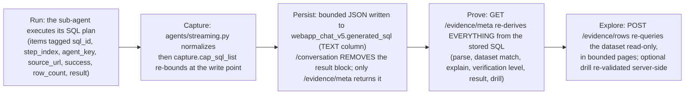
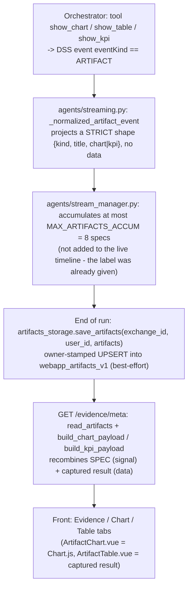

# Backend - Evidence Studio and artifacts

> Audience: backend developer. Last updated: 2026-06-19. Summary: how the backend
> re-derives, in a purely deterministic way (zero LLM), the "evidence" behind an agent answer (badge,
> sources, chips, explanation, captured result, drill, SQL) and reconstructs the artifacts (chart /
> table / kpi) while strictly separating signal from data.

Evidence Studio is the Evidence panel to the right of the chat. On the backend side, it never asks an LLM
to "justify" an answer: it re-derives everything, in a PURE and DETERMINISTIC way, from the single SQL
statement that the sub-agent stored. The stored SQL is the source of truth; at evidence time, nothing
new is written (with the exception of the artifact specs, persisted once at the end of the run). The
sources live under `python-lib/owismind/evidence/` (service, sql_parse, sql_explain, capture,
chart_payload, query_builders, whitelist, throttle) and `python-lib/owismind/storage/artifacts.py`.

## 1. The core principle: separate signal from data

The whole subsystem rests on a strict distinction:

- the SIGNAL is what the orchestrator REQUESTS or DECLARES: an `ARTIFACT` event carries only the SPEC
  (`kind`, `title`, and for a chart `{type, x, y[]}`); it NEVER carries the rows;
- the DATA is the real result, the `result` already captured on the stored `generated_sql` item, reused
  at read time via `/evidence/meta`.

Three concrete consequences for the backend:

- the Chart.js shaping (`{labels, datasets}`) is done server-side in trusted Python code, not
  by the agent ("the agent only says x/y", `chart_payload.py`): a mistyped column or a non-numeric
  cell degrades to an honest empty state (`{ok: false}`) rather than a broken chart;
- the client NEVER sends SQL: the editable chips travel as `{column, op, values}`, the locked chips
  as server-side re-derived ids, and the drill columns are re-derived from the stored SQL;
- an artifact costs a few hundred bytes per exchange (the data is never duplicated).

## 2. Evidence life cycle: Run -> Capture -> Persist -> Prove -> Explore

Step detail:

1. Run: each stored SQL item is tagged with `sql_id` (`s{step}q{n}`), `step_index`, `agent_key`,
   `source_url`, `success`, `row_count`, and opportunistically a captured `result`.
2. Capture: `capture.cap_sql_list` re-bounds EVERYTHING at the write point (it never trusts an
   upstream cap).
3. Persist: the bounded JSON is written to the `generated_sql` TEXT column of `webapp_chat_v5` (no
   schema migration). The `/conversation` read-back REMOVES the `result` block (the thread payload stays
   light); only `/evidence/meta` returns it.
4. Prove: `GET /evidence/meta` re-derives everything from the stored SQL.
5. Explore / drill: `POST /evidence/rows` re-queries the matched dataset read-only, in bounded
   pages; the optional `drill` filters down to the rows contributing to a group after re-validation.

> IN FLUX: the exact key of the tool span rows is NOT confirmed on the instance. Until this is verified
> against a real stored trace, the capture may be absent (`result_captured: false`). The
> panel stays useful (sources, chips, explanation, drill, SQL) but without a chart or captured result.
> This is the single most uncertain point in the whole area.

## 3. The `/evidence/*` endpoints

All three routes go through `_evidence_guard()` (`api/routes.py`) which, in this order, resolves
identity (401 `unauthenticated` otherwise), requires a configured storage (409 `storage_not_configured`
otherwise), bootstraps the chat table (500 `storage_unavailable` otherwise), then applies a per-user
token-bucket (429 `rate_limited` on flood). The throttle gate is intentionally placed AFTER the cheap
auth/config path.

| Endpoint | Method | Input | Output |
|---|---|---|---|
| `/evidence/meta` | GET | `exchange_id` | full descriptor (or degraded shape): `dataset`, `columns`, `chips`, `advanced`, `sql`, `source`, `sources`, `queries`, `verification`, `explanation`, `result`, `drilldown`, `artifacts` |
| `/evidence/rows` | POST | `{exchange_id, filters, kept_ids, include_advanced, page, sort, drill, table}` | `{rows, has_more, page}` |
| `/evidence/distinct` | GET | `exchange_id`, `column`, `exclude_id?` | `{values, truncated}` |

### 3.1 `GET /evidence/meta`

Owner-scoped: another user's exchange returns 404 (`exchange_not_found` is the only `EvidenceError`
that propagates as 404; any other one degrades the panel instead of failing). The client sends ONLY
`exchange_id`; table, connection, SQL and dataset matching are resolved server-side.

In degraded mode (parse impossible, no dataset matched), the response carries `available: false`, a `reason`
(stable code), the best-effort raw `sql`, and `verification: {level: "declared", result_captured: false}`.
In nominal mode (`evidence_meta`, `service.py`), the response adds the additive trust layer:
`source: {dataset, schema, table, url}`, `sources` (list of distinct datasets read, the front renders a
selector only if there is more than one entry), `queries` (one summary per stored item), `verification` (a
deterministic block), `explanation: {ok, steps}`, `result` (capture block) and `drilldown: {available, columns,
reason}`. The `chips` expose the LIVE casing of the schema (what `rows`/`distinct` will use).

It is the ROUTE, not the agent, that finally attaches the `artifacts`: for each chart, `a["data"] =
chart_payload.build_chart_payload(result_block, a["chart"])`; for each kpi,
`build_kpi_payload(...)`. Best-effort: a read failure degrades to `artifacts: []`, never a 500.
One observability log line per meta surfaces `available`, `reason`, `level`, `result_captured`,
`drill_available` and the number of `artifacts` (the verification level is the whole point of the trust
layer, so it must be greppable).

### 3.2 `POST /evidence/rows`

A bounded page (`PAGE_SIZE = 50`, `service.py`) rebuilt from STRUCTURED filters, validated
by `validate_evidence_rows_request`. The mechanics:

- locked chips (non-editable AND present in `kept_ids`): re-derived via `_locked_condition`;
- `filters` (editable chips): the column must resolve against the LIVE colmap, otherwise `invalid_filter_column`
  (400); the op is normalized to `=` (1 value) or `IN`;
- `include_advanced` + fragment present: the fragment is re-gated by `_advanced_condition`;
- `drill`: re-derived and re-validated by `_drill_conditions` (see section 6);
- optional `sort`, otherwise a deterministic ORDER BY on the first column of the schema;
- `LIMIT PAGE_SIZE+1` allows `has_more` to be computed without `COUNT(*)`.

> IN FLUX: `/evidence/rows` shows the CURRENT data of the dataset, not a snapshot. Only the
> rows of the captured `result` are "what the agent used". Furthermore, the default sort on the
> first column has an assumed v1 caveat: a non-sortable type fails (`query_failed`), and ties
> can repeat across OFFSET pages.

### 3.3 `GET /evidence/distinct`

Bounded distinct values of a column (the chip picker). `DISTINCT_LIMIT = 100` (`service.py`).
The picker shows the values WITHIN THE AGENT'S REMAINING SCOPE: the locked predicates and the advanced
fragment apply, but the chip being edited (`exclude_id`) NEVER filters itself out (a comparative
chip `>=`/`BETWEEN` must be able to widen beyond its own bound). `LIMIT DISTINCT_LIMIT+1`
yields the `truncated` flag. The `DISTINCT`+`LIMIT` runs inside a subquery and only the bounded result
is sorted (`build_distinct_query`), to avoid a full sort of all the distinct values on a
large table.

## 4. sql_parse + sql_explain: pure analysis, never raises

### 4.1 `sql_parse.parse_select(sql)`

The parse is BEST-EFFORT (a user decision that supersedes the strict-fidelity v1 rule): it never fails
because the query is "too complex". JOIN, GROUP BY, subqueries, CTE, set-ops all parse; the
goal is to recover the source tables and each WHERE predicate that maps onto them. `ok` is `False` only
when the text is not ONE single parseable statement: empty, longer than `MAX_SQL_CHARS = 20000`,
unknown characters, comments, multi-statement, not a SELECT/WITH, or unbalanced parentheses.

The returned shape is `{ok, reason, schema, table, tables, predicates, advanced}`, where each predicate
carries `{id, column, op, values, editable, binding, scope_tables}`. Key points to know:

- the in-house tokenizer rejects comments (`comment_unsupported`) and any unknown character
  (`tokenize_failed`); the offsets point into the ORIGINAL text to keep the exact spelling of the
  agent;
- the per-SELECT "scope" scoping attaches to each predicate a `binding` (the table that its qualifier
  resolves); `predicates_for_table` keeps only those that apply to the matched table (a self-join
  keeps both sides, the filter of another joined table is dropped);
- for a top-level set-op, only the FIRST arm is analyzed;
- `advanced` (the re-executable WHERE fragment) is produced only for a simple single-table SELECT (a
  fragment sliced from a join would reference other relations);
- `EDITABLE_OPS = ("=", "IN")`: only these ops are value-editable as parsed (the UI lets you edit
  any chip, which converts it into `=`/`IN`).

`validate_fragment(text)` is the FINAL DEFENSIVE GATE of a fragment before re-execution: no 2nd
statement, no banned word (`_BANNED_FRAGMENT_WORDS`: select/union/insert/update/delete/drop/.../set/
into/returning/lateral), no `pg_*` function (checked on bare AND quoted identifiers), no
backslash, balanced parentheses, length at most `MAX_FRAGMENT_CHARS = 2000`. The trust model
is explicit: security does NOT rest on naming but on the fact that the fragment is
agent-authored, re-validated on every request, and only appended to a bounded read-only SELECT on a
discovered dataset.

### 4.2 `sql_explain.explain_select(sql)`

Structured business explanation + deterministic completeness flags. This module NEVER RAISES: the whole
body is guarded and `explain_select` wraps `_explain` in a try/except returning
`_failed("explain_failed")`. The honesty principle is strict: anything that is not POSITIVELY
understood degrades a flag or produces an `opaque` step; a false explanation would be false evidence,
an under-stated explanation is merely less useful.

The returned shape is `{ok, reason, steps, where_complete, dropped_where, group_keys, single_source,
select_understood, has_set_op, has_recursive_cte, calc_resolved}`. The `kind` enum of the steps is frozen,
and the outputs are bounded (`MAX_STEPS = 15`, `MAX_PARAM_CHARS = 80`, `MAX_OPAQUE_CHARS = 120`). The
module REUSES the building blocks of `sql_parse` (tokenizer, `validate_fragment`, table reading) without
modifying `sql_parse` (whose contract is locked by its tests), and masks comments as length-preserving
spaces so that a commented SQL still explains.

A few anti-false-evidence subtleties to keep in mind:

- `single_source` requires exactly one real table occurrence AND no multi-ref/join scope (a
  self-join via CTE counts as multi);
- `calc_share` (share of total) is emitted only for exactly `SUM(x) / SUM(x) OVER ()` with a truly
  empty OVER; otherwise an honest ratio;
- `agg_filtered` (`SUM(CASE WHEN ... THEN x END)`): an `ELSE 0` is only neutral for SUM, not for
  AVG/MIN/MAX;
- `topn` requires a resolved ORDER BY; a LIMIT without a resolved ORDER BY becomes `limit_arbitrary` (an
  arbitrary sample, never worded as top-N);
- `group_keys`: only the GROUP BY keys with identity lineage to the source column (at the end of the
  CTE chain) are kept, and it is the SOURCE name (not the outer alias) that is returned, so that the drill
  filters the correct physical column.

## 5. capture.py: extraction + mirror caps (pure, no dataiku)

A PURE module (no dataiku/pandas import) so that each bound is testable outside DSS and so that
`storage.chat_v5` can import it without a cycle. Three responsibilities:

- `extract_result(outputs)`: OPPORTUNISTIC extraction of the exact rows of a tool span. Since the key of
  the rows is not confirmed on the instance, the candidate keys are probed in the order
  `_ROW_KEYS = ("rows", "records", "data", "result_rows", "values")`. The module accepts
  list-of-lists (columns via `_COLUMN_KEYS` or synthetic `col_1..col_n`) or list-of-dicts
  (columns = keys of the 1st dict, insertion order). ANY other shape returns `None` (honest absence,
  never an invention) and the downstream surfaces `result_captured: false`.
- `cap_result(result)`: MIRROR re-cap at the write point, NEVER trusts an upstream cap.
  Re-bounds rows/columns/cells + serialized budget. A shape that is not positively
  `{columns: list, rows: list-of-lists}` is dropped (`None`).
- `cap_sql_list(items)`: bounds the whole `generated_sql` list before persistence, and NEVER RAISES.
  In order: (1) re-cap of each `result` + structural bounds per item (`sql` truncated to
  `MAX_ITEM_SQL_CHARS = 20000` with a `sql_truncated` flag, tags truncated); (2) keeps the
  `MAX_SQL_ITEMS = 20` most recent items; (3) if the serialized list exceeds
  `MAX_PERSISTED_TEXT_CHARS = 262144`, removes `result` from the OLDEST one first, PRESERVING the
  longest the `result` of the last successful item (this is the evidence shown). The core keys (`_CORE_ITEM_KEYS`:
  `sql`, `success`, `row_count`, `sql_id`, `step_index`, `agent_key`, `source_url`) are NEVER
  removed.

The caps are a frozen contract: `MAX_RESULT_ROWS = 200`, `MAX_RESULT_COLS = 50`, `MAX_CELL_CHARS = 256`,
`MAX_RESULT_JSON_CHARS = 100000`. All the caps are STRUCTURAL (rows dropped, `truncated` flag
raised), never a text marker inside the JSON (which would corrupt decoding). `_normalize_cell` preserves
the `bool` type before `int` (a bool is a subclass of int) and stringifies nan/inf (which are not
valid JSON numbers). The operation is idempotent.

## 6. Trust levels, badge, drill: the pure service pipeline

The verification and drill helpers are PURE (no dataiku, unit-tested), in `service.py`.

### 6.1 Deterministic verification scale

`verification_level(explain, matched, mapped_count, where_complete)` computes a level on a frozen
scale. The UI badge can NEVER be green, and the dropped/unmapped elements are LISTED, never hidden.

| Level | Mechanical criterion |
|---|---|
| `declared` | parse fails or no dataset matched (agent claim only) |
| `source_identified` | matched but WHERE not evaluable (explain not ok), or nothing mapped without completeness |
| `scope_partial` | matched + at least 1 mapped predicate, broken completeness (drops listed) |
| `scope_exact` | each WHERE conjunct decomposed + single source + no set-op |
| `calc_decomposed` | `scope_exact` + SELECT calculation fully understood (nothing opaque) |

`result_captured` is ORTHOGONAL to the level (stored rows present or not); the UI badge maps the
pair level x capture. An absent or failing explainer can only LOWER the level: this is the
role of `safe_explain` (guarded import; if the module is absent or raises, returns an honest not-ok shape
that caps the verification at `source_identified` and makes the drill `not_supported`) and of
`normalize_explain` (a defensive adapter).

The WHERE completeness follows a frozen formula, `effective_where_complete = explain.where_complete AND
colmap_dropped == 0`. `colmap_dropped` counts the predicates that applied to the matched table but
DO NOT RESOLVE against the LIVE schema (each one silently widens the reconstructed scope, thus breaks
completeness whatever the explain says). `compute_verification` assembles the final block: `{level,
result_captured, dropped_predicates (exact count), dropped_display (bounded at MAX_DROPPED_DISPLAY = 10),
single_source, where_complete, select_understood}`.

### 6.2 Drill-down

`derive_drilldown(explain, colmap, where_complete)` offers the drill ONLY when it is provably
reliable: explain ok, no recursive CTE, no set-op, single source (a self-join does not qualify),
COMPLETE reconstructed WHERE, and at least one identity GROUP BY key resolved against the LIVE schema (live casing
returned). The `reason` is a stable refusal code: `not_supported`, `set_op`, `multi_source`,
`incomplete_where`, `no_group_keys`. Beyond `MAX_DRILL_CONDITIONS = 8` keys, the drill is refused
(`not_supported`) rather than silently truncated (a truncation would show a superset of the
group).

On the `/evidence/rows` side, `_drill_conditions` RE-DERIVES the drillable list from the stored SQL on each
call and only matches the client list against this server-side set. `build_drill_conditions` rejects
any column outside the set (`invalid_drill`, 400); a `value None` renders an `IS NULL`, otherwise a strict
equality. The exchange SQL is also re-bounded here (mirror of the validator). This bound at 8 is mirrored
by `security/validation.MAX_EVIDENCE_DRILL = 8` (defense in depth in case a future caller skipped the
validator).

## 7. chart_payload.py: Chart.js + KPI from the captured result

`build_chart_payload(result, chart_spec)` takes the `result` block of `/evidence/meta` and the `chart` dict
of the artifact (`{type, x, y[]}`), and returns either `{ok: True, labels, datasets: [{label, data}],
truncated}` (+ `label` for a pie), or an honest empty shape `{ok: False, reason}` where `reason` is
in `no_data`, `bad_spec`, `x_not_found`, `y_not_found`, `no_numeric`. The module NEVER RAISES (stdlib
only). Mechanics:

- empty state if `result` is not `captured`, or no columns/rows;
- CASE-INSENSITIVE column resolution by name to index (`_resolve`);
- `_to_number`: best-effort coercion. Numbers pass through; formatted strings (`'1 234,5'`,
  `'12.5%'`, `'€ 90'`, `'1,234.56'`) are parsed; the decimal comma and the thousands separator are
  reconciled (the rightmost of `,`/`.` is the decimal); nan/inf yield `None`. The cells are
  usually already raw numbers, the string path is a safety net;
- bounds (instance safety + readability): `MAX_POINTS = 200` (x values), `MAX_SLICES = 12` (beyond that,
  the tail is grouped into "Other"), `_LABEL_MAX_CHARS = 80`, `CHART_TYPES = ("line", "bar", "pie")`;
- pie: one slice per row on the first resolved y column, only strictly > 0 numeric values,
  descending sort, tail folded into "Other";
- line/bar: one dataset per y column, `None` leaves a gap; if no numeric value then
  `{ok: False, reason: "no_numeric"}`.

`build_kpi_payload(result, kpi_spec)`: the agent only names the `value` column (and optionally
`delta`/`delta_pct`); the numbers are read from the FIRST row by trusted code. Output
`{ok: True, label, value[, delta, delta_pct]}` or `{ok: False, reason}`. All this reshape is built
INSIDE the `/evidence/meta` route, not by the agent: this is the whole point of "the agent only says x/y".

## 8. query_builders, whitelist, throttle, read-only guards

### 8.1 query_builders

PURE SQL text builders (no dataiku). Contract: callers pass PRE-ESCAPED
fragments (values via `sql_value`, identifiers via `pg_identifier`) and integer bounds, never
raw user input. `render_predicate` receives both quoting functions as ARGUMENTS to stay
import-free and testable with stubs. `build_rows_query` enforces an ORDER BY (OFFSET pagination is
non-deterministic without it), normalizes the direction (anything but `DESC` becomes `ASC`), and
parenthesizes each condition so that a top-level OR in a fragment does not change the meaning of the AND
conjunction.

### 8.2 whitelist (auto-discovery, no admin whitelist)

`match_whitelist(table, schema, candidates)` returns the first candidate matching `(schema, table)`, or
`None`. There is NO admin whitelist to configure: the service auto-discovers the SQL datasets of the
webapp project and resolves each one to its PHYSICAL `(schema, table)`. The comparison is CASE-INSENSITIVE (the
unquoted PostgreSQL identifiers fold), and a schema missing on ONE SIDE is a wildcard (the agent's SQL
often writes the bare table name). Security rule: the callers build the executed reference
from the RETURNED candidate (its resolved physical schema/table), NEVER from the
parsed `(schema, table)`; the wildcard match is only safe under this rule.

On the service side, `_list_project_sql_datasets` keeps only the PostgreSQL-typed datasets
(`_SQL_DATASET_TYPES = {"PostgreSQL"}`), scoped to the own project. `_resolve_physical_table` takes the table
from `get_location_info()['info']` (metadata, without execution), with a fallback on the dataset settings API
(`params.table`/`params.schema`), and substitutes `${projectKey}`. The whole thing is in a process-wide
300s TTL cache: the lock guards ONLY the dict access, never the IO (the metadata round-trip is resolved OUTSIDE
the lock). DSS restarts the backend when the webapp config changes, which cold-starts the cache. Defensive cap
`_MAX_EVIDENCE_DATASETS = 300`.

### 8.3 throttle

Per-user token-bucket for the read-only routes. The pure core `take_token` is deterministic in `now`
(testable). Two separate buckets (separate dicts, same lock) prevent starvation between the Evidence
panel and the budget-status endpoint:

- **Evidence bucket** (`can_accept(user_id)`): `EVIDENCE_BUCKET_CAPACITY = 15`,
  `EVIDENCE_REFILL_PER_SEC = 10.0`. Guards `GET /evidence/meta`, `POST /evidence/rows`, and
  `GET /evidence/distinct`. Burst-tolerant (meta+rows = 2 tokens, a picker = 1, all human-paced)
  but blocks a sustained scripted flood.
- **Usage bucket** (`usage_can_accept(user_id)`): `USAGE_BUCKET_CAPACITY = 12`,
  `USAGE_REFILL_PER_SEC = 5.0`. Guards `GET /usage` (the budget-status endpoint). Independent of
  the Evidence bucket so an active Evidence session never starves the profile's budget refresh.

Both buckets evict idle entries after `_BUCKET_TTL_SECONDS = 300` to bound the in-process dict.

### 8.4 Read-only guards + statement_timeout

The Evidence execution runs on the matched dataset's OWN connection (`SQLExecutor2(dataset=...)`, via
`_evidence_executor`), NOT on the chat storage connection. The pre-queries
`_EVIDENCE_TIMEOUT_PRE_QUERIES` set `SET LOCAL statement_timeout TO '30000'` and `SET LOCAL
transaction_read_only TO on`. The `SET LOCAL` (not `SET`) is TRANSACTION-scoped: a pooled JDBC
connection can never carry these settings over to other workloads. `transaction_read_only` is defense
in depth: every query built here is already a bare SELECT, but a future regression fails loudly
instead of writing. The identifiers are validated by `pg_identifier` (regex + byte cap, raises
`ValueError`); the values by `sql_value` -> `toSQL(Constant(value), dialect=...)`; the bools are
routed to the bare keywords `true`/`false` (`_quote_value`), because the escaping of `Constant(bool)` is
not a documented behavior.

## 9. The artifact pipeline: ARTIFACT event -> table -> /evidence/meta

### 9.1 From event to persistence

1. The orchestrator calls a `show_chart` / `show_table` / `show_kpi` tool, which produces a DSS event
   with `eventKind == "ARTIFACT"`. The timeline whitelist drops its fields, so it is surfaced as a
   dedicated normalized `artifact` event by `agents/streaming.py`.
2. `_normalized_artifact_event` projects onto a STRICT shape: `kind` in {chart, table, kpi}, `title`
   bounded, chart `{type, x, y[]}` (y bounded at 8), kpi `{value[, delta, delta_pct]}`. The data is NOT there
   (the front reuses the `generated_sql` `result` via `/evidence/meta`, only the SPEC travels). Pure, never
   raises.
3. The worker (`agents/stream_manager.py`) accumulates at most `MAX_ARTIFACTS_ACCUM = 8` specs in a
   list, NOT added to the live timeline list (the live label was already given by the ARTIFACT
   `agent_event`).
4. At the end of the run, best-effort: `artifacts_storage.save_artifacts(exchange_id, user_id, artifacts)`. A
   failure can never affect the on-screen response.

> IN FLUX: `show_kpi` appears on the storage, streaming and chart_payload sides, but the EMISSION on the agent
> side (`dataiku-agents/`, being edited live) has not been verified within the backend scope.

### 9.2 Storage (`storage/artifacts.py`)

The table is `webapp_artifacts_v1` (`ARTIFACTS_V1_LOGICAL`). Its DDL: `exchange_id TEXT PRIMARY KEY`,
`user_id TEXT`, `artifacts TEXT`, `created_at TIMESTAMP NOT NULL DEFAULT now()`.

`save_artifacts` does `_sanitize` -> JSON -> owner-stamped UPSERT (`INSERT ... ON CONFLICT (exchange_id)
DO UPDATE`). The non-negotiable backend rules are respected: parameterized direct SQL (`sql_value`,
no f-string around values), `COMMIT` after the write (`post_queries=["COMMIT"]`), owner-scoping at
read time, best-effort everywhere (a failure is logged on one line and swallowed). The UPSERT (write) cannot
be read-only, but the same `statement_timeout 30000` bounds this tiny single-row write. Bounds:
`MAX_ARTIFACTS = 8`, `MAX_ARTIFACTS_JSON_CHARS = 16000`, `MAX_Y_SERIES = 8`.

`read_artifacts` is owner-scoped (`user_id` in the WHERE), read-only + statement_timeout. The lookup is
a PRIMARY KEY hit on `exchange_id` (O(1) index access, never a full scan). It never raises: an absent table,
corrupt JSON, or executor error degrade to an empty list. `_sanitize` is applied both
on WRITE AND on READ (defense in depth): it drops the unknown, bounds the strings, and keeps at most
`MAX_ARTIFACTS` well-formed specs. Pure, never raises.

### 9.3 Final reshape in /evidence/meta

As seen in section 3.1, the route reads the specs and attaches to them `a["data"]`, computed from the `result_block` of
meta. The front renders the Evidence / Chart / Table tabs. This is the culmination of the signal / data
separation: the stored spec (the SIGNAL) and the captured `result` (the DATA) are recombined at read time, in
trusted code.

## 10. Connections to the rest of the system

- Chat storage: the evidence reads `webapp_chat_v5.generated_sql` owner-scoped via
  `build_exchange_sql_query` (always `user_id` in the WHERE). The capture (`capture.cap_sql_list`) is
  called at write time by `storage.chat_v5`.
- Agents / streaming: `agents/streaming.py` (ARTIFACT event normalization) and
  `agents/stream_manager.py` (accumulation, spec persistence, and replay of `read_artifacts` in the
  screen context).
- Screen awareness: `agents/context.build_screen_state` (`MAX_SCREEN_ARTIFACTS = 4`) builds an
  "ON SCREEN NOW" block from the rendered artifacts so that the agent knows what the user sees (backend
  gate, panel open).
- Clickable source: `source_url` is stamped by the orchestrator on each captured SQL item (core key),
  propagated additively up to `meta.source.url` via `source_url_for_run` / `with_source_urls`, and rendered on the
  front as `<a target="_blank">`. Only the single-source case attaches the url; the per-dataset
  multi-source mapping is deferred.

## 11. Known limitations and points in flux

- `result` capture: the key of the tool span rows is not confirmed on the instance (the most
  uncertain point). An absent capture yields `result_captured: false`; the panel stays useful without a chart or
  result.
- Multi-source: only the first arm of a UNION/INTERSECT/EXCEPT is analyzed; aggregations on joins
  (self-joins included) are explained but never drillable; window values (rank, running totals)
  are explained but not re-verifiable.
- Re-execution: `/evidence/rows` shows TODAY's data; only the captured rows are
  "what the agent used".
- Historical exchanges (pre-v2): no tags or `result`; the evidence degrades gracefully.
- Legacy doc: `docs/evidence-trust-layer.md` still references v2 paths (`webapp_chat_v4`,
  the old orchestrator file); rely on the CODE for the exact names (`webapp_chat_v5`).

## See also

- [Backend - overview and structure](01-overview-and-structure.md) - where the `evidence/` and `storage/` sub-packages fit in.
- [Backend - API reference](02-api-reference.md) - full signatures of the `/evidence/*` endpoints and error codes.
- [Backend - streaming and run life cycle](03-streaming-and-runs.md) - the worker that accumulates and persists the artifact specs at the end of the run.
- [Backend - storage and data model](04-storage-and-data-model.md) - `webapp_chat_v5`, `webapp_artifacts_v1` and SQL naming.
- [Backend - security and validation](06-security-and-validation.md) - payload validation, SQL safety, mirrored read-only guards.
- [Understanding the results (Evidence)](../01-user-guide/03-understanding-evidence.md) - the same panel seen from the user side.
- [ADR-0008 - Evidence trust layer and artifacts](../08-decisions/0008-evidence-trust-layer-et-artifacts.md) - the decision to separate signal and data.
- [The orchestrator](../05-agents/02-orchestrator.md) - emitter of the ARTIFACT events and the `source_url`.
