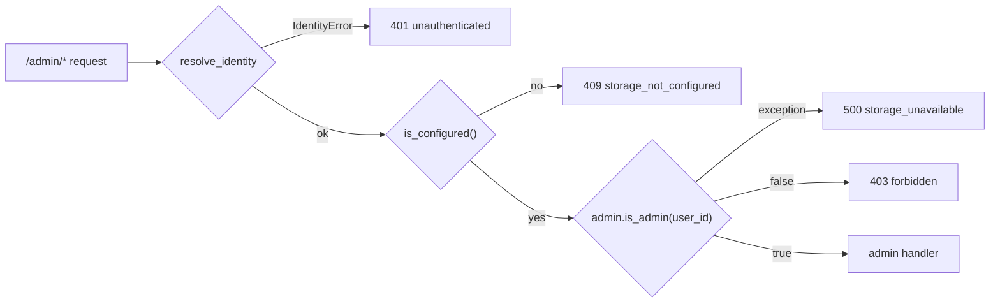

# Backend - security and validation

> Audience: backend developer, security. Last updated: 2026-06-18. Summary: code-level detail of identity
> resolution, payload validation, admin gating (403), log hygiene, and defense in depth (sanitize on read AND
> on write) that implement the security model summarized by the architecture.

This document drops one level below [the security model (architecture)](../02-architecture/04-security-model.md):
where the latter lays out the trust boundaries and invariants, this page shows the CODE that enforces them,
file by file, in `Plugin/owismind/python-lib/owismind/security/` and at the route enforcement points. The
scope is deliberately cross-cutting: identity, validation, guards, SQL safety at point of use, and log hygiene.

## 1. Posture in one sentence

The trust boundary is the browser: everything coming from it (JSON body, query params, application headers) is
untrusted and must be validated AND bounded before reaching SQL. Two invariants structure everything else:

1. The caller's identity is NEVER read from the request body: it is resolved server-side from the DSS
   authentication headers (`security/identity.py`).
2. The frontend only sends LOGICAL data (`session_id`, `message`, an opaque agent key, a context window size,
   an optional `parent_exchange_id`, a feedback payload, a `mode`, `webapp_lang`, `screen_context`). It never
   chooses table, column, connection, query, or raw `agent_id` (`security/validation.py`).

## 2. Identity resolution: `security/identity.py`

### 2.1 Two distinct identities

Two identities must be distinguished, since they are often conflated (detail in
[02-architecture/04-security-model.md](../02-architecture/04-security-model.md)):

- the logged-in DSS user (the caller), resolved from the headers, used ONLY for application-level scoping;
- the backend run-as-user, the DSS identity under which the WebApp actually runs, which executes SQL and calls
  the agents.

Consequence: `resolve_identity` does not grant the user any SQL power; it provides the `user_id` key on which
all owner-scope filters rely.

### 2.2 `resolve_identity(headers)`

`resolve_identity(headers)` returns the dict `{user_id, display_name, groups}`. The core of resolution is
`_auth_info(headers)`, which calls `dataiku.api_client().get_auth_info_from_browser_headers(dict(headers))`
with a FRESH DSS API client per call (a lightweight, thread-safe object under concurrent Flask workers). Header
values can carry credentials: they are NEVER logged.

The output contract:

| Key | Origin | Notes |
|---|---|---|
| `user_id` | `info.get("authIdentifier")` (DSS login, e.g. `said.chaoui`) | This is the stable owner-scoping key. |
| `groups` | `info.get("groups") or []` | Normalized to a list if scalar (`groups = [groups]`). |
| `display_name` | `derive_display_name(user_id)` | DSS returns no `displayName` (lesson L011), hence the derivation. |

Any failure raises `IdentityError`, mapped to `401 unauthenticated` in EVERY route:

- the DSS call fails: `IdentityError("auth_lookup_failed")` (the warning logs the exception, not the headers);
- no `authIdentifier`: `IdentityError("no_auth_identifier")` (the warning logs the KEY NAMES present,
  `sorted(info.keys())`, never their values, to diagnose an unexpected shape).

### 2.3 `derive_display_name` and `derive_full_name`

DSS does not provide a displayable name, but logins follow the `firstname.lastname` convention. Two PURE
derivations (no DSS call) produce readable defaults:

- `derive_display_name(login)`: takes the segment BEFORE the first `.`, title-cased per hyphen group.
  `said.chaoui -> Said`, `jean-marc.dupont -> Jean-Marc`, `admin -> Admin`. This is the `display_name` returned
  by `/me`.
- `derive_full_name(login)`: title-cases ALL dot/hyphen segments. `said.chaoui -> Said Chaoui`. Used by
  `/chat/start` to build the agent context suffix (`derive_full_name(identity["user_id"])`).

These names are only DEFAULTS. `admin.record_user` does a `COALESCE` on `display_name` at upsert, so that a
future "set my display name" feature (which does not yet exist) would see its custom name preserved rather than
overwritten on the user's next visit.

### 2.4 Identity cache (a safety measure, not a flaw)

`/chat/poll` re-resolves the caller on every poll (about 2 Hz per live chat), and each resolution is a
synchronous DSS round-trip that holds a worker thread. A per-process cache with a short TTL collapses these
lookups:

- key = SHA-256 fingerprint of the authentication cookie (`_identity_cache_key`); a missing or unreadable cookie
  makes the request non-cacheable (resolution is then done on every call);
- TTL `_AUTH_TTL_SECONDS = 5.0`; only SUCCESSFUL lookups are cached;
- opportunistic eviction bounded by `_AUTH_CACHE_MAX = 512`.

A different cookie produces a different fingerprint: the cache can never return another user's identity. The
cache (like all in-memory state) assumes a SINGLE-PROCESS backend, an assumption to lock down at deployment time
(see [02-architecture/04-security-model.md](../02-architecture/04-security-model.md)).

## 3. Payload validation: `security/validation.py` (pure, no DSS)

This module is PURE: it does not touch DSS, does no SQL, and is testable with `node:test`/`unittest` off the
instance. Every function validates SHAPE and BOUNDS, then raises `ValidationError(code)` or returns a
sanitized/clamped value. The `code` is a STABLE, machine-readable string, rendered as-is to the frontend, never
an internal detail.

```python
class ValidationError(ValueError):
    def __init__(self, code, message=None):
        self.code = code
        super().__init__(message or code)
```

### 3.1 Global bounds

| Constant | Value | Role |
|---|---|---|
| `MAX_MESSAGE_LENGTH` | `8000` | Maximum length of a user message. |
| `MAX_SESSION_ID_LENGTH` | `128` | Bound on `session_id` and any `exchange_id`. |
| `MAX_AGENT_KEY_LENGTH` | `64` | Bound on the opaque agent key (`ag_` + 12 hex = 15 chars in practice). |

### 3.2 Chat turn validation

- `validate_message(payload)`: requires a dict body (`invalid_payload`), a str `message` (`missing_message`),
  `<= MAX_MESSAGE_LENGTH` (`message_too_long`), non-empty after `strip()` (`empty_message`). Returns the
  sanitized message.
- `validate_chat_request(payload)`: validates the core `{session_id, message}` (`missing_session_id`,
  `empty_session_id`, `session_id_too_long`, then `validate_message`).
- `validate_chat_start_request(payload)`: stacks `agent_key` on top (`missing_agent_key`, `empty_agent_key`,
  `agent_key_too_long`). Key point: this validator ONLY bounds the key. Whether it corresponds to a real and
  active agent is enforced SEPARATELY, server-side, by `settings.resolve_enabled_agent` (see section 4).

### 3.3 Clamps that NEVER raise

Three optional inputs must never break a send: an invalid value is silently brought back to a safe default.

| Helper | Behavior |
|---|---|
| `validate_history_limit(value)` | Clamp `[MIN_HISTORY_LIMIT=10, MAX_HISTORY_LIMIT=50]`, default `DEFAULT_HISTORY_LIMIT=20`. Counts messages, never conversations. |
| `validate_conversations_limit(value)` | Clamp `[MIN_CONV_PAGE=1, MAX_CONV_PAGE=60]`, default `DEFAULT_CONV_PAGE=30`. |
| `validate_optional_exchange_id(value)` | Non-empty str `<= 128`, otherwise `None` (= start a new branch at the root). |

The client-supplied `parent_exchange_id` goes through this last helper: a malformed id degrades to `None`, and
since every read stays owner-scoped, a forged id can at worst only match the caller's OWN rows.

### 3.4 Feedback: the trap of bool being a subtype of int

`validate_feedback(payload)` returns `(exchange_id, rating, reasons, comment)`. Three safety points:

- `rating` must be `0`, `1`, or `None`. The bool is EXPLICITLY REJECTED first
  (`isinstance(rating, bool)` -> `invalid_rating`), because `True`/`False` are subclasses of `int` in Python and
  would otherwise pass the `rating not in (0, 1, None)` test.
- `reasons` is FILTERED against the whitelist `ALLOWED_FEEDBACK_REASONS = ("incorrect", "incomplete",
  "off_topic", "other")` (unknown values are silently dropped), then capped at `MAX_FEEDBACK_REASONS = 8`.
- `comment` is truncated to `MAX_FEEDBACK_COMMENT_CHARS = 2000`.

### 3.5 Evidence validation (shape and bounds only)

The frontend NEVER sends SQL to the `/evidence/*` routes: only an `exchange_id`, STRUCTURED filters
`{column, op, values}`, locked chip ids, a page, and a sort. The validation here only checks shape and bounds;
column EXISTENCE is re-validated by the service against the dataset's LIVE schema (detail in
[04-backend/05-evidence-and-artifacts.md](05-evidence-and-artifacts.md)).

`validate_evidence_rows_request(payload)` returns
`(exchange_id, filters, kept_ids, include_advanced, page, sort, drill, table)`. The bounds:

| Element | Bound / rule | Error code |
|---|---|---|
| `filters` | list `<= MAX_EVIDENCE_FILTERS = 20`, each `op` in `EVIDENCE_FILTER_OPS = ("=", "IN")` | `invalid_filters`, `invalid_filter_op` |
| `values` | list `1..MAX_EVIDENCE_IN_VALUES = 50` (exactly 1 for `"="`) | `invalid_filter_values` |
| filter value | `_validate_evidence_value`: bool allowed, NaN/Inf rejected, str/number `<= 500` | `invalid_filter_value`, `filter_value_too_long` |
| `kept_ids` | list `<= MAX_EVIDENCE_KEPT_IDS = 100`, integers `>= 0`, bool rejected | `invalid_kept_ids` |
| `page` | CLAMPED `[0, MAX_EVIDENCE_PAGE = 20]` (never raises; bounds the OFFSET cost) | (none) |
| `sort` | `{column, dir}`; malformed degrades to `None` | (none) |
| `drill` | list `<= MAX_EVIDENCE_DRILL = 8`; a malformed drill RAISES | `invalid_drill` |
| `table` | optional source selector `<= MAX_EVIDENCE_TABLE_CHARS = 256`; malformed degrades to `None` | (none) |

Two design choices deserve particular attention:

- `_validate_evidence_value` accepts the bool FIRST (boolean columns are legitimate filter values), unlike the
  feedback `rating`. It does, however, reject NaN/Inf (`not math.isfinite`) because they would render as UNquoted
  SQL tokens downstream. It also bounds `str(v)` for numbers: an arbitrary-precision integer JSON literal
  (Python) must not be inlined into the executed statement and LOGGED by DSS.
- A malformed `drill` RAISES (`invalid_drill`), whereas a malformed `sort` degrades to `None`. This is a SCOPE
  HONESTY choice: a silently dropped drill would return the UN-drilled (wider) page while the UI believes it is
  showing a single group, which would lie about the displayed scope.

The shape helpers `validate_required_exchange_id` (`invalid_exchange_id`) and `validate_evidence_column`
(`invalid_filter_column`, bound `MAX_EVIDENCE_COLUMN_CHARS = 128`) serve as building blocks for the two above.

### 3.6 `_sanitize_screen_context` (defined in `routes.py`)

`_sanitize_screen_context(raw)` bounds the "what the user is looking at" pointer. A `raw` that is not a dict or
lacks `open` returns `None`. The `exchange_id` must be `str`/`int` (bool excluded via
`not isinstance(exch, (str, int)) or isinstance(exch, bool)`), otherwise `None`. The output is
`{open: True, exchange_id: str(exch)[:128], active_tab: tab if in _SCREEN_TABS else None}`, with
`_SCREEN_TABS = ("evidence", "chart", "table")`. The worker then reads that exchange's artifacts in
OWNER-SCOPE: a forged id can only reveal the caller's own data.

## 4. Agent whitelist: server-side enforcement

The frontend only receives and sends an OPAQUE logical key. The key is computed by `_logical_key(project_key,
agent_id)` (in `routes.py`): `"ag_" + sha1(f"{project_key}:{agent_id}").hexdigest()[:12]`, stable (re-saving the
selection keeps the same key) and opaque (the frontend never sees the raw `agent_id`). The validation bound is
`MAX_AGENT_KEY_LENGTH = 64`.

The enforcement point of the chat path is `settings.resolve_enabled_agent(agent_key)`, called in `/chat/start`:
it returns `{logical_key, project_key, agent_id, label}` ONLY if the key matches a still-active agent, otherwise
`None`. In the route, `if not agent` -> `404 agent_not_enabled` and the run is NEVER launched. The resolved
`agent_id` stays server-side end to end (passed to the worker, never surfaced to the frontend, which only
receives the opaque `run_id`). The front-end router guard (UI) is purely cosmetic: the real enforcement is this
server resolver.

On the admin write side, the whitelist is INVIOLABLE: `POST /admin/agents` re-validates each requested agent
against the LIVE DSS listings (project visible AND agent actually present, via `discovery.list_project_keys()`
and `discovery.list_project_agents(project_key)`) before persisting. An `agent_id` forged from the frontend can
never be persisted; a defensive cap `MAX_ENABLED_AGENTS = 50` bounds the selection. The detail of these routes
lives in [04-backend/02-api-reference.md](02-api-reference.md) and the decision in
[ADR-0004](../08-decisions/0004-whitelist-agents-serveur.md).

## 5. Admin gating (403) and anti-lockout

### 5.1 The `_admin_guard()` guard

All `/admin/*` routes share `_admin_guard()`, which chains three checks and short-circuits at the first failure:



`is_admin(user_id)` reads the persistent flag in the users table (`webapp_users_v1`). The check is separate from
the run-as: the APPLICATION admin (table flag) is distinct from DSS rights. A non-DSS-admin user can be an admin
of the app, and vice versa. Security therefore does not rely on per-user DSS rights but on this server gating
plus SQL owner-scoping.

### 5.2 Bootstrap "first to open = admin", POST only

`/me` accepts `GET` and `POST`, but the side effect (record the user and elect the first admin) only happens on
POST. A `GET`/prefetch/scanner can neither create a user row nor win the election. The frontend emits POST once
at init.

`record_user(identity)` (in `storage/admin.py`) does, in ONE transaction:

- a transactional advisory lock `pg_advisory_xact_lock(_BOOTSTRAP_LOCK_KEY = 0x4F57494D)` that SERIALIZES the
  election across concurrent connections (released at COMMIT);
- an idempotent UPSERT (`ON CONFLICT (user_id) DO UPDATE` with `COALESCE` on `display_name` to preserve a future
  custom name);
- a guarded UPDATE `SET is_admin = true ... WHERE NOT EXISTS (SELECT 1 ... WHERE is_admin = true)` that only
  promotes if no admin yet exists.

Without the advisory lock, two truly concurrent first users could each see "no admin" (READ COMMITTED isolation)
and both become admin: the lock closes that race.

> IN FLUX (operational, not a bug): this is a TOFU (Trust On First Use) model. The first to open the app AFTER
> configuration becomes admin: at deployment, make sure that this is indeed the deploying admin. See
> [06-operations/01-installation-and-configuration.md](../06-operations/01-installation-and-configuration.md).

### 5.3 Anti-lockout

`POST /admin/users/set-admin` refuses to remove the LAST remaining admin:
`if not value and admin.is_admin(target) and admin.count_admins() <= 1` -> `400 cannot_remove_last_admin`.
You can therefore never lock yourself out of the admin space by mistake.

## 6. Defense in depth: sanitize on read AND on write

The validation at the gateway (section 3) is only one layer. SQL safety relies on central helpers
(`storage/sql_config.py`) applied at POINT OF USE, on write as well as on read, so that every value is escaped
and every identifier controlled, even if an input were to get past the gateway.

| Helper | Role | Safety |
|---|---|---|
| `sql_value(value)` | `toSQL(Constant(value), dialect=POSTGRES)` | Escapes every user value before inlining. |
| `nullable_value(value)` | Bare `NULL` for `None`/empty, otherwise `sql_value` | Stores a real NULL rather than an empty string. |
| `bool_literal(value)` | Bare `"true"`/`"false"`, for a bool already type-checked server-side | Avoids depending on the escaping of `Constant(bool)`. |
| `pg_identifier(name)` | Validates against `_IDENTIFIER_RE = ^[A-Za-z_][A-Za-z0-9_-]*$` AND rejects `> 63` bytes, then double-quotes | Built ONLY from constants + the validated prefix; never from user input. |

The `> 63` byte rejection (`_MAX_IDENTIFIER_BYTES`) is a defense against PostgreSQL silent truncation
(NAMEDATALEN): without it, two logical names could collide on the same physical name. The admin prefix is
bounded by `_PREFIX_RE = ^[A-Za-z0-9_-]{1,16}$`; an invalid/too-long prefix is IGNORED (a warning memoized once)
and surfaced to the admin via `storage_status()`.

The frontend never chooses table, connection, or query: `physical_table(logical)` and `full_table(logical)`
only compose names from LOGICAL constants (`webapp_chat_v5`, `webapp_users_v1`, `webapp_settings_v1`,
`webapp_usage_monthly_v1`), the connection comes from the admin dropdown (never hardcoded), and `new_executor()`
RAISES if no connection is configured rather than guessing. There is NO generic SQL route. The explicit COMMIT
discipline (`post_queries=["COMMIT"]`) and the absence of destructive DDL round out the picture (detail in
[04-backend/04-storage-and-data-model.md](04-storage-and-data-model.md) and
[ADR-0003](../08-decisions/0003-sql-direct-sans-flow.md)).

Beyond writes, the ONLY surface that re-executes SQL on READ (Evidence) does so in forced read-only mode
(`SET LOCAL statement_timeout TO '30000'`, `SET LOCAL transaction_read_only TO on`), bounded and with a WHERE
fragment re-validated on every query. This chain of defenses is documented in
[04-backend/05-evidence-and-artifacts.md](05-evidence-and-artifacts.md).

DSS discovery (listing projects/agents for the admin) is STRICTLY read-only and bounded (`MAX_PROJECTS = 500`,
`MAX_AGENTS = 200`, an agent = any LLM whose id starts with `AGENT_ID_PREFIX = "agent:"`). No `set_*`/`save`/`delete`
method is ever called: only reads plus agent execution.

## 7. Log hygiene and error codes

Log hygiene is a hard rule: the CONTENT of user messages and agent responses is NEVER logged.

- `/chat/start` logs `user_id`, `session_id`, `agent_key`, `msg_len` (the message LENGTH), never its content. The
  code comment underlines it: this is the only entry point where a body could leak, and it stays content-free.
- The blueprint-scoped hooks `_log_request_start` / `_log_request_end` only trace META (method, path, status,
  duration in ms), for `/owismind-api/*` only. Being blueprint-scoped, they do not fire on DSS internal
  health-pings.
- Credential-bearing header values are never logged (`identity.py`). On an unexpected auth shape, only the KEY
  NAMES (`sorted(info.keys())`) are logged, never the values.
- `/ping` is intentionally MINIMAL: it does NOT expose the storage config (connection, project key, table
  names), because it is reachable WITHOUT authentication. The resolved config is only readable by an admin via
  `/admin/storage` (`storage_status()`).
- On an agent failure, no internal (agent, SQL, connection) is disclosed to the client: the response degrades to
  a stable code (`agent_unavailable`, `storage_unavailable`, etc.).

Application error codes are STABLE, machine-readable strings, mapped to an HTTP status. The frontend translates
them into i18n messages. A few representative examples:

| Code | Status | Meaning |
|---|---|---|
| `unauthenticated` | 401 | Identity not resolved from the headers. |
| `forbidden` | 403 | Admin route called by a non-admin (`_admin_guard` gating). |
| `storage_not_configured` | 409 | No SQL connection chosen (except `/ping` and `/me`). |
| `agent_not_enabled` | 404 | Forged or disabled agent key (whitelist resolver). |
| `invalid_rating` / `invalid_drill` / `invalid_filter_value` | 400 | Payload validation (stable codes from `validation.py`). |
| `cannot_remove_last_admin` | 400 | Admin anti-lockout. |

Owner-scoped 404s (unknown run vs belonging to another, another user's exchange) never reveal WHICH case
occurred, which avoids an existence oracle.

## 8. In-flux points to be aware of

> IN FLUX: the SINGLE-PROCESS assumption underpins all in-memory state (identity cache, runs, rate-limit
> buckets, Evidence caches). In multi-process, the cache would stay correct (per-process) but the concurrency
> cap would be multiplied and the cross-process poll would return 404. The first-admin election, however, stays
> protected by the PostgreSQL advisory lock (cross-connection), not by process state. To be forced to 1 process
> at deployment (see [02-architecture/04-security-model.md](../02-architecture/04-security-model.md)).

> IN FLUX: several already-hardened invariants (bool rejection in rating/kept_ids, drill that raises, NaN/Inf
> rejected, admin gating) are not yet all covered by unit tests. The agent layer (`dataiku-agents/`) that hosts
> the honesty firewall and the anti-injection robustness lives outside this scope and is edited live.

## See also

- [Security model (architecture)](../02-architecture/04-security-model.md) - the framework this page details at the code level.
- [Backend - API reference](02-api-reference.md) - all endpoints, their payloads and error codes.
- [Backend - streaming and run lifecycle](03-streaming-and-runs.md) - admission, concurrency caps, owner-scoping of runs.
- [Backend - storage and data model](04-storage-and-data-model.md) - SQL naming, safety helpers, owner-scoping in the database.
- [Backend - Evidence Studio and artifacts](05-evidence-and-artifacts.md) - the chain of defenses around the read-only SELECT re-execution.
- [ADR-0004 - Server-side agent whitelist](../08-decisions/0004-whitelist-agents-serveur.md) - the decision behind the opaque logical key.
- [ADR-0003 - Direct SQL, no Flow at runtime](../08-decisions/0003-sql-direct-sans-flow.md) - the SQL safety posture.
