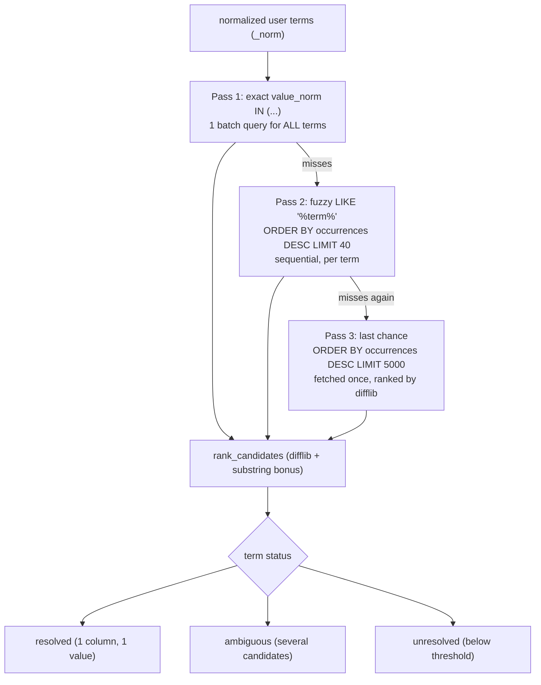

# The revenue expert sub-agent (SalesDrive_revenue_expert)

> Audience: agent engineer. Last updated: 2026-06-18. Summary: how the revenue sub-agent
> turns a business question into a sourced figure, via the UNDERSTAND -> RESOLVE -> QUERY ->
> RENDER pipeline, read-only inline grounding on `DRIVE_Revenues_value_index`, assistive disambiguation,
> and the frozen contracts (the `semantic-model-query` span) on which the webapp and Evidence depend.

## 1. What the sub-agent is and its identifiers

The revenue expert sub-agent is a **LangGraph Code Agent** (Python 3.11 env), re-pasted by hand from
the repository, which is the source of truth. Its file is
`dataiku-agents/agents/SalesDrive_revenue_expert.py`; its DSS name is `SalesDrive_revenue_expert`; its
id is `agent:bHrWLyOL`. The entry class required by the DSS contract is `class MyLLM(BaseLLM)`
(import `from dataiku.llm.python import BaseLLM`) and the runtime entry point is the method
`process_stream(self, query, settings, trace)`. The class must NOT be renamed: `MyLLM` is the
Code Agent contract.

The sub-agent imports only the stdlib, `dataiku` and `langgraph`: no import from the OWIsMind plugin. It is
a self-contained file that is pasted as-is into DSS.

It is **dataset-agnostic**: you point it at a PROFILE dataset and a VALUE INDEX dataset, and it
becomes the expert of that dataset. The configuration at the top of the file pins that target:

| Constant (CONFIG) | Value | Role |
|---|---|---|
| `PROFILE_DATASET` | `"DRIVE_Revenues_profile"` | the profile, the "business brain" built design-time |
| `VALUE_INDEX_DATASET` | `"DRIVE_Revenues_value_index"` | the catalog of values queried for grounding |
| `TARGET_DATASET` | `""` | optional override; default = `dataset_name` from the profile |
| `SQL_ENGINE` | `"semantic_tool"` | default engine (delegates the SQL to the semantic tool) |
| `FALLBACK_TO_DIRECT` | `True` | fallback to the direct engine on TECHNICAL failure only |
| `SUBAGENT_LLM_HEADLINE` | `False` | no LLM headline from the sub-agent (the orchestrator writes the analysis) |
| `DEFAULT_MODE` | `"eco"` | default mode when no mode is injected |

### Per-mode model

The LLM Mesh ids per mode (to be matched against the instance's LLM Mesh connection) are defined by
`LLM_BY_MODE = {"eco": GEMINI_FLASH_LITE_ID, "medium": GEMINI_FLASH_ID, "high": SONNET_ID}`. The orchestrator
propagates the mode by injecting a `MODE:` token into the system context, parsed on the sub-agent side by
`forced_mode(context)` (regex `\bMODE:\s*(eco|medium|high)\b`). In `high` mode, the entire sub-agent stack
runs on Sonnet. The helper `pick_subagent_llm(mode)` resolves the turn's model. The response language is
likewise imposed by the orchestrator via `forced_language(context)` (token `USER LANGUAGE:\s*(fr|en)`):
it is authoritative because the orchestrator knows the real language of the user's message, whereas the
sub-agent only sees a self-contained task (often written in English).

> IN FLUX: the ids `GEMINI_FLASH_LITE_ID`, `GEMINI_FLASH_ID` and `SONNET_ID` must correspond to
> ids actually exposed by the LLM Mesh connection `LLM-7064-revforecast`. A wrong id breaks the
> corresponding mode: to be checked on the instance. The detail of the per-mode model lives in
> [06-models-prompts-and-llm-mesh.md](06-models-prompts-and-llm-mesh.md).

## 2. The pipeline in brief

The sub-agent is a **linear** LangGraph `StateGraph`: `START -> understand -> resolve -> query ->
render -> END`. The typed state is `ExpertState(TypedDict)`. Because the graph is linear (no parallel
write), it uses no reducers. Each step can short-circuit to `END` via conditional edges built by the
helper `route(next_node)`, which tests `state.get("done")`: as soon as a step sets `done: True`
(out-of-scope, clarification request, "about data" answer, error), the graph stops cleanly without
moving to the following steps.

`process_stream` retrieves the project, extracts the instruction and the context (`_extract_input`), loads the
profile (TTL cache `PROFILE_TTL_SECONDS = 600`), resolves the mode, compiles the graph and streams it in
`stream_mode="custom"` with `config={"recursion_limit": 12}`. Live events are emitted in each SYNC node
via LangGraph's `get_stream_writer()`.

The canonical diagram of this loop (and of the orchestrator's) lives in
[01-agent-system-overview.md](01-agent-system-overview.md). Here, we detail the responsibility of each
step.

| Step | Node | Responsibility | Typical output |
|---|---|---|---|
| UNDERSTAND | `n_understand` | classify the question into ONE JSON object (intent, terms, scope) | `u` (understanding) or terminal branch |
| RESOLVE | `n_resolve` | ground the user's terms onto real values + disambiguation policy | exact filters, deferred terms, or clarification |
| QUERY | `n_query` | compose the grounded question then write+execute the SQL via the tool | `semantic-model-query` spans + result |
| RENDER | `n_render` | format the answer BY CODE (scope, table, headline, notes) | `AGENT_RESULT` + streamed text |

## 3. UNDERSTAND step: forced JSON extraction

Responsibility: turn the question into ONE JSON object describing the intent, without answering and without
writing SQL.

The step makes a single LLM call, with `with_json_output` **FORCED** (method `_call_json_llm`). The JSON
schema (`build_understand_schema`) anchors the enums on the profile (intents, scenario values, axes), and the
system prompt (`build_understand_prompt`) is GENERATED from the profile: metrics, scenarios, axes,
synonyms, indexed columns. The result is then validated and degraded **deterministically against the
profile** by `validate_understanding`, never against hardcoded business values. The output fields
include `scope`, `language`, `intent`, `original_intent`, `metric`, `scenarios`, `period`, `periods`,
`group_by`, `list_column`, `top_n`, `order`, `terms` and `clarification`.

Forcing the JSON is not a comfort detail. The comment in `_call_json_llm` explains it:
UNDERSTAND is a deterministic extraction (scope / intent / terms), not a reasoning task.
Forcing the schema disables the model's reasoning FOR THIS call only, which gives a clean and
fast parse instead of a long "thinking" pass that would return prose the parser cannot
read. Reasoning stays active where it truly helps (the orchestrator's routing, the verified
headline). The method makes 2 attempts: native JSON mode, then prompt-only. The rule that follows is
general to the agent layer: `with_json_output` is forced on UNDERSTAND and NEVER set on
the orchestrator, because it disables reasoning in DSS 14. This decision is formalized in
[../08-decisions/0007-json-output-force-sur-understand.md](../08-decisions/0007-json-output-force-sur-understand.md).

The known intents are frozen in `KNOWN_INTENTS`: `total`, `breakdown`, `top_n`, `share_of_total`,
`compare_scenarios`, `compare_periods`, `trend`, `list_values`, `count_distinct`, `about_data`, `custom`.
The `original_intent` field keeps the intent classified BEFORE any degradation, for observability and
for the transparency note if a requested comparison could not be built.

> IN FLUX: the `lookup` intent was REMOVED on 2026-06-18. It is no longer in `KNOWN_INTENTS`, and all the
> attribute-reading code (`build_lookup_filter`, `extract_lookup_rows`, `_lookup_rows`,
> `Profile.match_attribute` / `attribute_columns` / `live_columns`) was deleted from the sub-agent. The
> reference to `lookup` still found in `agents/README.md` is stale doc. Its
> replacement, the `attribute_lookup` tool, was wired on 2026-06-18 (board decision) on the ORCHESTRATOR
> side, as a built-in tool (and NOT in the sub-agent, which stays unchanged and touches no frozen
> `KNOWN_*` contract). The sub-agent no longer does simple attribute reads: that role moves to the orchestrator.
> The tool is described in [04-tools-and-semantic-model.md](04-tools-and-semantic-model.md) and its wiring
> on the orchestrator side in [02-orchestrator.md](02-orchestrator.md).

UNDERSTAND also carries three terminal branches, handled directly in the node without going further
in the graph: `out_of_scope` (deterministic text), `clarification` (short question rendered as-is)
and `about_data` (answer built from the profile by `build_about_answer`, ZERO SQL and ZERO
LLM). Each emits its `AGENT_RESULT` then sets `done: True`.

## 4. RESOLVE step: inline grounding, not a tool

Responsibility: ground ("grounder") the user's business terms against the catalog of real values,
then apply the disambiguation policy.

Key point: **grounding is NOT a DSS tool call**. It is read-only inline SQL executed
by `dataiku.SQLExecutor2` directly on the dataset `DRIVE_Revenues_value_index`, via the method
`_resolve_terms(self, profile, base_terms, trace)`. The event label `resolve_filter_value` emitted at this
moment is an EVENT NAME for the timeline, not a tool; it belongs to `KNOWN_TOOL_NAMES` on the events side
but corresponds to no `tool.run(...)`.

The `value_index` has the schema `{column_name, value, value_norm, occurrences}` (about 3.6 k rows):
each distinct value of each groundable text column, plus its normalized form. The normalization
`value_norm` is FROZEN and shared with the sub-agent's `_norm` function (NFKD, ascii, lowercase, collapsed
spaces), so that the join key on the SQL side and the Python side is identical. The dataset MUST live on
the source SQL connection (`SQL_owi`) for SQL grounding to work; its design-time build is
detailed in [05-flow-recipes-and-grounding.md](05-flow-recipes-and-grounding.md).

### Three-pass algorithm

1. **Pass 1, exact `value_norm IN`**: a single batch query
   `SELECT column_name, value, value_norm, occurrences FROM <index> WHERE value_norm IN (...) LIMIT
   <fetch_cap>` for all normalized terms at once.
2. **Pass 2, fuzzy `LIKE`**: only for the terms missed in pass 1. Per term,
   `WHERE value_norm LIKE '%term%' ESCAPE '\' ORDER BY occurrences DESC LIMIT FUZZY_CANDIDATES_LIMIT` (40).
   This pass is **sequential** by safety choice: concurrent access to `SQLExecutor2` is not
   guaranteed thread-safe and the gain would be marginal (in general 0 to 2 terms unresolved after the
   exact pass). Instance safety prevails.
3. **Pass 3, "last chance"**: a bounded slice `ORDER BY occurrences DESC LIMIT LAST_CHANCE_SCAN_LIMIT`
   (5000), fetched AT MOST ONCE per request (term-independent) then reused, ranked by `difflib`
   to catch large typos.

Execution is kept read-only by `SQL_PRE_QUERIES = ["SET LOCAL statement_timeout TO '30000'", "SET
LOCAL transaction_read_only TO on"]`. Reading goes through `_run_sql`, which prefers `query_to_iter`
(streaming, without pandas) with a fallback to `query_to_df`.

The ranking of candidates (`rank_candidates`) combines `difflib.SequenceMatcher`, a bonus for
substrings, then sorts by similarity and occurrences. The thresholds are `FUZZY_MIN_RATIO = 0.62` (below which
the term is `unresolved`) and, for a "strong" fuzzy resolution, score >= 0.9 with a single candidate. A term
qualified in the question (`VALUE (Column)`, e.g. `IPL (Product)`) is detected by `parse_qualified_term`:
the preferred column then filters the candidates.

### Assistive disambiguation

After grounding, the node applies two sorting functions, both 100% deterministic:

- `refine_ambiguous` resolves simple `ambiguous` statuses: the preferred column of a qualified term
  filters; the exact-value preference evicts normalization collisions; a single distinct
  value gives an auto-pick by `column_priority` (profile override `ambiguity_priority`, otherwise
  `-distinct_count`, that is, the most specific column); several values but a strictly
  dominant column give a pin WITH disclosure of the others (`alt_columns`).
- `defer_multicolumn_offer_terms` decides, for what remains `ambiguous`, between ASKING the user and
  DEFERRING to the Semantic Model. The decision is taken PURELY from the number of distinct candidate
  columns, never from hardcoded column names. An offer term whose candidates span >= 2 distinct
  columns is reclassified `deferred` (the Semantic Model will decide the offer hierarchy and disclose the
  chosen level); a single-column ambiguity (two distinct entities in a single column, for example
  two customers) stays `ambiguous` and gives a real clarification request. The return is
  `(resolutions, deferred)`, where `deferred = [{raw, columns, samples}]`.

This is the heart of the **assistive** stance: the sub-agent ASSISTS, it does not DICTATE. The regression that
motivated this choice: `column_priority`, with its `-distinct_count` fallback, was pinning `sirano_product =
'EVPL'`. But BUDGET rows carry no `sirano_product`, which produced a budget = 0. The rule
therefore became: for an ambiguous offer term, the sub-agent NO LONGER pins a column; it marks the term
and lets the Sonnet model (which carries the semantic layer and the offer hierarchy) resolve. This
decision is formalized in [../08-decisions/0011-sous-agent-assistif.md](../08-decisions/0011-sous-agent-assistif.md).

If, after these two passes, some single-column ambiguity or some unresolved term remains, the node emits a
clarification (`build_clarification`) and ends. Otherwise, it threads the deferred terms
(`offer_terms_for_model`) into the state, so that QUERY passes them to the Semantic Model.

## 5. QUERY step: compose then delegate the SQL

Responsibility: produce the SQL and execute it. The node works on a COPY of the understanding because it
can downgrade the structured intent to `custom` on several fallback paths. It emits the event labels
`run_sql` (block) and `dataset_sql_query` (tool), both purely decorative for the timeline.

Two engines coexist, driven by `SQL_ENGINE`.

### `semantic_tool` engine (default)

The sub-agent COMPOSES a maximally grounded NL question with `build_semantic_question`, then passes it
to the DSS tool `revenue_semantic_query` (`v4oqA6R`) which WRITES AND EXECUTES the SQL. It is the only real DSS tool
called at runtime in v3; it is documented in detail in
[04-tools-and-semantic-model.md](04-tools-and-semantic-model.md).

`build_semantic_question` is 100% deterministic: the sub-agent's LLM never writes this question.
It carries everything the upstream layers earned, structured in parts announced verbatim:

- `USER QUESTION (this is the source of truth - answer THIS): "..."`: the user's question is the truth.
- `EXPECTED SHAPE (guidance, use your judgment): ...`: a shape hint derived from the intent.
- `HELPER FINDINGS - ... They are HINTS to ASSIST you, NOT orders ...`: the confident values grouped
  by column (`=` or `IN`), with their exact spellings from the catalog.
- `AMBIGUOUS OFFER TERM ...`: for values with `alt_columns` AND for deferred terms, with the
  explicit instruction not to reuse a pinned column and to "never default to sirano_product".
- `SCENARIO (guidance): ...` and `PERIOD: ...`: default scenario and time window.

The structure translates the assistive stance even into the text contract: each hint is announced as
an aid, never as an order, and the Semantic Model keeps the final word.

The extraction of the tool's return is done by `extract_semantic_payload`, a defensive walker because the tool
runs in Agent mode (multi-message transcript: reasoning, schema exploration, probe queries,
final answer). Two choices handle this noise: the ANSWER is selected by key priority (`answer` /
`output_text` first, then `completion`, `text`, `result`) and, at equal priority, the LAST occurrence
wins (the final message, never the preamble); the tabular RESULT and `row_count` likewise keep the
LAST occurrence, because probe query results precede the final result. The output has the
shape `{"sqls": [str], "result": {...}|None, "answer": str|None, "row_count": int|None, "shape_keys":
[str]}`.

### `direct` engine (technical fallback)

The direct engine activates only if `FALLBACK_TO_DIRECT = True` and on a TECHNICAL failure (not an empty
result, which is a valid answer). The sub-agent then builds its own read-only SQL: deterministic templates
per intent (`build_sql`) or, for the `custom` long-tail, a guarded LLM (prompt `SQLGEN_PROMPT`,
verifier `guard_custom_sql`, EXPLAIN dry-run and up to 2 repairs, `MAX_CUSTOM_SQL_ATTEMPTS = 3`).
`guard_custom_sql` is defense in depth: a single SELECT, whitelisted table, no DML/DDL, no
system tables, forced LIMIT; literals are whitened before the keyword scan, the form `FROM"x"`
without space is covered, and `WITH RECURSIVE` is tolerated.

## 6. RENDER step: everything is formatted by code

Responsibility: format the answer. Everything is formatted BY CODE, which makes the rendering reproducible and
verifiable.

- The `[Scope]` prefix (`build_scope_note`) writes an explicit scenario / period / entity /
  currency line: a money answer must never be a bare number. The currency is derived from the column name
  (`metric_unit` infers `EUR` from `amount_eur`), without any profile config. This note is deterministic
  and number-free, so it never affects any verified headline.
- The markdown table is built by `build_table`, the cells formatted by `format_cell` and
  `format_number` (driven by the profile).
- The headline is deterministic by default (`build_fallback_headline`). The flag `SUBAGENT_LLM_HEADLINE =
  False` disables the sub-agent's LLM headline, because it is the orchestrator that writes the user-facing
  analysis. If you enable it (stand-alone use, without orchestrator), the LLM headline is verified figure
  by figure (`verify_headline` + `allowed_number_set`): a single unverifiable number causes the headline to
  be rejected and falls back to the deterministic headline.
- The transparency notes are produced by `build_disclosure_notes` (multi-level offer) and by
  `DEGRADED_COMPARISON_NOTE` when a requested comparison could not be built.
- The node emits the final `AGENT_RESULT`.

## 7. Frozen contracts: the `semantic-model-query` span and the `AGENT_RESULT`

The webapp and Evidence depend on frozen contracts that you may only enrich, never rename.
An anti-drift test keeps the consistency between the orchestrator's registry and the sub-agent's ids.

> IN FLUX: the comment in the code (section 12) still cites this test under the old name
> `tests/test_orchestrator_v3.py`. The file actually present in the repository is
> `dataiku-agents/tests/test_langgraph_agents.py` (later rename, code comment to refresh).

The key contracts:

| Contract | Definition | Why frozen |
|---|---|---|
| `KNOWN_BLOCK_IDS` | `resolve`, `run_sql`, `format_output`, `clarify_user`, `out_of_scope_msg`, `about_data` | timeline labels, must match the orchestrator registry |
| `KNOWN_TOOL_NAMES` | `resolve_filter_value`, `dataset_sql_query` | EVENT NAMES (not tools), same |
| span `semantic-model-query` | one span PER SQL executed, `outputs = {sql, success, row_count}` + `{rows, columns}` on the successful SQL | Evidence turns these spans into SQL items |
| `AGENT_RESULT` | a single, final one: `{status, language, intent, originalIntent, resolvedFilters, sqlCount, rowCount, attempts}` | machine status (never shown to the user) |

The `semantic-model-query` span carries an important operational subtlety. When the semantic tool
generates several SQL (for example a query then a repaired variant), the RESULT is attached to the
LAST SQL (`i == last_i`), because the webapp and Evidence take the last successful SQL. Without this, the
active item would carry a span with no result and the chart could not render. This is the fix for the
multi-SQL case.

The possible statuses of the `AGENT_RESULT` are `ready`, `need_clarification`, `out_of_scope`, `no_data` and
`error`. The general shape of an event is `{"chunk": {"type": "event", "eventKind": kind, "eventData":
data}}`; the streamed text is `{"chunk": {"text": "..."}}`.

## 8. Concurrency and caches: what must never be broken

The Code Agent instantiates `MyLLM` ONCE per process and may call `process_stream` CONCURRENTLY. The
consequence is a firm rule: all `__init__` caches must be keyed by a stable identifier
(dataset name, tool id), and there must never be per-request state on `self`. The resolved mode and
the semantic tool's id travel in the graph STATE, not on the instance. The resolution of the semantic tool's
input key (`pick_semantic_input_key`) is for example cached by tool id (`self._semantic_keys`),
which stays correct even with a different tool per mode.

The helper `run_parallel`, bounded by `SUBAGENT_MAX_PARALLEL = 4`, exists as a drop-in mechanism for
future independent tools. Today, grounding stays deliberately sequential for instance
safety (see section 4).

## 9. Connection to the rest of the system

- **Orchestrator**: it calls the sub-agent as a tool (`ask_revenue_expert`), injects `USER
  LANGUAGE:` and `MODE:` into the context, writes the final user-facing analysis (hence `SUBAGENT_LLM_HEADLINE =
  False`) and presents the sub-agent's `[Scope]` line in prose. See
  [02-orchestrator.md](02-orchestrator.md) for the collaboration contract.
- **Evidence / webapp**: the sub-agent's trace is appended to the orchestrator's trace; on the backend side,
  the `semantic-model-query` spans are turned into Evidence SQL items (with a frozen `sql_id` and a
  `source_url` if configured). The detail of this transformation lives in
  [../04-backend/05-evidence-and-artifacts.md](../04-backend/05-evidence-and-artifacts.md).
- **Profile and value index**: built design-time by the Flow recipes, consumed live (the agent reads
  the datasets on every turn, there is no need to re-paste the code when a recipe re-runs). See
  [05-flow-recipes-and-grounding.md](05-flow-recipes-and-grounding.md).
- **Semantic tool and aligned model**: the SQL belongs to the Semantic Model (Sonnet) that the tool
  `v4oqA6R` queries. See [04-tools-and-semantic-model.md](04-tools-and-semantic-model.md).

## See also
- [01-agent-system-overview.md](01-agent-system-overview.md) - the agent loop (canonical diagram) and the central invariant.
- [02-orchestrator.md](02-orchestrator.md) - the orchestrator that calls this sub-agent and writes the final analysis.
- [04-tools-and-semantic-model.md](04-tools-and-semantic-model.md) - the `revenue_semantic_query` tool (`v4oqA6R`), `attribute_lookup`, and the aligned Semantic Model.
- [05-flow-recipes-and-grounding.md](05-flow-recipes-and-grounding.md) - design-time build of the profile and the value index, inline grounding.
- [06-models-prompts-and-llm-mesh.md](06-models-prompts-and-llm-mesh.md) - per-mode model, native LLM Mesh calls, control tokens.
- [../08-decisions/0007-json-output-force-sur-understand.md](../08-decisions/0007-json-output-force-sur-understand.md) - ADR: `with_json_output` forced on UNDERSTAND.
- [../08-decisions/0011-sous-agent-assistif.md](../08-decisions/0011-sous-agent-assistif.md) - ADR: assistive sub-agent (does not impose a column for an ambiguous term).
- [../04-backend/05-evidence-and-artifacts.md](../04-backend/05-evidence-and-artifacts.md) - how the `semantic-model-query` spans become Evidence items.
