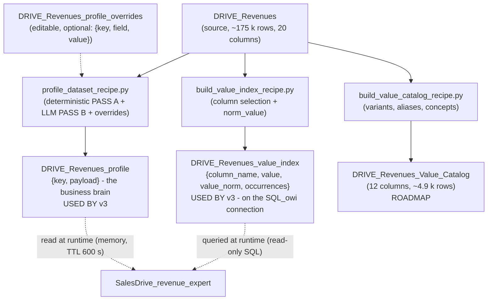

# Flow recipes and building the expertise

> Audience: agents engineer, data engineer. Last updated: 2026-06-19. Summary: how the Dataiku Flow
> builds, at DESIGN-TIME, via three Python recipes, the artifacts (profile + value index, plus a value
> catalog on the roadmap) that turn the sub-agent into an expert on a dataset, and how those artifacts are
> then consumed at runtime for grounding.

The business expertise of the `SalesDrive_revenue_expert` sub-agent (`agent:bHrWLyOL`) is NOT hard-coded in
the agent (rule P3: no business value in the logic). It is BUILT in the Dataiku Flow by three Python recipes
that run at DESIGN-TIME, then simply READ at runtime. This is how you can point the same sub-agent at another
dataset (a PROFILE dataset and a VALUE INDEX dataset) and watch it become an expert on that dataset, without
touching the agent code.

This document covers the DESIGN-TIME side (the recipes) and the contract of each artifact. The RUNTIME side
(the UNDERSTAND -> RESOLVE -> QUERY -> RENDER loop that consumes these artifacts) is detailed in
[The revenue expert sub-agent](03-revenue-expert-subagent.md). The SQL tool that writes the analytical query
is in [Agent tools and Semantic Model](04-tools-and-semantic-model.md).

## 1. Why DESIGN-TIME: pandas upstream, SQL at runtime

The three recipes live in `dataiku-agents/recipes/`. They run in the DSS Flow, where pandas is allowed and
where loading the dataset into memory is acceptable. This is the structuring opposition of the system:

- DESIGN-TIME (recipes): pandas, `get_dataframe()`, one expensive but one-time LLM call to profile the dataset.
- RUNTIME (sub-agent in chat): direct read-only SQL via `SQLExecutor2`, zero LLM profiling cost per
  question, no raw row sent to the model.

The WHY is explicit in the header of `profile_dataset_recipe.py`: the LLM profile costs once but is
amortized across every future question. At runtime, the sub-agent only has to READ the profile (in memory) and
query the value index (in SQL). Fundamental confidentiality contract: the recipes send the Mesh model ONLY
AGGREGATED metadata (schema, stats, enumerated low-cardinality values, a few samples), NEVER the raw rows.

## 2. The build Flow



Summary of the three recipes:

| Recipe | Output | Output schema | v3 status |
|---|---|---|---|
| `profile_dataset_recipe.py` | `DRIVE_Revenues_profile` | `{key, payload}` (v1 contract) | WIRED (the sub-agent's business brain) |
| `build_value_index_recipe.py` | `DRIVE_Revenues_value_index` | `{column_name, value, value_norm, occurrences}` | WIRED (sub-agent grounding) |
| `build_value_catalog_recipe.py` | `DRIVE_Revenues_Value_Catalog` | 12 columns (variants, aliases) | WIRED as `attribute_lookup` alias fallback (see 5) |

## 3. Recipe 1: `profile_dataset_recipe.py`, the business brain

### 3.1 Flow wiring

- INPUT 1 (required): the dataset to profile (e.g. `DRIVE_Revenues`).
- INPUT 2 (optional): an EDITABLE human overrides dataset, schema `{key, field, value}`.
- OUTPUT 1 (required): the profile dataset, schema `{key, payload}` (e.g. `DRIVE_Revenues_profile`).

The DSS entry point is `main()`: it reads `recipe.get_inputs_as_datasets()` and
`recipe.get_outputs_as_datasets()[0]`. The 2nd input is only read if it exists
(`overrides_ds = inputs[1] if len(inputs) > 1 else None`).

### 3.2 Two passes: A deterministic, B LLM

PASS A (zero LLM, pandas), function `profile_dataframe(df, schema_columns)`. It computes for each
column: DSS type, `null_pct`, `distinct_count`, verbatim enumerated values if low cardinality,
samples otherwise, numeric/temporal stats, and temporal-format detection. Highlights:

- Enumeration vs samples: if `0 < distinct <= ENUM_MAX_VALUES` (50) and no time format, the column
  becomes `is_enum=True` and keeps the full `{v, n}` list sorted by `value_counts()`. Otherwise, it keeps
  `SAMPLES_N` (12) truncated samples. A TIME column is never an enumeration: listing 30 months
  as "allowed values" would pollute the UNDERSTAND prompt and the SQL map for nothing.
- PHYSICAL date detection takes priority: a real pandas datetime or a `datetime.date`/`Timestamp` object
  is profiled as `format="date"` EVEN IF the DSS type or the string samples say otherwise. The
  code comment recalls the context: in DSS, a PostgreSQL `date` column profiled as a string
  broke `LEFT(col, 10)`; the agent is now cast-safe, but the profile must tell the truth about the type.
- Temporal-format detection: `detect_time_format(dss_type, sample_values)` returns one of `TIME_FORMATS`
  (`date | yyyy_mm_dd_str | yyyy_mm_str | yyyymm_int | year_int`). Pure and defensive.
- Deterministic election of the time column: candidates named first (rank 0 via `looks_like_time_name`,
  rank 1 otherwise), sort, first wins. PASS B can override this election.
- Default role: `default_role(...)` = deterministic fallback when the LLM is absent or silent (time /
  measure for numeric / free_text if long / identifier if near-unique or name ending in `_id` / dimension otherwise).

PASS B (LLM via Mesh), function `run_enrichment(...)`. It calls the `ENRICH_LLM_ID` model (current value
`openai:LLM-7064-revforecast:vertex_ai/claude-opus-4-7`, changed from Gemini 2.5 Pro during the 2026-06-18
simplify session) with 2 attempts, via the NATIVE Mesh completion API
(`project.get_llm(ENRICH_LLM_ID).new_completion()`, `.with_message(..., role=...)`, `.execute()`). The
`ENRICH_PROMPT` system prompt enforces a SINGLE JSON object, with no markdown fences: EN/FR descriptions, grain, metrics,
`default_metric`, scenario, time, and per column role/synonyms/display_column. The user input, built
by `build_enrichment_input(...)`, is COMPACT and aggregated (row count, detected time column, and per column:
type/distinct/nulls + enum values or 8 samples + stats). No raw row.

Deterministic validation of the LLM output: `validate_enrichment(parsed, column_names)` NEVER raises and
degrades field by field. Unknown columns rejected, `agg` must be in `KNOWN_AGGS`, `role` in
`KNOWN_ROLES`, `format` in `KNOWN_FORMATS`, metrics referencing an absent column rejected, etc. The
`default_metric` falls back to the first valid metric if the given name does not exist. Guarantee: the LLM cannot
break the contract; everything it wrote is flagged `llm_generated: true` to signal to humans that
it must be reviewed.

The scenario (in the sense of versions of the same measure: actuals/budget/forecast) is handled specially. The prompt
explains that mixing its values in a SUM double-counts, so if such a column exists it must be
declared and the most factual value(s) chosen as `default_values`. At merge time, the field
`scenario` receives `{column, values (all the real values of the column), default_values (validated
intersection or the 1st)}` and the column receives `role="scenario"`.

### 3.3 The NON-NEGOTIABLE principle: human overrides always win

`apply_overrides(dataset_payload, column_payloads, override_rows)` applies the `{key, field, value}` rows
IN PLACE, AFTER the LLM pass (comment in `main()`: "Human overrides ALWAYS win (applied last)"):

- `key == "__dataset__"` writes at the table level.
- `key` = known column name writes the field AND flags `human_override = True`.
- Unknown keys/fields ignored, never fatal.
- `parse_override_value(raw)` parses as JSON if possible (`'["a","b"]'`), otherwise trimmed raw string.

This is the mechanism that produces QUALITY: you create an editable dataset `DRIVE_Revenues_profile_overrides`
`{key, field, value}`, you add it as the 2nd input, you re-run, and there you set the default scenario (ACTUALS),
the metric currency, the display pairs, the synonyms. Because the overrides are applied LAST,
they SURVIVE re-runs: a re-profiling regenerates PASS A + PASS B, but the human corrections are
re-applied on top each time. This is what makes the refresh fearless (see 6). Additional free
signal: column descriptions already entered in the DSS UI (the `comment` field) are
recovered as `description_en` when the field is empty.

### 3.4 The output contract: PROFILE CONTRACT v1 (FROZEN)

The profile dataset is a list of `{key: str, payload: str(JSON)}` rows, with `PROFILE_VERSION = 1`. The
final write produces one `__dataset__` row (table-level) plus one row per column, each
`json.dumps(..., ensure_ascii=False, default=str)`.

`__dataset__` row (table-level):

```
{profile_version, dataset_name, generated_at, row_count,
 description_en, description_fr, grain,
 default_metric, metrics: [{name, agg, column, format, unit?, label_fr, label_en, description}],
 scenario: {column, values, default_values} | null,
 time: {column, format, min, max} | null,
 notes: [str]}
```

`<column>` row (column-level):

```
{name, dss_type, role, description_en, description_fr, synonyms,
 null_pct, distinct_count, is_enum, values: [{v, n}], samples,
 stats, display_column, groupable, indexed, llm_generated, human_override?}
```

`time.format` is one of `date | yyyy_mm_dd_str | yyyy_mm_str | yyyymm_int | year_int`. This contract is FROZEN
(the frozen-contracts rule, on the `dataiku-agents/` side): the webapp and Evidence depend on it, you NEVER
RENAME a field in it, you only ADD.

### 3.5 Runtime consumption

The sub-agent reads this contract via the `Profile` class ("In-memory view of the profile dataset (contract
v1)"). Loading goes through `_get_profile()`, which reads `PROFILE_DATASET = "DRIVE_Revenues_profile"` without
pandas (via `iter_tuples`, fallback `get_dataframe`), then `parse_profile_rows(rows)` reconstructs the
`__dataset__` plus the columns (invalid JSON rows ignored; `None` if `__dataset__` is missing = unusable
profile). The cache is a simple in-process TTL: `PROFILE_TTL_SECONDS = 600`.

Key accessors: `metrics`/`metric(name)`/`default_metric` (feed UNDERSTAND and RENDER);
`scenario`/`time` (drive the SQL filters via `period_predicate`); `groupable_columns()` (valid breakdown
axes); `match_column(raw)` (resolves a user/LLM designation into a canonical column name via
exact / case-and-space insensitive / synonyms); `column_priority(name)` (disambiguation priority).

Currency derived from the column NAME (no profile config): `metric_unit(metric)` returns the display unit of the
metric: its explicit `unit`, otherwise a currency symbol INFERRED from the amount column name via
`_CURRENCY_BY_CODE = {"eur": "€", "usd": "$", "gbp": "£", "jpy": "¥", "chf": "CHF"}` and a boundary regex
`(^|[_-])eur($|[_-])`. So `amount_eur -> €` with no profile config at all. Renaming the amount column therefore
changes the displayed currency: this is a side effect to be aware of.

> IN FLUX: the `indexed` flag. The recipe ALWAYS writes `indexed=False` (in `profile_dataframe`) and none
> of the three recipes ever sets it to `True`. On the runtime side, `Profile.indexed_columns()` filters on
> `c.get("indexed")` and `_resolve_terms` logs an explicit WARNING when there is no indexed column
> ("value resolution: profile has NO indexed columns; candidate filtering disabled"). The code then degrades
> gracefully (all columns become candidates). To enable filtering by indexed column, you must
> set `indexed=true` via a human OVERRIDE on the desired columns (the only documented path to
> set this field to true outside the LLM). It remains to be confirmed whether this is a deliberate opt-in choice or a gap.

## 4. Recipe 2: `build_value_index_recipe.py`, grounding by exact value

### 4.1 Role and wiring

The recipe builds the "value index": every distinct value of every groundable text column, with its
normalized form. The sub-agent queries it at runtime (read-only SQL) to resolve the business terms that
users type ("algerie telecom", "halys", "ipl") into EXACT cell values and their column. The WHY:
text-to-SQL is sensitive to case and accents; grounding is what prevents silent empty results.

- INPUT 1 (required): the dataset to index (e.g. `DRIVE_Revenues`).
- OUTPUT 1 (required): the index dataset (e.g. `DRIVE_Revenues_value_index`).

> IN FLUX (deployment trap #1): the output MUST be created ON THE SQL CONNECTION of the source dataset
> (`SQL_owi`), so that the sub-agent can query it in SQL. If the value index is not SQL,
> `_resolve_terms` raises "value index dataset is not SQL".

### 4.2 Output schema (FROZEN v1)

```
column_name  STRING   the source column of this value
value        STRING   the EXACT cell value, verbatim
value_norm   STRING   normalized form (lowercase, accents removed, spaces collapsed) = match key
occurrences  BIGINT   number of rows with this value in the source
```

The column order is written explicitly by the recipe
(`pd.DataFrame(rows, columns=["column_name", "value", "value_norm", "occurrences"])`). Observed volume: ~3.6 k
rows.

### 4.3 Deterministic selection of the columns to index

`should_index_column(name, dss_type, distinct_count, row_count, avg_len)` indexes the columns whose value a user
might NAME. Skips:

| Case | Threshold | Reason |
|---|---|---|
| Numeric or date | `_NUMERIC_DSS_TYPES` / `_DATE_DSS_TYPES` | You do not ground a number or a date by value |
| Too few / too many distincts | `distinct == 0` or `> MAX_VALUES_PER_COLUMN` (20000) | Nothing to index, or too many to disambiguate (filter on a coarser column) |
| Free text | `avg_len > FREE_TEXT_AVG_LEN` (120) | Free text, not a value to match |
| Long near-unique id | `distinct/rows >= ID_UNIQUENESS_RATIO` (0.95) AND `row_count > 1000` AND `avg_len > 24` | Long unique ids; short codes (carrier codes) stay indexed |

Manual overrides: `INCLUDE_COLUMNS` / `EXCLUDE_COLUMNS`, applied first. The `build_index_rows` function
then runs `value_counts()` on the cleaned string version of each retained column and emits one row per
value, skipping `occurrences < MIN_OCCURRENCES` (1) or `len(value) > MAX_VALUE_CHARS` (200), capped at
`MAX_VALUES_PER_COLUMN`.

### 4.4 The SHARED and FROZEN normalization (the match key)

`norm_value(value)` is IDENTICAL in both recipes (`profile_dataset_recipe.py` and
`build_value_index_recipe.py`) and in the agent resolver (`_norm`). Algorithm: NFKD, encode ascii
ignore, decode, then `re.sub(r"\s+", " ", strip().lower())`. A test verifies that the two recipes produce
the SAME output ("FROZEN contract shared by both recipes + the agent"). If you change this normalization on one
side without the other, grounding breaks silently: that is why it is FROZEN.

Not to be confused: `build_value_catalog_recipe.py` has its own normalization (`norm`) that ALSO REMOVES
punctuation. This is consistent because the catalog is a separate artifact (roadmap) with its own match
logic. Do not confuse it with the frozen `norm_value` of the value index.

### 4.5 Runtime consumption (RESOLVE)

Grounding is NOT a tool: it is inline read-only SQL on the value index, in the method
`_resolve_terms(profile, base_terms, trace)`. Mechanics:

1. Resolves the SQL table of the index via `get_location_info().info.quotedResolvedTableName` (raises if the index is
   not SQL).
2. Pass 1 (normalized exact, ONE query for all terms): `SELECT column_name, value, value_norm,
   occurrences FROM <index> WHERE value_norm IN (...) LIMIT N`, literals quoted via `_sql_quote_literal`.
3. Pass 2 (fuzzy/substring, SEQUENTIAL) for unmatched terms: `... WHERE value_norm LIKE %s ESCAPE
   '\' ORDER BY occurrences DESC LIMIT FUZZY_CANDIDATES_LIMIT` (40). Sequential for instance safety
   (`SQLExecutor2` concurrent not guaranteed thread-safe, marginal gain).
4. Last chance: a TERM-INDEPENDENT slice `ORDER BY occurrences DESC LIMIT LAST_CHANCE_SCAN_LIMIT`
   (5000), fetched AT MOST ONCE per query and reused, for terms with large typos.
5. Ranking by difflib similarity, then disambiguation policy.

SQL execution goes through `_run_sql` in strict read-only mode: `SQL_PRE_QUERIES = ["SET LOCAL statement_timeout
TO '30000'", "SET LOCAL transaction_read_only TO on"]`.

## 5. Recipe 3: `build_value_catalog_recipe.py`, the rich catalog (ROADMAP)

### 5.1 Status

The value catalog is built by the recipe and is NOT the grounding path of the v3 sub-agent (which
grounds on the value index). However, `attribute_lookup` uses it as an **alias fallback**: when no
match is found in `DRIVE_Revenues` AND no specific attribute is requested, `_alias_fallback` queries
`DRIVE_Revenues_Value_Catalog` for close aliases (hand-crafted business concepts, account short names)
and returns them as `suggestions`. Running the recipe is therefore useful for the fast-lookup path.

> The recipe's STATUS header (in the code, dated 2026-06-17) still references `Drive_Revenues_resolve_filter_value`
> as the target consumer. That tool is being deleted (called by nobody). The value catalog's current consumer
> is `attribute_lookup`, which reads it as an alias fallback via `_alias_fallback` (entity searches only:
> domains `account`, `account_group`, `alias`). The RECIPES front is stable: `profile` + `value_index` are
> the sub-agent's grounding path; `value_catalog` feeds the orchestrator's fast lookup alias path. Detail of
> `attribute_lookup` in [Agent tools and Semantic Model](04-tools-and-semantic-model.md).

### 5.2 What the catalog adds vs the value index

The catalog is richer than the value index:

- A `variants` mechanism: a canonical value reachable by several user phrases ("indirect",
  "reseller", "vente indirecte" to `Indirect_distribution/Resseler`).
- Short aliases for the long `Account_name` values (typing "Telesat" instead of the full name).
- Business concept aliases maintained IN the recipe (in code, not in YAML), via `BUSINESS_ALIASES`
  (indirect/direct to `distribution_type`, gcp/gcs to `sales_entity`, roaming hub to `Product`).
- A clean `is_alias` flag instead of downstream Python complexity.

A notable honesty decision in the code: Voice and Messaging are NOT added as aliases because they do not exist
as direct categories; the resolver will return `unresolved_known_term` to avoid a silent hallucination
on totals. `ALIAS_FREQUENCY = 99999` boosts the hand-crafted aliases so they win over
the fuzzy matches.

### 5.3 Output schema (12 columns, ~4.9 k rows)

```
search_domain         : account | account_group | offer | business | alias
source_column         : column of the variant in DRIVE_Revenues (or "alias")
target_column         : column to filter at SQL time
target_value          : value to filter at SQL time
matched_value         : the variant text (what users can type)
display_value         : the canonical readable label
normalized_value      : normalized matched_value (match key)
frequency             : nb of rows for this target (or 99999 = ALIAS_FREQUENCY for aliases)
canonical_account_name, canonical_carrier_code, parent_group : for account rows
is_alias              : 1 if hand-crafted alias, 0 otherwise
```

The construction is sectioned: ACCOUNT RESOLVER (short aliases), OFFER RESOLVER (on
`Product/Solution/SolutionLine/sirano_product`), BUSINESS/SCENARIO RESOLVER (on
`Phase/booking_type/distribution_type/sales_entity/sales_zone`), BUSINESS CONCEPT ALIASES, then dedup + sort.

## 6. The refresh scenario

Re-run the recipes (scenario: weekly, or after each source refresh) to keep profile + index
fresh. The agent ALWAYS reads live, so NO cache invalidation is necessary (code comment: "the
agent always queries live, no cache invalidation needed").

Deploying a recipe: in the Flow, `+ Recipe -> Code -> Python`; input `DRIVE_Revenues` (+ optional overrides
for the profile); output = the target dataset (the value index MUST be on the SQL connection);
paste the code; review the CONFIG block (`ENRICH_LLM_ID` for the profile, the column-selection thresholds
for the value index); Run; add a refresh scenario.

Idempotence and survival of overrides: a re-profiling regenerates PASS A + PASS B, then re-applies the
human overrides LAST. The refresh therefore never destroys the business corrections: this is the
pillar of trust in the refresh cycle. On the agent side, the runtime cache is the simple in-process TTL
`PROFILE_TTL_SECONDS = 600`: after a recipe re-run, the new profile is picked up at the latest 10 min
later (or at the next process start). No tight recipe-to-agent coupling.

## 7. Tests and guardrails

The PURE helpers are unit-tested in `dataiku-agents/tests/test_profiler.py`: shared `norm_value` and
identical between recipes, `detect_time_format`, `validate_enrichment` (non-dict to empty, unknown
columns/aggs/roles rejected, `default_metric` fallback, scenario/time columns must exist, display pairs), and
`should_index_column`. Reference command: `python3 -m unittest discover -s dataiku-agents/tests`.

> NO INSTALL: the doc never proposes an install command or running these tests during writing;
> the command above is cited as a test contract, executed by the engineer on their machine.

## 8. Gotchas to remember

| Gotcha | Effect | Mitigation |
|---|---|---|
| Value index not on the SQL connection | `_resolve_terms` raises "value index dataset is not SQL" | Create the output on `SQL_owi` (deployment trap #1) |
| `indexed` always `False` in output | Filtering by indexed column inactive (runtime warning) | Set `indexed=true` via human override (to be confirmed as practice) |
| Two different normalizations | `norm_value` (frozen, keeps punctuation) vs the catalog's `norm` (removes punctuation) | Do not confuse them |
| Empty `ENRICH_LLM_ID` | No PASS B: deterministic profile, empty descriptions to fill in by hand | Configure a strong Mesh model; current default `claude-opus-4-7`; verify the id on the Mesh connection |
| `MAX_ROWS_IN_MEMORY` (2 000 000) | `get_dataframe()` truncates; profile on a head sample beyond that | Profile on a bounded dataset or a representative sample |
| Currency derived from the column name | `amount_eur -> €` via `metric_unit` | Renaming the amount column changes the displayed currency |

## See also

- [Agent tools and Semantic Model](04-tools-and-semantic-model.md) - the `revenue_semantic_query` tool
  that writes the analytical SQL, and `attribute_lookup` (in flux).
- [The revenue expert sub-agent](03-revenue-expert-subagent.md) - the RESOLVE loop that consumes profile and
  value index at runtime.
- [Agent system - overview](01-agent-system-overview.md) - frozen contracts and central invariant.
- [ADR-0010 - Grounding via value_index, the Semantic Model owns the SQL](../08-decisions/0010-grounding-et-semantic-model.md) - the architecture decision of the hybrid engine.
- [Component map](../02-architecture/02-component-map.md) - where the recipes live in the system.
