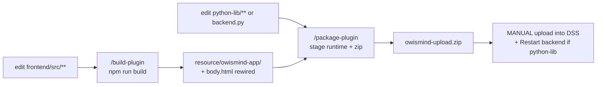

# Build, packaging and deployment

> Audience: Developer, operator. Last updated: 2026-06-18. Summary: how to go from source code to a running
> DSS plugin, through the two steps `/build-plugin` then `/package-plugin`, the manual upload of the zip, and
> the clear decision of when to restart the backend or re-paste the agents.

OWIsMind is deployed through three independent flows: the Vue/Vite frontend compiles into static assets, the
Flask backend and the webapp ship in a plugin zip, and the two LangGraph Code Agents are pasted by hand into
DSS (Python 3.11 environment). This page describes the full release cycle and provides the decision matrix
of "what to rebuild, what to restart, what to re-paste" depending on what you changed.

Cardinal rule: building does not package, packaging does not upload, and the agent never uploads. Uploading
the zip and pasting the Code Agents are manual operations performed by the operator.

## 1. The two-step pipeline

Two skills sequence the release of the plugin (frontend + backend + webapp). The LangGraph agents are a
third path, covered in section 5.



- `/build-plugin` concerns ONLY the frontend: it compiles Vue/Vite and rewires the DSS entry point
  (`body.html`).
- `/package-plugin` stages the runtime (`plugin.json` + `python-lib/` + `resource/` + `webapps/`) and
  produces the archive. It excludes `frontend/` and `node_modules/`.
- A frontend-only change goes through both steps; a backend-only change goes through only `/package-plugin`
  (the already-built frontend travels in the repository, see section 6).

## 2. Step 1: `/build-plugin` (compile the frontend)

The `.claude/skills/build-plugin/SKILL.md` skill chains five steps. It never installs anything.

1. **Preflight**: verify that `Plugin/owismind/frontend/node_modules/` exists. If it is missing, STOP: only
   the user installs (NO INSTALL policy). The install command would in any case be refused by the harness.
2. **Build** from the repository root: `npm --prefix Plugin/owismind/frontend run build`. The `build` script
   in `frontend/package.json` is `vite build`.
3. **Rewire `body.html`**: copy the built `index.html` to the DSS entry point of the webapp
   (`cp .../resource/owismind-app/index.html .../webapps/webapp-owismind-ai-agents/body.html`).
4. **Verify** that the assets base `/plugins/owismind/resource/owismind-app/` is indeed present in
   `body.html`.
5. **Report** in French; remind that packaging is a separate step.

### 2.1 The Vite config is canonical

`Plugin/owismind/frontend/vite.config.js` sets three values that must never change without a rebuild and a
rewiring of `body.html`:

| Vite key | Value | Role |
|---|---|---|
| `base` | `/plugins/owismind/resource/owismind-app/` | URL prefix of the assets served by DSS |
| `build.outDir` | `../resource/owismind-app` | output (relative to `frontend/`, so `Plugin/owismind/resource/owismind-app`) |
| `build.emptyOutDir` | `true` | purges the output folder before writing |

The actual output: `index.html`, `favicon.svg`, and an `assets/` folder of about 24 hashed files
(`index-*.js`, `*.css`, and chunks such as `Icon-*.js`, `session-*.js`).

### 2.2 Why rewire `body.html` on EVERY build

`body.html` is the DSS entry of the webapp (`baseType` STANDARD). The built `index.html` references a HASHED
bundle, and that hash changes on every build. Without the copy of `index.html` to `body.html`, DSS serves a
`body.html` that points to an old hash, hence assets returning 404. After the copy, `body.html` must be
identical to the built `index.html`. Actual state observed in `body.html`: entry `assets/index-DCY_crmu.js`,
modulepreload `Icon-R0zNmMF0.js` and `session-lX0dumx_.js`, stylesheets `Icon-xzaNi_GI.css` and
`index-D7fJBFZD.css`.

The skill uses an allowed Bash `cp`. Depending on context, that `cp` may be refused: the documented fallback
is to write `body.html` via the `Write` tool. This is gotcha F10 of the project memory.

### 2.3 Throwaway compile-check (never build in `resource/` outside the skill)

Since `emptyOutDir: true`, a `vite build` launched without care OVERWRITES the deployed app in
`resource/owismind-app/`. For a simple compilation check, build to a throwaway folder then delete it:

```bash
./node_modules/.bin/vite build --outDir /tmp/owi_buildcheck --emptyOutDir
rm -rf /tmp/owi_buildcheck
```

NEVER build into `resource/` outside of `/build-plugin`. See also the frontend build documentation.

## 3. Step 2: `/package-plugin` (stage the runtime and zip)

The `.claude/skills/package-plugin/SKILL.md` skill stages the runtime ONLY and produces the archive.
Precondition: the frontend must already be built and `body.html` wired. The skill never uploads.

1. **Reset the staging**: `rm -rf` of the `Plugin/ready-for-dataiku/owismind-upload` folder and the zip,
   then recreation of the folder. The `rm -rf` may request approval (expected behavior).
2. **Stage the runtime**: `plugin.json` goes to the ROOT of the staging; `python-lib/`, `resource/` and
   `webapps/` are copied (`cp -R`). Note (lesson L002): `plugin.json` lives at
   `Plugin/owismind/plugin.json`, there is no `_/plugin.json` in this repository.
3. **Zip from the staging** so that `plugin.json` is at the root of the archive, excluding development files
   and Python caches.
4. **Verify that the archive is clean** (must display "ZIP clean").
5. **Verify the required files**: `plugin.json`, `webapps/webapp-owismind-ai-agents/webapp.json`,
   `body.html`, `backend.py`, `python-lib/owismind/__init__.py`.

### 3.1 The exclusion glob trap (lesson L002)

The zip exclusions are done BY NAME only (`CLAUDE.md`, `README.md`, `__pycache__/`, `*.pyc`), never via a
broad glob `*.py` or `*.md`. Such a glob would sweep up the `python-lib/owismind/**/__init__.py` and break
the import of the API blueprint at runtime (`from owismind.api.routes import register_routes` in
`backend.py`). You must also not zip from the source root: a `zip -r ... .` would suck in `frontend/` and
`node_modules/`.

## 4. What is in the zip, and what is not

The archive is staged from the staging folder, so its canonical content is: `plugin.json` (at the root) +
`python-lib/` + `resource/` + `webapps/`. Actual verified state of the current archive: 77 entries,
top-level `plugin.json` / `python-lib/` / `resource/` / `webapps/`, verdict "ZIP clean" (zero pollution), 6
`__init__.py` preserved (the by-name glob correctly protects the `__init__.py`).

| Element | In the zip? | Note |
|---|:--:|---|
| `plugin.json` | yes | at the ROOT of the archive (id `owismind`, version `0.0.1`) |
| `python-lib/owismind/**` (the Flask backend) | yes | the 6 sub-packages: `agents`, `api`, `evidence`, `security`, `storage` + root |
| `resource/owismind-app/**` (built frontend) | yes | this is the payload served by DSS |
| `resource/compute_available_connections.py` | yes | the webapp `paramsPythonSetup` (populates the Settings dropdowns) |
| `webapps/webapp-owismind-ai-agents/**` | yes | `webapp.json`, `body.html`, `backend.py`, `app.js`, `style.css` |
| `frontend/**` (Vue + Vite sources) | NO | excluded: never travels in the zip |
| `node_modules/` | NO | reinstallable toolchain, excluded |
| `CLAUDE.md`, `README.md` | NO | development docs, excluded by name |
| `__pycache__/`, `*.pyc` | NO | Python bytecode, excluded |
| `.DS_Store`, `__MACOSX/`, any `_/` | NO | OS noise / archive artifacts |
| the Code Agents (`dataiku-agents/**`) | NO | third path, pasted by hand (section 5) |

The STANDARD slots `app.js` and `style.css` are deliberately empty but never removed: DSS requires their
presence for a STANDARD webapp. `app.js` contains only a comment ("Vue/Vite application is loaded from
body.html") and `style.css` an empty-slot comment; all the styling ships in the Vite bundle scoped on
`App.vue`.

> IN FLUX: the entry count (77) and the list of hashed assets (`index-DCY_crmu.js`, etc.) are the state
> observed as of the date of this page; these values change on every build. The reference docs `docs/`
> sometimes mention older counts (for example "64 entries"): the code and the memory take precedence.

## 5. The Code Agents: a separate deployment (outside the zip)

The two LangGraph agents live in `dataiku-agents/agents/` (the repository is the source of truth) and are
pasted by hand into DSS Code Agents, on the Python 3.11 code env. They NEVER go through the zip.

### 5.1 Why a second Python environment

The Flask backend runs on Python 3.9.23 and does not bundle langchain: it only does Flask and direct SQL.
The agents, on the other hand, need LangGraph / LangChain v1, which require Python >= 3.10. So langgraph
cannot be put in the 3.9 backend; the agents live in a separate 3.11 code env, hence their deployment by
copy-paste rather than by the zip. The agent files are standalone: they import only the stdlib, `dataiku`
and `langgraph`, never the plugin. This is the Python 3.9 / 3.11 "dual path".

### 5.2 Pasting procedure

1. Edit the file(s) in `dataiku-agents/agents/`, run the tests
   (`python3 -m unittest discover -s dataiku-agents/tests`).
2. Re-paste BOTH Code Agents when one changes: `agents/OWIsMind_orchestrator.py` to the
   **OWIsMind_orchestrator** Code Agent, and `agents/SalesDrive_revenue_expert.py` to the
   **SalesDrive_revenue_expert** Code Agent (`agent:bHrWLyOL`), on the Python 3.11 env. The two are
   re-pasted together because the orchestrator resolves the sub-agent by id and some fixes live on both
   sides.
3. Verify the config ids against the instance (section 5.3).
4. Optional: set `source_url` on the `revenue_expert` capability of the orchestrator registry to make the
   Evidence source clickable.
5. If `python-lib` also changed, rebuild, package, upload the zip and restart the backend. An agent-only
   change requires NO zip upload (the webapp resolves the orchestrator by id via the server whitelist).

The Flow recipes (`dataiku-agents/recipes/`) are deployed as Python recipes in the Flow and refreshed by a
scenario; they are not re-pasted like the agents.

### 5.3 The LLM Mesh ids to verify after pasting

A wrong model id simply makes the corresponding mode not respond. To re-verify against the LLM Mesh
connection of the instance after each pasting:

| Constant (orchestrator and sub-agent) | Mode / role |
|---|---|
| `GEMINI_FLASH_LITE_ID` | eco mode (default) |
| `GEMINI_FLASH_ID` | medium mode |
| `SONNET_ID` | high mode, and the model of the Semantic Model Query tool in ALL modes |
| `SEMANTIC_TOOL_ID` (`v4oqA6R`) | the Semantic Model Query tool called at runtime |
| `agent:bHrWLyOL` | id of the sub-agent resolved by the orchestrator |

> IN FLUX: `dataiku-agents/` is being edited live. The managed tool `dataset_lookup` (`9FEzVZk`) and the
> `lookup` intent were REMOVED on 2026-06-18; their replacement `attribute_lookup`
> (`tools/attribute_lookup_tool.py`) is built and unit-tested but NOT yet wired into the sub-agent. The
> `DRIVE_Revenues_Value_Catalog` and the Python resolver `Drive_Revenues_resolve_filter_value` remain
> ROADMAP, not wired in v3.

The detail of the agent layer and its editing lives in
[Deploying and editing the agents](../05-agents/07-deploying-and-editing-agents.md).

## 6. Why the built frontend is versioned in the repository

This is the direct consequence of the NO INSTALL policy. A fresh clone cannot reinstall the toolchain (npm),
so it cannot rebuild the frontend. So that the plugin remains packageable from any clone, the built payload
(`resource/owismind-app/`) must travel IN the repository. This is the only exception to the "regenerable
outputs = ignored" philosophy.

| Path | Git status | Why |
|---|---|---|
| `frontend/src/**`, `webapps/**`, `python-lib/**`, `plugin.json` | tracked | plugin source |
| `resource/owismind-app/**` (built frontend) | tracked (exception) | payload; a NO INSTALL clone cannot rebuild it. NEVER edit by hand |
| `node_modules/`, `dist/`, `.vite/` | ignored | reinstallable toolchain / scratch |
| `__pycache__/`, `*.py[cod]` | ignored | Python bytecode |
| `Plugin/ready-for-dataiku/**` (the deliverable zip) | ignored | regenerated by `/package-plugin` |

Never edit by hand the generated outputs (`resource/owismind-app/`, `ready-for-dataiku/`, `body.html`): the
`guardrail.sh` hook BLOCKS any `Edit`/`Write` edit under `resource/owismind-app/` or `ready-for-dataiku/`.
`body.html` is rewired by the build, not by hand (except the `Write` fallback of gotcha F10).

## 7. Deployment into DSS (manual upload)

The upload is a manual operation performed by the operator; the agent never uploads. Steps:

1. A **Development** plugin of the same id CANNOT be updated by a zip upload. To keep the same id `owismind`
   (and therefore the Vite paths already wired in `body.html`): DELETE the Development plugin, then UPLOAD
   the zip with Origin = Uploaded, then create or reload the webapp.
2. After upload: Start / Restart the backend of the webapp, and force-refresh the browser (asset cache).
3. In the webapp Settings, select the SQL connection `SQL_owi`. As long as no connection is chosen, the app
   reports "storage not configured". Optional params: table prefix (max 16 characters), trace dataset, log
   level.
4. The webapp runs under a "Run backend as" identity (the run-as-user), distinct from the end user; the
   caller identity comes from the browser headers.

The detail of installation and configuration lives in
[Installation and configuration](01-installation-and-configuration.md).

> IN FLUX: the per-mode LLM Mesh ids must match the instance connection; the monthly budget quota
> (50 EUR/user/month) has its STORAGE ready (`webapp_usage_monthly_v1`) but the BLOCKING is NOT implemented.
> These points are to be verified or finished in DSS.

## 8. Decision matrix: what to rebuild, restart, re-paste

This is the operational table to remember. It tells, for each type of change, which steps to run and which
DSS action to perform after upload.

| Change | `/build-plugin` | `/package-plugin` | Upload zip | Restart backend | Re-paste agents |
|---|:--:|:--:|:--:|:--:|:--:|
| `frontend/src/**` (Vue, CSS, registries, i18n) | yes | yes | yes | no | no |
| `frontend/public/**` | yes | yes | yes | no | no |
| `vite.config.js` `base` or `outDir` | yes + rewire `body.html` | yes | yes | no | no |
| `python-lib/owismind/**` or `backend.py` | no | yes | yes | **yes** | no |
| `webapps/.../webapp.json` or slots `app.js`/`style.css` | no | yes | yes | yes if `webapp.json` touches the backend | no |
| `plugin.json` (version / meta) | no | yes | yes | no | no |
| `dataiku-agents/agents/**` (one agent) | no | no | no | no | **yes (both)** |
| agent + `python-lib` together | depending on the frontend | yes | yes | yes | yes (both) |
| `dataiku-agents/recipes/**` (Flow) | no | no | no | no | no (refresh by scenario) |

In one sentence for each case:

- **Frontend-only**: build + package + upload + browser refresh. No backend restart.
- **Backend / python-lib**: package + upload + RESTART the backend (mandatory).
- **Agent-only**: re-paste BOTH Code Agents (3.11 env). No zip, no restart.
- **Flow recipes**: refreshed by a scenario, neither zip nor re-pasting.

After any upload that changes python-lib, a backend restart is required because the SQL tables and columns
are created on first use and the Python module is reloaded at backend startup. The detail of the lifecycle
on the backend side lives in [Streaming and runs](../04-backend/03-streaming-and-runs.md).

## 9. Tests before deployment (without DSS, without install)

The suites are pure-logic, without a DSS environment and without install: they lock the invariants testable
off-instance, but do NOT replace validation IN DSS.

| Suite | Command | Note |
|---|---|---|
| Backend | `python3 -m unittest discover -s Plugin/owismind/tests -v` | folder outside `python-lib/`, never packaged |
| Frontend | `npm --prefix Plugin/owismind/frontend test` | runner `node --test test/*.test.js`, without Vue or dataiku |
| Agents | `python3 -m unittest discover -s dataiku-agents/tests` | DSS-free, contains the registry anti-drift test |

There is NO CI today. Some backend modules import `dataiku` or `pandas` at load time and are therefore not
covered by the pure-logic suites; their validation goes through the instance. The throwaway compile-check of
section 2.3 (`vite build` to `/tmp`) serves as a compilation guardrail on the frontend side. The full test
strategy lives in [Test strategy](../07-testing/01-test-strategy.md).

## 10. Gotchas to remember

1. `body.html` must be copied on EVERY build (the hash changes), otherwise assets 404 (gotcha F10).
2. NEVER build into `resource/` outside `/build-plugin`: `emptyOutDir: true` overwrites the deployed app.
3. Exclude from the zip BY NAME, never via a broad `*.py` / `*.md` glob (otherwise the `__init__.py` drop
   out and the `owismind.api.routes` import breaks, lesson L002).
4. A Development plugin of the same id is not updatable by zip: delete it then re-upload with
   Origin = Uploaded.
5. Backend restart MANDATORY when `python-lib` or `backend.py` changes; unnecessary for a frontend-only
   change.
6. Re-paste BOTH Code Agents together (3.11 env); then verify the LLM Mesh ids.
7. Absolute NO INSTALL: applied at three levels (`settings.json` permissions, `guardrail.sh` hook,
   documentation). Only the user installs.

## See also

- [Frontend - build and assets](../03-frontend/05-build-and-assets.md) - the Vite detail (base, outDir, hashes, body.html) on the frontend side.
- [Installation and configuration](01-installation-and-configuration.md) - plugin upload, SQL connection, webapp params, first admin.
- [Monitoring and logs](03-monitoring-and-logs.md) - request logs, storage_status, observability after deployment.
- [Runbooks](04-runbooks.md) - incident procedures (backend restarted, mode that does not respond, storage not configured).
- [Deploying and editing the agents](../05-agents/07-deploying-and-editing-agents.md) - re-paste the 2 Code Agents in the 3.11 env, verify the ids.
- [Backend - streaming and runs](../04-backend/03-streaming-and-runs.md) - why the backend restart reloads the run state.
- [Test strategy](../07-testing/01-test-strategy.md) - pure-logic suites, NO INSTALL, what requires DSS.
- [ADR-0005 - LangGraph Code Agents in Python 3.11](../08-decisions/0005-langgraph-code-agents-python-311.md) - the 3.9/3.11 dual path.
