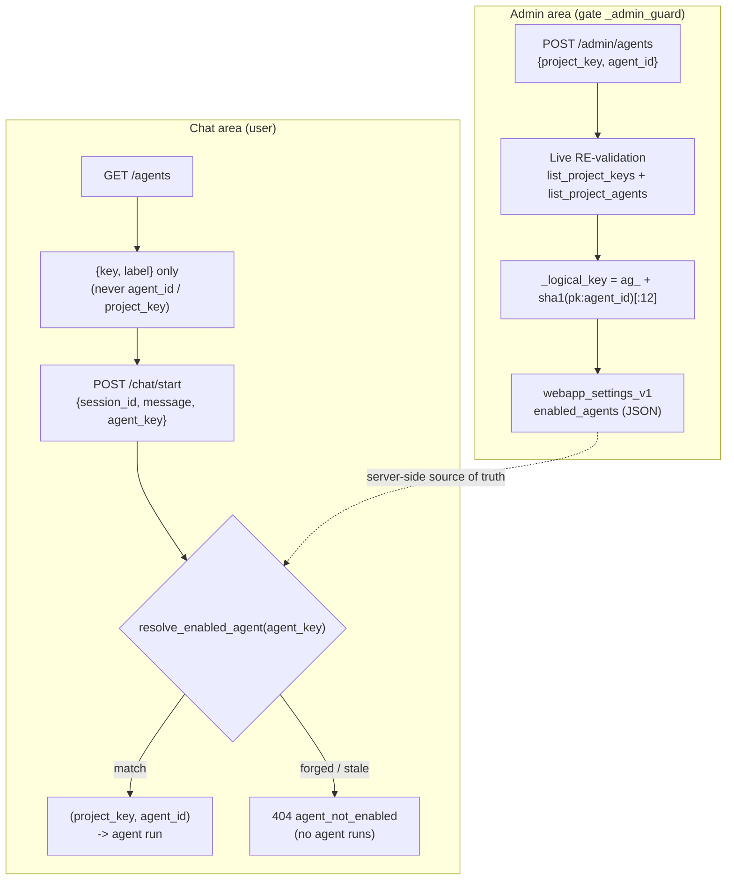

# ADR-0004 - Server-side agent whitelist

> Audience: Developer. Last updated: 2026-06-18. Summary: why the frontend only ever references an agent
> through an OPAQUE logical key (`ag_<hash>`), resolved server-side into `(project_key, agent_id)` against an
> administered whitelist, so that an id forged from the frontend can never run an agent.

## Status

Accepted and validated in DSS. The server whitelist layer (discovery, admin validation, chat resolution) has
been tested on the instance and works. This decision is structural and stable, anchored in non-negotiable
project rule #4 ("the frontend sends a logical key, the backend resolves the `agent_id`").

## Context

OWIsMind exposes a chat portal where the user picks an agent in a selector, then asks it a question. On the DSS
side, an agent is an LLM Mesh whose id starts with `agent:` (for example `agent:bHrWLyOL`, the
`SalesDrive_revenue_expert` sub-agent). Running the wrong agent, or an agent the administrator has not
authorized, would be a vulnerability: the frontend is an untrusted client, and everything it sends is
potentially forged.

Three requirements frame the decision:

- An administrator explicitly chooses which DSS projects and which agents can be activated in the portal. The
  end user must only see and only be able to invoke THOSE agents.
- A raw `agent_id` (for example `agent:bHrWLyOL`) must NEVER pass through the frontend nor be stored in a table
  that the frontend can read (chat, history, agent list). If it is exposable nowhere, there is no surface to
  forge it.
- The Dataiku instance is shared: discovery of projects/agents must be strictly read-only, bounded, and
  triggered on demand only (never a heavy or unbounded scan over the instance).

Do not confuse this server whitelist with the `CAPABILITIES` registry internal to the orchestrator. These are
two distinct layers: the Flask backend resolves the USER SELECTOR key into the orchestrator's `agent_id`; the
orchestrator in turn resolves ITS own sub-agent ids (`OWIsMind_orchestrator.py`, comment: "the backend
resolves the agent id ; this orchestrator resolves sub-agent ids"). These are two stacked resolution
boundaries, never the frontend side by side with a raw id.

## Decision

The frontend only references an agent through an **opaque, stable logical key**. The backend is the single
point of resolution from this key to `(project_key, agent_id)`, against an administered whitelist persisted in
direct SQL. Five concrete elements make up this decision.

### 1. The opaque logical key: `ag_<sha1(project_key:agent_id)[:12]>`

The key is derived by `_logical_key(project_key, agent_id)` in `api/routes.py`: a SHA-1 of the string
`"{project_key}:{agent_id}"`, truncated to 12 hex characters, prefixed with `ag_` (15 characters in total):

```python
def _logical_key(project_key, agent_id):
    digest = hashlib.sha1(
        "{}:{}".format(project_key, agent_id).encode("utf-8")
    ).hexdigest()
    return "ag_" + digest[:12]
```

Two properties are intended: **stable** (re-saving the same selection yields exactly the same key, so
conversations stay attached) and **opaque** (the frontend never receives the raw `agent_id`, only this hash).
The key is not a cryptographic secret: it is not used for authentication, only as an indirect identifier; the
real trust boundary is the server-side resolution table (point 4).

### 2. DSS discovery, strictly read-only and bounded

`agents/discovery.py` lists the projects visible to the backend identity (`list_project_keys`, bound
`MAX_PROJECTS = 500`) then the agents of a project (`list_project_agents`, filtering on
`id.startswith("agent:")` via `AGENT_ID_PREFIX`, bound `MAX_AGENTS = 200`). The module is commented as
"STRICTLY READ-ONLY : only listing calls (`list_project_keys` / `get_project` / `list_llms`), never
create/modify/delete", and called "ON DEMAND (one project at a time, only while an admin is configuring)". No
route can therefore trigger heavy or unbounded work against the instance.

### 3. The whitelist persisted in `webapp_settings_v1`

The activated selection lives in the key-value registry `webapp_settings_v1`, under the stable key
`SETTING_ENABLED_AGENTS = "enabled_agents"` (`storage/settings.py`). The value is a JSON list of entries
`{logical_key, project_key, agent_id, label}`. It is the server-side source of truth; the frontend never sees
its sensitive fields.

### 4. Admin validation RE-validates everything against the live DSS listing

The admin route `POST /admin/agents` (`api/routes.py`, guarded by `_admin_guard`: 401 unauthenticated, 409
storage not configured, 403 not admin) receives `{agents: [{project_key, agent_id}, ...]}`. Before persisting,
it RE-validates each requested agent against the live DSS listing:

- the project must be in `discovery.list_project_keys()` (otherwise the entry is ignored with a warning log);
- the agent must actually appear in `discovery.list_project_agents(project_key)` (otherwise ignored).

Only the entries that pass both checks are rebuilt server-side, with a `logical_key` recomputed by
`_logical_key` and a `label` taken from the DSS description (never from the client payload). A forged id or an
invisible project can therefore NEVER be persisted in the whitelist. The size of the selection is also bounded
(`MAX_ENABLED_AGENTS = 50`, otherwise 400 `too_many_agents`).

### 5. The chat only sees `{key, label}`; the server resolves at runtime

Two routes close the loop:

- `GET /agents` (for any authenticated caller) projects ONLY the public-safe fields:
  `{"key": a.get("logical_key"), "label": a.get("label")}`. The route comment insists: "returns ONLY each
  agent's opaque logical key and human label - never a raw agent_id or project key". The frontend selector is
  therefore ALWAYS repopulated from this route, never hard-coded.
- `POST /chat/start` receives `{session_id, message, agent_key}`. The payload is validated for shape and bounds
  by `validate_chat_start_request` (`security/validation.py`: `agent_key` must be a non-empty string,
  `<= MAX_AGENT_KEY_LENGTH = 64`), but it is `settings.resolve_enabled_agent(agent_key)` that ENFORCES the
  whitelist: it walks the currently activated list and returns the entry `{logical_key, project_key, agent_id,
  label}` only if the key matches a real and still-active agent. A forged or stale key matches nothing and
  returns `None`, which results in a `404 agent_not_enabled`: no agent runs.

In other words, the `agent_key -> (project_key, agent_id)` resolution is the ONLY trust boundary, and it is
strictly server-side. Shape validation (length, type) and business enforcement (whitelist) are two deliberately
separated steps: `validate_chat_start_request` stays pure and free of any DSS dependency, the enforcement lives
in `settings.resolve_enabled_agent`.

## Resolution flow



## Rationale

| Choice | Why |
|---|---|
| OPAQUE logical key on the frontend | The frontend is untrusted: giving it only an indirect hash removes any surface to forge an `agent_id`. |
| `agent_key -> id` resolution server-side only | A single, auditable trust boundary; no table readable by the frontend exposes the `agent_id`. |
| Admin RE-validation against the live listing | Even the admin POST can only persist a real and authorized agent; the client payload is never taken at face value. |
| Read-only and bounded discovery | Safety of the shared instance: no DDL, no unbounded work, on-demand calls only. |
| Persistence in `webapp_settings_v1` (key-value JSON) | A new global setting never requires a new table; `_vN` stays reserved for schema changes. |
| STABLE key (deterministic hash) | Re-saving the selection keeps the same key, so conversations stay attached to their agent. |

## Consequences

### Positive

- Validated in DSS ("works like a charm", lesson L017). No table (chat, history, agent list) exposes an
  `agent_id` or a `project_key`: the forge surface is nil.
- The frontend selector is always repopulated from `GET /agents`; hard-coding it would produce a
  `404 agent_not_enabled` on the first send, which keeps the frontend honest by construction.
- Adding or removing an activatable agent is a purely administrative operation (one POST `/admin/agents`),
  without touching the code or the SQL schema.
- Defense in depth: bounded shape validation (`validate_chat_start_request`), business enforcement
  (`resolve_enabled_agent`), discovery bounds (`MAX_PROJECTS`, `MAX_AGENTS`, `MAX_ENABLED_AGENTS`), admin guard
  (`_admin_guard`).

### Negative / constraints

- If an agent is deactivated or moved to another project, its `logical_key` stops resolving: the old
  conversations that carried it become orphaned (the key no longer matches). This is an accepted trade-off.
- Since the key is derived from `project_key:agent_id`, moving an agent to another project changes its key (and
  breaks the attachment of old conversations): this is intended, an agent in another project is a different
  agent from the whitelist's point of view.
- The `label` displayed in the selector comes from the DSS description at the time of the admin save; renaming
  the agent on the DSS side without re-saving the whitelist leaves the old `label`.

## Rejected alternatives

| Alternative | Why rejected |
|---|---|
| Sending the raw `agent_id` from the frontend | Forbidden by non-negotiable rule #4: a forged id could then run any agent visible to the backend. |
| Trusting the admin payload without live RE-validation | A compromised or buggy admin client could inject an arbitrary id; the RE-validation against the DSS listing closes that door. |
| DSS `CONNECTION` or `MULTISELECT` parameter type for the selection | These types do not render correctly in the DSS Settings (lessons L012/L037); the selection therefore goes through the admin route + `webapp_settings_v1`. |
| Hard-coding the agent list in the frontend | Breaks on the first `404 agent_not_enabled` and bypasses the server whitelist; the frontend MUST repopulate from `GET /agents`. |
| Reversible key (for example base64 of the id) on the frontend | Would re-expose the `agent_id`: the truncated, non-reversible hash is chosen precisely to reveal nothing. |

## See also

- [Security model (architecture)](../02-architecture/04-security-model.md) - trust boundary, run-as-user, owner-scoping, place of the whitelist in the overall model.
- [Backend - security and validation](../04-backend/06-security-and-validation.md) - payload validation, SQL safety, read-only guards, enforcement detail.
- [Backend - API reference](../04-backend/02-api-reference.md) - endpoints `/agents`, `/chat/start`, `/admin/agents` and their error codes.
- [The orchestrator (`OWIsMind_orchestrator`)](../05-agents/02-orchestrator.md) - the internal `CAPABILITIES` registry, distinct from the server whitelist.
- [ADR-0003 - Direct SQL, no Flow at runtime](0003-sql-direct-sans-flow.md) - the SQL safety posture that frames the persistence of the whitelist.
- [Architecture Decision Records (ADR) - index](README.md) - list of the twelve ADRs.
