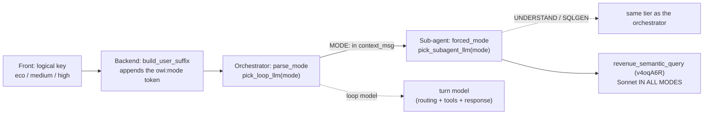

# ADR-0009 - Per-mode model and mode propagation

> Audience: agent engineer. Last updated: 2026-06-18. Summary: why OWIsMind picks ONE model per mode
> (eco / medium / high), removed every in-turn escalation, and propagates the same mode to the sub-agent
> for a model-agnostic architecture.

## Status

Accepted and coded in both Code Agents. The live BEHAVIOR of the models (per-tier quality, latency)
remains NOT validated in DSS at the time of writing.

> IN FLUX: the per-mode LLM Mesh ids (`GEMINI_FLASH_LITE_ID`, `GEMINI_FLASH_ID`, `SONNET_ID`) follow the
> format observed on the `LLM-7064-revforecast` connection, but they must match exactly the connection of
> the target instance. A wrong id breaks the corresponding mode: for example, if the Flash-Lite id is
> invalid, eco mode (which is the DEFAULT) stops responding entirely. To be verified on the instance
> before going live.

## Context and problem

OWIsMind exposes three quality modes to the user (eco, medium, high), selectable in the chat. The
previous version of this choice relied on a driven ESCALATION: a small model started the turn, then the
logic handed off to a stronger model (Sonnet) mid-turn when the task looked complex.

The DSS test of this escalation on gpt-5.4-mini failed in two reproducible ways:

- near-systematic escalation, plus a hardcoded transition message;
- or the small model narrated its intent ("I am going to look at the revenues...") then stopped without
  calling a single tool (the "narrate-and-stop" pattern).

The user instruction that followed was clear: stop the single-model hacks, aim for an architecture that
works EVEN on the small models and that excels on the large ones, without depending on the quirks of any
particular model.

## Decision

TOTAL removal of escalation. A single model drives the entire turn, chosen by the mode.

The core of the decision lives in `OWIsMind_orchestrator.py`, the "CONFIGURATION" section:

```python
GEMINI_FLASH_LITE_ID = "openai:LLM-7064-revforecast:vertex_ai/gemini-3.1-flash-lite"  # eco
GEMINI_FLASH_ID = "openai:LLM-7064-revforecast:vertex_ai/gemini-3.5-flash"             # medium
SONNET_ID = "openai:LLM-7064-revforecast:vertex_ai/claude-sonnet-4-6"                  # high

DEFAULT_MODE = "eco"
LOOP_LLM_BY_MODE = {
    "eco": GEMINI_FLASH_LITE_ID,
    "medium": GEMINI_FLASH_ID,
    "high": SONNET_ID,
}
```

| Mode | Loop model | Role | Narration |
|---|---|---|---|
| `eco` (default) | Gemini 3.1 Flash-Lite | fast, inexpensive, good | OFF (the deterministic ticker covers the wait) |
| `medium` | Gemini 3.5 Flash | stronger, narrates during tool calls | ON |
| `high` | Claude Sonnet 4.6 | max quality, most expensive | ON |

The mode is resolved by `pick_loop_llm(mode)`, which returns the single model for the whole turn:
routing, tool calls and final response drafting, end to end. The function `narration_enabled(mode)`
returns `mode != "eco"`: only eco stays strictly act-first (mandatory tool call in the same turn) so as
never to fall back into narrate-and-stop on the smallest tier.

### Mode selection: a control token, read last

The front never sends a raw model id. It sends a LOGICAL key (`eco` / `medium` / `high`, default `eco`
on the front side as on the backend side). The backend relays it as a machine token `owi:mode=…`
appended at the END of the current message, built in `build_user_suffix`
(`python-lib/owismind/agents/context.py`). The orchestrator reads this token through `parse_mode`, then
strips all `owi:…` tokens from the text before it reaches the model.

A security point to understand: `parse_mode` reads the LAST valid occurrence, not the first. The backend
always appends its authoritative token at the end of the message, so a user who would type a fake
`owi:mode=high` earlier in their text cannot force a more expensive model. The token appended by the
backend wins. The same defense applies to the language token `owi:lang=…` (`parse_lang`).

### Mode propagation to the sub-agent

The same mode flows down to the sub-agent so that the whole stack stays on the same tier (in high, it is
Sonnet everywhere). Propagation goes through the `context_msg` injected into the sub-agent, whose first
line is `MODE: <mode>` (see `process_stream` in `OWIsMind_orchestrator.py`).

On the sub-agent side (`SalesDrive_revenue_expert.py`), the `_MODE_RE` regex and the `forced_mode(context)`
function extract this mode from the received context. At the start of the run, the sub-agent does:

```python
mode = forced_mode(conversation_context) or DEFAULT_MODE
initial = {..., "llm_id": pick_subagent_llm(mode),
                "semantic_tool_id": pick_semantic_tool_id(mode)}
```

The resolved `llm_id` is threaded through the graph state (not read off `self`), so the node closures
never touch per-request state: it is concurrency-safe. In the absence of a token (batch path or
stand-alone usage), the sub-agent falls back to `DEFAULT_MODE` (eco).

The sub-agent's `LLM_BY_MODE` table strictly mirrors the orchestrator's (same connection, same ids). The
sub-agent uses it for its own LLM calls: UNDERSTAND, the long-tail "custom" SQLGEN, and the headline (the
latter being `SUBAGENT_LLM_HEADLINE = False` by default, since the orchestrator now writes the analysis).



### The Semantic Model Query tool's model stays constant

Regardless of the mode, the Semantic Model Query tool `revenue_semantic_query` (`v4oqA6R`), which WRITES
AND EXECUTES the analytical SQL, runs on its own strong model (Sonnet) configured on the DSS side. The
sub-agent materializes it through `SEMANTIC_TOOL_ID_BY_MODE`, which points to the SAME tool for all three
modes (`pick_semantic_tool_id`). The mode therefore only changes the ORCHESTRATION tier: offer and column
resolution stays at constant quality. To back a mode with a different SQL model, you would have to create
a second Semantic Model tool and set its id in `SEMANTIC_TOOL_ID_BY_MODE`.

## Rationale

- Escalation was a band-aid tailored to gpt-5.4-mini, and it was the very thing CAUSING the bug. A single
  model per mode is predictable and genuinely model-agnostic: the orchestration logic is identical for
  the three modes, only the tier changes.
- Turning narration off in eco structurally removes narrate-and-stop on the smallest model: no request to
  "speak before acting" that would prompt the mini to stop after its preamble.
- Reading the token LAST closes the path to a cost escalation by user-side injection.
- Pushing the mode down to the sub-agent guarantees tier consistency across the whole stack (high =
  Sonnet everywhere), while the SQL tool stays on Sonnet so as never to degrade value resolution.

## Consequences

Positive:

- Predictable behavior, identical across modes; eco becomes a viable default (cheap, fast), surfaced as
  the recommended option in the `ModelModePicker` (a "Recommended" badge on eco, green cost).
- The orchestrator names the model in the logs and in the `ERROR` event (`process_stream`), so a wrong or
  unconfigured LLM Mesh id no longer surfaces as an opaque crash mid-loop.
- The euro money layer derives from the column NAME (`metric_unit`, `amount_eur -> €`) without profile
  config, and the sub-agent prefixes a scope line (`build_scope_note`); these transparency features are
  orthogonal to the mode choice but were delivered in the same arc.

Negative or watch points:

- The Gemini ids are best-effort in the observed format: to be VERIFIED in the Mesh connection (otherwise
  the corresponding mode does not respond), see the IN FLUX box at the top.
- The live behavior of the models (actual per-tier quality) is not validated in DSS.
- Two Code Agents carry the same `LLM_BY_MODE` table (orchestrator + sub-agent). Any id change must be
  reflected in BOTH files, then the two Code Agents re-pasted in env 3.11.

## Link with the optimistic stop

This decision was delivered in the same model-agnostic effort as the cooperative stop on the front side.
The stop can only cut between two chunks (the agent is structured; the perceived latency during a
blocking call is on the order of a few seconds). The front therefore applies an OPTIMISTIC stop
(`stopGeneration` marks the state immediately and POSTs `/chat/stop` best-effort, with a blinking
"Stopping…" label), while the backend persists its own partial. This mechanism is detailed on the
backend side; see the streaming reference document below.

## Rejected alternatives

| Alternative | Why rejected |
|---|---|
| Escalation / mid-turn hand-over to Sonnet | Failed in DSS (systematic escalation + hardcoded message, or narrate-and-stop on gpt-5.4-mini); it was the cause of the bug. |
| Single-model hacks (logic tailored to the quirks of a specific model) | Explicit user instruction to remove them; not maintainable, not portable. |
| The front sends a raw model id | Breaks the trust boundary: the front only sends a logical key, the tier is resolved on the agent side. |
| Currency unit via profile config | The user refuses it: the `amount_eur` column already carries the currency, derived from the column name. |
| gpt-5.4-mini in eco mode | Removed: eco moves to Gemini 3.1 Flash-Lite (the original mini tier is what motivated dropping the escalation). |

## See also

- [Models, prompts and LLM Mesh](../05-agents/06-models-prompts-and-llm-mesh.md) - the detail of native
  Mesh calls, control tokens and with_json_output, where this decision applies concretely.
- [The orchestrator](../05-agents/02-orchestrator.md) - the LangGraph loop that consumes `pick_loop_llm`
  and propagates the mode in `context_msg`.
- [The revenue expert sub-agent](../05-agents/03-revenue-expert-subagent.md) - the `forced_mode` /
  `pick_subagent_llm` side and the UNDERSTAND / RESOLVE / QUERY / RENDER pipeline.
- [ADR-0006 - Native LLM Mesh calls](0006-appels-natifs-llm-mesh.md) - why we call Mesh natively
  (reasoning + tool-calling preserved), a prerequisite of this decision.
- [ADR-0007 - with_json_output forced on UNDERSTAND](0007-json-output-force-sur-understand.md) - the
  counterpart on the sub-agent's deterministic extraction side.
- [Backend - streaming and run lifecycle](../04-backend/03-streaming-and-runs.md) - the cooperative stop
  and the polling loop mentioned above.
- [Deploying and editing the agents](../05-agents/07-deploying-and-editing-agents.md) - re-paste the two
  Code Agents in env 3.11 and verify the model ids.
