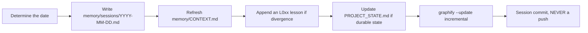
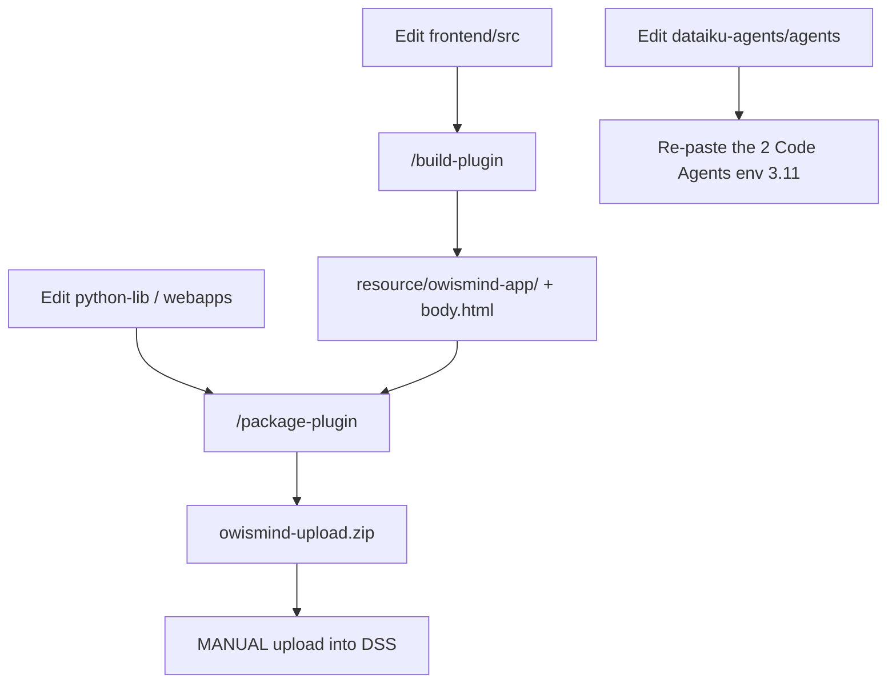

# Contributing - conventions and rules

> Audience: every contributor (developer, documentation writer, maintainer). Last updated: 2026-06-19. Summary: this document gathers the project's NON-NEGOTIABLE rules, the memory protocol, the "repository = source of truth" principle for the agents, and the end-to-end contribution workflow (edit the source, build/package, deploy).

OWIsMind is a Dataiku DSS plugin running on a SHARED instance. Most of the rules below exist for a single reason: never harm that instance, nor users' trust. Before you touch the code, read this page in full. It does not replace the architecture or backend documentation; it sets the working invariants that every change must respect.

---

## 1. The NON-NEGOTIABLE rules

These ten rules are enforced at once by convention, by the Claude Code harness configuration, and by deterministic hooks. They are not up for negotiation: a change that violates them is a change to refuse, not to discuss.

| # | Rule | Why |
|---|---|---|
| 1 | NO INSTALL: the agent NEVER installs a dependency | Safety: only the user controls the instance environment. |
| 2 | Dataiku instance safety: no heavy, blocking or overloading code | The instance is shared; an expensive handler slows it down for everyone. |
| 3 | Direct parameterized SQL + COMMIT, no Flow at runtime, no generic SQL route | Predictable, auditable storage, zero injection surface. |
| 4 | Server-side agent whitelist: the front end only sends an opaque logical key | Prevent the execution of a forged `agent_id`. |
| 5 | The frontend NEVER goes into the zip | The zip is the plugin runtime; `frontend/` and `node_modules/` have no business being there. |
| 6 | Never edit the generated folders by hand | Any manual edit is overwritten at the next build/package. |
| 7 | Code and documentation in English | All code, comments, and this documentation set are in English. The legacy `docs/` and `memory/` folders are in French (historical). Code identifiers stay VERBATIM in English, never translated. |
| 8 | Do not assume Python 3.11 / FastAPI on the backend without proof | The backend observed in DSS is Python 3.9.23 (Flask, without langchain). |
| 9 | No em dash (U+2014) nor en dash (U+2013), anywhere | An AI typographic signature, forbidden by user decision. |
| 10 | Orange charter is MANDATORY for every styling task | Every page, component, or style touch follows `docs/cadrage/CHARTE_ORANGE_UI.md`. Read it BEFORE any styling work. |

### 1.1 NO INSTALL (rule #1): defense in depth

This is the project's structuring rule. The agent NEVER runs `npm install/ci/i/add/update`, `yarn`, `pnpm add`, `pip/pip3 install`, `pipenv`, `poetry`, `conda install`, `brew install`, nor `npx` of an install. If a dependency is missing, we stop and ask the user to install it. This rule is locked at three levels:

- Harness permissions: `.claude/settings.json` explicitly lists each install command in `permissions.deny`, and also blocks `Edit`/`Write` on `Plugin/owismind/resource/owismind-app/**`.
- PreToolUse hook: `.claude/hooks/guardrail.sh` intercepts any `Bash` whose `"command"` field matches an install (broad regex for npm/yarn/pnpm/pip/pipenv/poetry/conda/brew/npx) and BLOCKS it (exit 2, message returned to the model). The hook is pure bash + grep over the raw JSON, with no jq or python dependency, so it never breaks a session.
- Documentation: the rule is recalled at every session start by `.claude/hooks/session-start.sh` and in every skill.

A direct, non-trivial consequence: the BUILT frontend (`Plugin/owismind/resource/owismind-app/`) is VERSIONED in the repository. It is the single exception to the "regenerable outputs = ignored" philosophy. The logic: a fresh clone cannot reinstall the Vite toolchain (NO INSTALL), so the plugin payload must travel inside the repository to stay packageable.

### 1.2 Dataiku instance safety (rule #2)

Before writing a single line of backend code, ask yourself: is it risky, slow or overloading for the instance? No heavy, blocking or unbounded work in a request handler. The agents' background worker is bounded everywhere (concurrency cap, deadlines, TTL, memory bounds); any new code must respect the same spirit. This rule is recalled in a non-blocking way by the `guardrail.sh` hook as soon as a file under `python-lib` or a `backend.py` is touched.

### 1.3 Direct SQL (rule #3)

All storage goes through `SQLExecutor2` (PostgreSQL, `public` schema), with no Flow at runtime. The canonical backend rules live in `Plugin/owismind/python-lib/CLAUDE.md`: PARAMETERIZED values (`toSQL(Constant(value), dialect=Dialects.POSTGRES)`, never an f-string around user input), identifiers built only from controlled constants (`sql_config.full_table(...)`, physical prefix `{PROJECT_KEY}_owismind_{logical}`), an explicit `COMMIT` via `post_queries=["COMMIT"]`, and NO generic SQL route (`/execute-sql`, `/run-query` do not exist). The front end never chooses a table, a connection or a query. The detail of these guardrails is documented on the architecture and backend side (see See also).

### 1.4 Agent whitelist (rule #4)

The front end only receives and sends an OPAQUE logical key (form `ag_<hash>`); the backend resolves `(project_key, agent_id)` via `storage.settings.resolve_enabled_agent`, only if the agent has been enabled by an admin. A forged or disabled key resolves to `None`, and the run is never launched. The raw `agent_id` NEVER crosses over to the front end.

### 1.5 Frontend never in the zip + generated folders (rules #5 and #6)

The deliverable zip (`Plugin/ready-for-dataiku/owismind-upload.zip`) contains only the RUNTIME: `plugin.json`, `python-lib/`, `resource/`, `webapps/`. Never `frontend/` nor `node_modules/`. And we NEVER edit the generated outputs by hand: `Plugin/owismind/resource/owismind-app/`, `Plugin/ready-for-dataiku/`, nor `body.html` (which is re-wired at build time). Any manual edit of these paths is overwritten, and the `guardrail.sh` hook already blocks it for `resource/owismind-app/` and `ready-for-dataiku/`. We edit the SOURCE (`frontend/src`, `python-lib`, `webapps`) then rebuild.

### 1.6 Language: code and documentation in English (rule #7)

All code and its comments are in English (professional standard, optimized, well commented). This documentation set (`project-documentation/`) is written in English, the owner's final decision. The legacy `docs/` and `memory/` folders are in French for historical reasons; in case of conflict, the CODE and the project memory (`memory/`) take precedence over any document. Note: `project-documentation/.workdir/CONVENTIONS.md` section 1.3 says the prose is French - that is stale; the prose is English. Code identifiers (file names, functions, tables, columns, config ids such as `agent:bHrWLyOL` or `v4oqA6R`) stay VERBATIM in English, never translated.

### 1.7 No em dash (rule #9)

The em dash (U+2014) and the en dash (U+2013) are BANNED everywhere: code, comments, i18n strings, UI text, memory, commit messages AND chat replies. We replace them with `-`, `:`, `,` or parentheses. The only document allowed to display these glyphs literally is [ADR-0012](../08-decisions/0012-regle-typographique-sans-tiret-cadratin.md), where they are named between backticks to identify them. For any cleanup sweep, stay byte-safe (`LC_ALL=C`): never use `perl -CSD` on files with multibyte glyphs (risk of corrupting tokens such as `owi:mode`).

### 1.8 Orange charter: mandatory for every styling task (rule #10)

The Orange brand charter is MANDATORY on every page, component, or CSS touch. The authoritative, self-contained spec lives in `docs/cadrage/CHARTE_ORANGE_UI.md`. READ IT before any styling work; it supersedes any older mock or guide. Essential constraints:

- **Palette**: white background + black text + **a single accent `#FF7900`** used sparingly (primary actions, active state, headline detail). Access it via the semantic tokens in `frontend/src/styles/tokens.css` (never a bare hex in component CSS). For readable orange text on white use `--orange-text` (confirmed AA contrast).
- **Geometry**: square (`border-radius: 0`); only avatars/icons are round. Flat surfaces, 1px hairlines, no blur, no gradient, no glow, no large shadow.
- **Typography**: H1 at 36 px/800, orange ALL-CAPS eyebrow, 52x4px orange title-bar accent below H1. Heavy weight via `--fw-heavy: 800`.
- **Real brand assets**: always use the real logo image (`frontend/src/assets/orange-logo.png`, imported as ``). NEVER reconstruct a brand mark with CSS shapes, even if a mock does so (mocks simulate assets).
- **Theme**: dark mode via `body[data-theme]` + tokens. Never `color-mix`.
- **Banned unconditionally**: `color-mix`, `backdrop-filter`/blur, gradients, glow/large shadows, emoji in UI, a global `:focus-visible` override on inputs, and any CSS-generated brand visual.

Violating the charter - including adding unsolicited orange accents, focus rings, glows, or replacing the real logo with CSS - is treated the same as violating any other non-negotiable rule. Decision logged in `memory/LESSONS.md` L091-L092.

---

## 2. The memory protocol: `memory/` is the source of truth

OWIsMind keeps a project memory under `memory/`, which TAKES PRECEDENCE over the guides in `docs/cadrage/`. The guides are starting points; the real names and the solutions that work live in memory. In case of a guide versus memory conflict, memory prevails. Likewise, the CODE prevails over outdated documentation.

Three files structure this memory:

| File | Role | When to read it |
|---|---|---|
| `memory/CONTEXT.md` | Short-term memory: current focus, last session, active gotchas | At EVERY session start. |
| `memory/LESSONS.md` | `L0xx` lessons: what diverged from the guides, what failed then worked (context, failure, solution, proof, source, date) | When looking for the "why" of a non-obvious solution. |
| `memory/PROJECT_STATE.md` | Durable state: architecture, canonical ids, validated / not-validated in DSS matrix | For the detail of a component and to know what is confirmed on the instance. |

The `.claude/hooks/session-start.sh` hook reminds you to read these three files (plus the knowledge graph) at the start of every session.

### Continuous learning and end of session

As soon as a solution diverges from the guides, or something fails then works, we append a lesson to `memory/LESSONS.md`. At the end of the session, we run the `/log-session` skill, which writes ONLY memory files (no build, package, upload or push):

The session commit is authorized (permanent user authorization). The PUSH never is: it is the user who pushes. The `post-commit` git hook rebuilds the knowledge graph (code only, AST, without LLM) in the background after each commit.

> To navigate the code ("where is X handled?", "what touches Y?"), query the graph first (`graphify query "..."`) rather than re-reading the docs: roughly 18 times fewer tokens. The graph (`graphify-out/`) is git-ignored.

---

## 3. Repository = source of truth for the agents

The two LangGraph Code Agents (`OWIsMind_orchestrator` and `SalesDrive_revenue_expert`) live in `dataiku-agents/agents/`. The REPOSITORY is the source of truth: we edit the code here, then RE-PASTE it by hand into the DSS Code Agents (on the Python 3.11 code env). A direct edit in DSS is overwritten at the next paste. The agents are STANDALONE files: they import only stdlib + `dataiku` + `langgraph`, with no import from the plugin.

This Python dual-path is intentional: the Flask backend runs on Python 3.9.23 (without langchain), whereas LangGraph/LangChain v1 require Python 3.10+. We therefore cannot put the agents in the backend; they live in a separate 3.11 env, deployed by copy-paste rather than by the zip. An agent-only change NEVER touches the zip (the webapp resolves the orchestrator by id via the whitelist).

Agent deployment procedure (full detail in the dedicated agents document):

1. Edit the file(s) in `dataiku-agents/agents/`, run the tests (`python3 -m unittest discover -s dataiku-agents/tests`).
2. RE-PASTE BOTH Code Agents when either changes (some fixes live on both sides; the orchestrator resolves the sub-agent by id), on the Python 3.11 env.
3. Check the config ids against the instance: the per-mode LLM Mesh ids (`GEMINI_FLASH_LITE_ID`, `GEMINI_FLASH_ID`, `SONNET_ID`), `SEMANTIC_TOOL_ID` (`v4oqA6R`), and `agent_id` (`agent:bHrWLyOL`). A wrong id breaks the corresponding mode or resolution.
4. If `python-lib` also changed, rebuild + upload zip + restart backend.

> IN FLUX: the `dataiku-agents/` folder is being edited live. As of 2026-06-18, the managed `dataset_lookup` tool (`9FEzVZk`) and its `lookup` intent have been REMOVED. Its replacement `attribute_lookup` (`tools/attribute_lookup_tool.py`, Custom Python) is, according to `dataiku-agents/CLAUDE.md`, now wired as a built-in tool of the ORCHESTRATOR (sub-agent unchanged); the security research pack still described it as "built but not wired". Status to confirm on the instance before relying on it.

> ROADMAP: `DRIVE_Revenues_Value_Catalog` and the Python resolver `Drive_Revenues_resolve_filter_value` are NOT wired in v3.

---

## 4. The contribution workflow: edit the source, build, package, deploy

The release pipeline has two distinct steps for the plugin, plus a third path for the agents. Cardinal rule: building does not package, packaging does not upload, and the agent NEVER uploads (the upload is a manual user operation).

### 4.1 Build: skill `/build-plugin`

The `/build-plugin` skill runs `vite build` on `Plugin/owismind/frontend/` (output to `resource/owismind-app/`, base `/plugins/owismind/resource/owismind-app/`), then RE-WIRES `body.html` by copying the built `index.html` into it. This re-wiring is mandatory at EVERY build: the bundle is HASHED (`index-<hash>.js`) and the hash changes at every build; without the copy, DSS serves a `body.html` that points to an old hash and the assets fall into 404. The skill never installs (preflight `node_modules`, STOP if absent).

> Gotcha: NEVER build in `resource/` outside the skill. The Vite config has `emptyOutDir: true`, so a stray build OVERWRITES the deployed app. For a simple compile-check, build to `/tmp` then `rm -rf`.

### 4.2 Package: skill `/package-plugin`

The `/package-plugin` skill stages ONLY the runtime (`plugin.json` at the root + `python-lib/` + `resource/` + `webapps/`) and produces `ready-for-dataiku/owismind-upload.zip`. It never uploads.

> Critical gotcha (lesson L002): exclude `CLAUDE.md`/`README.md`/`__pycache__`/`*.pyc` BY NAME only, never via a broad `*.py`/`*.md` glob. A broad glob would sweep up the `python-lib/owismind/**/__init__.py` files and break the `from owismind.api.routes import register_routes` import at runtime (the backend bootstrap in `backend.py`).

### 4.3 What to rebuild when

| Change | `/build-plugin` | `/package-plugin` | DSS action after upload |
|---|:--:|:--:|---|
| `frontend/src/**` (Vue, CSS, registries, i18n) | yes | yes | upload + browser refresh |
| `python-lib/owismind/**` or `backend.py` | no | yes | upload + Restart backend |
| `webapp.json` / `app.js` / `style.css` only | no | yes | upload (+ Restart if `webapp.json` changes the backend) |
| `vite.config.js` `base` or `outDir` | yes + re-wire `body.html` | yes | upload + refresh |
| `plugin.json` (version/meta) | no | yes | upload |
| `dataiku-agents/agents/**` (agent-only) | no | no | re-paste the 2 Code Agents, NO zip |

Practical rule: a frontend-only change = build + package + upload + refresh (no backend restart). A `python-lib`/`backend` change = package + upload + mandatory BACKEND RESTART. An agent-only change = re-paste the Code Agents, no zip.

### 4.4 DSS deployment (manual)

The upload is manual and is the user's responsibility. A Development plugin with the same id CANNOT be updated by a ZIP upload: to keep the same `owismind` id (and therefore the Vite paths already wired in `body.html`), delete the Development plugin then re-upload the ZIP as Origin = Uploaded. After upload: Start/Restart the webapp backend + force-refresh the browser. As long as no SQL connection (`SQL_owi`) is chosen in the webapp Settings, the app reports "storage not configured".

---

## 5. Tests: pure-logic, no DSS, no install

The test suites are pure-logic, with no DSS environment and no install (native runners). They lock down the invariants testable off-instance; they do NOT replace validation in DSS.

| Suite | Command |
|---|---|
| Backend | `python3 -m unittest discover -s Plugin/owismind/tests -v` |
| Frontend | `npm --prefix Plugin/owismind/frontend test` (= `node --test test/*.test.js`) |
| Agents | `python3 -m unittest discover -s dataiku-agents/tests` |

These suites deliberately stay free of Vue and `dataiku` so they can be run by the native runners. Some modules import `dataiku`/`pandas` at load time and are therefore not covered off-instance. There is NO CI today. Real validation always happens in DSS, and the validated / not-validated matrix lives in `memory/PROJECT_STATE.md`. The detailed test strategy is documented in the testing section (see See also).

---

## 6. Documentation writing conventions

Every contribution to `project-documentation/` follows the shared conventions file `project-documentation/.workdir/CONVENTIONS.md`. In short: each file starts with an H1 + a blockquote (audience, date, summary) and ends with a `## See also` section in relative links; the prose is in English, the code stays verbatim in English; no em dash anywhere; we anchor every assertion in the real source (we open the file before asserting a name), and we explicitly flag what is in flux. The repository code is READ-ONLY for writers: we only write in the file(s) assigned under `project-documentation/`.

---

## See also

- [Repository map](02-repository-map.md) - where everything lives (Plugin/, dataiku-agents/, docs/, memory/).
- [Known gotchas and lessons](03-known-gotchas-and-lessons.md) - a synthesis of cross-cutting gotchas.
- [Build, packaging and deployment](../06-operations/02-build-package-deploy.md) - detail of the `/build-plugin` and `/package-plugin` skills and of the what-to-rebuild-when matrix.
- [Deploying and editing the agents](../05-agents/07-deploying-and-editing-agents.md) - the full procedure to re-paste the 2 Code Agents in env 3.11.
- [Security model](../02-architecture/04-security-model.md) - trust boundary, run-as-user, owner-scoping, whitelist.
- [Backend - security and validation](../04-backend/06-security-and-validation.md) - payload validation, SQL safety, read-only guards.
- [Test strategy](../07-testing/01-test-strategy.md) - pure-logic suites, NO INSTALL, what requires DSS.
- [ADR-0012 - Typographic rule: no em dash](../08-decisions/0012-regle-typographique-sans-tiret-cadratin.md) - the decision behind rule #9.
- Orange charter (external, not in project-documentation): `docs/cadrage/CHARTE_ORANGE_UI.md` - the self-contained UI brand spec (rule #10).
