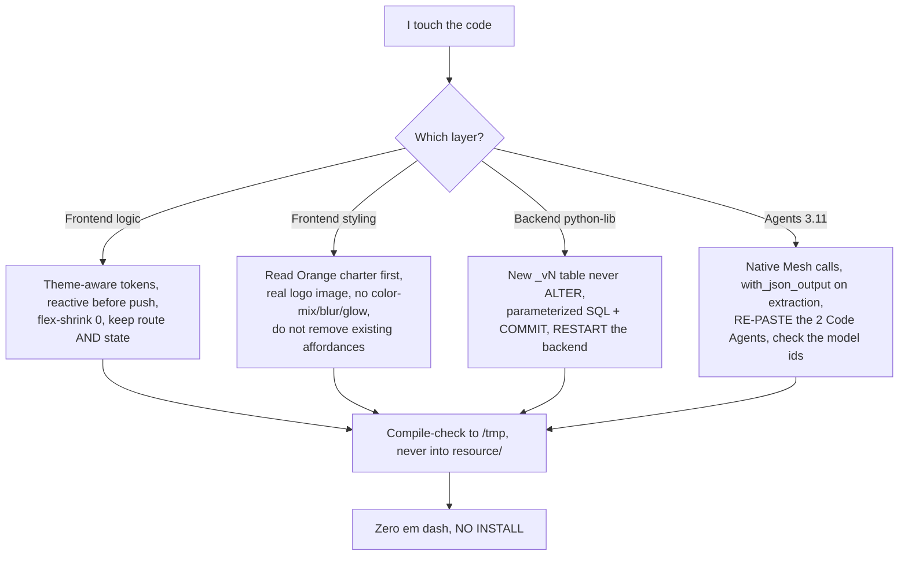

# Known gotchas and lessons

> Audience: developer, maintainer. Last updated: 2026-06-19. Summary: the distilled list of
> the gotchas that genuinely cost time on OWIsMind (frontend, backend, agents, styling), each one
> with its symptom and the fix that works, plus pointers to the ADRs and the detailed docs.

This document is the project's operational memory: what you MUST know before touching the code,
condensed from `memory/LESSONS.md` (L001 to L092). Every entry follows the same format: the gotcha, the
observable symptom, the solution verified in the code. References name the real file; line
numbers are deliberately omitted (the repository is edited live, especially `dataiku-agents/`).

> IN FLUX: the agent layer (`dataiku-agents/`) is currently being edited. The invariants below are
> stable, but some model identifiers and the tools wiring are moving: always check the real file
> before relying on them. Points explicitly in transition are flagged with a dedicated
> blockquote.

---

## 1. How to read this document

A gotcha here is not a style opinion: it is a behavior that failed in DSS or in
review, then was fixed durably. When you reintroduce a banned pattern (for example a
hardcoded color that is invisible in dark mode, or an `ALTER TABLE`), you do not just break your page: you replay a
bug already paid for. The project's golden rule: memory (`memory/LESSONS.md` + `memory/PROJECT_STATE.md`)
takes precedence over the `docs/cadrage/` guides, and the code takes precedence over stale docs.

---

## 2. Frontend gotchas (Vue 3 + Vite)

| # | Gotcha | Symptom | Verified solution |
|---|---|---|---|
| F-1 | Vue 3 reactivity on the streamed object | The timeline does not update during the run, then appears all at once at the end (zero intermediate re-render) | Wrap the object BEFORE pushing it into the reactive array: `reactive({...})`. Confirmed in `stores/chat.js` (exchanges and versions are created via `reactive(...)`). |
| F-2 | Flexbox scroll that crushes the bubbles | Some messages get compressed to near-zero height and slide under others | In any scrollable flex column, children must not be compressible: `flex-shrink: 0` on the message and step elements (pattern visible in `MessageAgent.vue`). |
| F-3 | `:global` theme that loses the descendant | `:global(body[data-theme="dark"]) .x` compiles to `body[data-theme="dark"]` ALONE and repaints the whole body dark | Wrap the ENTIRE selector inside the `:global`: `:global(body[data-theme="dark"] .x)`. Better still: go through a theme-aware semantic token instead of a manual override. |
| F-4 | Hardcoded color invisible in dark mode | A tinted background or text (hardcoded rgba) disappears in dark mode | Use the semantic tokens from `styles/tokens.css`: `--success-soft`, `--danger-soft`, `--orange-text` (AA), `--orange-soft-dark`. No `color-mix`. Orange text goes through `--orange-text`, not a literal value. |
| F-5 | Panel outside RouterView that never closes | Evidence stays open when navigating to Settings; it survives the unmount (the Pinia store outlives the view) | Keep the route AND the state: `watch([() => route.name, () => evidence.open], ...)` closes Evidence as soon as `name !== 'chat'`. Implemented in `components/shell/AppLayout.vue`. |
| F-6 | Hardcoded close `aria-label` | A modal's close button stays in French even in English (inconsistent accessibility) | Go through i18n: `:aria-label="t('x.close')"`. Fixed in `components/ui/Modal.vue` (propagates to all modals). |
| F-7 | Scroll that follows the wrong signal | The thread jumps or does not follow the bottom during a run | `ChatThread` only re-scrolls on `activeSessionId`, the exchange count, a signature gated by the current send, and `evidence.open`. Never a direct watch on the `turns` (triggers a loop). |

| F-8 | Brand logo rebuilt in CSS by a mock-following agent | The real `orange-logo.png` is replaced by `` CSS shapes; the production app no longer shows the actual brand | Always use `` where `logoUrl` is `import logoUrl from '../../assets/orange-logo.png'`. Mocks simulate assets with CSS; never transfer that simulation to the real component. This rule is part of the Orange charter (rule #10). Lesson L092. |

Cross-cutting frontend note: the router is in HASH mode (`createWebHashHistory`), the theme is set on
`body[data-theme]` BEFORE the mount, and `body.html` is a file GENERATED by the build (see gotcha B-6).
These choices are decisions, detailed in [ADR-0001](../08-decisions/0001-vue-spa-servie-par-dss.md).

---

## 3. Orange charter gotchas (styling, brand discipline - rule #10)

Every styling task is governed by the Orange charter (`docs/cadrage/CHARTE_ORANGE_UI.md`). Read it in full before touching any CSS or component appearance. The gotchas below are the recurring mistakes that triggered user corrections (lessons L083, L091, L092).

| # | Gotcha | Symptom | Verified solution |
|---|---|---|---|
| S-1 | Unsolicited orange accents (over-design) | A session restyle adds orange buttons, orange title text, or orange glow on elements the user did not ask about | Orange is a RARE accent for the single primary action or active state on a view, nothing more. Anything already working before the styling task must stay as it was. Reverted from DSS user feedback (L091). |
| S-2 | Global `:focus-visible` override | A `base.css` rule puts `box-shadow` on all `input`/`textarea :focus-visible` => the chat input gets an orange ring, breaking the validated chat | Focus styling goes on individual fields, NEVER as a global rule in `base.css`. The chat input style is validated in DSS and must not be affected. |
| S-3 | CSS-generated brand mark | The logo or a brand bar is reproduced with `` + colored `border-left` or `background` blocks instead of the real image | Always `` (see F-8). A CSS shape is never acceptable as a brand mark, no matter what the source mock shows. |
| S-4 | Removing an existing affordance | A button (e.g., the sidebar collapse toggle in `MainTop.vue`) is deleted during a restyle because the mock does not show it | Never remove an existing, working UI affordance unless the user explicitly asks to remove it. Restore and re-verify. |
| S-5 | `color-mix` in a CSS token or override | `color-mix(in srgb, #FF7900 20%, white)` appears in `tokens.css` or a component | `color-mix` is on the banned list. Use `rgba(255, 121, 0, 0.15)` with a named token, or a pre-computed hex, or the existing `--orange-soft-dark` token. |
| S-6 | Glow / large shadow | `box-shadow: 0 12px 32px rgba(255,121,0,0.3)` on a card or button | Shadows are limited to 1px hairlines (border-style) in the Orange charter. Large or coloured shadows are banned. Use the existing `--shadow-sm` token (or none). |
| S-7 | Hover-triggered popup reflow loop (modal vibration) | A popup that changes its content or size on hover causes a layout shift, which moves the hovered element, which re-triggers hover -> infinite oscillation | For selection popups, use click-to-select + Cancel/Confirm footer (pattern used in DSS). Never change popup size or content on hover alone. Add `min-height` on the detail pane to prevent reflow. Lesson L084. |

---

## 4. Backend gotchas (Flask Python 3.9, direct SQL)

| # | Gotcha | Symptom | Verified solution |
|---|---|---|---|
| B-1 | `ALTER TABLE` forbidden, `_vN` versioning | You want to add a column; an `ALTER` is judged destructive/risky for the shared instance | Any schema evolution = NEW `_vN` table via `CREATE TABLE IF NOT EXISTS`, never an ALTER. The current chat table is `webapp_chat_v5` (never `webapp_chat_v4`). Centralized in `storage/sql_config.py` (`physical_table`, `full_table`, `APP_NAMESPACE = "owismind"`). Accepted consequence: older conversations become invisible at the switch. |
| B-2 | Non-namespaced table naming | Risk of collision, or copying the example names from the guides | The physical name is always `{PROJECT_KEY}_{APP_NAMESPACE}_{logical}` (e.g. `OWISMIND_DEV_owismind_webapp_chat_v5`), cited `public."..."`. The project key is resolved in a cascade by `_resolve_project_key()` (private, in `storage/sql_config.py`) and exposed as the module-level constant `PROJECT_KEY`, never chosen by the front. |
| B-3 | `rows_to_json_safe` that re-coerces `NaN` | An entirely NULL TEXT column (typed float64) produces a `NaN` token that is invalid in client-side JSON | Cast to object BEFORE the `.where`: `df.astype(object).where(mask, None)`. Confirmed in `storage/serialization.py`. |
| B-4 | Unparameterized / unbounded SQL | Risk of injection, overload or memory leak on a shared Dataiku instance | SQL always parameterized (`sql_value`/`nullable_value`), identifiers via `pg_identifier`/`full_table`, explicit `COMMIT`, FRESH `SQLExecutor2` per call. No generic SQL route; the front never chooses table/connection/query. See [ADR-0003](../08-decisions/0003-sql-direct-sans-flow.md). |
| B-5 | Orphan runs / lost final frame / run pollable by others | A run stays in memory indefinitely, the last event is missing, or another user reads a run | Guardrails in `agents/stream_manager.py`: `MAX_CONCURRENT_RUNS = 8` (503 `busy`), TTL eviction (`FINISHED_TTL_SECONDS = 60`, `HARD_TTL_SECONDS = 600`), reading the slice AND setting `done` under a SINGLE `_LOCK`, `user_id` scope (404 if another user polls), `time.monotonic()` for the clocks. |
| B-6 | `cp` to `body.html` refused | The `cp` copy to `webapps/.../body.html` is refused by the environment's permissions | Re-wire `body.html` via the Write tool (replace the two asset hashes), not a `cp`. The `cp` to the `ready-for-dataiku/` staging area does go through. The `/build-plugin` skill is what does this re-wiring. |
| B-7 | Webapp param not SET = absent | A new parameter does not appear, or `get_webapp_config()` does not contain it | A param only exists in the config if it is SET; a new param only renders by REOPENING the Settings (Development plugin: delete then re-upload). The MULTISELECT type does NOT render at all. Hence the AUTO discovery of datasets on the backend for Evidence (see gotcha A-9). |

> OPERATIONS REMINDER: the python-lib backend runs inside the webapp process. When you modify
> `python-lib/owismind/`, you must RESTART the webapp backend in DSS for the change to
> take effect. Changing only the frontend is never enough to propagate a backend fix. Detailed procedure
> in the [runbooks](../06-operations/04-runbooks.md).

---

## 5. Evidence Studio gotchas (read-only SQL re-execution)

Evidence replays the agent's already-stored `SELECT`, read-only, without a new schema. The real
risks of an endpoint that replays SQL are DoS and performance, not injection: the adversarial audits
confirmed zero injection / zero IDOR / zero XSS, the findings were all instance-safety
issues.

| # | Gotcha | Symptom | Verified solution |
|---|---|---|---|
| E-1 | Unbounded re-execution | A replayed query can be heavy, long, or bring back thousands of rows | Caps at the write point (`MAX_RESULT_ROWS = 200`, `MAX_RESULT_COLS = 50` in `evidence/capture.py`), `SET LOCAL statement_timeout` + `transaction_read_only`, bounded pagination, lock-free TTL cache, per-user token bucket. |
| E-2 | SQL guard bypassed by space-less `FROM"table"` | A blind audit showed that a `FROM"table"` with no space slipped past the table guard | Hardened guard: literals whitelisted, system tables rejected (`pg_catalog`/`information_schema`), `WITH RECURSIVE` not falsely rejected, both bare AND quoted identifiers tested. Logic in `evidence/sql_parse.py` and the service-side validation. |
| E-3 | Empty chart in multi-SQL | The result was attached to the FIRST SQL span, but Evidence takes the LAST | Attach the result to the LAST span; Evidence prefers the last successful item WITH a result. In multi-SQL, the "Result used by the agent" = result of the LAST SQL (intermediate probe queries no longer pollute it). |
| E-4 | Capture by trace digging | Guessing the row keys in the trace gave `result_captured: false` | Call the managed tools via `get_agent_tool(id).run()` and read SQL + rows in the RETURN value, not by digging in the trace. Deterministic capture. See [ADR-0008](../08-decisions/0008-evidence-trust-layer-et-artifacts.md). |
| E-5 | LLM in the evidence path | The temptation to have a model "explain" the calculation | FORBIDDEN: the evidence path is 100% deterministic, re-derived from the `generated_sql` already in the database. The badge is NEVER green. False evidence stems from the re-derived rules, not from parsing. |

> IN FLUX: the row key of the tool span is not confirmed on the instance; the capture of the `result`
> remains best-effort and may be absent (`result_captured: false`). Detail in
> [Backend - Evidence and artifacts](../04-backend/05-evidence-and-artifacts.md).

---

## 6. Agent gotchas (LangGraph Code Agents, env 3.11)

The two Code Agents (`OWIsMind_orchestrator` and `SalesDrive_revenue_expert`, `agent:bHrWLyOL`) run
in Python 3.11, distinct from the Flask 3.9 backend. The repository is the SOURCE OF TRUTH: on every change you must
re-paste the two files by hand into their DSS Code Agents.

| # | Gotcha | Symptom | Verified solution |
|---|---|---|---|
| A-1 | `as_langchain_chat_model` loses reasoning and tool-calling | The model no longer reasons or no longer calls its tools | Always call the LLM Mesh NATIVELY in the nodes (`new_completion()`, `execute_streamed()`, `get_agent_tool(id).run()`), never via `as_langchain_chat_model`. See [ADR-0006](../08-decisions/0006-appels-natifs-llm-mesh.md). |
| A-2 | `get_stream_writer` breaks in async | Custom streaming surfaces nothing | The "get_stream_writer breaks" caveat only applies to async under 3.11. Solution: SYNCHRONOUS nodes in 3.11 (proven in DSS), driven by `graph.stream(initial, stream_mode="custom")`. |
| A-3 | Reasoning + deterministic JSON extraction | UNDERSTAND ran in reasoning=high WITHOUT `with_json_output`: ~15 s of reasoning then text the parser cannot read, internal error before any SQL | Force `with_json_output(schema=...)` on ANY output consumed by code (UNDERSTAND); reasoning reserved for routing (the orchestrator's tool-calling) and for verified prose. The sub-agent does "2 attempts: native JSON mode then prompt-only"; fallback `UNDERSTAND_LLM_ID`. See [ADR-0007](../08-decisions/0007-json-output-force-sur-understand.md). |
| A-4 | Wrong model id per mode | The corresponding mode does not respond at all | The ids live in `LOOP_LLM_BY_MODE` (`OWIsMind_orchestrator.py`): eco `GEMINI_FLASH_LITE_ID`, medium `GEMINI_FLASH_ID`, high `SONNET_ID`, `DEFAULT_MODE = "eco"`. The current real ids point to `gemini-3.1-flash-lite`, `gemini-3.5-flash`, `claude-sonnet-4-6`. These ids MUST match the instance's LLM Mesh connection. |
| A-5 | A single model drives the turn | Mid-turn escalation (Sonnet hand-over) broke gpt-5.4-mini (systematic escalation or narrate-and-stop) | Escalation REMOVED: a single model drives the entire turn, chosen by mode (`pick_loop_llm`). The mode PROPAGATES to the sub-agent (`forced_mode` -> `pick_subagent_llm`), so high = Sonnet everywhere. See [ADR-0009](../08-decisions/0009-modeles-par-mode.md). |
| A-6 | "Narrate FIRST" breaks the small models | The small model writes the narration then STOPS, without calling a tool | ACT-FIRST: mandatory tool-call on the same turn; narration OFF in eco mode. A nudge re-asks once in case of premature stop. |
| A-7 | `column_priority` fallback `-distinct_count` | "EVPL" exists in `Product`, `Solution` and `sirano_product`; the column with the most distinct values won (`sirano_product` 153 beats `Product` 42), so budget = 0 (the BUDGET rows have no `sirano_product`) | Stop pinning a column for an ambiguous offer term: emit `AMBIGUOUS OFFER TERM` and let the model (Sonnet + "never default to sirano_product" instructions) decide. `defer_multicolumn_offer_terms` defers to the model instead of asking the user. The offer hierarchy lives in the model's INSTRUCTIONS, not in the code. See [ADR-0011](../08-decisions/0011-sous-agent-assistif.md). |
| A-8 | The orchestrator asserts a business fact | On "budget 2026", it answered "I don't have budget data" WITHOUT calling the agent, even though the `Phase` column carries `BUDGET` | Honesty firewall: zero business fact authored by the orchestrator; the only "no" allowed = "no AGENT yet for this domain" (capability gap), never "the data does not exist"; when in doubt, ROUTE. `CAPABILITY_GAP`/`OUT_OF_SCOPE` are DETERMINISTIC templates. See [ADR-0004](../08-decisions/0004-whitelist-agents-serveur.md) for the registry and the whitelist. |
| A-9 | value_index stale after a dataset change | The agent does not "see" the new columns; grounding misses values | Grounding is a read-only inline SQL on `DRIVE_Revenues_value_index` (not a tool): exact `value_norm IN` then fuzzy `LIKE` then slice + `difflib`, `transaction_read_only` + `statement_timeout`. A LIVE schema awareness is required when the dataset changes. See [ADR-0010](../08-decisions/0010-grounding-et-semantic-model.md). |
| A-10 | Config that does not cross the 2 processes | A URL configured in the orchestrator registry does not reach `/evidence/meta` (backend); the backend filters the fields of the SQL items | Make the value TRAVEL (e.g. `source_url`) via the SQL items in an ADDITIVE way over the frozen capture pipeline. Confirmed by the `sourceUrl` propagation in `agents/streaming.py`. |

> IN FLUX: the managed tool `dataset_lookup` (`9FEzVZk`) and the `lookup` intent have been REMOVED from
> both agents (frozen contract). Their successor `attribute_lookup` (`tools/attribute_lookup_tool.py`,
> read-only full-text `ILIKE` resolver, single `concat_ws` + `translate`-based accent folding, no DB
> extensions) is BUILT, unit-tested, validated via a DSS RUN TEST (~14 s for an attribute lookup), and
> as of 2026-06-18 wired as a BUILT-IN tool of the ORCHESTRATOR (dispatched inline like `show_table`;
> the sub-agent is unchanged). Remaining DSS action: update the Custom Python tool definition, re-paste
> the orchestrator, and delete the old `Drive_Revenues_resolve_filter_value` tool object (never called
> at runtime, loads ~170K rows of pandas RAM). The `DRIVE_Revenues_Value_Catalog` remains ROADMAP.
> The ONLY analytical SQL tool called today is `revenue_semantic_query` (`v4oqA6R`).

### Frozen contracts (do not break without checking the anti-drift test)

Several invariants are protected by tests that BREAK if you violate them silently:

- The orchestrator's `CAPABILITIES` manifest lists the revenue phases (`ACTUALS`, `BUDGET`, `FORECAST`,
  `Q3F`, `HLF`; always `ACTUALS` in the plural, never `ACTUAL`). These strings live in the prompt and
  the manifest description: if the description is narrowed or a phase is silently dropped, the
  "expert authority" firewall may incorrectly refuse to route budget/forecast queries.
- `KNOWN_TOOL_NAMES` / `KNOWN_BLOCK_IDS` (sub-agent `SalesDrive_revenue_expert.py`) must match the
  agent registry in the orchestrator. The anti-drift test in `test_langgraph_agents.py`
  (`test_block_labels_match_known_block_ids` / `test_tool_labels_match_known_tool_names`) imports both
  constants and fails if the orchestrator's labels diverge.
- The value normalization (`value_norm`) is SHARED between the Flow recipe that builds the
  value_index and the sub-agent's grounding code: changing it on only one side breaks the matching.
- The `ARTIFACT` event has a FROZEN shape (the timeline whitelist drops the unexpected fields, hence the
  `_normalized_artifact_event` normalization in `agents/streaming.py`).

---

## 7. Packaging and tooling gotchas

| # | Gotcha | Symptom | Verified solution |
|---|---|---|---|
| P-1 | Frontend in the zip | The zip ships `frontend/` or `node_modules/` (heavy, useless in prod) | `frontend/` and `node_modules/` must NEVER be packaged. The `/package-plugin` skill only stages `plugin.json` + `python-lib` + `resource` + `webapps`. |
| P-2 | Building into `resource/` during dev | Pollutes the generated output ahead of time | Compile-check to `/tmp` then `rm -rf`; the official build goes through `/build-plugin` (`base: '/plugins/owismind/resource/owismind-app/'`, `outDir: '../resource/owismind-app'`, confirmed in `vite.config.js`). Never hand-edit `resource/owismind-app/`. |
| P-3 | Graphify ingests the generated artifacts | The knowledge graph swallows the `resource/owismind-app/assets/*.js` bundles and the staging area, and "lies" | The versioned `.graphifyignore` excludes these folders. Discovery = graph; exhaustiveness = grep. |
| P-4 | `zsh` does not do word-splitting | `for f in $FILES` passes the whole list as a single name | Use `for f in ${=FILES}`. And to move a folder referenced everywhere, target the full path (`s|cadrage/|docs/cadrage/|`) so as not to match the common name. |
| P-5 | Em dash / en dash | The characters U+2014 (em dash) and U+2013 (en dash) are an AI signature, forbidden EVERYWHERE (code, comments, i18n, commits, docs) | Replace with `-`, `:`, `,` or parentheses. The sweep must be byte-safe (`LC_ALL=C`, never `perl -CSD` on files with multibyte glyphs such as `owi:mode`). See [ADR-0012](../08-decisions/0012-regle-typographique-sans-tiret-cadratin.md). |
| P-6 | Top-level `import pandas` in a recipe or tool | `python3 -m unittest discover` throws `ModuleNotFoundError: No module named 'pandas'` because pandas is not installed in the local test environment (NO INSTALL policy) | Keep `import pandas` LAZY (inside the functions that use it: `profile_dataframe`, `main`, etc.). Numpy can be imported at module level with `try/except` and a `None` fallback. Before hoisting any import, check if a test file loads this module via `importlib`. Lesson L089. |

---

## 8. Summary: the reflexes to keep

Four reflexes that avoid the majority of regressions:

1. When you change the `python-lib` backend, RESTART the webapp backend; otherwise your fix does not
   run (the frontend alone propagates nothing).
2. When you change a Code Agent, RE-PASTE the two files into DSS (env 3.11); the repository is the source
   of truth, the instance does not update on its own.
3. Never reintroduce a banned pattern (hardcoded color, `ALTER`, `as_langchain_chat_model`, narrate
   first, em dash, CSS-generated logo): each one has already cost a bug.
4. Before any styling task, read `docs/cadrage/CHARTE_ORANGE_UI.md` in full. Orange is a rare accent;
   do not add glow, gradient, or global focus rings; use the real logo image; do not remove existing
   affordances. Over-design is a defect just like any other rule violation.

---

## See also
- [Contributing - conventions and rules](01-contributing-and-conventions.md) - the project's non-negotiable rules (NO INSTALL, instance safety, code in English, Orange charter).
- [Repository map](02-repository-map.md) - where what lives (Plugin/, dataiku-agents/, docs/, memory/).
- [Runbooks](../06-operations/04-runbooks.md) - incident procedures (backend restarted, mode not responding, storage not configured).
- [Streaming and run lifecycle](../04-backend/03-streaming-and-runs.md) - detail of the stream_manager (TTL, locks, polling).
- [Storage and data model](../04-backend/04-storage-and-data-model.md) - the `_vN` naming and the conversation tree.
- [Evidence Studio and artifacts](../04-backend/05-evidence-and-artifacts.md) - capture, read-only guards, verification levels.
- [Deploying and editing the agents](../05-agents/07-deploying-and-editing-agents.md) - re-paste the 2 Code Agents, check the model ids.
- [ADR index](../08-decisions/README.md) - the architecture decisions that underpin these gotchas.
- Orange charter (external, not in project-documentation): `docs/cadrage/CHARTE_ORANGE_UI.md` - the self-contained UI brand spec (rule #10, L091, L092).
